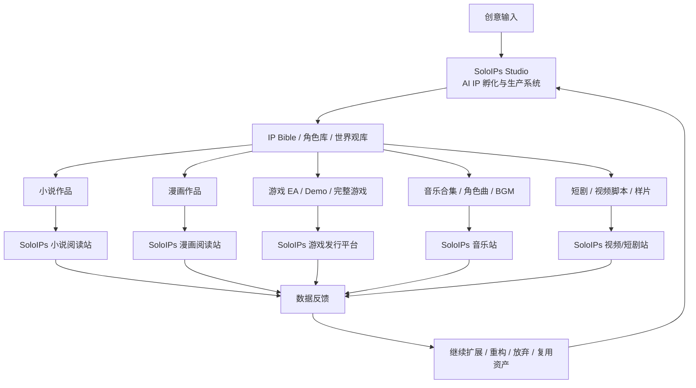
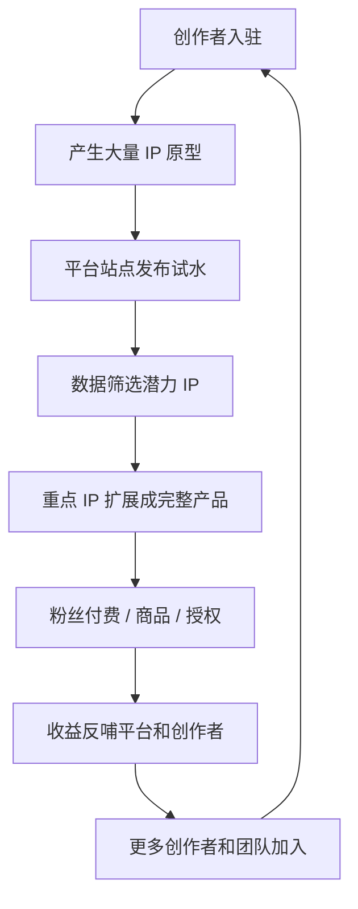

# SoloIPs Studio 想法文档 V0.4

> 品牌：**SoloIPs**
> 产品：**SoloIPs Studio**
> 公司：**SoloIPs AI**
> 主域名：**soloips.com**
> 中文名：**一人 IP 工作室**
> 版本：V0.4
> 日期：2026-05-10

---

## 1. 一句话定位

**SoloIPs Studio 是一个 AI IP 孵化、生产、发行与商业化平台，帮助个人创作者、小团队和一人企业从一个想法开始，低成本试水多个原创 IP，并将有潜力的 IP 扩展为小说、漫画、游戏、音乐、短剧、商品和授权业务。**

平台的核心不再是“一次性生成完整资料”，而是：

> **先孵化，先发布验证，成功就扩展，不理想就重构，并复用沉淀资产继续创建新 IP。**

---

## 2. 核心愿景

SoloIPs 的长期愿景是建立一个面向一人企业和小型工作室的 **AI 原创 IP 商业生态**。

它不仅是创作工具，而是一个完整的 IP 产业链平台：



---

## 3. 关键修正：IP 不一定一次性完整

SoloIPs 生成的 IP 作品可以是 **部分的，也可以是完整的**。

平台不强迫用户一开始就做完整大项目，而是支持不同成熟度：

| 阶段 | 产出形态 | 目标 |
|---|---|---|
| IP 想法 | 一句话、模糊设定 | 快速启动 |
| IP 原型 | IP Bible、主角、世界观、故事钩子 | 判断方向 |
| 试水作品 | 小说前三章、漫画第一话、游戏 Demo、音乐 Demo | 市场验证 |
| 连载 / EA | 小说连载、漫画连载、游戏 EA、音乐合集试发行 | 收集数据 |
| 完整产品 | 完整小说、完整漫画季、完整游戏、完整音乐专辑 | 商业化 |
| 重构复用 | 复用角色、世界观、风格、工作流、数据经验 | 降低失败成本 |

---

## 4. 平台不是“外部投稿工具”，而是发行生态

早期“投稿到小说网站、漫画网站”的理解需要修正为：

> 用户发布的内容，主要发布到 SoloIPs AI 自营或合作的站点与平台。

例如：

- SoloIPs 小说阅读站
- SoloIPs 漫画阅读站
- SoloIPs 游戏发行 / EA 平台
- SoloIPs 音乐与音频站
- SoloIPs 短剧 / 视频站
- SoloIPs Market IP 商城
- SoloIPs IP 官网 / 角色站 / 粉丝社区

这意味着 SoloIPs 的价值不只是生成内容，而是拥有自己的下游发行渠道。

---

## 5. SoloIPs 的差异化

SoloIPs 不是普通的 AI 写作工具、AI 绘图工具或 Agent 工作流平台。

它的差异在于：

1. **IP 孵化逻辑**
   先生成原型，发布试水，根据数据决定是否继续投入。

2. **多部门 Agent 生产体系**
   秘书主控负责调度小说部、漫画部、游戏部、音乐部、运营部、合规部等部门。

3. **公司自营 / 合作发行站点**
   用户作品优先发布到 SoloIPs 公司生态内的小说站、漫画站、游戏发行平台、音乐站、商城等。

4. **数据反馈闭环**
   平台能根据阅读、收藏、付费、评论、试玩、购买数据，判断 IP 是否值得继续做大。

5. **资产复用系统**
   不理想的 IP 不等于失败，它可以沉淀为角色模板、世界观模板、风格模板、剧情结构、Agent Skill、工作流经验。

6. **个人版与企业版差异**
   个人版在系统框架内重构 IP；企业版可以复用自定义 Skill、Agent、工具、部门和工作流。

---

## 6. 这是否可以成为个人商业帝国？

可以，但必须按阶段建设。

SoloIPs 的“个人商业帝国”不是靠一个功能完成，而是靠一套飞轮：



长期来看，SoloIPs AI 可以拥有：

- 创作生产系统
- 小说阅读平台
- 漫画阅读平台
- 游戏 EA 发行平台
- 音乐与音频平台
- IP 商品商城
- IP 授权市场
- 创作者工作室 SaaS
- 数据分析与 IP 投资判断系统

这就是一个从上游创作到下游发行、消费、交易的 IP 生态。

---

## 7. 但不能一开始全做

必须保持克制。

第一阶段只做最小闭环：

```text
创建 IP → 生成 IP 原型 → 生产试水作品 → 发布到 SoloIPs 自有站点 → 收集数据 → 决策扩展或重构
```

最建议的 MVP：

1. SoloIPs Studio 创作工作台
2. IP Bible / 角色库 / 世界观库
3. 小说试水连载
4. 漫画分镜 / 第一话试水
5. 角色资料站
6. IP 官网
7. 基础数据反馈
8. 重构与复用机制

---

## 8. 最终定位语

中文：

> **一个人，也能孵化、发布和经营多个原创 IP。**

英文：

> **One creator. Many story IPs.**

产品说明：

> **SoloIPs Studio helps creators prototype, publish, validate, expand, and monetize original IPs with AI agents.**
