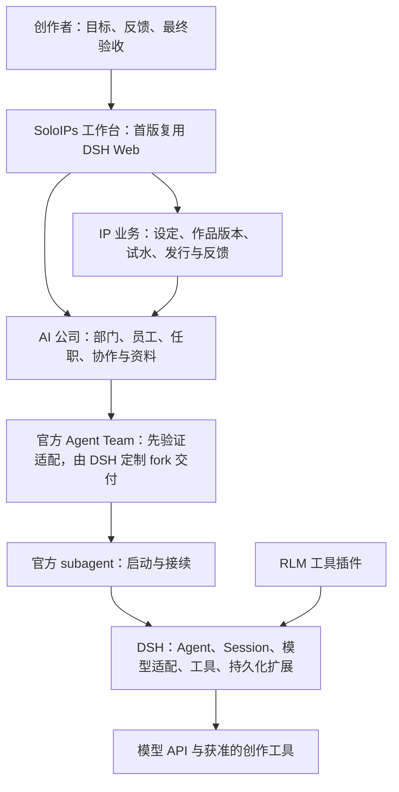

# SoloIPs Studio：产品范围与架构入口

| 阅读契约 | 内容 |
| --- | --- |
| 身份 | SOLO-ARCH；产品目标、首版范围与需求来源的维护正文，同时提供技术架构阅读入口；登记角色不改变各条决策/证据标签 |
| 目的 | 保留用户确认的 IP 创作闭环与首版边界，指向技术架构及其专题决策正文 |
| 范围 | 产品分层、业务对象、首版成果、切片与需求来源；技术包划分/装配/数据根/恢复/验收设计见 [技术架构](technical-architecture.md) |
| 决策状态 | 〔需求〕沿用各节用户来源；ARCH-D01–07 是用户 2026-09-16 委托“你来给我决定”后的技术裁定，正文只在技术架构维护 |
| 证据范围 | 本文含需求与历史源码观察，不提供产品运行验收；证据基线见 §9 与技术架构附录 B |
| 交付状态 | 产品交付仍为〔提案〕；正式技术设计不自动授权实现或变更服务 |
| 依据 | [产品想法 V0.4](SoloIPs_Studio_Idea_Document_V0.4.md)、[项目绑定](governance/project-binding.yaml)、[注册表](governance/document-registry.md)、[技术架构](technical-architecture.md)及各节需求来源 |
| 变更权 | 用户决定产品目标与最终验收；技术决定按明确委托范围维护，文档身份与负责人复用注册表 |

## 1. 先确定真正交付什么

**〔需求，SOLO-01〕** SoloIPs 以 DSH 为底层框架，独立产品仓库用 `SOLOIPS_ROOT` 表示，实际位置按[环境交接](operations/environment-handoff.md)解析。第一版让用户把目标交给 AI 公司，由员工协作产出，最后由用户验收。

**〔需求，SOLO-02〕** 第一版先复用 DSH Web 界面，完成可用闭环，再逐步替换为 SoloIPs 产品界面。复用外壳仍需呈现业务目标、当前负责人、待回答事项和真实交付物。

> **2026-09-17 补充**：「逐步替换」的 V1 落实方式已确定为**复制官方 Web 插件 fork 改造为 `soloips-web`**（官方 DSH 源码不动，装配时替换 profile bundles 的官方 Web 行）；原「自研 Web+3D 双版本」路线推迟。本需求（先复用、再替换）不变，见 [`docs/decisions/web-ui-fork.md`](decisions/web-ui-fork.md)。

**〔需求，SOLO-03〕** 第一条业务验收选择短剧：先完成 IP 简纲，再测试生成可观看的 PV。PV 是试水宣传短片，首片不等于完整短剧制作与发行完成。

**业务主线（来源：[产品想法 V0.4](SoloIPs_Studio_Idea_Document_V0.4.md)，该文件登记为 `reference`，不是本节已确认需求）** 业务主线是“原创 IP 孵化 → 试水作品 → 自营或合作发行 → 数据反馈 → 扩展、重构或资产复用”。小说、漫画、游戏、音乐及视频属于产品的创作与发行方向。第一条交付路径不会自动取消其余方向，也不等于整套商业生态已完成。

需要区分两个团队：

- **建设 SoloIPs 的研发团队**：实现、测试、发布这个产品，是研发手段。
- **SoloIPs 里的 AI 公司**：根据创作者目标组织创作与运营，是用户使用的产品能力。

不能仅因为研发队能写代码，就认为 AI 公司产品已可用；也不能把“员工很多、任务很多”当作创作目标的达成。

## 2. 架构关系与技术正文

**〔约束，SOLO-A01〕** SoloIPs 使用独立产品仓库，以 DSH 插件及 profile 组合交付；具体包边界与分期组合按 [技术架构](technical-architecture.md) ARCH-D02/SOLO-C01。来源：用户既有底座与交付形态要求，以及 2026-09-16 委托的技术裁定。下图保留产品职责分层，不表示每层须独立成包或服务。



箭头表示依赖或调用，不能解释成每个框都要独立部署。

| 层 | 负责的事情 | 本项目采取的关系 |
| --- | --- | --- |
| DSH 执行底层 | Agent 执行、Session 历史、模型与工具适配、插件装配、公开持久化和 UI 扩展能力 | 锁定经过验证的依赖组合，通过公开扩展点调用 |
| 协作内核 | Team 原生任务、成员、依赖与消息；公司合同所需 attempt / 审核门禁须适配验证 | 通过公开接口复用官方 Agent Team → subagent → Session；定制由 DSH fork 承载，一个事实保留一个写权威 |
| 公司组织 | Organization、Department、Employee、Appointment、执行身份绑定、入职与准入 | 复用当前公司重构合同和合格候选，补齐真实 Host 入口与恢复 |
| SoloIPs 业务 | IP 设定、角色、世界观、作品版本、创作阶段、试水计划、反馈与资产复用 | 在组织与协作之上增加业务对象，不把全部业务塞进聊天提示词 |
| 工作台 | 输入目标、观察工作、回答问题、查看/退回/接受成果 | 首版使用 DSH Web 插槽、页面或侧栏；后续独立界面消费同一业务接口（V1 改为复制官方 Web 插件 fork 改造为 `soloips-web`，见 [`docs/decisions/web-ui-fork.md`](decisions/web-ui-fork.md)） |
| 发行与外部工具 | 内容生产服务、发布渠道、反馈采集 | 通过具体工具/适配器接入，按首个作品类型逐项交付 |

**〔需求〕用户 2026-09-16 明确选择官方 Agent Team → 官方 subagent → DSH Session 作为协作执行基础，维护 DSH 定制 fork，并由 SoloIPs 锁定工件；旧 swarm 仅作源码与测试经验参考。** 路线、状态归属、适配缺口与升级规则统一见[官方 Team 与 DSH fork 决策](decisions/official-team-and-dsh-fork.md)（SOLO-TEAM-01–09）。原“首片优先 swarm”的实现选择已取代；公司准入、独立审核、独占与恢复要求继续保留，官方复用尚不代表适配验收通过。

DSH 官方说明其采用 Everything-is-a-plugin 架构，且仍处于开发预览，可能发生破坏性变化。因此建议固定宿主、插件、公开 API 和安装包的验收组合，升级单独验证。[官方仓库](https://github.com/deepseek-ai/deepseek-harness)

### PTC、RLM、模型与员工分别是什么

- **PTC** 是 Agent 的工具调用呈现/执行模式，应核验实际会话预设；它不提供部门、岗位或任务接续规则。
- **RLM** 是组合进 DSH 的工具能力插件；安装启用、实际被调用、适合当前任务是三个不同事实。已有用户要求启用 RLM，继续保留并验证。
- **模型配置** 决定谁执行一次推理及其参数；模型切换不应使 Employee、IP 或作品失去稳定身份。
- **`provider` 与 `llmProvider`** 分别选择 subagent 后端与模型 API 路由。当前 Team 后端为 `spawn` / `fork`；Qwen、WorkBuddy 等不能填到这个后端字段。
- **Skill** 指导方法；确定的权限、准入、任务接续和保存要求由 Host 代码执行。不能靠一句“完成后继续工作”替代调度实现。

## 3. 数据关系：谁拥有事实

**〔需求，SOLO-A02〕** 长期组织身份、一次协作和一次执行分别建模。来源：[公司架构与员工生命周期](refactoring/02-company-contract.md) 「部门承担长期组织职责，员工以任职加入部门，Team 承担工作协作，Session 承担具体执行。四者不能混为同一个身份。」

| 对象 | 具体例子 | 保存与生命周期 |
| --- | --- | --- |
| Organization / Department | 用户的 AI 工作室 / 短剧制作部 | 长期组织与职责，不随一次队伍结束而消失 |
| Employee / Appointment | 某员工 / 当前担任编剧或制作审查 | 员工身份与任职分别保存；模型和 Session 不是员工 ID |
| IP | 一套原创角色、世界观与故事设定 | SoloIPs 业务对象；可关联多个作品与项目 |
| Project | 某 IP 的首支短剧 PV 试水 | 保存目标、交付要求与 Team 引用；进度从任务事实汇总 |
| Team / Task / Attempt | 编写 PV 分镜 / 某镜头的生成尝试 | 协作内核是任务与尝试的唯一权威，不在 IP 模块再建一套任务状态机 |
| Session / ExecutionBinding | 员工本次真实执行 | DSH 保存执行历史；公司 Host 保存到合法员工/任职的绑定 |
| ArtifactVersion | PV v2、镜头 03 v1、角色参考 v1 | 长期资产按准确版本保存，审核引用该版本；不依赖临时 Team 目录 |
| Publication / Feedback | 试读发布记录、反馈来源 | 后续发行模块保存实际外部结果；任务完成不能推导为已发布或市场验证成功 |

公司、任务和作品有各自合法的事实来源。界面、列表、计数和提示词消费这些事实的投影；它们不能各自写一份“现在有几个员工”“任务是否完成”。

## 4. 旧重构成果如何接入

**〔建议，SOLO-A03〕** 采用“按能力接入、逐片验证”。不将当前插件目录整体复制改名后宣布重构完成，也不要求重写已有合格能力。

| 来源 | 本次核实的状态 | 接入处理 |
| --- | --- | --- |
| `repair-release` | 旧 Team 协作与 Web 插件候选；仍有恢复写入/schema、待回答、停线与接续缺口 | 仅作差异实现和测试经验参考；按 SOLO-TEAM-02 提取规则与反例，不移入第二套 Team 运行链路 |
| `company-core` | 有组织与准入等候选代码；与安装来源基线不同 | 核对接口、持久化及真实 Host 入口后再集成，不能直接叠加分支 |
| `docs/refactoring` | 当前公司、入职、资料、头像与验收要求；声明本身不证明已实现 | 按下表追踪要求，实施时读取对应正文，保留未定项 |
| 旧团队记录与候选备份 | 保留在已归档的工作记录中 | 用于追溯和接手；新产品用新身份，不恢复旧团队执行 |
| 55120 | 上轮交接记录为 PTC 默认、RLM 已启用的空团队服务；实际模型调用仍待验证 | 作为用户指定的后续交付目标；本次架构整理不改变服务 |

公司准入候选的源码基线与缺口统一见[技术架构](technical-architecture.md) §7.9：完整入职与禁止未绑定旁路的要求必须在正式业务入口启用前满足，不因复用旧候选而放宽。另有历史源码观察：`REPAIR_RELEASE_CHECKOUT/src/runtime/execution-roots.ts` 的 `captureWorktreeDiff` 只捕获 Git 工作树差异，不能用来宣称视频等创作素材已被长期保存。

### 当前重构要求映射

| 要求来源 | SoloIPs 中的承接 |
| --- | --- |
| DEPT-01–04、ORG-01/02 | 长期公司/部门、员工/任职、合法任命及跨项目协作 |
| ORG-03–07、AVATAR-64 | 完整入职、合法身份装配、实际工具能力、单员工占用、撤权和恢复；头像等必需项不降为可选 |
| LIB-01–11、ORG-08 | 设定和作品准确版本、归属、保存、访问、复用与个人资料边界 |
| ORG-09/10、BUG08 | 自主工作、审查后接续、待回答可见、空队列但目标未完成时重新规划 |
| ORG-11/12 | 新入口不保留旧执行器旁路；按可运行纵向切片验收 |
| ORG-13 | 上游故障停止受影响执行、站内通知、保留事实，用户明确恢复；短信/邮箱及通知方式选择预留接口，后续同片实现 |

用户已要求 GLM 仅处理文档；旧文档中的早期模型职责不能覆盖这一决定。模型品牌和上下文参数保留在部署配置，不能固化到公司业务规则。

## 5. 首版：先交付内部生产闭环

**〔需求，SOLO-01/02/03〕** AI 公司接受目标，员工协作交付，用户最终验收；首版使用 DSH Web。

**〔需求，SOLO-03〕** 短剧 IP 简纲与第一支 PV。先产出简纲，确定故事钩子、主要人物和 PV 想验证的观感，再形成镜头计划、参考素材、镜头视频和可播放的合成片。首支片的时长、画幅、画风、声音和具体生成工具在制作任务启动前收敛；当前不假定已有视频服务可调用。

建议首次只启用一个短剧制作部门，一名经理与两名执行/审查员工，按需要工作；这是验证配置，不是固定组织上限。经理负责创作目标和交付，一名员工主编剧/分镜，另一名主制作/合成；针对各自没有创作的产物交叉审查，必要的整体质量判断由经理和用户完成。生成视频的是接入的制作工具，不能仅凭语言模型能写提示词就认定具备制片能力。

```text
用户输入创作目标
→ 确认读者、体裁、成果和验收要求
→ 经理建立有依赖和职责的任务
→ 已完成入职的员工领取就绪工作
→ IP 简纲与 PV 分镜 → 参考素材 → 镜头生成 → 合成预览片
→ 保存作品准确版本并提交
→ 非作者审查；不通过则带具体意见返工
→ 经理汇总，用户接受或退回
→ 接续授权范围内的下一项就绪工作
```

### 首片必须观察到的结果

1. 公司/部门/新员工完成合法建立和入职，缺项能修正；真实 PTC 会话完成文件工具调用，RLM 在一个适合的检查中实际可调用。
2. 用户从同一工作入口看到目标、负责人、待回答问题和交付版本；不会“等待回答”却没有可回答入口。
3. 审查绑定具体作品版本，作者不能给自己的产物生成独立通过记录；用户退回后有明确责任人继续修订。
4. 正常接受后，员工能领取属于职责且依赖满足的下一项任务；队列为空但目标未完成，经理能发现缺项，而不错误宣布完成。
5. 上游 API 错误停止受影响链路并直接通知；身份、任务和已保存成果保留。恢复须用户明确指令，不能因充值或探测成功自动续跑。
6. 使用同一安装包完成“写入 → 停止 → 重启 → 读回”。公司、任职、任务及作品版本可核对，恢复没有双重执行；清空数据后能启动不算恢复通过。
7. 框架测试与模型自报之外，用户实际看见并能接受一份目标作品。最后一项是产品验收，不能由构建成功代替。

### PV 制作需要补齐的最小业务接口

- **制作工具适配**：提交生成请求、保存服务返回的 jobId、查询同一次任务、取得结果及真实失败信息。长任务等待不会被误当为模型闲置；超时未知先查原任务，不盲目重复生成。
- **素材与版本**：保存 IP 简纲、分镜、获准参考素材、生成参数、镜头输出与合成片；记录来源、准确版本、长期文件位置和可用性。真实媒体字节已保存才报告保存成功。
- **制作依赖**：分镜变化只使受影响镜头和合成结果待更新；引用关系由作品/素材模块保存，实际执行状态仍在协作任务中。
- **预览与验收**：在复用的 Web 工作台播放 PV、打开镜头素材、对准确版本接受或退回；用户要能指出具体镜头的问题。
- **失败与恢复**：模型 API 与视频服务故障均按现行停止/通知约定处理；保留已完成镜头，恢复不重做已成功提交的外部操作。外部工具若不支持取消，明确报告仍在运行。

工具选型先核实用户已有的图像、视频与合成能力及可调用方式，再为选中的一条链做适配；本次不因架构建议就购买服务或提交付费生成任务。

内部生产闭环通过后，再做最小发行反馈切片：准确版本的试读页面/渠道发布、真实反馈与下一轮投入决定。仍保留 V0.4 的商业闭环；首个内部成果不能称为市场验证。

## 6. 快速开发的具体顺序

| 切片 | 解决的问题 | 验收出口 |
| --- | --- | --- |
| S0：运行接通与恢复 | DSH 依赖组合、公司 Host 入口、Session 绑定、持久 schema 与同包恢复 | 新公司/部门/员工能建立；真实工具可调用；重启后可继续；同一数据根只有合法 writer |
| S1：短剧 IP 与 PV 交付 | 任务领取、简纲/分镜、制作工具 job、镜头/合成、媒体保存、审查、提问与接续 | 一支实际可播放 PV 完成创建、修订与用户验收；关键失败场景保留已成功素材 |
| S2：一次发行反馈 | 试水发布和反馈进入下一轮判断 | 实际发布记录和真实反馈可追溯到作品版本 |
| 后续能力 | 多部门跨媒体协作、进一步资产复用、独立/3D 工作台、多个发行渠道 | 每项分别给出用户路径与验收，不一次摊开开发 |

S0/S1 优先处理恢复、准入、API 停线、待回答入口、成果保存及接续这些直接阻塞交付的问题。其他已承诺 bug 保留在后续任务，不因迁移丢失，也不要求先修完所有无关问题才能获得第一份成果。

〔约束〕实现组织方案按 [技术架构](technical-architecture.md) ARCH-D02 及第 5 章；原“可从一个插件包开始”的备选由该裁定取代，产品职责分层保留。S0 交付实际需要的模块与组合，PV 工具适配随 S1 出现。Profile 只负责装配与部署设置，业务模块不读取个人绝对路径或凭据。

开发工作区与运行数据分开；密钥、旧会话备份及临时执行产物不进入源码。S0 输出可复现的依赖锁定和统一交付组合后，后续切片沿用同一运行路径，避免验证了一个分支却发布另一个。

先用具体失败场景判定能否复用，再交付修复。前期规模不需要新建微服务集群、第二套调度器或向量库；需要它们时应有业务量或功能证据。多用户商业部署的租户隔离另行验收，单人同信任范围的通过不能当作多人安全证明。

## 7. 这次梳理揭示的管理问题

已确认的交接记录包含“运行包与候选分支不同”“旧记录写入成功却重启读不回”“资料和等待问题未在真实路径验收”等现象。它们提示需要同时管理以下三个边界：

- **需求到代码**：每片对应本轮产品结果和重构要求，代码候选须核对真实入口。
- **代码到运行**：验收绑定实际安装包；构建、安装和重启分别给证据。
- **任务到用户成果**：任务提交后必须有审查、集成、使用与返工接续；不能只统计队员是否忙碌。

这些是基于已有证据的流程判断，不意味着每个历史 bug 的根因已经定位。后续以首片的可用成果、等待和返工情况检验改进。

## 8. 文档团队配置

**〔需求〕来源：用户 2026-09-15 确认。** 本轮先组织文档团队，协助理清产品、重构架构与验收要求。下表替换此前的模型分配建议。

反面声明：**它是建队配置要求，不代表团队已创建或成员已经执行。**

| 职责 | 用户指定模型 |
| --- | --- |
| 产品经理兼队长 | `cn:deepseek-v4.1-flash` |
| 前端顾问 | `global:deepseek-v4.1-flash`、Qwen |
| 后端与架构顾问 | `global:deepseek-v4.1-flash`、`global:hy4-preview` |
| 文档工程师 | Qwen，仅文档工作 |
| 独立 QA | `global:deepseek-v4.1-flash`、`global:hy4-preview` |

`global:hy4-preview` 与 `cn:hy4-preview` 均要求默认开启思考、使用 `high`。国内 HY4 的加入属于可用模型配置补齐，不自动替换上表已指定的国际 HY4 席位。DeepSeek 两路保留 `off / low / high / max` 选项；PTC 与 RLM 沿用已确认的要求。文档团队的交付是收敛后的需求、技术边界与可验证的开发任务，产品代码实现另行开展。

> **范围说明**：本表是**文档团队**（需求收敛）配置；**开发团队**（代码实现）的多智能体模型与派工配置见 [多智能体开发规范](governance/multi-agent-development.md)，两者范围不同，不互相覆盖。

## 9. 来源与剩余决定

以下符号的本机位置按[环境交接](operations/environment-handoff.md)解析；源码与历史观察的基线统一见[技术架构附录 B](technical-architecture.md)，不能由历史位置推断当前部署：

- 产品目标：[SoloIPs V0.4](SoloIPs_Studio_Idea_Document_V0.4.md)。2026-09-15 本轮已确认 AI 公司协作、用户验收、先用 DSH Web。
- DSH 源码：`DSH_CHECKOUT`；基线与工作树限制见技术架构附录 B 第 3 项，安装工件及已有修改与目标的关系仍须 S0 核对。
- DSH 实验团队适用范围：上述源码 `packages/experimental/agent-team/README.md` 的 “When to choose it”；仅作为复用比较，未启用第二套团队实现。
- 重构入口：`REFACTORING_DOCS_ROOT/README.md`；01、02、03、04 是相关要求正文。
- `REPAIR_RELEASE_CHECKOUT` 与 `COMPANY_CORE_CHECKOUT` 为不同候选来源；前者历史观察中有未提交集成内容，不能仅凭 HEAD 标识整包。
- `LAUNCH_ROOT/freeze-20260915-reteam/RETEAM-HANDOFF.md` 是历史冻结交接证据；本次未重新做运行验收，不将其当实时状态台账。

仍需按业务推进收敛：PV 的具体创意、时长与视听要求、已有制作工具的真实接口、第一轮发行渠道及反馈指标、何时从单人使用进入多人商业服务。PV 要求与工具决定 S1 的制作任务；发行与多人服务不阻塞 S0。旧重构中未确定的人格/私人资产权利仍保持未定，不从技术迁移推导为获准。

本文件保留产品范围与需求来源；技术裁定和后续执行边界统一见 [技术架构](technical-architecture.md) §1.4。任务执行状态留在绑定声明的原生系统，不能从任务登记规则推断该能力已经配置。
