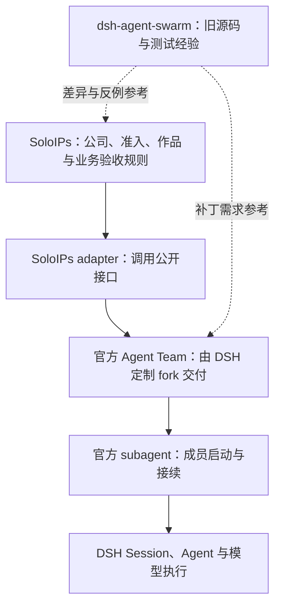

# SoloIPs：官方 Agent Team 复用与 DSH 定制 fork

| 阅读契约 | 内容 |
| --- | --- |
| 身份 | `SOLO-TEAM-FORK`；官方协作链路、定制边界与上游升级的决策正文 |
| 目的 | 让开发者明确复用什么、在哪里补能力，以及如何保留官方更新能力 |
| 范围 | 官方 Agent Team / subagent / Session 的复用；旧 swarm 的参考地位；DSH fork、补丁、工件锁定、升级与适配验收 |
| 决策状态 | 〔需求〕用户 2026-09-16 在本项目会话明确选择“DSH 定制 fork + 少量完整补丁 + SoloIPs 锁定工件”，允许修改官方 Agent Team；下文〔约束〕是该路线的工程落实，适配结果保持〔未验证〕 |
| 证据范围 | §3 为固定官方源码基线的静态事实，不代表实际安装、模型调用或产品验收通过 |
| 交付状态 | 设计路线已确定；运行交付仍为〔提案〕。本文不证明已创建 fork、发布工件、完成迁移或接入目标服务 |
| 依据 | 最新用户指令；[产品架构](../architecture.md)、[技术架构](../technical-architecture.md)、[代码规范](../governance/code-development-standard.md)、[官方文档导航](../../.agents/skills/dsh-plugin-development/SKILL.md)；官方固定来源见 §3 |
| 变更权 | 按[文档注册表](../governance/document-registry.yaml)维护；工程负责人可在本路线内决定适配与补丁，改变业务要求或改用另一协作内核须由用户决定 |

## 1. 已定路线（SOLO-TEAM-01）

**〔需求〕以官方插件接口作为协作执行基础；先验证适配，再启用产品工作路径。**

箭头表示依赖或调用，不要求各层独立部署。**“先验证适配”限定启用条件，不把已选路线重新降为候选。** 发现缺口时，先用公开接口适配；公开能力不足则在 fork 内补齐必要机制并测试。缺口未闭合时保留未通过的验收项，不自动恢复旧 swarm 运行链路。

**SOLO-TEAM-02〔约束〕旧源码的使用边界。** `dsh-agent-swarm` 及其候选分支用于提取业务规则、失败反例、恢复经验和测试意图。按新接口重新验证可复用部分；不作为新产品的运行依赖，不复制其完整 Team 状态机与官方 Team 并行运行。“不 fork、不整包拷贝旧 swarm”继续成立；维护 DSH 官方仓库的定制 fork 是本次明确选择的另一件事。

## 2. 谁拥有状态，谁负责执行（SOLO-TEAM-03）

**〔约束〕一项事实只有一个可写权威。** 保留 ARCH-D02 的五个 SoloIPs 包职责边界；它们不包括所依赖的 DSH 官方包，不需要为每个官方插件另建一个 SoloIPs 包。

| 事实 / 能力 | 唯一权威与接入方式 |
| --- | --- |
| 公司、部门、Employee、Appointment、准入与授权代际，IP 与作品版本，业务审核 / 用户验收 | `soloips-core` 持有 SoloIPs 业务事实；延续既有业务要求，不依赖提示词自报 |
| Team 成员 roster、原生任务状态与 revision、分配 / 领取 / 依赖、Team 消息 | fork 中的官方 Agent Team 服务持有原生协作事实；SoloIPs 经 adapter 调用公开接口，界面和统计消费投影 |
| 子智能体启动、继续消息、中断与运行句柄 | 官方 subagent 提供执行能力；Team 管理协作关系，不另建 Agent Loop |
| 执行历史与官方 Team 的持久化记录 | DSH Session 及官方 Team 的持久化机制；SoloIPs 不直接改写其日志或另存可写任务副本 |
| 公司身份到 Team / 成员 / Session 的业务绑定 | core 保存业务绑定；每次受保护操作根据真实执行上下文核对公司资格与官方协作事实，不能用界面传来的 ID 充当授权 |
| attempt、员工跨 Team 占用、operationId 共同提交 | 既有 ORG-05 要求继续成立；基线原生任务字段不足以证明已支持。在 fork 协作权威内落实所需扩展及恢复协议，core 保存身份和引用，不另建可写占用副本；具体 schema 与公开接口待适配切片确定 |

**业务审核不能被原生完成动作绕过。** 原生 task `completed` 不等于作品被接受。凡业务要求“审核后接续”的任务，正式执行、任务完成及依赖放行必须受同一套权威规则约束；仅在 SoloIPs 页面禁用按钮或在完成后补一条审核记录不成立。模型工具、Team Remote/UI、接续与恢复入口均须纳入检查。可以在 fork 中增加通用的授权或状态转换校验接口；**这是待实现设计，不是已存在的官方 hook**。具体业务判定仍由 SoloIPs 提供，校验不可用时拒绝受保护转换。

**跨服务写入不得假定成一个事务。** 公司授权、Team 提交与 Session 执行之间，须明确提交点、幂等关联、失权检查与崩溃恢复；未确认 Team 提交前不得放行执行。进程内锁、`already-open` 和日志 flush 均不能替代 ORG-06 的跨 Host 独占 / fencing。数据根隔离、故障停线和用户明确恢复要求继续按 SOLO-DATA、SOLO-FENCE-01、ORG-13 执行。

## 3. 官方依据与已知适配边界（SOLO-TEAM-04）

**〔源码事实〕DSH-UP-TEAM-01：** 官方仓库 commit `c291e7961a515f6d7af9304e7fd1d257929aef26`，以下相关包 manifest 版本为 `0.1.5-rc.2`；本节是 2026-09-16 的源码核对基线，不称其为官方最新版或 SoloIPs 已安装版本。开发和升级时按 DSH-DOC-01 核对目标版本正文。

| 固定来源 | 本次可支持的结论 | 不能据此声称 |
| --- | --- | --- |
| [Agent Team README](https://github.com/deepseek-ai/deepseek-harness/blob/c291e7961a515f6d7af9304e7fd1d257929aef26/packages/experimental/agent-team/README.md)；[公开入口](https://github.com/deepseek-ai/deepseek-harness/blob/c291e7961a515f6d7af9304e7fd1d257929aef26/packages/experimental/agent-team/src/index.ts) | 提供 Team、成员、任务板、消息及公开服务 / Remote；属于实验能力 | 已具备长期公司、完整入职、业务审核、跨进程共管或独立成员工作区 |
| [任务类型](https://github.com/deepseek-ai/deepseek-harness/blob/c291e7961a515f6d7af9304e7fd1d257929aef26/packages/experimental/agent-team/src/types.ts)；[任务转换](https://github.com/deepseek-ai/deepseek-harness/blob/c291e7961a515f6d7af9304e7fd1d257929aef26/packages/experimental/agent-team/src/task-board.ts) | 原生状态为 `pending / in_progress / completed / deleted`，转换包含 owner / Lead 权限和 revision 检查 | 原生完成即独立审核通过，或原生任务已实现公司合同的 attempt / 跨 Team 占用 |
| [roster](https://github.com/deepseek-ai/deepseek-harness/blob/c291e7961a515f6d7af9304e7fd1d257929aef26/packages/experimental/agent-team/src/roster.ts)；[subagent 入口](https://github.com/deepseek-ai/deepseek-harness/blob/c291e7961a515f6d7af9304e7fd1d257929aef26/packages/subagent/subagent/src/index.ts)；[Provider 类型](https://github.com/deepseek-ai/deepseek-harness/blob/c291e7961a515f6d7af9304e7fd1d257929aef26/packages/subagent/subagent/src/types.ts) | Team 通过 subagent `startContinuable` 创建成员；Provider 的可接续能力是可选能力 | 任意 Provider 都能替换 Team 使用的后端，或中断请求返回就代表执行已完全停止 |
| [Team journal](https://github.com/deepseek-ai/deepseek-harness/blob/c291e7961a515f6d7af9304e7fd1d257929aef26/packages/experimental/agent-team/src/journal.ts)；[subagent 边界](https://github.com/deepseek-ai/deepseek-harness/blob/c291e7961a515f6d7af9304e7fd1d257929aef26/packages/subagent/subagent/README.zh.md) | Team 状态事件写入 Lead Session 日志；存在进程内串行化；subagent 文档列有激活所有权、邮箱与崩溃边界 | 已有跨进程 lease，或消息恰好一次交付、崩溃后自动重放均有保证 |
| [Team Web profile](https://github.com/deepseek-ai/deepseek-harness/blob/c291e7961a515f6d7af9304e7fd1d257929aef26/packages/experimental/agent-team-web-profile/README.md)；[Client](https://github.com/deepseek-ai/deepseek-harness/blob/c291e7961a515f6d7af9304e7fd1d257929aef26/packages/experimental/client-ui-agent-team/README.zh.md) | 有现成 Web 组合与通过生成 Remote 消费 Host 投影的界面；profile 层工具调整不保证覆盖 preset 作用域 | 页面已满足 SoloIPs 公司体验，或所有实际可调用工具都已被统一限制 |
| [Session 格式规则](https://github.com/deepseek-ai/deepseek-harness/blob/c291e7961a515f6d7af9304e7fd1d257929aef26/docs/session-format-status.md) | Session 格式有独立的发布与兼容约束 | 包版本回退即数据格式回退，或旧版本一定能读新版本写入的数据 |

需一起核对的官方 Team 包是：

- `@deepseek-ai/dsh-experimental-agent-team`：Host 协作服务。
- `@deepseek-ai/dsh-experimental-tool-agent-team`：模型工具入口。
- `@deepseek-ai/dsh-experimental-client-ui-agent-team`：官方客户端。
- `@deepseek-ai/dsh-experimental-agent-team-profile`：Host 组合。
- `@deepseek-ai/dsh-experimental-agent-team-web-profile`：Web 组合。

这些包在该基线声明公开发布，仍保留实验性边界。是否采用现成 profile、哪些工具行被 SoloIPs 组合覆盖，以及 subagent 后端，须在锁定工件上验证；不能只用包存在或 profile 名称作适配证明。

**公开边界：** SoloIPs 使用目标版本正式导出的服务、类型、Remote 和插件接口，不跨包读取私有实现。官方 Team 自身在此基线使用了 [subagent 内部桥接](https://github.com/deepseek-ai/deepseek-harness/blob/c291e7961a515f6d7af9304e7fd1d257929aef26/packages/experimental/agent-team/src/mailbox.ts)；该耦合由同一 fork 的维护者联动验证，不转化为 SoloIPs 对 `subagent/internal` 的直接依赖。需要的新接口在 fork 中明确导出并测试，不在 SoloIPs 偷接内部路径。

## 4. fork 与补丁怎么维护（SOLO-TEAM-05）

**〔约束〕维护有完整上游历史的 DSH 定制 fork。** 官方仓库作为 `upstream`，自有 fork 作为开发与发布来源。SoloIPs 保持独立产品仓库；不把几个官方目录复制进去形成无法对齐历史的副本。用户 2026-09-16 已提供自有 fork，源码与分支分工见下表；工件渠道和具体补丁由获授权的实现切片登记。

### 仓库与分支分工（SOLO-TEAM-10）

| 对象 | 约定用途 |
| --- | --- |
| [SoloIPs 仓库](https://github.com/leinasi2014/soloips) | 公司、业务插件与产品界面；通过锁定工件依赖 DSH fork |
| [DSH 定制 fork](https://github.com/leinasi2014/deepseek-harness) | 用户指定的定制源码仓库；本机位置用 `DSH_FORK_CHECKOUT` 表示，按 ENV-02 解析；修改 Team 及必要官方机制在此进行 |
| [官方 DSH 仓库](https://github.com/deepseek-ai/deepseek-harness) | fork 的 `upstream` 来源；`upstream/master` 是官方跟踪引用，不承载自有补丁 |
| fork 的 `origin` / `master` | `origin` 指向自有 fork；`master` 作为定制集成分支，保留上游历史与经过审查的自有补丁；升级候选验证后再集成，不把生产环境跟随分支浮动 |
| fork 的 `codex/<切片>` / `codex/<升级任务>` | 从定制基线建立短期开发 / 升级分支，通过面向自有 fork 的 PR 集成；处理上游变更时按 SOLO-TEAM-07，不直接覆盖定制分支 |
| 历史 `DSH_CHECKOUT` | 保留旧文档源码基线与历史运行位置的含义；不因新增 fork 就改写旧引用、迁移目录或切换运行服务 |

这些是分工约定，不声明远程、分支保护、定制发布已全部配置。实施者开始适配前先核对 fork HEAD、工作区改动及仓库声明的包管理器版本；保留其他工作的改动，需要隔离时从明确提交建立 worktree。fork 与 §3 的源码基线不同，须复核受影响接口、profile、工具与 Session 读回路径，不能只替换目录或版本号后沿用旧适配结论。实际路径、提交和未提交变更记录在[环境交接](../operations/environment-handoff.md)规定的本机记录。

| 放置位置 | 适合放的内容 |
| --- | --- |
| SoloIPs core / adapter / web | 公司与作品规则、资格判定、业务审核、公开接口适配、产品界面 |
| DSH fork | 官方接口无法满足时所需的通用扩展、Team 状态与提交机制、必要的 bug 修复；保留上游主体结构 |
| 旧 swarm 参考 | 需求追溯、失败用例和测试意图；提取后按新权威重新证明行为 |

“少量完整补丁”以**一个可解释的行为变化**为单位，不以文件数或行数少为目标。一个变更若影响 Team 服务、工具、类型 / Remote、Client 与 profile，必须同时补齐受影响部分和回归用例；无需为凑齐五包修改无关文件。优先公开扩展和局部修复，不复制第二套 runtime，也不为避免合并冲突而藏入运行时 monkey patch。

每个保留的补丁在 fork 中记录：解决的缺口 / 需求 ID、上游基线、commit 或 PR、受影响入口与存储格式、公开接口变化、针对性回归、撤除条件。补丁是可追溯的代码提交，不要求再手工维护一套 `.patch` 文件。通用改进可在另获提交授权时贡献上游；上游已等价覆盖时验证后删除自有实现。

## 5. SoloIPs 锁定什么（SOLO-TEAM-06）

**〔约束〕一次 SoloIPs 交付引用一个经过验证的完整运行组合。** 不跟随 `master`、浮动 tag 或未锁定的本机 checkout 自动变动。

| 锁定内容 | 验证目的 |
| --- | --- |
| 上游基线 SHA、fork SHA、自定义版本与补丁集合 | 能重建和解释官方部分与定制差异；相同版本不发布不同内容 |
| Host、Team 五包、所需 subagent / Session 及实际依赖解析结果 | 证明来自可兼容的同一交付组合；防止仅替换一包造成类型、服务实例或生成 Remote 不匹配 |
| 依赖锁文件、不可变工件定位与内容校验值（如 SHA-256 / 锁文件 integrity） | 安装拿到的是审查过的字节，而非同名本地包 |
| 完整 profile / bundle / patch 组合及实际生效配置摘要 | 核对依赖就绪、工具与 UI 入口，包含 home、launcher 与 preset 的影响；不把凭据写入摘要 |
| Session / Team / SoloIPs 数据格式、迁移前置条件和恢复兼容范围 | 判断能否读旧数据、能否降级以及何时须恢复一致检查点 |

ARCH-D03 的独立 home 与 ARCH-D04 的 `soloips` / `patchReload: startup` 保持生效。技术架构 SOLO-C01 的旧数组只保留 SoloIPs 包间的相对关系，**不再是包含官方 Team 的完整可执行清单**；实际组合由适配切片补齐并核对全部配置层。这里的“完整锁定”不要求定制所有 DSH 包，未修改部分也须锁到兼容的确定版本。

## 6. 官方更新与冲突怎么处理（SOLO-TEAM-07）

**〔约束〕升级是一份独立候选，不自动改变已交付环境。**

### 每次更新对齐官方最新代码（SOLO-TEAM-11）

**〔需求〕用户 2026-09-16 要求：开发时持续注意官方更新，每次更新均对齐官方最新代码。** 执行者开始 DSH 定制开发时，以及每次 fork 更新、集成或发布前，必须从官方 `upstream` 重新 fetch `master`，记录查询时间与完整 SHA；不能用缓存的跟踪分支、网页缓存或包版本号代替实时核对。

**〔约束〕** 候选须包含本次获取的 `upstream/master`，以祖先关系检查并结合实际差异复核证明。保留自有补丁，在开发 / 升级分支合入官方变更；不通过覆盖定制分支或丢弃未提交工作实现“对齐”。`subagent`、`experimental` 与它们依赖的 Session、工具、生成接口、profile、锁文件作为同一仓库候选验证，不单独复制两个目录混用版本。

发布或集成前若官方已经前移，先更新候选，复核受影响接口、重新运行受影响检查并更新工件锁定；先前未受影响的证据可按精确范围复用。查询失败、合并冲突或必要验证失败时，更新保持未完成，已交付环境继续使用原锁定工件。对外的“已对齐”只表示包含最后一次成功 fetch 所记录的官方提交，不声称与不断变化的上游永久同步；生产部署仍按对应授权执行。

升级按以下顺序落实：

1. 按 SOLO-TEAM-11 获取并固定官方最新 `master` SHA，阅读该版本官方说明，比较公开接口、生成 Remote、工具、profile、Session 与 Team 格式变化。
2. 从当前定制发布基线建立短期升级分支，合入目标上游历史；保持可审查差异，不改写已共享发布历史。
3. 逐项处理补丁：仍有需要且兼容则保留；上游已等价实现则在回归证明后撤除；接口或语义改变则适配。无法证明时推迟该候选，已交付环境继续使用原锁定工件。
4. 在独立验证 home 运行上游相关测试、自有补丁回归和 §7 适配场景。Git 没有文本冲突、测试数量多或单包能构建，都不能代替行为兼容证据。
5. 通过后生成新定制工件，再以 SoloIPs 的依赖 / profile 更新候选完成集成审查；部署按该切片交付授权执行，不由上游推送触发生产切换。

**回退分两类。** 仅回退装配时，须先证明旧工件可读当前数据，再切回旧工件与旧 profile。存在不兼容写入时，停止相关写者并按经验证的一致检查点恢复全部相关 Session、Team 与 SoloIPs 数据，核对旧工件可读恢复后的数据。升级后新增成果先保留和核对，不自动丢弃。只切 profile、checkout 旧代码或只恢复 core 数据，都不能声明完成业务恢复。

## 7. 适配验证与完成条件（SOLO-TEAM-08）

下表为 **〔提案〕+〔未验证〕** 的验证合同，用于已获授权的最小工程切片；与既有 SOLO-ACC 场景合并执行，避免重复搭建验收。先跑不涉及真实模型调用的确定性路径；真实 API、目标服务切换和迁移须落在相应授权范围内。真实上游首错停线仍按 ORG-13，测试不得用隐式重试掩盖失败。

| ID | 要验证的行为 | 通过证据 |
| --- | --- | --- |
| TEAM-ACC-01 | 锁定 profile 真实启动官方 Team → subagent → Session；核对模型工具与 Remote / UI 组合 | 工件 / 配置一致；成员由预期 Provider 创建；标识关联可追溯；未加载旧 swarm 协作运行链路，无重复服务或未受控工具旁路 |
| TEAM-ACC-02 | 合法员工工作；未入职、已撤权或伪造绑定请求被拒；同一员工跨 Team 并发领取 | ORG-03/05 的真实 Host 门禁覆盖各入口；只有一个有效正式 attempt；重放稳定键不重复提交或放行执行；失败中断点恢复后仍成立 |
| TEAM-ACC-03 | 经模型工具、Remote / UI 和恢复入口尝试提前完成、绕过审核、提前解除依赖 | 未通过业务审核不能放行受保护的后续执行；引用准确作品版本；通过审核后的原生任务转换、依赖就绪与接续只产生合法结果 |
| TEAM-ACC-04 | 同一真实数据根被第二 Host 打开；首 Host 失权时仍尝试提交；模拟提交中断 | 满足 ORG-06 / SOLO-ACC-09；保护范围包含实际 Team / Session 与公司提交点，路径别名不能绕过；进程内锁结果不能替代跨 Host 证据 |
| TEAM-ACC-05 | 重启读回 roster、任务、消息、业务引用；执行故障后停止并通知、经授权恢复 | 不丢已确认提交，不把未知交付重发成重复工作；保留身份与成果；不以重启偷偷恢复已停线任务；满足 ORG-13 / SOLO-ACC-06–08 |
| TEAM-ACC-06 | 升级候选与原交付对照，演练格式兼容或一致恢复 | 每个自有补丁有回归结果；撤除补丁有等价证据；新旧 Session / Team / 业务数据的兼容边界明确，能恢复锁定组合与一致数据 |

复用适配通过须给出具体工件、输入、命令退出状态及观察结果；源码阅读、模拟测试、真实执行、目标集成分别标明。[环境交接](../operations/environment-handoff.md)承载机器路径和运行证据，本文件保留稳定设计。当前缺口由实现切片逐项关闭，不再把包数量、独立 home 或 fork 路线重新交回用户选择。

## 8. 对既有设计的取代范围（SOLO-TEAM-09）

本节只裁定与本路线直接冲突的实现选择；需求 ID 和验收要求继续有效。

| 既有条款 | 本决定后的效力 |
| --- | --- |
| 产品架构 SOLO-A01 / §2、§4 的“改造内部协作内核、首片优先 swarm、移入 repair-release 实现” | 〔已取代〕为 SOLO-TEAM-01/02 的官方复用路线；旧候选只提供参考 |
| ARCH-D02、DRAFT-S03、TERM-08/17、§5.1 的 core 唯一写权 | 保留 SoloIPs 公司、作品与业务事实的唯一写权；其中 core 持有原生 Team / Task / mailbox 的旧范围〔已取代〕，归属以 SOLO-TEAM-03 为准 |
| §5.3 的“因旧 Team 聚合 CAS，必须由 core 承载协作内核” | 〔已取代〕。仍不新建 SoloIPs 协作引擎包；改为依赖 fork 中的官方 Team，不复制旧 CAS 布局 |
| 技术架构 §7.3–7.7 的旧聚合、同包同 domain 与占用实现建议 | 旧源码事实保留为参考；据此要求官方 Team 复刻旧 schema / opener 的设计〔已取代〕。ORG-05 的可信身份、共同提交窗口和唯一占用要求保留，按 SOLO-TEAM-03 验证新实现 |
| SOLO-C01、C-10、SOLO-LAYER-01 的完整装配要求 | 保留组合完整与覆盖序检查；旧包数组的完整性声明〔已取代〕，按 SOLO-TEAM-06 补齐官方能力依赖，不直接照旧数组安装 |
| DEV-03/04/08、SOLO-ACC-03 的状态权威表述 | core 的唯一 opener 适用于其业务 domain；官方 Team / Session 按其服务和持久化权威验证，不能要求所有状态都在 core 的 domain 表内 |
| 源码参考文档的“参考重写、不 fork” | 限定旧 swarm / company 候选，不禁止本次明确选择的 DSH fork；文中复用建议不能覆盖本决定 |
| DRAFT-D07-D3 及“swarm fork 或参考迁移”的待决 | 〔已取代〕为 SOLO-TEAM-02；不再为新产品选择旧 swarm domain owner。若另获旧数据迁移授权，再制定独立迁移合同；实际工件渠道由交付切片确定 |

ARCH-D01 的正文分工、ARCH-D03–07、产品目标、公司合同与用户最终验收权继续有效；本决策仅把协作复用及 fork 维护集中到这一份正文。技术适配后需要变更其他设计时同步其既有权威，不另建相互竞争的架构文档。
