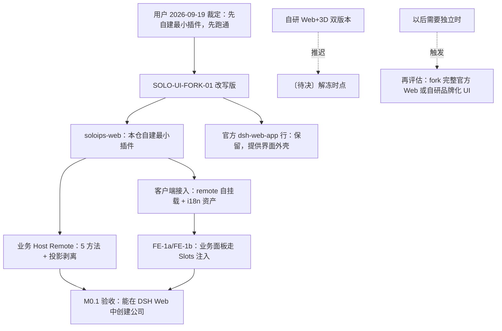

# SoloIPs：V1 界面路线——本版自建最小插件，不 fork 完整官方 Web

| 阅读契约 | 内容 |
| --- | --- |
| 身份 | `SOLO-UI-FORK-01`（**2026-09-19 改写**；原名为「V1 界面复用官方 Web 并 fork 改造为 soloips-web」）；V1 界面交付形态、与官方 Web 的关系、后续独立化路径的决策正文 |
| 目的 | 让开发者明确本版界面交付什么形态、为什么不 fork 官方 Web、以后要独立时怎么走 |
| 范围 | V1（M0.1）个人 IP 公司平台界面的来源与形态；`soloips-web` 与官方 Web 行的共存方式；自研 Web+3D 双版本路线的推迟；后续独立化触发条件 |
| 决策状态 | **〔需求〕用户 2026-09-19 明确裁定**：「这一版先自建最小插件，以后需要独立再说，先跑通」；下文〔约束〕是该路线在工程上的落实 |
| 证据范围 | §3 为 2026-09-17/19 对 DSH fork 与本仓 `packages/web` 的源码核对；§4 为 2026-09-19 真实浏览器 E2E 实测 |
| 交付状态 | **业务 Host 半边已实测通过**（BE-6a：真实浏览器 → gateway → core → 介质，9 步全绿 + 进程重启后读回一致）；**界面组件尚未实现**（本版范围见 §1.3） |
| 依据 | 用户 2026-09-19 裁定；用户 2026-09-17 两轮确认（该路线已被本版改写，保留为历史依据）；[官方 Team 复用与 DSH fork](official-team-and-dsh-fork.md)（SOLO-TEAM-01）；[产品架构](../architecture.md) SOLO-02；[权威数据契约](../design/data-contract.md) §0/§6.1；[装配机制](../technical/assembly.md) |
| 变更权 | 按[文档注册表](../governance/document-registry.md)维护；**改变 UI 交付形态（如改为 fork 完整官方 Web、或启动自研双版本）须由用户决定** |

## 1. 已定路线（SOLO-UI-FORK-01，2026-09-19 改写）

### 1.1 本版形态

**〔需求〕V1 的界面层 = 自建最小插件 `soloips-web`，本版不 fork 完整官方 Web。** 来源：用户 2026-09-19 裁定「这一版先自建最小插件，以后需要独立再说，先跑通」。

**〔需求〕官方 Web 行保留。** `@deepseek-ai/dsh-web-app` 继续在 `profiles/soloips/package.json` 的 bundles 中提供宿主界面外壳（会话、侧栏、主题等官方 UI）；`soloips-web` 作为**并列的自建插件行**接入，不替换官方行。来源：同上（「先跑通」的直接含义是不改动官方 Web 的装配地位）。

**〔需求〕M0.1 验收「能在 DSH Web 中创建公司」不变。** 实现路径改为：官方 Web 提供外壳，`soloips-web` 提供业务 Host Remote + 后续的业务面板（经官方 Slots 注入）。

### 1.2 与 2026-09-17 原决策的关系

2026-09-17 的原决策是「复制官方 Web 插件改造为 `soloips-web`，并在 profile bundles 中**替换**官方 Web 行」。**该路线已被 2026-09-19 裁定取代**（标注〔已取代〕）：

| 原决策条目 | 现状态 |
| --- | --- |
| 「复制 DSH 官方 Web 插件改造为 `soloips-web`」 | **〔已取代〕**——本版自建最小插件，不复制官方代码 |
| 「profile bundles 中把官方 Web 行替换为 `soloips-web`」 | **〔已取代〕**——官方行保留，`soloips-web` 并列接入 |
| 「上游官方 Web 的 bug 修正持续同步进 `soloips-web` 的未改动区域」 | **〔已取代〕**——不存在「未改动区域」（无复制内容），无需同步机制 |
| 「自研 Web+3D 双版本推迟，解冻时点〔待决〕」 | **继续有效**——3D 与品牌化自研 UI 仍推迟，见 §5 |
| 「M0.1 验收：能在 DSH Web 中创建公司」 | **继续有效**——口径未变 |

**为什么改写**：原路线要求「以 git fork / 分支形态维护，不做散装复制」（原 §2 第 1 条），而实际交付形态是**第三种形态**——本仓自建的最小插件（`packages/web`，无任何官方 Web 复制内容）。独立审查（2026-09-19）发现该落差：本文说 fork、另一批文档说「web 未开始」，两者都与事实不符。本版据实落档。

### 1.3 本版范围（明确交付什么、不交付什么）

| 层 | 本版交付 | 状态 |
| --- | --- | --- |
| **业务 Host 半边** | 5 个业务 Remote（`createCompany`/`getCompany`/`getCompanyTree`/`listDepartments`/`listTeams`）+ 只读投影剥离 `accountId` + 错误码翻译 | **已实测通过**（BE-6a，见 §4） |
| **客户端接入** | `soloips-web/remote` 自挂载（`ctx.remote.$mount`）+ 客户端 i18n 资产（中英字典、错误码映射、入职缺口文案） | 挂载已交付；**i18n 资产尚无消费方**（字典未打进浏览器产物、无调用点——属 FE 切片） |
| **界面组件** | 公司列表 / 创建表单 / 组织树等业务面板 | **未实现**（FE-1a / FE-1b 范围） |
| **官方 Web 外壳** | 会话、侧栏、主题等 | 由 `@deepseek-ai/dsh-web-app` 提供，本版不改动 |

**方向声明**：`soloips-web` 是**本仓自建的最小业务插件**，不是官方 Web 的派生副本；本版**不建立** fork 分支、**不复制**官方文件、**不替换**官方装配行。

## 2. 执行条件（〔约束〕）

1. **〔约束〕依赖面窄口径。** `soloips-web` 只依赖三项：`@deepseek-ai/cordis`（插件框架）、`@deepseek-ai/dsh-typert-protocol`（`@Remote` 装饰器与基类）、`soloips-core/contracts`（业务载荷类型，类型专用）。由 `.oxlintrc.json` 的窄口径 override 机械强制——**不得扩大放行面**（尤其不得放行 `@deepseek-ai/**` 通配，那会绕过 adapter 的收敛职责，DEV-04）。
2. **〔约束〕业务 UI 走官方扩展点（Slots / theme / 配置行 / preset），不改官方源码。** 与官方 Web 的耦合只经公开扩展点；不改动 `@deepseek-ai/dsh-web-app` 及其客户端包内容、不做运行时 monkey patch。
3. **〔约束〕改动做薄。** 官方 Web 的界面单元（`packages/client/ui-*`，45 个）不在本版改造范围；业务面板以新增 Slot 注册实现。
4. **〔约束〕以后要独立时的路径（不在本版执行）。** 若将来需要品牌化独立界面，按 §5 重新决策：可选项为「fork 完整官方 Web」或「自研品牌化 UI（React/Three.js 等）」——两者都是**用户决定**，本版不预设。

**这些条件不蕴含**：不声明界面组件已实现、不声明 i18n 资产已被消费、不声明业务面板已接入官方外壳。

## 3. 事实基线（〔源码事实〕）

### 3.1 官方 Web 界面由哪些包构成（身份更正，保留）

> **⚠️ 更正（保留自 2026-09-17）**：决策转述中出现过「DSH Web 是独立插件 `@deepseek-ai/dsh-web`，源码位于 `packages/web/web/`」的说法。**该说法不成立。** `@deepseek-ai/dsh-web` 是 **Web 访问服务（`ctx.web` 搜索与抓取）**，与界面无关。

| 角色 | 包名 | 本机源码位置（fork） | 与 `soloips-web` 的关系 |
| --- | --- | --- | --- |
| **界面装配 bundle（宿主外壳）** | `@deepseek-ai/dsh-web-app` | `packages/bundle/web-app/` | **保留**（本版不替换） |
| 前端构建入口 | `@deepseek-ai/dsh-web-frontend` | `apps/web/` | 保留 |
| 客户端启动内核 | `@deepseek-ai/dsh-client-web` | `packages/client/web/` | 保留 |
| 插槽注册（**本版业务面板的接入点**） | `@deepseek-ai/dsh-client-ui-slots` | `packages/client/ui-slots/` | **经此注入业务面板** |
| 官方界面功能包（45 个） | `@deepseek-ai/dsh-client-ui-*` | `packages/client/ui-*/` | 保留，不改动 |
| ~~非界面~~ | ~~`@deepseek-ai/dsh-web`~~ | `packages/web/web/` | **`ctx.web` 搜索 / 抓取服务，与 UI 无关** |

### 3.2 本仓 `soloips-web` 事实（2026-09-19 实测）

| 事实 | 值 |
| --- | --- |
| 包名 / 形态 | `soloips-web`；本仓自建最小插件（**无官方 Web 复制内容**） |
| 规模 | `packages/web/src` 共 1758 行（`index.ts` 551 / `contracts.ts` 325 / 客户端与 i18n 资产 882） |
| 官方复制痕迹 | **无**（`grep upstream/COPYING/copied from` 零命中） |
| 装配 | `packages/web/cordis.patch.yml` 的 `insert` 行，**不覆写官方行**；`profiles/soloips/package.json` 中官方 `@deepseek-ai/dsh-web-app` 行保留 |
| 依赖面强制 | `.oxlintrc.json` 窄口径 override（三项放行，其余 `@deepseek-ai/*` 与 `soloips-*` 实现路径全禁） |

## 4. 实测证据（2026-09-19）

**真实消费者链路（M-A 装配层身份一致性，裁定六）**：隔离 DSH 实例（独立 DSH_HOME + 独立存储根 + `127.0.0.1:55321`，不触碰用户实例）上，真实浏览器经 gateway 调用：

| 判据 | 结果 |
| --- | --- |
| 到达正确的 Host service instance | **PASS**（`createCompany → committed`，无 `gateway/internal`） |
| 候选产物身份可核对 | **PASS**（`artifactIdentity.embedded: true`，sha256 与候选一致） |
| `create → read → refresh/restart → read` | **PASS**（9 步全绿；**进程重启后读回逐字一致**） |
| 不以降级方式「通过」 | **PASS** |

证据落盘：`docs/evidence/be6a/`（含 E2E 报告、重启前后对照、摘除对照、候选绑定 manifest）。**注**：BE-6a 的候选在分支 `fix/BE-6a-runtime-identity`（尚未合并 main）。

## 5. 待决事项

| 事项 | 说明 | 决策人 |
| --- | --- | --- |
| **界面独立的触发条件** | 用户 2026-09-19：「以后需要独立再说」。触发条件未定——是「品牌化需求出现」还是「官方外壳能力不足」需明确 | 用户 |
| 自研双版本（Web+3D）解冻时点 | 同上，随独立化决策 | 用户 |
| 3D 技术栈最终选择 | Three.js vs Babylon.js；若自研路线解冻再定 | 用户 |
| i18n 资产消费方 | 字典已备但无调用点；FE 切片需决定接线方式 | architecture-owner |

## 6. 对里程碑的影响

> 里程碑权威定义见 [`data-contract.md` §6.1](../design/data-contract.md#6-统一里程碑)。

| 里程碑 | 本决策后的状态 |
| --- | --- |
| **M0.1**（Web 版基础） | **口径不变**：验收仍为「能在 DSH Web 中创建公司」。界面外壳由官方 Web 提供，业务面由 `soloips-web` 提供（Host 半边已实测通过，界面组件待 FE 切片） |
| **M0.3**（3D 版基础） | ⏳ 随独立化决策推迟；解冻时点〔待决〕 |
| **M1**（双版本联调） | ⏳ 依赖 M0.3，推迟 |
| **M0.2**（订阅限制） | 不受影响：权益策略是服务端规则，与界面实现方式无关 |
| **M2 / M3**（总助理 / 日志与监测） | 不受影响：属框架核心，不在 UI 路线内 |

**本决策不蕴含**：不声明界面组件已实现；不声明 M0.1 已验收；不声明 3D 被取消（仅为推迟）。

## 变更历史

| 日期 | 变更 | 变更者 |
| --- | --- | --- |
| 2026-09-17 | 创建：记录用户两轮确认的 V1 界面复用路线；更正改造对象包身份；登记执行条件与待决事项 | 文档审查·确认·更新智能体 |
| 2026-09-19 | **改写（用户裁定）**：本版改为「自建最小插件，不 fork 完整官方 Web」——①§1.1 新路线（自建最小插件 + 官方 Web 行保留 + M0.1 口径不变）；②§1.2 原「复制官方 Web 改造并替换装配行」三条标注〔已取代〕并说明改写理由（实际形态是第三种：本仓自建；独立审查发现路线落差）；③§1.3 新增本版范围表（业务 Host 半边已实测 / 客户端接入部分 / 界面组件未实现 / 官方外壳不改动）；④§3.1 表格「改造对象」列改为「与 soloips-web 的关系」，Slots 标注为业务面板接入点；⑤§3.2 新增本仓 `soloips-web` 事实（1758 行、无复制痕迹、不覆写官方行）；⑥§4 新增 2026-09-19 真实链路实测证据；⑦§5 待决事项改以「界面独立的触发条件」为首项 | 用户 2026-09-19 裁定「这一版先自建最小插件，以后需要独立再说，先跑通」；指挥执行 |
