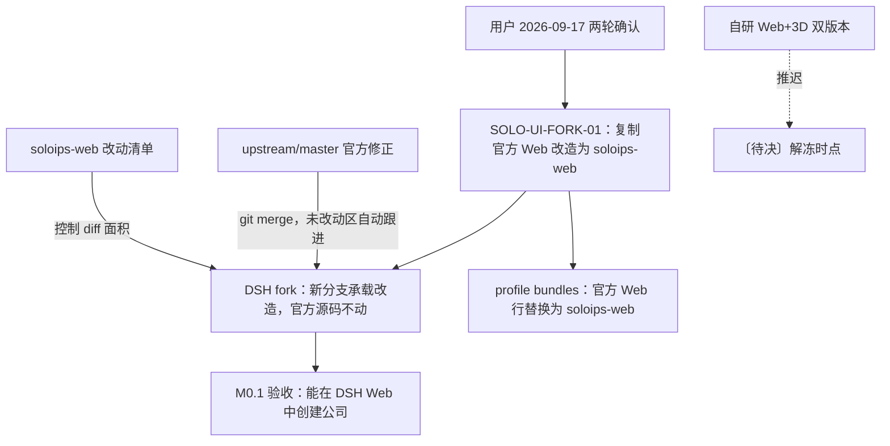

# SoloIPs：V1 界面复用官方 Web 并 fork 改造为 soloips-web

| 阅读契约 | 内容 |
| --- | --- |
| 身份 | `SOLO-UI-FORK-01`；V1 界面复用路线、fork 改造边界与上游同步方式的决策正文 |
| 目的 | 让开发者明确 V1 界面交付什么、改造落在哪里、官方修正如何持续跟进 |
| 范围 | V1（M0.1）个人 IP 公司平台界面的来源与改造方式；profile bundles 替换；上游 bug 修正同步；自研 Web+3D 双版本路线的推迟 |
| 决策状态 | 〔需求〕用户 2026-09-17 在本项目会话经两轮确认；下文〔约束〕是该路线的工程落实，改造结果保持〔未验证〕 |
| 证据范围 | §3 为 2026-09-17 本机 DSH fork 的静态源码核对，不代表 fork 已建立、工件已发布或界面已验收 |
| 交付状态 | 路线已确定；fork、替换装配与同步机制均为〔提案〕。本文不证明 soloips-web 已具备界面实现 |
| 依据 | 用户 2026-09-17 两轮确认；[官方 Team 复用与 DSH fork](official-team-and-dsh-fork.md)（SOLO-TEAM-01）；[产品架构](../architecture.md) SOLO-02；[技术架构](../technical-architecture.md)；[权威数据契约](../design/data-contract.md) §0/§6.1；[包结构](../technical/packages.md)；[装配机制](../technical/assembly.md) |
| 变更权 | 按[文档注册表](../governance/document-registry.md)维护；架构负责人可在本路线内决定改造范围与同步方式，改变 UI 交付目标或新增自研路线须由用户决定 |

## 1. 已定路线（SOLO-UI-FORK-01）

**〔需求〕V1 的个人 IP 公司平台界面 = 复制 DSH 官方 Web 插件改造为 `soloips-web`；官方 DSH 源码不动。** 来源：用户 2026-09-17 第一轮确认。

**〔需求〕在 fork 的 DSH 启动装配里，把官方 Web 插件替换为 `soloips-web`（profile bundles 替换）。** 来源：用户 2026-09-17 第二轮确认。

**〔需求〕上游官方 Web 的 bug 修正持续同步进 `soloips-web` 的未改动区域。** 来源：用户 2026-09-17 第二轮确认。

**〔需求〕原设计「`soloips-web` 自研 Web+3D 双版本（React/Zustand/Three.js，Client Slots 接入）」推迟。** 来源：用户 2026-09-17 第二轮确认。`soloips-web` 自此不再是等待自研的空骨架，而是官方 Web 的 fork 改造版；3D 与自研品牌化 UI 待本路线稳定后另行决策。解冻时点〔待决〕，见 §6。

**〔需求〕M0.1 验收「能在 DSH Web 中创建公司」不变。** 来源：用户 2026-09-17 第二轮确认。本决策与该验收同向：复用现成 Web 工作台比自研界面更早满足它。

箭头表示依赖或流向。**方向声明**：`soloips-web` 是官方 Web 的**派生仓库 / 分支形态**，不是重新实现；本文不授权把几个官方目录散装复制进 SoloIPs 仓库。

## 2. 执行条件（〔约束〕）

以下三条是用户路线在工程上的落实方式，是本项目技术裁定，不是用户的额外需求。

1. **〔约束〕以 git fork / 分支形态维护，不做散装复制。** 沿用 [SOLO-TEAM-05](official-team-and-dsh-fork.md) 的仓库分工：官方修正经 `git merge` 同步，未改动区域自动跟进。把官方文件逐份拷进 `packages/web/` 会切断历史对齐能力，使「持续同步上游修正」不可执行——该做法与本决策冲突，不得采用。
2. **〔约束〕改动做薄。** 优先使用官方 Web 已有的扩展点（Client Slots、theme、配置行、preset）；必须改源码的部分集中在「soloips 改动清单」（patch 序列或 `CHANGES` 文档）登记。diff 越小，同步成本越低。理由：官方修正进入未改动区域时无冲突；改动区越大，每次上游升级的冲突面和回归面越大。
3. **〔约束〕profile 装配替换走既有 `cordis.patch.yml` 机制。** 按 [装配机制](../technical/assembly.md) 的唯一 bundles 顺序，`@deepseek-ai/dsh-web-app` 行由 `soloips-web` 承接。替换以装配行完成，不修改官方包内容、不 monkey patch 运行时。

**这些条件不蕴含**：不声明 fork 分支已建立、不改动清单已存在、不声明替换后装配已通过启动验证。三项均由实现切片交付并单独取证。

## 3. 事实基线（〔源码事实〕，2026-09-17）

以下为 2026-09-17 对本机 DSH fork 的源码核对结果。**本节是静态源码事实，不证明任何东西已安装、已构建或已验收。**

### 3.1 官方 Web 界面由哪些包构成（身份更正）

> **⚠️ 更正**：决策转述中出现过「DSH Web 是独立插件 `@deepseek-ai/dsh-web`，源码位于 `packages/web/web/`」的说法。**该说法不成立，不得作为改造对象。** `@deepseek-ai/dsh-web` 是 **Web 访问服务（`ctx.web` 搜索与抓取）**，与界面无关。改造对象见下表。

| 角色 | 包名 | 本机源码位置（fork） | 版本 | 核对结论 |
| --- | --- | --- | --- | --- |
| **界面装配 bundle（改造主对象）** | `@deepseek-ai/dsh-web-app` | `packages/bundle/web-app/` | `0.1.6-alpha.1` | manifest 自述为「dsh 浏览器界面 bundle：dsh-base 之上的 web patch 层 + runtime glue（前端 dist 服务、web-surface prompt、bash runtime 变量、URL 行）」 |
| 前端构建入口 | `@deepseek-ai/dsh-web-frontend` | `apps/web/` | `0.1.6-alpha.1` | 自述为「Web 应用入口：以 `@deepseek-ai/dsh-client-web` 外壳库做 vite build；dist 由 `apps/cli` 的 `dsh web` 服务」 |
| 客户端启动内核 | `@deepseek-ai/dsh-client-web` | `packages/client/web/` | — | 静态模块表、Cordis loader、无框架启动页、UI-renderer 交接 |
| 插槽注册 | `@deepseek-ai/dsh-client-ui-slots` | `packages/client/ui-slots/` | — | SlotMap 声明合并、单一 register 组合 API |
| 官方界面功能包 | `@deepseek-ai/dsh-client-ui-*`（45 个） | `packages/client/ui-*/` | — | 侧栏、会话、设置、主题、品牌等官方界面单元 |
| ~~非界面~~ | ~~`@deepseek-ai/dsh-web`~~ | `packages/web/web/` | `0.1.6-alpha.1` | **`ctx.web` 搜索 / 抓取服务，与 UI 无关**；同目录另有 `web-search-*`、`web-fetch-http` 等 provider 包 |

**改造对象结论**：`soloips-web` 承接的是 `@deepseek-ai/dsh-web-app` 这一行所代表的浏览器界面面（patch 层 + bundle），配合 `apps/web`、`packages/client/` 下的客户端包。实现切片开始前必须先核实目标包范围，**不要按包名含「web」的直觉选错对象**。

### 3.2 fork 与 profile 事实

| 事实 | 来源 | 本机核对结果（2026-09-17） |
| --- | --- | --- |
| DSH 定制 fork | `D:/Source/workspace/deepseek-harness` | 存在；`origin` = `github.com/leinasi2014/deepseek-harness`；`upstream` = `github.com/deepseek-ai/deepseek-harness` |
| fork 当前检出 | `git rev-parse HEAD` / `git branch` | 分支 `codex/team-roster-model`，HEAD `abdfeb4831`（team roster model 提交） |
| 官方固定基线 | `git rev-parse upstream/master`；`profiles/development/upstream.json` | `upstream/master` = `0d1f50007f9bca3f52b06e1c3074fa14d5fb0720`；该提交是 fork 当前 HEAD 的祖先。`upstream.json` 以 `0d1f500` 为锁定基线 |
| 上游许可证 | `profiles/development/upstream.json`；fork `packages/bundle/web-app/package.json` | 官方 `MIT`；已有先例记录方式：`profiles/development/agent-presets/soloips-development/LICENSE.upstream`（`"license": "MIT; see ...LICENSE.upstream"`） |
| SoloIPs profile 装配 | `profiles/soloips/package.json`（`dsh.profile.bundles`） | 声明顺序含 `@deepseek-ai/dsh-base`、`@deepseek-ai/dsh-web-app`、`soloips-adapter-dsh`、`soloips-core`、`soloips-web`、`soloips-bundle` |
| 装配顺序正文 | `docs/technical/assembly.md` §唯一 bundles 顺序 | 与 `profiles/soloips/package.json` 一致 |

**〔未验证〕** 55120 运行实例的实际 bundles 内容未经本次核对；`profiles/soloips/package.json` 的声明不等于运行进程已按该声明启动（安装 ≠ 被调用）。运行实例归属证据按[环境交接](../operations/environment-handoff.md)的 `DSH_HOME_LIVE55120` / `PROFILE-55120` 行列式核对后另记。

### 3.3 与既有决策的关系

本决策是 [SOLO-TEAM-01](official-team-and-dsh-fork.md)「DSH 定制 fork + 少量完整补丁 + SoloIPs 锁定工件」（2026-09-16 用户确认）在 **UI 层**的延伸，**不是新路线**。因此以下既有约束直接适用，本文不复述其条文：

- fork 与分支分工、补丁登记要求：SOLO-TEAM-05 / SOLO-TEAM-10；
- 每次更新对齐官方最新代码：SOLO-TEAM-11；
- 上游修正经升级候选验证后再集成，生产环境不跟随分支浮动：SOLO-TEAM-07；
- SoloIPs 交付锁定完整运行组合：SOLO-TEAM-06；
- 公开边界：使用正式导出的接口，不跨包读取私有实现：SOLO-TEAM-04。

## 4. 对里程碑的影响

> 里程碑权威定义见 [`data-contract.md` §6.1](../design/data-contract.md#6-统一里程碑)。本节只记录本决策造成的状态变化，不复述里程碑定义。

| 里程碑 | 本决策后的状态 |
| --- | --- |
| **M0.1**（Web 版基础） | **口径不变**：验收仍为「能在 DSH Web 中创建公司」。界面来源改为 `soloips-web`（官方 Web fork 改造版），不再要求自研 React/Zustand 实现 |
| **M0.3**（3D 版基础） | ⏳ 依赖自研 UI 路线，随该路线**推迟**；解冻时点〔待决〕 |
| **M1**（双版本联调） | ⏳ 依赖 M0.3，**推迟**；Zustand 共享状态前提随自研路线重估 |
| **M0.2**（订阅限制） | 不受影响：权益策略是服务端规则，与界面实现方式无关 |
| **M2 / M3**（总助理 / 日志与监测） | 不受影响：属框架核心，不在 UI 路线内 |

**本决策不蕴含**：不声明 M0.1 已实现或已验收；不声明 3D 被取消（仅为推迟）；不改变 M0.1 的验收标准本身。

## 5. 待决事项

| 事项 | 说明 | 决策人 |
| --- | --- | --- |
| 自研双版本解冻时点 | 触发条件未定：是「fork 路线稳定」还是「品牌化需求出现」需明确 | 用户 |
| 3D 技术栈最终选择 | Three.js vs Babylon.js；若自研路线解冻再定 | 用户 |
| fork 承载位置 | 界面改造落在 DSH fork 仓库的独立分支，还是另建派生仓库——须在实现切片前定 | architecture-owner |
| 改动清单载体 | patch 序列还是 `CHANGES` 文档；按 §2 第 2 条要求登记，形式待定 | architecture-owner |

## 变更历史

| 日期 | 变更 | 变更者 |
| --- | --- | --- |
| 2026-09-17 | 创建：记录用户两轮确认的 V1 界面复用路线；更正改造对象包身份；登记执行条件与待决事项 | 文档审查·确认·更新智能体 |
