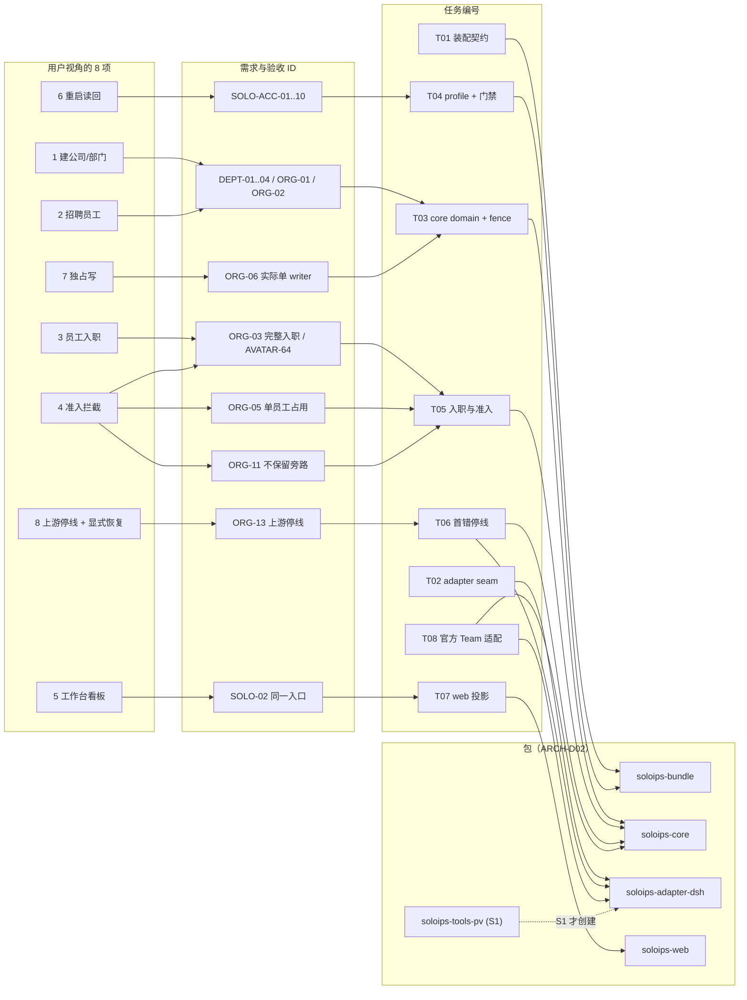
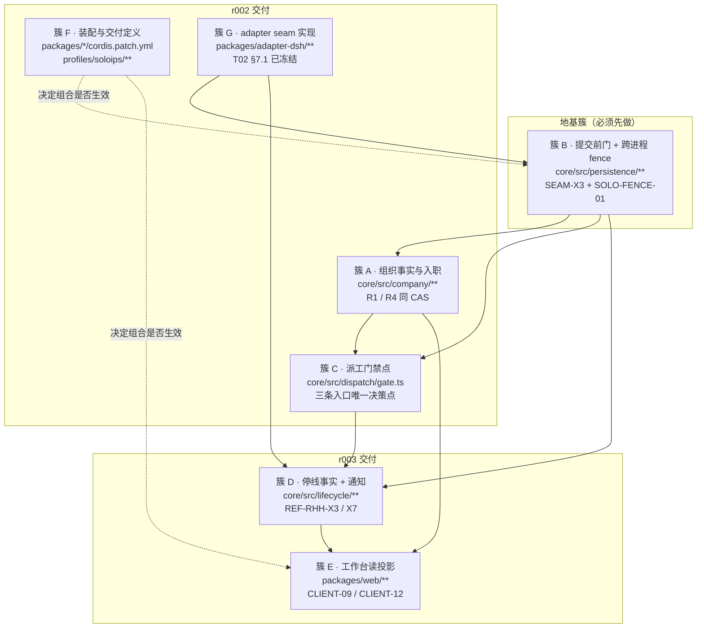
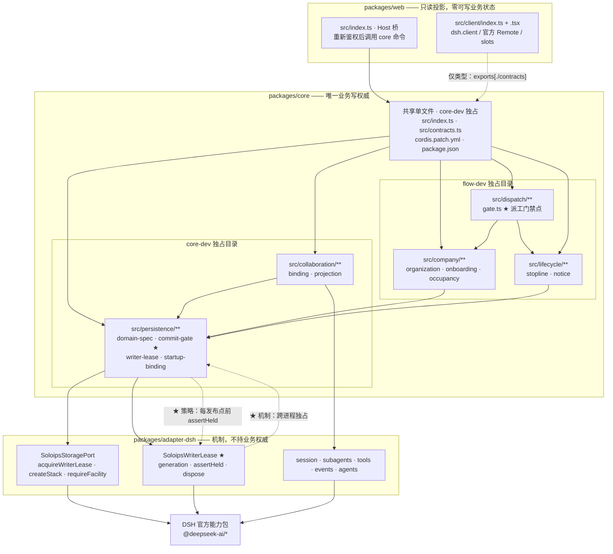

# SoloIPs r002 功能架构：8 项功能的真实关联、耦合簇与模块化设计

| 阅读契约 | 内容 |
| --- | --- |
| 身份 | `SOLO-R002-FUNC-ARCH`；r002 功能架构**设计分析**，非需求正文、非实现授权 |
| 目的 | 厘清用户列出的 8 项功能中哪些是功能、哪些是验收条件或存储层性质；给出真实耦合簇、可并行宽度、core 包内模块划分与版本边界 |
| 范围 | 8 项功能逐条裁定、耦合簇、并行宽度、派工门禁点判定、包内模块化设计、版本边界与预留接口。**不含**实现代码、schema 字段定义、装配 patch 内容 |
| 决策状态 | 〔提案〕本文件全部结论为**设计分析**。技术裁定以 [技术架构](../../technical-architecture.md) ARCH-D01–07 为准；本文件不新增〔需求〕，不改变 SOLO-ACC 验收合同，不构成对 `packages/**` 或 `profiles/soloips/**` 的写入授权（基线 §6 A3） |
| 证据范围 | 2026-09-16 本机**只读**核对：仓库权威正文、W0 机制重核、T01/T02 设计稿、task-8 参考提取、task-10 准备材料，以及**本次新增的 3 组隔离探针**（`oxlint` 静态检查 5 条、Mermaid 语法解析 4 张图 + 1 条负向对照、**domain 版本语义 6 用例**）。**未装配、未启动服务、未调用模型、未写入 `packages/**`** |
| 依据 | `docs/architecture.md` §3/§5/§6；`docs/technical-architecture.md` §3/§4/§5/§6/§7/§9/§10/§11；`docs/governance/code-development-standard.md` DEV-01–15；`docs/decisions/official-team-and-dsh-fork.md` SOLO-TEAM-01–11；`.artifacts/operations/r002-mechanism-audit-20260916/audit.md`（W0）；`.artifacts/operations/r002-adapter-20260916/contracts-design.md`（T02，§7.1 已冻结）；`.artifacts/operations/r002-assembly-20260916/design.md`（T01+T04）；`.artifacts/operations/r002-reference-runtime-host-human/rewrite-runtime-host-human.md`（task-8）；`.artifacts/operations/r002-dev-readiness/official-llm-error-surface.md`（task-10） |
| 变更权 | 本文件由 task-9 所有者（`core-dev`）维护；**结论不构成实现授权**。技术裁定变更须回到技术架构对应正文；登记由 `integrator` 执行 |

---

## 0. 结论摘要（先读这段）

1. **8 项里有 5 项是功能、2 项不是功能、1 项是跨切面功能。** 逐条裁定见 §2。用户与 Lead 的初始直觉部分成立、部分需要修正：
   - 「6 重启读回」**不是功能**（是 SOLO-ACC-05 的验收条件）—— **成立**，但有第二重身份：它同时是持久化层的**设计约束**（DEV-08）。
   - 「7 独占写」**不完全是存储层性质**—— **需修正**。它有两半：**机制半**（租约/ fencing）已由 T02 冻结在 `soloips-adapter-dsh` 的 `SoloipsWriterLease`；**策略半**（何时取得、每个发布点前复核、失权后怎么办）属 `soloips-core` 的唯一提交前门。**它不是可独立开发的功能，但也不是「已经由存储层解决」的性质**——策略半是 core 必须自己交付并验收的（SOLO-ACC-09）。
   - 另有 1 项需要重新分类：「8 上游停线+显式恢复」是**功能**，但它是**跨切面功能**：触发在 adapter、事实在 core、投影在 web、**门禁效果落在派工门禁点**。
2. **「准入拦截」与「上游停线」不是同一个门禁，但必须是同一个门禁点。** 这是本次核验对 Lead 假设的**部分确认 + 精确化**：两者的**谓词不同、作用域不同**（准入是逐员工无条件；停线是逐失败范围、只拦「依赖该失败请求的」派工），但两者的**决策点、失败语义与三条入口完全相同**。因此：**门禁点不可拆，谓词可以拆**。详见 §3。
3. **真实耦合簇有 7 个**（A–G），其中**簇 B（提交前门 + 跨进程 fence）是唯一的地基簇**——其余全部依赖它，且 `ARCH-D07` 明确「没有通过 ORG-06 则不启用公司写入」。每个簇给出了「拆开的具体故障」。见 §4。
4. **可并行的真实宽度是 3 → 4 → 5**，不是按人数算的 5。瓶颈是**门禁接口冻结**，不是人力。见 §5。
5. **与 `flow-dev` 的目录级互斥本身可行，但它是假安全**：`src/index.ts`、`src/contracts.ts`、`cordis.patch.yml`、`package.json` **不在任何一方的目录内**，两者都必须改。必须补一条「共享单文件单写者 + 冻结注册函数」规则，否则目录级互斥挡不住双写。**同时发现 roster 自身有两处归属缺口**：`packages/*/cordis.patch.yml` 同时属 `assembly-dev` 与各包 owner；`src/dispatch/**` 不属任何一方。见 §6.3–§6.5。
6. **版本边界需要一处修正**：基线把 SOLO-ACC-04 列为 r002 必达出口，但 ACC-04 的三条派工路径（经理派单 / 员工自领 / 自动调度）在 SOLO-TEAM-03 下属于**官方 Team 任务板**，因此 **T08（官方 Team 适配）在 r002 的关键路径上**，不能被推迟到 r004。见 §7 与 `version-architecture.md` §2.4。

**证据边界见 §9**：本文件是设计分析，未装配、未运行、未调用模型。全部「可并行宽度」与「拆开故障」均为**设计推演**，不是实测结果。

---

## 1. 核验方法与判据（说明我如何验证，而非照抄）

### 1.1 对「是不是功能」的四条判据

〔建议〕本文件用以下四条判据裁定每一项。四条**全部满足**才算「功能」；不满足的按下表归类：

| 判据 | 含义 | 来源 |
| --- | --- | --- |
| **F-1 独立用户路径** | 用户（或经理/员工角色）能独立走完一条路径，并观察到结果 | `docs/architecture.md` §5「首片必须观察到的结果」 |
| **F-2 独立交付物** | 存在可指名、可独立验收的交付物与写面 | DEV-12 单写者、DEV-13 交付证据 |
| **F-3 独立失败模式** | 拆开后能给出一个**具体的**、非泛泛的故障 | task-9 要求「拆开的具体故障」 |
| **F-4 不被他项蕴含** | 完成其他项**不自动**完成本项 | `TERM-12` 验收基线的「基线外不得外推」 |

**分类取值**（task-9 要求）：`功能` / `验收条件` / `存储层性质` / `门禁` / `跨切面功能`。

### 1.2 对「是否同一门禁点」的判据

〔建议〕不靠语义猜测，改用三条可核对的**同点判据**：

| 判据 | 问题 |
| --- | --- |
| **G-1 同入口** | 两项要求是否约束**同一组**入口？ |
| **G-2 同失败语义** | 被拒时的可观察结果是否同形（拒绝 + 具体原因 + 保持 pending/ready=false + 重试有界）？ |
| **G-3 同作用时机** | 是否都必须发生在**同一时点**（派工决策与持久发布之间）？ |

三条全中 → **同门禁点**；只有部分中 → 同点不同谓词。

### 1.3 本次新增的三组隔离探针（〔已验证〕）

三组探针均**在隔离目录内**运行，不触碰仓库产品文件、不装配、不启动服务：

| 探针 | 目的 | 命令 | 实测结果 |
| --- | --- | --- | --- |
| **P-LINT** | core 能否用 `import type { Context } from '@deepseek-ai/cordis'` 绕过 DEV-04 | `oxlint -c .oxlintrc.json packages/core/src/index.ts` | **exit 1**，报 `no-restricted-imports`：`'@deepseek-ai/cordis' import is restricted from being used by a pattern` |
| **P-LINT-CONTROL** | 同上，配置加 `allowTypeImports: true` | 同左，换配置 | **exit 0**，0 warning 0 error |
| **P-LINT-REPO** | 仓库真实门禁基线 | `oxlint --type-aware`（根脚本） | **exit 0**，7 文件、0 warning 0 error |
| **P-MMD-CONTROL** | Mermaid 探针的负向对照：故意写坏的图必须被拒 | `node probe/mermaid/parse-mermaid.mjs …`（脚本内置） | **被拒**——证明探针确实在校验语法，不会永远返回 ok |
| **P-MMD** | 本文 §8 的 3 张图 + `version-architecture.md` 的 1 张图语法可解析 | 同上，参数为两份正文 | **exit 0**，`blocks=4 failed=0` |
| **P-VER-C/A/B/E/D1/D2** | domain 版本语义（6 用例，task-17 补记） | `node probe-version-semantics.mjs`（已安装工件） | 见 §6.5.1 与 §9.2 第三组；**C-1 对照 OK；E-1 证明加表不需 bump；B-1 证明 `compatibleVersions` 无效** |

**前三条证明**（已证边界）：`packages/core/**` 的 `apply(ctx)` 需要 cordis 的 `Context` 类型，而现有 lint 规则**连类型导入一起拒绝**；core 只能经 `soloips-adapter-dsh` 暴露的接口拿到该类型。
**后三条证明**：4 张 Mermaid 图**语法可解析**；**不证明**渲染外观或图的内容正确。domain 版本语义见 §6.5.1（该组**推翻了本文件原有的 R-4 断言**）。
**均不证明**：任何运行期行为；也不证明 `pnpm run lint` 在**未来**改动后仍为绿。探针目录与完整输出见 §9.2。

---

## 2. 8 项功能逐条裁定

**裁定表**（分类依据见 §1.1；每条的「依据」在 `evidence.md` §2 逐条给出 file:line）：

| # | 用户视角名称 | 裁定 | 一句话理由 | 归属包 |
| --- | --- | --- | --- | --- |
| 1 | 建公司/部门 | **功能** | 独立用户路径（建公司→建部门）、独立写面、独立失败模式（重复/非法层级） | `soloips-core`（写） |
| 2 | 招聘员工 | **功能** | 独立用户路径（招募→建立 Employee+Appointment）、独立失败模式（重复身份、非法任命） | `soloips-core`（写） |
| 3 | 员工入职 | **功能** | 独立用户路径（补齐缺项→可开工）、**有真实写入**（资料/头像/初始化）、独立失败模式 | `soloips-core`（写） |
| 4 | 准入拦截 | **门禁** | 不产生新事实；是**决策点**，读 3 的结果与占用状态后拒绝或放行 | `soloips-core`（策略）+ `soloips-adapter-dsh`（机制） |
| 5 | 工作台看板 | **功能**（投影型） | 独立用户路径（同一入口看到目标/负责人/待回答/交付版本）；**零写权威** | `soloips-web`（读投影） |
| 6 | 重启读回 | **验收条件**（主）+ **持久化设计约束**（次） | 无独立用户路径、无独立写面；是 SOLO-ACC-05 的判定编排 | `soloips-core`（受约束）+ 交付定义 |
| 7 | 独占写 | **存储层性质**（机制半）+ **core 策略**（策略半） | 机制已冻结在 adapter；策略必须由 core 交付 | `soloips-adapter-dsh`（机制）+ `soloips-core`（策略） |
| 8 | 上游停线+显式恢复 | **跨切面功能** | 有独立用户路径（通知可见 + 明确恢复）；但触发/事实/投影/门禁分散在四层 | adapter（触发）+ core（事实）+ web（投影） |

### 2.1 逐条说明（含对 Lead 假设的独立验证）

**#6 重启读回 —— Lead 假设「是持久化的验收条件」：成立，但需补第二重身份。**

验证方法：直接读该要求的权威文本形态，而不是读它的名字。
〔需求〕`docs/technical-architecture.md` §11.4 的 `SOLO-ACC-05` 位于标题为「**11. 验收场景与反例**」的章内，章首自述「本章是**验收设计**，不是通过记录」（`technical-architecture.md:1005`）。该条有 `actor` / `trigger/precondition` / `action` / `outcome（通过）` / `outcome（失败）` 五个编排字段（`:1057-1062`），形态是**测试编排**而非功能规格。故 **F-1 独立用户路径不成立、F-2 独立交付物不成立** → 不是功能。**Lead 假设成立。**

但**它不只是一条验收条件**：`DEV-08` 明确要求「schema 变化必须说明旧数据读取、版本识别、迁移边界和失败恢复」（`code-development-standard.md:149`），而 `SOLO-F08` 第 1 点指出「patchReload 控制配置生效时机，**不提供持久化或状态恢复保证**；配置变化仍可能改变存储路由、schema 或服务接线」（`technical-architecture.md:954`）。因此 #6 对持久化层施加了**设计约束**：schema 版本策略与迁移边界必须在 r002 就定，不能等到做「重启」这个「功能」时才想。

**#7 独占写 —— Lead 假设「是存储层性质」：需修正。**

验证方法：把该要求拆成「机制」与「策略」两半，分别定位到 T02 冻结契约的具体类型与 core 的具体义务。
〔源码事实〕T02 已冻结的 `SoloipsWriterLease` 提供 `generation` / `storageId` / `assertHeld()` / `dispose()`（`r002-adapter-20260916/probe/contracts.ts:236-248`），且其文档注释明确写「core 负责**策略**：在装载任何可写 domain/缓存之前取得租约，并在每个持久发布点前复核」（同文件 `:230-234`）。
〔源码事实〕T02 设计稿 §3.3 给出同一分界：「adapter 提供 `acquireWriterLease` / `createStack` 两个**机制**入口；**何时**取锁、**每个持久发布点前**复核、失败如何回退，是 core 的**策略**」（`r002-adapter-20260916/contracts-design.md:217`）。

**结论**：**机制半**确实是存储层性质且**已经解决**（契约冻结、编译验证）；**策略半不是**——它是 core 必须自己交付、且必须自己通过 `SOLO-ACC-09` 验收的义务。因此：
- 「7 独占写**不是**可独立开发的功能」——**成立**（F-1 无独立用户路径）。
- 「7 独占写**是**存储层性质」——**部分成立**。把它整体归为存储层性质会**丢掉 core 的策略责任**，而那正是候选代码的原始缺陷（`SEAM-X2` 进程内锁、`SEAM-X3` 写路径旁路唯一提交点，见 `rewrite-seam-client.md:59-60`）。

**#8 上游停线 —— 需要单独一类「跨切面功能」。**

验证方法：读 `SOLO-F09` 的模块归属建议，核对它是否落在一个包内。
〔建议〕`technical-architecture.md:1001`：「**core 持有停线事实及派工门禁，adapter/tools-pv 上报去敏错误和真实外部状态，web 只投影通知**；不另建第二任务状态机。」
四个不同包各承担一部分 → **F-2「独立交付物」不成立**（没有单一交付物），但 **F-1「独立用户路径」成立**（`ORG-13` 要求站内通知可见 + 用户明确恢复）。
故它是**功能**，但类型是**跨切面**：不能按包切，只能按「事实 → 触发 → 投影 → 门禁效果」四条职责切。这直接决定了 §4 的簇 C/D。

**#5 工作台看板 —— 是功能，但必须标注「投影型」。**

〔需求〕`docs/architecture.md` §5「首片必须观察到的结果」第 2 条：「用户从同一工作入口看到目标、当前负责人、待回答问题和交付版本；不会『等待回答』却没有可回答入口」（`architecture.md:138`）。
**F-1 成立**（独立用户路径）。但 **`CLIENT-09`/`CLIENT-12` 要求客户端零可写业务状态**（`technical-architecture.md:802`、`:808`），故它是**只读投影功能**——这决定了它的簇（§4 簇 E）与它的失败模式（`CLIENT-F04` 双写权威）。

**#4 准入拦截 —— 是门禁，不是功能。**

**F-2 不成立**：它不产生新事实，只产生**决策**。
〔源码事实〕候选的准入判定顺序固定为「legacy → identity → appointment → onboarding → UNKNOWN → writer gate」，`AdmissionDecision` 三态 `allow`/`deny`/`unknown`（`rewrite-domain-storage.md:111`；task-8 `TC-08`）。
〔需求〕`ORG-11`「新入口不保留旧执行器旁路」（`technical-architecture.md:254`）→ 门禁的价值在于**唯一性**，而不是它自己是一个功能。

**#1/#2/#3 —— 是功能，但三者同域同门。**

三者的**用户路径独立**（建公司 ≠ 招人 ≠ 补齐入职），但**写面与原子边界相同**（同属组织事实）。这决定了它们在 §4 里同属簇 A，**不可按名词拆成三个 domain**（R1/R4）。

---

## 3. 问题 4 专项核验：准入拦截与上游停线是否同一门禁点

**Lead 的假设**：SOLO-ACC-04 要求拦三条派工路径，ORG-13 要求停线时也拦这三条 → 若是同一门禁点，则准入与停线不可拆。

### 3.1 核验结果

**结论：不是同一个门禁，但必须是同一个门禁点。因此「门禁点不可拆、谓词可以拆」。**

按 §1.2 的三条判据逐条核对：

| 判据 | 准入拦截（SOLO-ACC-04 / ORG-03） | 上游停线（SOLO-ACC-07 / ORG-13） | 是否同点 |
| --- | --- | --- | --- |
| **G-1 同入口** | 「必须分别触发并拒绝三条路径：(a) 经理显式派单；(b) 员工自领 open-claim 任务；(c) 自动调度器分配」（`technical-architecture.md:1046`） | 「暂停依赖该失败请求的**后续派工**、自动重试与续跑」（`:993`） | **是**——两者约束的都是「派工」这一动作的入口集合 |
| **G-2 同失败语义** | 「三条路径均被拒，返回**具体缺项原因**（非泛化失败）；重试有界且不重建员工身份；**任务保持 pending/ready=false**」（`:1048`） | 「首错立即可见且受影响执行/依赖派工停止；没有静默重试、换路由/账号/模型或自动续跑」（`:1125`） | **是**——拒绝 + 具体原因 + 不放行 |
| **G-3 同作用时机** | 准入必须在**取得可写 domain handle 之前**拒绝（`SOLO-ACC-09` 的「打开路径绕过」子场景，`:1150`） | 停线必须在**持久发布之前**生效（`SOLO-ACC-09` 的「检查/发布竞争」，`:1153`） | **是**——都位于「决策 → 持久发布」之间 |

**三条全中 → 同一个门禁点。**

### 3.2 但两者不是同一个门禁：谓词与作用域不同

这是对 Lead 假设的**精确化**，也是本文件最重要的结论之一：

| 维度 | 准入拦截 | 上游停线 |
| --- | --- | --- |
| **判定事实** | 员工入职完整性（`ORG-03`）+ 当前 Appointment/代际 + 跨 Team 占用（`ORG-05`） | 停线事实（哪个上游失败、影响哪个范围） |
| **作用域** | **逐员工、无条件**——该员工未过入职，三条路径全拦 | **逐失败范围、有条件**——`ORG-13` 原文限定「暂停**依赖该失败请求的**后续派工」 |
| **可解除条件** | 补齐缺项后重试即通过（`SOLO-ACC-04` failure/recovery，`:1050`） | **仅用户明确恢复指令**（`SOLO-F09` 恢复行，`:998`） |
| **事实归属** | `soloips-core`（组织域） | `soloips-core`（停线事实，`SOLO-F09` 模块归属建议） |
| **失败时的读回** | 返回**具体缺项**，可修正 | 返回**受影响范围**，不可自行修正 |

〔需求〕停线的**有条件性**有正面验收证据：`SOLO-ACC-07` 的 precondition 明确要求「另有**不依赖该失败请求的**任务用于核对影响范围」（`:1123`），outcome 要求「**无关工作未被任意处置**」（`:1125`）。
→ 因此门禁**不能**实现成「停线期间一律拒绝」，必须能按范围区分。这与准入的「逐员工无条件」是**不同的谓词语义**。

### 3.3 这个结论对设计的三个硬后果

1. **门禁点必须是单一函数，且接受有序谓词列表。** 若实现成「准入门 + 停线门」两个独立门，则三条路径各自要调用两个门 → **6 个检查点**。任何新入口（如 S1 的 `soloips-tools-pv` 派工、或官方 Team 的工具入口）只要漏接一个门，就会在停线期间放行——这**正面违反 `ORG-11`「新入口不保留旧执行器旁路」**（`technical-architecture.md:254`）。
2. **门禁点必须在 r002 就建好，不能等到做停线时再建。** 因为 ACC-04 是 r002 必达出口（`baseline.md:40`），而 ACC-04 已经要求三条路径统一拦截。若 r002 只做一个「入职检查函数」而没有门禁点，r003 加停线时就必须**改造三条路径的调用点**——那是返工，不是扩展。
3. **谓词的实现可以拆。** 入职谓词（`ORG-03`/`ORG-05`）与停线谓词是两个独立的事实来源，可以分别由不同切片交付，**只要它们注册到同一个门禁点、返回同形的 `{allow|deny, reasonCode, hint}`**。

**因此**：Lead 的假设「若是同一门禁点，则准入与停线不可拆」——**结论方向正确，但边界需要修正**：
- **不可拆**：门禁点本身、它的位置（决策与持久发布之间）、它的失败语义（拒绝 + 具体原因 + 保持 `ready=false`）、三条入口的接线。
- **可拆**：两个谓词的实现与它们各自的事实来源。

**版本含义**：门禁点属 **r002**（因为 ACC-04 是 r002 必达）；停线谓词属 **r003**（与 #8 一起交付）。见 `version-architecture.md`。

---

## 4. 真实耦合簇

**判据三条**（task-9 指定）：同 domain/schema（R1/R4 原子边界）、同文件（DEV-12 单写者）、接口是否已冻结。

| 簇 | 成员 | 判据 | 拆开的具体故障 | 可否并行 |
| --- | --- | --- | --- | --- |
| **A 组织事实与入职** | 功能 1、2、3；准入谓词的**数据来源** | 同 domain（组织事实）、同 CAS 单元（R1/R4）、同文件（`core/src/company/**`） | **具体故障**：把「部门成员计数」与「员工/任职」拆到两个 domain。两个进程并发招聘同一员工时，各自在自己 domain 内校验唯一性均通过，落库**两条 Appointment**；部门成员计数与 revision 不同记录 → 计数少算一个（丢失更新）。**正面违反 `SOLO-ACC-04` 的 failure/recovery「重试不得产生第二条员工身份或第二个 appointment」**（`technical-architecture.md:1050`） | 与 B 串行（依赖提交前门）；与 E、F、G 并行 |
| **B 提交前门 + 跨进程 fence** | 功能 7 的**策略半**；功能 6 的 schema/版本策略 | `SEAM-X3`（所有权威写经单一 commit 入口）、`SOLO-FENCE-01`、`SEAM-X2` | **具体故障**：任一处写路径直接 `table.put()` 而不经前门（正是候选的原始缺陷：`organization-assets.ts` 内 7 条 `withLock` 写路径**全部**直接 `.put()`，`rewrite-domain-storage.md:151-152`）。失权旧 writer 的 handle 仍在内存 → A 在被接管后仍能写入，**覆盖 B 的数据**。`SOLO-ACC-09` 的「失权旧 handle」子场景直接失败（`:1152`） | **必须先做**（地基）；其余全部依赖它 |
| **C 派工门禁点** | 功能 4；功能 8 的**门禁效果** | §3 的三条判据全中：同入口、同失败语义、同时机 | **具体故障**：实现成「准入门 + 停线门」两个门。S1 新增 `soloips-tools-pv` 派工入口时只接入了准入门 → 停线期间该入口仍能派工。`SOLO-ACC-07` 的「受影响执行/依赖派工停止」无法保证；`ORG-11`「不保留旧执行器旁路」失效 | 门禁点属 r002；停线谓词属 r003 |
| **D 停线事实 + 通知投影** | 功能 8 的**事实**与**通知** | 事实必须**持久化**（`REF-RHH-X3`）；投影必须保留**已去敏**诊断（`REF-RHH-X7`） | **具体故障**：停线事实只存进程内（候选的做法：`suspendTeam` 只撤销进程内 IO 租约，`rewrite-runtime-host-human.md:219`）。注入 `RATE_LIMIT` → 停线 → 进程重启 → **无停线记录** → 自动重新派工。**正面违反 `ORG-13`「恢复须用户明确指令」** | 与 C 同版（r003）；与 E 串行（E 消费 D 的投影） |
| **E 工作台读投影** | 功能 5；功能 8 的**通知呈现** | `CLIENT-09`/`CLIENT-12` 零可写业务状态；`SOLO-02` 同一入口 | **具体故障**：客户端保留可写副本（候选反例 `CLIENT-D3`/`CLIENT-D4`：业务草稿落 IndexedDB / sessionStorage，`rewrite-seam-client.md:91-92`）。用户在界面上看到「已完成」，Host 未提交 → `CLIENT-F04` 双写权威；且待回答事项没有可回答入口（正面违反 `architecture.md:138`） | 依赖 core 的**读投影接口**冻结；与 A、C 并行 |
| **F 装配与交付定义** | 四包的 `cordis.patch.yml`、`package.json` 的 `dsh` 字段、`profiles/soloips/**`、dump 门禁 | 装配权威唯一（`SOLO-C01`）；`SOLO-C03` 覆写须完整重述 | **具体故障**：0.1.6 下 `soloips-*` 行 pending **只 warn 不失败**（W0 `MECH-06`：仅 7 个 required id + bootstrap include 才 reject）。服务根本没生效，而**进程退出码仍是 0**；若门禁只看退出码，会判定通过。`SOLO-ACC-01` 因此必须落在 L2 逐行比对（`r002-assembly-20260916/design.md` §6.1） | **完全独立**，可立即并行 |
| **G adapter seam 实现** | `soloips-adapter-dsh` 的五个端口实现 | T02 §7.1 的 11 组类型**已冻结**；`DEV-04` 依赖方向 | **具体故障**：core 直接 import 官方能力包（本次探针 **P-LINT exit 1** 实测拒绝）。DSH 升级时改动面从 adapter 一处扩散到 core 全部业务模块；且 `core` 会把 Node/存储句柄带进浏览器边界 | **完全独立**，可立即并行 |

### 4.1 地基簇的判定依据

**簇 B 是唯一的地基簇**，因为：
- 〔源码事实〕T02 冻结契约把顺序写成结构性质：「core 必须先取得 `SoloipsWriterLease`，再建立 stack，最后在租约窗口内 open 业务 domain；释放时逆序」（`r002-adapter-20260916/probe/contracts.ts:602-604`）。
- 〔需求〕`ARCH-D07`：「**没有通过 ORG-06 则不启用公司写入**」（`technical-architecture.md:70`）。
- 〔约束〕`DEV-08`：「由 core 执行身份、准入、占用与写权检查……检查和发布必须满足 SOLO-FENCE-01」（`code-development-standard.md:145`）。

→ **簇 A/C/D 的任何写入都必须在 B 之后**。这不是排期偏好，是 `ARCH-D07` 的启用条件。

---

## 5. 问题 3：可并行的真实宽度

**定义**：接口冻结后，**真正不互相返工**的写者数。不是「能派几个人」。

| 阶段 | 可并行写者 | 冻结前提 | 为什么不能更宽 |
| --- | ---: | --- | --- |
| **阶段 0**（今天） | **3** | T02 §7.1 已冻结 | `adapter-dev`（簇 G）、`assembly-dev`（簇 F）、`core-dev`（簇 B）互不依赖。**`flow-dev` 不能加入**：簇 A/C 的谓词与门禁点都依赖 B 的提交前门签名 |
| **阶段 1** | **4** | 提交前门签名 + 门禁点签名冻结 | `flow-dev` 加入（簇 A + C）。`web-dev` 仍不能加入：读投影 DTO 未定 |
| **阶段 2** | **5** | core 的**读投影接口**冻结（`src/contracts.ts` 的浏览器安全 DTO） | `web-dev` 加入（簇 E） |
| **上限** | **5** | —— | 第 6 人无处可放：`ARCH-D02` 只有 5 包，`packages/core/**` 内再多写者只会增加 `tsc -b` 与共享文件的争用 |

### 5.1 三个把宽度压到 5 以下的真实约束

1. **同包 `tsc -b` 是一个整体。** 根 `tsconfig.json` 用 project references（`tsconfig.json:3-7`），`pnpm run typecheck` = `tsc -b`（`package.json:16`）。`core-dev` 与 `flow-dev` 同处 `packages/core` → **任一方的类型错误会挡住另一方的门禁**。因此两人并行时必须约定「每次交接前跑 `pnpm run typecheck`」，且共享文件单写者。
2. **共享单文件不在任何目录内**（§6.4）。目录级互斥**不覆盖** `src/index.ts` / `src/contracts.ts` / `cordis.patch.yml` / `package.json`。
3. **`ARCH-D02` 只有 5 包**，且 §5.3 明确列出**刻意不建**的包（协作内核、独立组织包、IP/作品包、第二套调度器、独立 Runtime）。**不能靠拆包增加并行宽度**——`technical-architecture.md:305` 已写「拆包不提升任何写安全」。

**结论**：**真实并行宽度 3 → 4 → 5**。瓶颈是**门禁接口冻结**（`core-dev` 的第一个切片），不是人力。这与基线 §4「并行宽度的真实上限不由人数决定」同向（`roster.md:91`）。

---

## 6. 问题 6：模块化设计

### 6.1 core 包内模块划分

〔约束〕按 `DEV-03` §2.2 的目录约定（`code-development-standard.md:108`：`package.json`、`cordis.patch.yml`、`src/index.ts`、`src/contracts.ts`，以及当前切片需要的 `src/company/`、`src/collaboration/`、`src/persistence/` 与 `tests/`）。

```text
packages/core/
├── package.json              # 共享单文件（§6.4）
├── cordis.patch.yml          # 共享单文件（§6.4）；roster 归 assembly-dev，见 §6.5
├── tsconfig.json             # 共享单文件
├── src/
│   ├── index.ts              # 共享单文件：apply(ctx, config) 装配 + re-export
│   ├── contracts.ts          # 共享单文件：公开 DTO/命令契约（浏览器安全，无 Node 依赖）
│   ├── persistence/          # 簇 B —— core-dev
│   │   ├── domain-spec.ts        # defineDomain 声明（业务 domain 的唯一 spec 来源）
│   │   ├── commit-gate.ts        # ★ 唯一提交前门（SEAM-X3）
│   │   ├── writer-lease.ts       # 租约策略：取得 / 每发布点复核 / 失权处理
│   │   └── startup-binding.ts    # 启动绑定清单（backend / root / storageId / 代际）
│   ├── company/              # 簇 A —— flow-dev
│   │   ├── organization.ts       # 公司 / 部门 / 员工 / 任职（写经 commit-gate）
│   │   ├── onboarding.ts         # ORG-03 入职必需项（不止资料引用与头像存在性）
│   │   └── occupancy.ts          # ORG-05 占用与代际事实（不持可写占用副本）
│   ├── dispatch/             # 簇 C —— flow-dev
│   │   └── gate.ts               # ★ 派工门禁点（§3）：有序谓词列表 + fail-closed
│   ├── lifecycle/            # 簇 D —— flow-dev
│   │   ├── stopline.ts           # 停线事实（持久化，REF-RHH-X3）
│   │   └── notice.ts             # 站内通知（去敏，REF-RHH-X7）
│   └── collaboration/        # 簇 E 的 Host 侧 —— core-dev
│       ├── binding.ts            # 公司身份 ↔ Team/成员/Session 业务绑定
│       └── projection.ts         # 只读投影（供 web 与 tools-pv 消费）
└── tests/                    # 镜像 src/ 子树，每写者独占自己的镜像目录
    └── package-contract.spec.ts  # 共享（core-dev）
```

**为什么 `dispatch/gate.ts` 单独成模块而不是塞进 `company/` 或 `lifecycle/`**：§3 已证两者是**同一门禁点的两个谓词**。若门禁点放在 `company/admission.ts` 里，则 `lifecycle/stopline.ts` 必须反向依赖 `company/**` —— 虽然两者同属 `flow-dev`、不构成跨写者冲突，但会把「门禁点的唯一性」表达成目录偶然，日后新增谓词（如 S1 的工具派工）时容易再建一个门。**单独成模块 + 显式谓词注册表**把唯一性变成结构性质。

**⚠️ `src/dispatch/**` 与现有 roster 不一致（须 Lead 裁定）**：`roster.md:25` 给 `core-dev` 的是 `packages/core/**`（除 `src/company/**`、`src/lifecycle/**`），`roster.md:26` 给 `flow-dev` 的是 `src/company/**`、`src/lifecycle/**`。**`src/dispatch/**` 不在任何一方**——按 roster 的「排除法」表述，它会**默认落到 `core-dev`**。

本文件的建议是**把 `src/dispatch/**` 划给 `flow-dev`**，理由：§3 已证两个谓词（入职/占用 + 停线）都由 T05/T06 交付，门禁点与谓词同属一个写者才能保证「一个决策点」不被拆散。**但这需要 Lead 更新 `roster.md:26`**（或在任务描述中显式声明）。**在 roster 更新前，该目录的归属是未定的**；若不更新，则门禁点归 `core-dev`，而两个谓词分属两人，跨目录接口（谓词注册函数）必须由 `core-dev` 冻结。

### 6.2 公开接口与写权威归属

| 面 | 位置 | 消费者 | 写权威 |
| --- | --- | --- | --- |
| `soloips-core`（Host 入口） | `exports["."]` → `src/index.ts` | DSH Loader（`cordis.patch.yml` 的 `name: 'soloips-core'`） | —— |
| `soloips-core/contracts` | `exports["./contracts"]` → 仅类型/DTO | `soloips-web` 的 **client** 半边、`soloips-tools-pv` | **只读 DTO**，无写入口 |
| core 服务面 | `ctx.provide('soloipsCore', …)`（命名待定稿） | `soloips-web` 的 **Host** 半边 | 经 core 命令服务 |
| **业务 domain 的唯一 opener** | `persistence/domain-spec.ts` + `persistence/commit-gate.ts` | 仅 core 内部 | **`soloips-core` 独占** |
| 跨进程 fence 机制 | `soloipsAdapter.storage.acquireWriterLease` / `createStack` | `soloips-core` | `soloips-adapter-dsh`（**只提供机制，不 open 业务 domain**） |
| 官方 Team / Session 原生事实 | `soloipsAdapter.team`（T08 定稿） | `soloips-core` 的 `collaboration/**` | **官方 Team**（`SOLO-TEAM-03`） |

**唯一 opener 的核对清单**（`R2` 要求「同时枚举业务事实与真实介质的唯一写入口」）：

| 业务事实 | 唯一写入口 | 介质 |
| --- | --- | --- |
| 公司 / 部门 | `core/src/company/organization.ts` → `commit-gate` | SoloIPs 业务 domain（JSON backend，root 由 `startup-binding` 绑定） |
| 员工 / 任职 / 代际 | 同上 | 同上 |
| 入职完整性 | `core/src/company/onboarding.ts` → `commit-gate` | 同上 |
| 准入决策 | `core/src/dispatch/gate.ts`（**不持久化决策本身**，只读谓词） | —— |
| 停线事实 | `core/src/lifecycle/stopline.ts` → `commit-gate` | 同上 |
| 公司身份 ↔ Team/Session 绑定 | `core/src/collaboration/binding.ts` → `commit-gate` | 同上 |
| Team 成员 / 原生任务 / revision | **`soloips-adapter-dsh` → 官方 Team 服务** | 官方 Team 持久化（**core 不另存可写副本**，`SOLO-TEAM-03`） |
| 执行历史 | DSH Session（core 不直接改写） | Session 持久化 |

〔反面声明〕`already-open` 只拦**同一 facility 实例**内的同名 open（W0 `MECH-05`：`storage-domain/src/index.ts:103-107`，文件与 `c291e796` 同 blob）。**它不能替代 `SOLO-ACC-09` 的跨 Host 独占证据**（`baseline.md:54`）。

### 6.3 与 `flow-dev` 的目录级互斥是否可行

**结论：目录级互斥本身可行，但它是假安全。必须补一条「共享单文件单写者」规则，否则挡不住双写。**

**为什么「可行」**：`core-dev` 与 `flow-dev` 的目录集合按 §6.1 划分后**不相交**：

| 写者 | 独占目录 |
| --- | --- |
| `core-dev` | `src/persistence/**`、`src/collaboration/**` |
| `flow-dev` | `src/company/**`、`src/dispatch/**`、`src/lifecycle/**` |

**⚠️ 其中 `src/dispatch/**` 需要 Lead 先更新 roster**（见 §6.1 末段的说明）；`src/company/**` 与 `src/lifecycle/**` 已由 `roster.md:26` 覆盖，无歧义。

**为什么是「假安全」**：以下**4 个文件**不在任何一方的目录内，而**两者都必须改**：

| 共享单文件 | 为何两者都要改 |
| --- | --- |
| `src/index.ts` | `apply(ctx, config)` 必须同时注册 core 的 persistence 服务与 flow 的 company/lifecycle/dispatch 服务 |
| `src/contracts.ts` | 公开契约必须同时暴露组织读投影与停线/通知读投影 |
| `cordis.patch.yml` | 行的 `inject` 是**追加合并**语义（`r002-assembly-20260916/design.md:292-294`），两侧能力都会往同一行加依赖 |
| `package.json` | `exports`（新增 `./contracts`）、`dsh.bundle.patch`、`files`（`cordis.patch.yml` 必须进 tgz） |

**处置规则（〔建议〕，这是本次交付对派工的直接输入）**：

1. **共享单文件由 `core-dev` 独占**（含 `tsconfig.json`）。`flow-dev` 不直接编辑这四个文件。
2. **冻结两个注册函数签名**，由 `core-dev` 在 `src/index.ts` 里**接线一次**：
   - `registerCompanyModule(ctx, deps): Promise<void>`（`flow-dev` 提供实现）
   - `registerLifecycleModule(ctx, deps): Promise<void>`（`flow-dev` 提供实现）
   - `deps` 的形状由 `core-dev` 冻结（至少含 `{ adapter, commitGate, domainHandle }`），因为它是**跨目录接口**。
3. **`src/contracts.ts` 的新增导出走接口变更流程**：`flow-dev` 提需求 → `core-dev` 执行 → 双方各自 `pnpm run typecheck` 确认。
4. **两人都必须在交接前跑 `pnpm run typecheck` 与 `pnpm run lint`**（同包 `tsc -b` 是一个整体，§5.1 约束 1）。

**若上述 4 条不成立**，则目录级互斥**不可行**——因为 `src/index.ts` 会成为双写者文件，而 `DEV-12` 要求「每个可写文件/共享状态只有一个当前写者」（`code-development-standard.md:187`）。

### 6.4 本次发现的 roster 写面冲突（须 Lead 裁定）

**〔源码事实〕** `roster.md:21` 给 `assembly-dev` 的独占写面是 `packages/bundle/**`、**`packages/*/cordis.patch.yml`**、`profiles/soloips/**`；`roster.md:25` 给 `core-dev` 的是 `packages/core/**`（除 `src/company/**`、`src/lifecycle/**`）；`roster.md:26` 给 `flow-dev` 的是 `packages/core/src/company/**`、`src/lifecycle/**`。

**冲突**：`packages/core/cordis.patch.yml` 同时落在两者的写面内。

**同类冲突**：`packages/core/package.json` 的 `dsh.bundle.patch` / `exports` / `files` 三项改动是 T01（`assembly-dev`）的交付内容（`r002-assembly-20260916/design.md:189-230`，明确写「三包各需在 `package.json` 增加」），但该文件按 roster 属 `core-dev`。

**〔建议〕处置**：
- **一次性移交**：T01 的 manifest/patch 改动由 `assembly-dev` 在**装配切片内一次性落地**，之后这两个文件归 `core-dev` 维护。
- **理由**：`DEV-12` 要求同一可写面只有一个写者；而 manifest 与 patch 的变更**触发条件是装配变化**（`r002-assembly-20260916/design.md:827-829`），与业务代码的变更节奏不同。
- **代价**：`core-dev` 需要改动 `inject` 时必须经 `assembly-dev`，引入一次跨人往返。**这是有意的**——`SOLO-C03`/`SOLO-C04` 的「单行单写者」正是靠这个约束成立的。
- **须 Lead 明确裁定并写入两个任务描述**，否则两人都会认为自己有权改。

### 6.5 必须为后续功能预留的接口

〔约束〕`docs/architecture.md` §6 明写「需要它们时应有业务量或功能证据」（`architecture.md:172`）。**预留必须有据，不能盲目预留；过度设计与返工同样是失败。**

下表只列**由 §4 的耦合簇证明会碰**的接口。**未列入的一律不预留。**

| # | 预留点 | 为哪个功能预留 | 不预留的具体返工 | 落点 |
| --- | --- | --- | --- | --- |
| **R-1** | 提交前门签名含 `operationId` | #8（恢复）、S1 的 job | `DEV-08` 要求「命令的 `operationId` 或等价稳定键须**贯穿提交、结果和恢复**」。若 r002 的 `commit()` 不带稳定键，r003 加恢复时要**改所有调用点**，且已落库的记录没有关联键可对账 | `persistence/commit-gate.ts` 的公开签名 |
| **R-2** | 派工门禁接受**有序谓词列表** | #8（停线谓词） | §3.3 后果 2：r002 若写成硬编码入职检查，r003 加停线必须改造三条路径的调用点 | `dispatch/gate.ts` 的公开签名 |
| **R-3** | 门禁返回 `{allow\|deny, reasonCode, hint}` 三态 | #4（具体缺项）、#8（受影响范围） | `SOLO-ACC-04` 要求「返回**具体缺项原因**（非泛化失败）」；`TC-08` 要求「每个非 allow 必须带 code + reason + 可修复提示」 | 同 R-2 |
| **R-4** | 停线事实的**持久化**表位 + **版本变更政策**（r002 建表时一次声明已知会加的后续表） | #8 | `REF-RHH-X3`：进程内撤销**不构成**停止证据。**真正的风险不是「加表」，而是「bump version」**：加表**不需要** bump（task-15 探针 E-1 已证）；但一旦 bump，默认 `single` layout 会以 `version-mismatch` **整次拒绝**（A-1），且 `compatibleVersions` **救不回**（B-1）→ **旧库打不开**。故 r002 须一次声明已知表位，并在 §6.5.1 记明「**不要无迁移地 bump version**」 | `persistence/domain-spec.ts` |
| **R-5** | 读投影 DTO 含「待回答事项」占位 | #5、#8 的通知 | `architecture.md:138` 要求「待回答状态与可回答入口同时可见」。若 r002 的投影 DTO 无该字段，r003 加时要改 `contracts.ts` + web 两侧 | `src/contracts.ts` |
| **R-6** | `exports["./contracts"]` 子路径 | #5（web client） | `DEV-04`：「web Client → DSH 官方 Client API + core 的安全契约」；无此子路径时 client 只能深层导入，违反 `DEV-04` 的「禁止跨包相对路径」 | `package.json`（T01 一次性落地） |
| **R-7** | `collaboration/binding.ts` 的绑定表含 Team 引用字段 | #5、#8、T08 | `SOLO-TEAM-03` 要求 core 保存「公司身份到 Team/成员/Session 的业务绑定」。若 r002 不建该表，T08 落地时要改 domain spec（**表位须按 R-4 一次声明**，见 §6.5.1） | `persistence/domain-spec.ts` + `collaboration/binding.ts` |

**明确不预留**（防止过度设计）：

| 不预留 | 理由 |
| --- | --- |
| 短信/邮箱通知通道 | `ORG-A10` 明确属**后续切片**；`SOLO-F09` 只要求「本轮只预留契约」，而契约即 R-5 的通知投影 |
| `soloips-tools-pv` 的任何接口 | `ARCH-D02`：S1 才创建，**不建空包占位** |
| 向量库 / 微服务 / 第二套调度器 | `architecture.md:172`：无业务量证据；`technical-architecture.md:316` 明确列为「刻意不建的包」 |
| 多租户隔离 | `architecture.md:172`：单人同信任范围通过不等于多人安全证明 |
| 旧 swarm / company-core 数据迁移 | 基线 §3：须另获授权并制定独立迁移合同（`SOLO-TEAM-09`） |

### 6.5.1 R-4 的机制修正（**本条的旧断言已被 task-15 探针推翻**）

> **性质**：这是对**本文件自身**的一条已发布断言的**取代**，按文档规范 §7「取代旧决定时引用被取代者」保留原文。
> **触发**：task-15 独立验证（`core-dev`，非 task-9 作者视角）在**真实安装工件**上做可执行探针，推翻了原断言的两个环节。
> **探针**：`.artifacts/operations/r002-walkthrough/probe-version-semantics.mjs`（输出：同目录 `probe-version-semantics-output.txt`）。
> **可重放性**：`node --check` **exit 0**；连跑 **3 次结论一致**；探针含**正向对照**（C-1）并**自动清理临时根**。

#### (1) 旧断言〔已取代〕

原 R-4 行（本文件 2026-09-16 首版 `:353`）原文：

> 「若 r002 的 domain spec 没有为后续表预留 `compatibleVersions` 策略，r003 加表时 `open` 会因版本不符**整次拒绝**（T02 契约 `contracts.ts:118-119` 注明默认即「整次 open 拒绝（权威数据的正确默认）」）」

**两处缺陷**：

| # | 缺陷 | 性质 |
| --- | --- | --- |
| **①** | **机制断言错**：把「加表」与「版本不符」当作因果关系，并把 `compatibleVersions` 当作补救办法 | 〔源码事实〕错 → 已被探针推翻 |
| **②** | **引用错字段**：`contracts.ts:118` 的「整次 open 拒绝」描述的是 **`invalidRecords`**（存量记录**校验失败**时的策略），不是 `compatibleVersions`（在 `:116-117`，语义为**接受旧版本**） | 引用缺陷 |

**源头声明**：该断言与引用**均由本文件作者（`core-dev`）在 task-9 中引入**；走查样例（`adapter-dev`）与模板示例均为**忠实转引**，非错误制造者。

#### (2) 新实测（〔已验证〕，探针 6 用例）

**探针对象**：**已安装工件** `@deepseek-ai/dsh-storage-json@0.1.6-alpha.1`（非 fork 源码），公开入口 `JsonStorageBackend.kv.open(descriptor)`；在系统临时目录建独立根，预置 `unit.version = 1` 的存量 unit。

| 用例 | 条件 | 预期（按旧断言） | **实测结果** |
| --- | --- | --- | --- |
| **C-1**（正向对照） | single，v1 与存量一致 | 打开 | **OPENED OK**（`tables=[companies]`, keys=[c1]）✅ 对照有效 |
| **A-1** | single，v2，无 `compatibleVersions` | 拒绝 | **REJECTED** `version-mismatch: stored version 1 != expected 2` |
| **B-1** | single，v2，`compatibleVersions:[1]` | 成功（旧断言暗示的补救） | **REJECTED**（同样 `version-mismatch`）→ **补救无效** |
| **E-1** | single，**v1 不变** + **新增一张表 `departments`** | 拒绝（旧断言的前提） | **OPENED OK** `tables=[companies,departments]` → **前提不成立** |
| D-1 | per-record，v2，无 `compatibleVersions` | — | OPENED OK，keys=[]（旧记录读作缺席） |
| D-2 | per-record，v2，`compatibleVersions:[1]` | — | OPENED OK，keys=[c1] → **仅此 layout 有效** |

**两个环节均不成立**：

- **前提 (P) 不成立**：**新增一张表而不 bump `version` 可以正常打开**（E-1）。`parse()` 把文档中不存在的表初始化为空 Map → 「加表 → 版本不符」的**因果不存在**。
- **补救 (Q) 无效**：**即使 bump 了 `version`，声明 `compatibleVersions` 在默认 `single` layout 下仍然拒绝**（B-1）。该字段**只在 `per-record` layout 生效**（D-2），而 `per-record` **不是默认**。

#### (3) 源码依据（〔源码事实〕）

| # | 断言 | 依据 |
| --- | --- | --- |
| 1 | `single` 是**默认** layout | `DSH_CHECKOUT/packages/storage/storage-domain/src/spec.ts:41`：「Medium layout for the backend unit: **`single` (the default)** stores the whole unit as one document」 |
| 2 | single 的解析**只比较 version，不读 `compatibleVersions`** | `packages/storage/storage-json/src/format.ts:66`：`if (version !== descriptor.version) { throw new StorageError('version-mismatch', …) }` —— 该函数**无任何 `compatibleVersions` 引用** |
| 3 | `compatibleVersions` **只被 per-record 消费** | `packages/storage/storage-json/src/per-record-unit.ts:106`：`return [descriptor.version, ...descriptor.compatibleVersions ?? []]`（`acceptedStamps()`） |
| 4 | 已安装工件的 layout 分发以 `per-record` 为**唯一分支**，其余一律 single | 已安装 `@deepseek-ai/dsh-storage-json@0.1.6-alpha.1` 的 `lib/index.js:575`：`descriptor.layout === "per-record" ? openPerRecordUnit(…) : openSingleUnit(…)` |
| 5 | 契约注释的真实语义 | `docs/design/r002/adapter/probe/contracts.ts:116-117` = `compatibleVersions`（接受旧版本）；`:118-119` = **`invalidRecords`**（存量记录校验失败策略） |

#### (4) 对功能 1（建公司/部门）的具体影响

**结论方向不变，理由与手段都变了。**

| 项 | 旧断言 | **修正后** |
| --- | --- | --- |
| 要预留什么 | `compatibleVersions` 策略 | **表位**（已知会加的后续表）**+ 版本变更政策** |
| 为什么 | 「加表 → 版本不符 → 整次拒绝」 | **真正的风险是 bump `version`**：一旦 bump，默认 layout 整次拒绝且 `compatibleVersions` 救不回 |
| 怎么做 | 在 spec 里声明 `compatibleVersions` | ① **不要无迁移地 bump `version`**；② r002 建表时把**已知会加的后续表一次声明进去**（停线事实、绑定等） |

**对功能 1 的直接指令（〔约束〕）**：

1. `src/persistence/domain-spec.ts` 在 r002 首次建 `soloips_company` domain 时，**一次声明** `companies`、`departments` **以及已知会加的后续表**（至少含 R-4 的停线事实表位、R-7 的绑定表位），使 r003 加表时**无需 bump `version`**（E-1 已证此路径可行）。
2. **禁止**在 r003 通过 bump `version` 来表达「加了表」——除非同时设计并验证**迁移路径**（A-1/B-1 已证：bump 后旧库在默认 layout 下**打不开**，且无低成本补救）。
3. `version` 的语义应保留给**真正的格式不兼容变更**（如记录结构改变），而非表集合增减。

**〔建议〕** 若将来确需 bump `version`，须同时给出**迁移脚本 + 冷启动读回证据**（`SOLO-ACC-05`），不得只改常量。

**〔未验证〕** ① `per-record` 是否更适合 SoloIPs 业务 domain（该 layout 下 `compatibleVersions` 有效，但语义变为「旧记录读作缺席」，与「权威数据」的取向相反）；② 探针只覆盖默认 `json` backend 的该工件版本，**其他 backend 或版本**未验。两项均须在实现切片评估。

**〔需求/约束 边界〕** 本节是**机制事实修正**，**不新增业务需求**，也不改变 `SOLO-ACC` 验收合同；R-4 作为**预留点**的结论（要预留）**继续有效**。

---

## 7. 与 S0/S1 原有划分的关系

**结论：本文件不改变 S0/S1 的划分，但揭示了两处必须在派工前解决的落差。**

| 项 | S0/S1 原划分 | 本文件的结论 | 关系 |
| --- | --- | --- | --- |
| S0 内容 | 「DSH 依赖组合、公司 Host 入口、Session 绑定、持久 schema 与同包恢复」（`architecture.md:161`） | 与 §4 的簇 A+B+F+G 一致 | **不改变** |
| S0 出口 | `SOLO-ACC-01–05、07、09、10`（`technical-architecture.md:1117`） | 一致 | **不改变** |
| S1 内容 | 「任务领取、简纲/分镜、制作工具 job、镜头/合成、媒体保存、审查、提问与接续」（`architecture.md:162`） | 一致 | **不改变** |

**落差 1（阻断级）：S0 的 ACC-04 需要官方 Team 任务板。**

〔需求〕`SOLO-ACC-04` 要求拦截三条路径：(a) 经理显式派单、(b) 员工自领 open-claim、(c) 自动调度器分配（`technical-architecture.md:1046`）。
〔约束〕`SOLO-TEAM-03`：Team 成员 roster、**原生任务状态与 revision、分配 / 领取 / 依赖**归官方 Agent Team 服务持有（`official-team-and-dsh-fork.md:39`）。
→ **三条路径操作的是官方 Team 的任务板**。因此 **T08（官方 Team 适配）落在 S0/r002 的关键路径上**，而不是可推迟到 S1。

**必须同时说明一个反面**：`technical-architecture.md:313` 明确「**刻意不建** `soloips-collaboration`（独立协作内核包）」，`§5.3` 也把「`soloips-scheduler`（第二套调度器）」列为不建。因此 (c) 自动调度路径**必须是官方 Team 任务板之上的一层策略**，不能是第二套调度器。这一点的实现形态属〔未验证〕——**须在 T08 适配切片核对官方 Team 是否提供所需的调度/领取原语**；若不提供，须在 fork 内补齐（`SOLO-TEAM-01`：公开能力不足则在 fork 内补齐必要机制并测试）。

**落差 2（设计级）：`collaboration/` 模块在 S0 的职责边界未定。**

`DEV-03` §2.2 规定 `soloips-core` 的 `src/collaboration/`「只承载业务绑定 / 规则，**不另建官方 Team 状态机**」（`code-development-standard.md:108`）。本文件据此把 `collaboration/` 限定为「绑定 + 只读投影」两个文件（§6.1），**不含**任务/attempt/成员状态机。该边界与 `SOLO-TEAM-02/03` 一致，无需改动权威，只需在 T03 实现时守住。

---

## 8. 架构图（Mermaid）

### 8.1 图 1：功能 → 需求 ID → 任务 → 包 的映射



### 8.2 图 2：耦合簇



### 8.3 图 3：模块化设计（包内模块 / 公开接口 / 写权威归属）



**图 3 的读法**：
- **★ 标记的两处是本设计的核心**：`commit-gate`（唯一提交前门）与 `gate.ts`（派工门禁点）。前者保证「所有权威写无旁路」，后者保证「三条派工入口一个决策点」。
- **箭头方向即 `DEV-04` 的依赖方向**：`core → adapter → DSH`；`web Host → core`；`web Client → core/contracts`（仅类型）。
- **`A_LEASE` 与 `C_PERSIST` 之间的双向虚线**表达 §2.1 的「机制/策略分界」：机制在 adapter，策略在 core，两者必须配对才成立。

---

## 9. 证据边界

### 9.1 已验证 / 未验证 / 未执行（DEV-13 分层）

**已验证（本次实际执行）**：

| 项 | 方法 | 结果 |
| --- | --- | --- |
| core 的 `apply(ctx)` 无法用 `import type` 绕过 DEV-04 | 隔离 oxlint 探针 P-LINT | **exit 1**，`no-restricted-imports` 命中 |
| 上一条的对照（`allowTypeImports: true`） | 隔离 oxlint 探针 P-LINT-CONTROL | **exit 0** |
| 仓库 lint 基线 | `oxlint --type-aware` | **exit 0**，7 文件 0 warning 0 error |
| 4 张 Mermaid 图语法可解析 | 隔离 `mermaid.parse()` 探针（mermaid 11.16.0 + jsdom） | **exit 0**，`blocks=4 failed=0`；含负向对照（故意写坏的图**被拒**） |
| 三包缺装配声明 | `Test-Path packages/{core,adapter-dsh,web}/cordis.patch.yml` | **三者均 False** |
| `packages/core/src/` 仅 1 个文件 | 目录列举 | 仅 `index.ts`（`export {}` 占位） |
| 根 tsconfig 用 project references | 读 `tsconfig.json` | `references` 含 adapter-dsh / core / web |
| 全部强制输入文档已读 | 见「依据」行 | 已读 |

**未验证（本文件据其推断，但未独立取证）**：

| 项 | 为何未验证 |
| --- | --- |
| 「可并行宽度 3→4→5」 | **设计推演**，非实测。真实返工次数须在实现切片观察 |
| 各簇「拆开的具体故障」 | **设计推演**。其中簇 A 的「两条 Appointment」与簇 B 的「失权旧 handle 覆盖数据」的具体形态，须由 `SOLO-ACC-09` 的双真实进程场景取证 |
| 官方 Team 是否提供 (c) 自动调度路径所需原语 | 需 T08 适配切片在目标安装上核对（§7 落差 1） |
| ~~r003 加表是否触发 domain 版本整次拒绝~~ **〔已由 task-15 探针关闭〕** | 原为〔未验证〕推断。**实测已推翻**：加表**不**触发版本拒绝（E-1），真正的风险是 bump `version`（A-1/B-1）。详见 §6.5.1 |
| `dispatch/gate.ts` 的谓词注册表形态能否承载 `ORG-13` 的「按范围区分」 | 设计候选；须在 T06 实现切片验证 |

**未执行**：未写入 `packages/**`（A3）；未装配；未安装；未启动服务；未做故障注入；未调用模型（A5）；未 fetch/构建 DSH fork（A6）；未创建 r002 实例（A1）；未改凭据（A2）。

### 9.2 探针落点

**第一组：`oxlint` 静态检查探针（5 条）**

| 文件 | 内容 |
| --- | --- |
| `.artifacts/operations/r002-function-architecture/probe/lint/.oxlintrc.json` | 探针配置（与根 `.oxlintrc.json` 的 `no-restricted-imports` 规则同形） |
| `.artifacts/operations/r002-function-architecture/probe/lint/packages/core/src/index.ts` | 探针输入（`import type { Context } from '@deepseek-ai/cordis'`） |
| `.artifacts/operations/r002-function-architecture/probe/lint/.oxlintrc.control.json` | 对照配置（加 `allowTypeImports: true`） |
| `.artifacts/operations/r002-function-architecture/probe/lint-output.txt` | P-LINT / P-LINT-CONTROL / P-LINT-REPO / P-PATH / P-SRC 的原始输出与退出码 |

**第二组：Mermaid 语法解析探针（4 张图 + 1 条负向对照）**

| 文件 | 内容 |
| --- | --- |
| `.artifacts/operations/r002-function-architecture/probe/mermaid/parse-mermaid.mjs` | 探针脚本：抽取 Markdown 的 mermaid 围栏块后调用 `mermaid.parse()`，**只解析不渲染、不写产物** |
| `.artifacts/operations/r002-function-architecture/probe/mermaid-output.txt` | 原始输出与退出码 |

**依赖与边界**〔源码事实〕：`mermaid` 11.16.0 与 `jsdom` 取自 `DSH_FORK_CHECKOUT` 的 `node_modules`（**只读引用，未安装任何依赖**）。选择 jsdom 而非手写 DOM shim 的原因是实测发现：手写 shim 下 `mermaid.parse()` 对所有**含 label 的图**都抛 `DOMPurify.sanitize is not a function`（DOMPurify 需要真实 DOM），只有无 label 的最小图能通过——那会产生**假阳性通过**。脚本内置负向对照（故意写坏的图必须被拒），防止探针退化为「永远返回 ok」。

**第二组的通过边界**：只证明 **Mermaid 语法可解析**，不证明渲染外观、不证明图的内容正确。

**第三组：domain 版本语义探针（6 用例；task-17 补记）**

| 文件 | 内容 |
| --- | --- |
| `.artifacts/operations/r002-walkthrough/probe-version-semantics.mjs` | 探针脚本：在**已安装工件** `@deepseek-ai/dsh-storage-json@0.1.6-alpha.1` 上经公开入口 `JsonStorageBackend.kv.open` 打开 unit；**只读、系统临时根、自动清理** |
| `.artifacts/operations/r002-walkthrough/probe-version-semantics-output.txt` | 原始输出与退出码 |

**本组的通过边界**：只证明**该工件在该 backend 与版本下**的版本语义（`version-mismatch` 行为、`compatibleVersions` 的作用范围）；**不证明**其他 backend（如 SQLite）、其他工件版本的行为，也不证明任何 SoloIPs 实现行为。
**可重放性**：`node --check` **exit 0**；连跑 **3 次结论一致**；含**正向对照** C-1。
**用途**：推翻 §6.5.1 所取代的 R-4 旧断言；详见 `evidence.md` §4 第三组。

### 9.3 反面声明（本文件不蕴含）

- **设计分析不蕴含实现授权。** 本文件不改变基线 §6 的 A1–A8 未授权项。
- **裁定不蕴含功能已实现。** 「是功能」只表示它满足四条判据，不表示它已被开发。
- **耦合簇不蕴含包边界。** 簇是**写者与原子边界的划分**，不是包；`ARCH-D02` 的五包边界不变。
- **并行宽度不蕴含可以派 5 个人。** 它是「接口冻结后不互相返工的写者数」的上限，且受 §5.1 三条约束与 §6.4 的 roster 冲突影响。
- **Mermaid 语法可渲染不蕴含图的内容已被验证。** 图表达的是设计意图；本次只证明了**语法可解析**（§9.1 已验证表），未渲染、未目视核对布局。

### 9.4 须 Lead 裁定的事项

| # | 事项 | 本文件的建议 |
| --- | --- | --- |
| 1 | `packages/*/cordis.patch.yml` 与三包 `package.json` 的 `dsh` 字段归属（§6.4） | T01 一次性由 `assembly-dev` 落地，之后归各包 owner |
| 2 | T08（官方 Team 适配）是否纳入 r002 关键路径（§7 落差 1） | **是**——否则 `SOLO-ACC-04` 无法按合同验收 |
| 3 | `src/index.ts` 等 4 个共享单文件的独占写者（§6.3） | `core-dev` 独占 + 两个冻结注册函数 |
| 4 | `soloips-core` 的服务名常量（§6.2） | 待定稿；须与 `soloipsAdapter` 同为 `soloips*` 前缀（T02 §4.3 已立此规则） |
| 5 | **`packages/core/src/dispatch/**` 的归属**（§6.1） | 划给 `flow-dev`（门禁点与两个谓词同一写者），需更新 `roster.md:26`；否则默认落 `core-dev` 并由其冻结谓词注册函数 |
