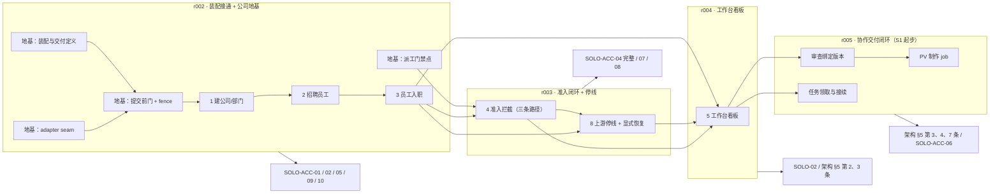

# SoloIPs r002 版本架构：每版功能边界、演示路径与不包含项

| 阅读契约 | 内容 |
| --- | --- |
| 身份 | `SOLO-R002-VERSION-ARCH`；r002 起的**版本划分设计分析**，非需求正文、非实现授权、非发布承诺 |
| 目的 | 让接手者与用户直接判断「这一版能演示什么、下一版加什么、什么明确不做」，避免把不可独立开发的事项（重启读回、独占写）当版本功能 |
| 范围 | r002 / r003 / r004 / r005 四个版本的功能、演示路径、验收 ID、前置依赖与不包含项；以及与 S0/S1 原有划分的关系 |
| 决策状态 | 〔提案〕版本划分为**设计分析**。S0/S1 的既有划分见 `docs/architecture.md` §6，本文件不改变它；版本号 r002 起沿用 `DEVENV` 版本目录约定 |
| 证据范围 | 只读核对（同 `function-architecture.md` §9）；**本次未实现、未装配、未启动服务、未调用模型** |
| 依据 | `docs/architecture.md` §5/§6；`docs/technical-architecture.md` §11（SOLO-ACC 验收合同）；`.artifacts/operations/r002-baseline-20260916/baseline.md` §2/§3；`docs/design/r002/function-architecture.md`（本文件的耦合簇与裁定来源）；`docs/operations/development-iterations.md` DEVENV-01–04 |
| 变更权 | task-9 所有者维护；版本内容变更须回到 `docs/architecture.md` §6 与 SOLO-ACC 合同 |

---

## 0. 阅读须知

1. **版本号从 r002 起**，沿用 `SOLOIPS_DEVS_ROOT/versions/rNNN` 的既有目录约定（`baseline.md:19`：实测 `versions/` 下仅 `r001`）。
2. **每版 2–3 个功能**，按用户视角命名，与 `function-architecture.md` §2 的 8 项裁定对齐。
3. **「重启读回」与「独占写」不出现在任何版本的「功能」列**——它们分别是验收条件与存储层性质（`function-architecture.md` §2.1）。它们出现在**验收 ID** 列。
4. **每版必须有演示路径**：用户实际能做什么、看到什么。写不出演示路径的功能不进本版。
5. **「不包含什么」是硬要求**，不是可选说明。它防止把「已经设计」误读成「本版交付」。
6. **本文件不构成实现授权。** 全部版本工作受 `baseline.md` §6 的 A1–A8 未授权项约束。

---

## 1. 版本总览

| 版本 | 主题 | 功能 | 演示路径一句话 | 前置依赖 |
| --- | --- | --- | --- | --- |
| **r002** | 装配接通 + 公司地基 | 1 建公司/部门、2 招聘员工、3 员工入职 | 用户在隔离实例里建起公司、部门、员工，并看到入职缺项清单 | T00（已并入 main）；无其他 |
| **r003** | 准入闭环 + 停线 | 4 准入拦截、8 上游停线+显式恢复 | 未过入职的员工在三条路径上都被拒并看到具体缺项；上游故障时收到站内通知且不自动重试 | r002 |
| **r004** | 工作台看板 | 5 工作台看板（+ 4/8 的投影补全） | 用户在同一入口看到目标、当前负责人、待回答事项、真实交付版本 | r003 |
| **r005** | 协作交付闭环（S1 起步） | 任务领取与接续、审查绑定版本、PV 制作 job | 用户交一个创作目标，员工领活、产出、审查、用户验收 | r004 + S1 授权 |

**关键路径**：`r002 → r003 → r004 → r005`。其中 **r002 的关键路径上包含 T08（官方 Team 适配）**，理由见 §2.4。

---

## 2. r002 · 装配接通 + 公司地基

### 2.1 本版功能（3 项）

| # | 功能 | 需求 ID | 交付包 / 模块 |
| --- | --- | --- | --- |
| 1 | 建公司/部门 | DEPT-01–04、ORG-01/02 | `soloips-core` 的 `src/company/organization.ts` |
| 2 | 招聘员工 | DEPT-01–04、ORG-02 | 同上 |
| 3 | 员工入职 | ORG-03、AVATAR-64 | `soloips-core` 的 `src/company/onboarding.ts` |

**地基（不作为功能列出，但必须先做）**：`function-architecture.md` §4 的簇 B（提交前门 + 跨进程 fence）、簇 F（装配与交付定义）、簇 G（adapter seam 实现）。

### 2.2 演示路径

> 用户在**独立验证 home** 上启动 r002 实例，从工作入口执行：建立公司 → 建立部门 → 招募一名员工 → 查看该员工的入职缺项清单 → 补齐一项 → 再次查看，缺项减少。

**用户实际能看到什么**：

| 步骤 | 可观察结果 |
| --- | --- |
| 1 | 实例冷启动成功；`dsh --profile soloips --dump-config` 的 L2 生效树含全部 `soloips-*` 行，且 `entry id` 唯一（`SOLO-ACC-01`） |
| 2 | 公司建立后**停止进程 → 冷启动 → 读回**，公司与部门仍在（`SOLO-ACC-05`） |
| 3 | 招募员工后，员工与任职可读回；重复招募**不产生第二条员工身份或第二个 appointment**（`SOLO-ACC-04` failure/recovery） |
| 4 | 入职缺项清单返回**具体缺项**（非泛化失败），且可修正后重试 |
| 5 | 第二个 Host 指向同一规范化根时被拒（`SOLO-ACC-09` 第二 Host 子场景） |

### 2.3 验收 ID

| 验收 | 为何属 r002 |
| --- | --- |
| `SOLO-ACC-01`（部署组合 == 验收组合） | 装配生效是任何功能的前提 |
| `SOLO-ACC-02`（同 facility 重复 open 拒绝） | 唯一 opener 的直接验收 |
| `SOLO-ACC-05`（写入 → 停止 → 冷启动 → 读回） | 公司/部门/员工是本版唯一持久事实 |
| `SOLO-ACC-09`（跨 Host 与数据根） | `ARCH-D07`：**没有通过 ORG-06 则不启用公司写入** |
| `SOLO-ACC-10`（数据根隔离） | 本版开始产生真实业务写入，必须证明写入落在隔离根 |
| `SOLO-REG-01/02`（L1/L2 golden） | 装配门禁 |
| `SOLO-ACC-04`（**部分**） | 见 §2.4：三条路径的**门禁点**属 r002；三条路径的**完整接线**依赖 T08 |

### 2.4 r002 的关键路径必须包含 T08（官方 Team 适配）

**这是本文件对基线的一处修正建议。**

〔需求〕`SOLO-ACC-04` 要求「必须分别触发并拒绝三条路径：(a) 经理显式派单；(b) 员工自领 open-claim 任务；(c) 自动调度器分配」（`technical-architecture.md:1046`）。
〔约束〕`SOLO-TEAM-03`：Team 成员 roster、**原生任务状态与 revision、分配 / 领取 / 依赖、Team 消息**归官方 Agent Team 服务持有（`official-team-and-dsh-fork.md:39`）。
→ 三条路径操作的是**官方 Team 的任务板**。

**基线把 `SOLO-ACC-04` 列为 r002 必达出口**（`baseline.md:40`：「新公司/部门/员工能建立；缺项返回**具体原因**且可修正重试；经理派单 / 员工自领 / 自动调度**三条路径**统一拦截」）。

**因此**：若 T08 推迟到 r004，则 r002 的 ACC-04 只能验到「门禁点存在」，**验不到三条路径统一拦截**——那是合同降级，而 `technical-architecture.md:1114` 明确「首片门槛不得降级」。

**两个可选处置（须 Lead 裁定）**：

| 方案 | 内容 | 代价 |
| --- | --- | --- |
| **A（建议）** | T08 纳入 r002，仅交付「经 adapter 调用官方 Team 任务板的读/派工原语 + 门禁点接线」，**不含**业务审核接续 | r002 变大；需在 r002 内完成官方 Team 的适配核对 |
| **B** | ACC-04 在 r002 只验 (a)(b) 两条路径，(c) 明确标注为未交付并保留在 r003 | 需**显式记录为未交付项**，且不得在 r002 的完成报告中写「ACC-04 通过」 |

**反面声明**：`technical-architecture.md:313` 明确「**刻意不建** `soloips-collaboration`（独立协作内核包）」，§5.3 把 `soloips-scheduler`（第二套调度器）列为不建。因此 (c) 自动调度路径**必须是官方 Team 任务板之上的一层策略**，不能是第二套调度器。官方 Team 是否提供所需原语为〔未验证〕——须在 T08 核对（`SOLO-TEAM-01`：公开能力不足则在 fork 内补齐必要机制并测试）。

### 2.5 明确不包含

| 不包含 | 理由 |
| --- | --- |
| 准入拦截（功能 4） | 属 r003。r002 只交付**门禁点**与入职缺项清单，不交付「三条路径统一拦截」的完整验收 |
| 上游停线（功能 8） | 属 r003 |
| 工作台看板（功能 5） | 属 r004。r002 用 DSH 现有 Web 外壳与命令行读回演示，**不新建业务界面** |
| 真实模型调用 / RLM 实际调用 | 基线 §2 第 7 项：**需单独授权**；未获授权前以确定性 fixture 验证接线 |
| 短信/邮箱通知 | `ORG-A10` 属后续切片；`SOLO-F09` 本轮只预留契约 |
| `soloips-tools-pv` 及任何 PV 制作能力 | `ARCH-D02`：S1 才创建，**不建空包占位** |
| 旧 swarm / company-core 数据迁移 | 基线 §3：须另获授权并制定独立迁移合同（`SOLO-TEAM-09`） |
| 多用户租户隔离 | `architecture.md:172`：单人同信任范围通过不等于多人安全证明 |
| r001 / 55120 的任何改动 | 基线 §5：保持运行、不原地修改 |

---

## 3. r003 · 准入闭环 + 上游停线

### 3.1 本版功能（2 项）

| # | 功能 | 需求 ID | 交付包 / 模块 |
| --- | --- | --- | --- |
| 4 | 准入拦截（三条路径完整接线） | ORG-03、ORG-05、ORG-11 | `soloips-core` 的 `src/dispatch/gate.ts` + `src/company/onboarding.ts` |
| 8 | 上游停线 + 显式恢复 | ORG-13、SOLO-F09 | `soloips-core` 的 `src/lifecycle/**`；`soloips-adapter-dsh` 的错误上报 |

**本版的核心结构判断**（来自 `function-architecture.md` §3）：准入与停线**不是同一个门禁，但必须是同一个门禁点**。r002 已交付该门禁点（簇 C），r003 只是**注册第二个谓词**并交付通知面。这就是为什么门禁点必须在 r002 建好——否则 r003 要改造三条路径的调用点，那是返工。

### 3.2 演示路径

> 场景一（准入）：用户建一名员工但**不补齐入职**。经理尝试派单 → **被拒**；员工尝试自领 → **被拒**；自动调度 → **被拒**。三处都显示**同一具体缺项原因**。补齐后重试 → 通过，且**没有产生第二条员工身份**。

> 场景二（停线）：在隔离根用**受控替身**注入一次 `RATE_LIMIT`。用户看到站内通知（时间、受影响团队/任务、模型路由、去敏错误、实际停止状态、等待用户事项）。依赖该失败请求的后续派工**停止**；**不依赖它的任务继续**（`SOLO-ACC-07` 要求「无关工作未被任意处置」）。用户发出明确恢复指令后，从既有 `operationId` 续接，**无重复提交**。

**用户实际能看到什么**：

| 步骤 | 可观察结果 |
| --- | --- |
| 1 | 三条路径均被拒，返回**具体缺项**（非泛化失败）；任务保持 `pending`/`ready=false`（`SOLO-ACC-04`） |
| 2 | 补齐缺项后重试通过；重试**不重建员工身份**（`SOLO-ACC-04` failure/recovery） |
| 3 | 注入首错后**立即**可见；**无自动重试**（含 `llm-retry` 的隐式重试，见 §3.4） |
| 4 | 通知含全部必需字段；「已请求停止」与「已确认停止」**分别展示**（`SOLO-F09`） |
| 5 | 停线事实**重启后仍在**（进程内撤销不构成停止证据） |
| 6 | 未获用户明确恢复指令前，健康检查成功 / 充值 / 通知送达**均不续跑** |

### 3.3 验收 ID

`SOLO-ACC-04`（**完整**：三条路径）、`SOLO-ACC-07`、`SOLO-ACC-08`（首片占位真实性）、`SOLO-ACC-05`（停线事实的冷启动读回）、`SOLO-ACC-09`（停线后失权旧 handle 仍被拒）。

### 3.4 本版的阻断级前置（来自 task-10 的实测结论）

〔源码事实〕`llm-retry` 在 base bundle 中**默认挂载**（`packages/bundle/base/cordis.patch.yml:84-85`），且 base 的 `llm-deepseek` 行**无 `config`** → 默认策略 `mode: normal`、`maxRetries: 5`、重试 `RATE_LIMIT`/`SERVER`/`TIMEOUT`/`TRANSPORT`/`EMPTY_RESPONSE`（`.artifacts/operations/r002-dev-readiness/official-llm-error-surface.md` §1.5，完整链条四环节）。

→ **默认组合下一次 `RATE_LIMIT` 会被自动重试最多 5 次**，与 `SOLO-F09`「不等耗尽重试次数」「不自动重试」**直接冲突**。本版**必须**处置（关闭该行，或在 T06 listener 中 `prepend` 并短路）。该处置涉及 profile/home 层 patch，**属 A3 未授权项**，须在实现授权内一并处理。

**另一个正确性要点**〔源码事实〕：provider 失败**不只是抛出**，也以「带内 finish chunk」交付（`adapterFailureChunk`，`packages/llm/llm/src/index.ts:1126-1134`）。**唯一同时覆盖两条路径的判据位置是 `agent/request-error` waterfall**（`packages/core/agent-loop/src/agent.ts:442-465`）。只在 `llm/stream` 上包 `try/catch` 会**漏掉绝大多数 provider 失败**。

### 3.5 明确不包含

| 不包含 | 理由 |
| --- | --- |
| 工作台看板（功能 5） | 属 r004。本版的通知经 DSH 现有 Web 外壳呈现，**不新建业务界面** |
| 真实付费上游故障注入 | 基线 §5：一律用受控替身；`SOLO-ACC-07` 明确「不制造真实付费上游故障」 |
| 真实短信/邮箱送达 | `ORG-A10` 属后续切片；本版只做**站内通知**与通道占位（`not_implemented`/`not_configured`） |
| 自动恢复 / 自动续跑 | `ORG-13`：恢复**仅凭用户明确指令** |
| PV 制作能力 | 属 S1/r005 |
| 旧数据迁移 | 基线 §3 |

---

## 4. r004 · 工作台看板

### 4.1 本版功能（1 项主体 + 2 项投影补全）

| # | 功能 | 需求 ID | 交付包 / 模块 |
| --- | --- | --- | --- |
| 5 | 工作台看板 | SOLO-02、`architecture.md` §5 第 2 条 | `soloips-web`（Host 桥 + client 投影） |
| 4' | 准入状态的读投影（补全） | ORG-03 | `soloips-core` 的 `src/collaboration/projection.ts` |
| 8' | 停线通知的读投影（补全） | ORG-13 | 同上 |

### 4.2 演示路径

> 用户从**同一入口**看到：当前目标、当前负责人、**待回答事项**（且**同时可见可回答入口**）、真实交付版本。用户对待回答事项作答 → 员工继续工作。若上游故障停线，用户在同一入口看到停线通知与「等待用户处理事项」。

**用户实际能看到什么**：

| 步骤 | 可观察结果 |
| --- | --- |
| 1 | 目标、负责人、待回答事项、交付版本在**同一入口**可见（`architecture.md:138`） |
| 2 | 「待回答状态」与「可回答入口」**同时可见**——不会出现「等待回答却没有可回答入口」 |
| 3 | 用户作答后，员工的待回答状态更新；**客户端本地副本丢失后能由 Host 投影重建**（`CLIENT-10`） |
| 4 | 停线期间界面显示停线通知；**不显示「已完成」** |
| 5 | 加载 / 空结果 / 失败 / 等待用户回答 / 已提交**五态可区分**（`DEV-10`） |

### 4.3 验收 ID

`SOLO-02`、`architecture.md` §5 第 2、3 条、`CLIENT-04`（组合图无激活期 FAILED）、`CLIENT-F04` 的反例检查（客户端无业务写权威）、`DEV-10` 的五态区分与权限拒绝可见性。

### 4.4 硬约束（本版风险最高处）

〔约束〕`CLIENT-09`/`CLIENT-12`：客户端**零可写业务状态**，不得在 IndexedDB、localStorage、内存 Map 或 reducer 中保留可写权威副本（`technical-architecture.md:802`、`:808`）。
〔源码事实〕候选实现**违反了这一条**：业务草稿落 IndexedDB（`goal-draft-store.ts:37`、`public-draft-store.ts:28`、`work-request-draft-store.ts:14`）、业务态落 sessionStorage（`team-dashboard-plugin.ts:98,103-105`）（`rewrite-seam-client.md:91-92`）。**不得继承。**

〔约束〕`CLIENT-11`：数据面走**官方生成的 Remote**，不自建 HTTP/RPC channel。候选的 `CLIENT-X01` 反例正是自建 RPC channel（`public-rpc-client.ts` + Host 侧 `read-rpc-service.ts:215-239`），后果是「换界面退化为重写传输层」（`technical-architecture.md:866`）。

### 4.5 明确不包含

| 不包含 | 理由 |
| --- | --- |
| 独立 SoloIPs 界面 | `SOLO-02`：首版**复用 DSH Web**，本版是投影层，不是独立产品界面 |
| 占用官方 shell 插槽的长期承诺 | `CLIENT-D02`〔待决〕：conversation 头部动作、右侧栏面板 tab 是否长期占用**责任人：用户/架构负责人** |
| 首版业务视图的载体形态定稿 | `CLIENT-D01`〔待决〕：会话内卡片（`main.conversation` 插槽）还是独立 View target，**责任人：用户** |
| 客户端本地持久化 | `CLIENT-13`：首版建议直接省略 |
| PV 播放 / 素材查看 | 属 S1/r005 |

---

## 5. r005 · 协作交付闭环（S1 起步）

### 5.1 本版功能（3 项）

| # | 功能 | 需求 ID | 交付包 / 模块 |
| --- | --- | --- | --- |
| 9 | 任务领取与接续（含空队列但目标未完成时重新规划） | ORG-09/10、BUG08 | 官方 Team + `soloips-core` 的业务绑定与审核门禁 |
| 10 | 审查绑定准确作品版本（作者不能给自己的产物通过） | `architecture.md` §5 第 3 条、LIB-04/05 | `soloips-core` 的作品版本与审核 receipt |
| 11 | PV 制作 job（提交 / jobId / 查询 / 取回） | ORG-13 的 job 侧、`architecture.md` §5「PV 制作需要补齐的最小业务接口」 | 新建 `soloips-tools-pv` |

### 5.2 演示路径

> 用户交一个创作目标 → 经理建立有依赖和职责的任务 → **已完成入职**的员工领取就绪工作 → 产出 IP 简纲与 PV 分镜 → 非作者审查 → 不通过则带具体意见返工 → 经理汇总 → 用户**接受或退回** → 接续授权范围内的下一项就绪工作。

**用户实际能看到什么**：

| 步骤 | 可观察结果 |
| --- | --- |
| 1 | 任务有依赖与职责；员工只领到**属于职责且依赖满足**的任务 |
| 2 | 审查**绑定具体作品版本**；作者**不能**给自己的产物生成独立通过记录 |
| 3 | 用户退回后有**明确责任人**继续修订 |
| 4 | 队列为空但目标未完成时，经理**能发现缺项**，而不错误宣布完成 |
| 5 | 外部 job 超时且结果未知时，**先查原任务**，不盲目重复生成；素材**真实字节已保存**才报告保存成功 |
| 6 | 用户实际看见并接受一份目标作品 |

### 5.3 验收 ID

`architecture.md` §5「首片必须观察到的结果」第 3、4、7 条；`SOLO-ACC-06`（装配回退与状态恢复，发布切换时）；`DEV-09`（外部制作操作的结果未知与待核对状态）；`SOLO-ACC-CE-G`（跨包半状态反例，保持〔提案〕）。

### 5.4 明确不包含

| 不包含 | 理由 |
| --- | --- |
| 真实视频/图像生成服务选型与采购 | `architecture.md:153`：工具选型先核实用户已有能力；**不因架构建议就购买服务或提交付费生成任务** |
| 试水发布与反馈采集 | 属 S2（`architecture.md:163`） |
| 真实发行渠道接入 | 属 S2 |
| 多部门跨媒体协作、独立/3D 工作台 | `architecture.md:164`：**每项分别给出用户路径与验收，不一次摊开开发** |
| 旧 swarm / company-core 数据迁移 | 基线 §3：须另获授权并制定独立迁移合同（`SOLO-TEAM-09`） |
| 微服务集群 / 第二套调度器 / 向量库 | `architecture.md:172`：**需要它们时应有业务量或功能证据** |

---

## 6. 与 S0/S1 原有划分的关系

**结论：本文件不改变 S0/S1，而是把 S0 拆成 r002–r004 三个可演示的纵向切片，并修正一处关键路径。**

| 原划分 | 内容 | 本文件的版本映射 | 关系 |
| --- | --- | --- | --- |
| **S0** | 「DSH 依赖组合、公司 Host 入口、Session 绑定、持久 schema 与同包恢复」（`architecture.md:161`） | **r002 + r003 + r004** | **拆分**，不改变内容。S0 的出口 `SOLO-ACC-01–05、07、09、10` 分布在三个版本，逐版各自有演示路径 |
| **S1** | 「任务领取、简纲/分镜、制作工具 job、镜头/合成、媒体保存、审查、提问与接续」（`architecture.md:162`） | **r005 起步**（3 项），后续版本继续 | **不改变** |
| **S2** | 「试水发布和反馈进入下一轮判断」（`architecture.md:163`） | r005 之后 | **不改变** |

**为什么把 S0 拆成三版**：`docs/architecture.md` §6 明确「S0/S1 优先处理恢复、准入、API 停线、待回答入口、成果保存及接续这些直接阻塞交付的问题」（`architecture.md:166`）。S0 内部的三组问题**互相有硬依赖**（准入门禁点必须先存在，停线才能挂第二个谓词；投影必须先有事实可读），但它们**各自都有独立的用户可观察结果**。拆成三版使每版都能给出演示路径与独立验收，而不必等 S0 全部完成才第一次演示。

**这一拆分不降级任何门槛**：`technical-architecture.md:1114` 要求「首片门槛不得降级」；本文件的做法是**把门槛分配到版本**，并**显式列出每版不包含什么**（§2.5、§3.5、§4.5、§5.4），而不是把未交付项写成已通过。

---

## 7. 版本依赖图

---

## 8. 版本划分的三条纪律

1. **每版必须有演示路径。** 写不出「用户实际能做什么、看到什么」的项不进本版——它要么是验收条件（如重启读回），要么是存储层性质（如独占写），要么应拆到后续版本。
2. **每版必须列出「不包含什么」。** 设计完成 ≠ 本版交付。`docs/design/r002/` 的全部设计候选都是〔提案〕，不因已入库而成为本版内容。
3. **验收门槛分配到版本，不分配到「以后」。** `technical-architecture.md:1114` 的「首片门槛不得降级」要求每一项都有归属版本与验收 ID；本文件的每版 §「验收 ID」小节即该分配。

---

## 9. 证据边界

**已验证**：本文件的版本划分依据（`baseline.md` §2 的 9 条出口、`architecture.md` §5/§6 的 S0/S1、`technical-architecture.md` §11 的验收合同、`function-architecture.md` 的耦合簇）均来自已读的权威正文；引用位置在 `evidence.md` 逐条给出。

**未验证**：各版的工期、人力与真实返工次数；官方 Team 是否提供 (c) 自动调度路径所需原语（§2.4）；`llm-retry` 在**目标安装**（0.1.6 tgz）上的实际生效情况（§3.4，task-10 自述为〔未验证〕）。

**未执行**：未实现、未装配、未安装、未启动服务、未做故障注入、未调用模型。

**反面声明**：
- 本文件是**版本划分设计**，不是发布计划，也不是实现授权。
- 版本号 r002–r005 是**设计分析中的划分**，不等于已经创建对应版本目录或实例（`baseline.md:19`：实测仅 `r001`）。
- 「本版功能」列出的项**均未实现**。`docs/architecture.md` §6 与 `baseline.md` §2 的出口要求不因本文件而改变。
- 各版的验收 ID 是**待执行的验收**，不是通过记录。
