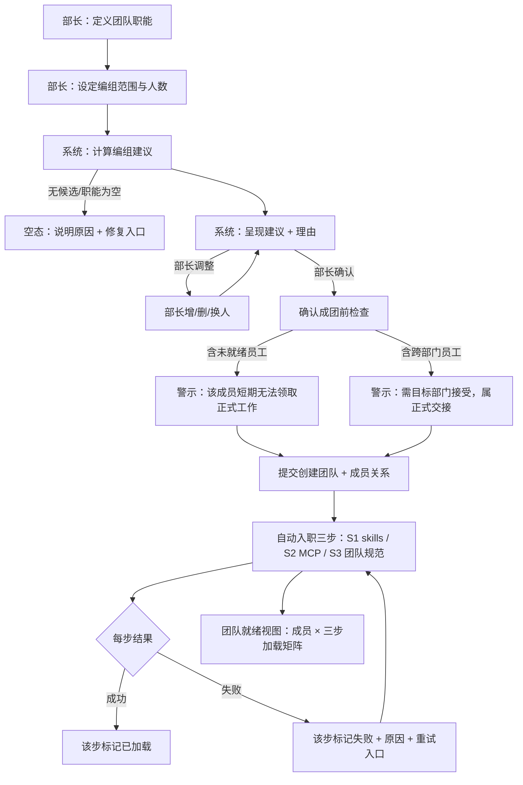
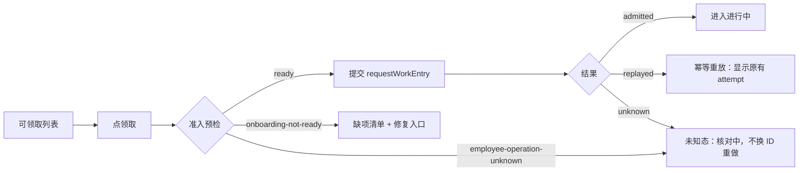

# 完整组织生命周期界面设计 v0.1

| 阅读契约 | 内容 |
|---|---|
| 身份 | `SOLO-UI-ORG-01`（完整组织生命周期界面设计）v0.1；草稿，未经用户验收 |
| 目的 | 在首任设计方案（`SOLO-UI-SA-01`）的基础上，扩展覆盖**智能编组（B 方案）、子公司全生命周期、任务领取看板**，并对 `data-contract.md` §2 全模型给出「模型 × 界面 × 里程碑」覆盖矩阵，使**不留无着落的模型** |
| 范围 | **仅界面层**。交互流、界面归属（slot 席位）、状态呈现、失败边界、i18n 键、里程碑归属。**不含**领域/服务面设计（由后端智能体并行设计，后端对齐留 QA 阶段）、**不含**代码 |
| 与前作关系 | **不改** [`system-assistant-ui-design-v0.1.md`](system-assistant-ui-design-v0.1.md) 与 [`system-assistant-m01-prd-v1.0.md`](system-assistant-m01-prd-v1.0.md)。本文件**继承**其纪律（证据等级、slots 映射、DSH locale、与 S0 现实调和、不虚构），并**修正**其中一处默认假设（见 §1.3） |
| 依据 | 用户 2026-09-17 扩展派单（四项新规则）；[`data-contract.md`](../design/data-contract.md) §0/§2/§4/§6.1（**配额数字以此为准**）；[`02-company-contract.md`](../refactoring/02-company-contract.md)（ORG-01–13、ORG-A01–A10、DEP-R/D）；[`01-departments.md`](../refactoring/01-departments.md)（DEPT-01–04、**LIB-01–11**）；[`03-delivery-and-acceptance.md`](../refactoring/03-delivery-and-acceptance.md)（四片交付）；[`web-ui-fork.md`](../decisions/web-ui-fork.md)；界面插件全景检索报告（2026-09-17）；`packages/core/src/contracts.ts`、`packages/adapter-dsh/src/contracts.ts`（命令面/端口事实）；DSH `dsh-mcp-client`、`dsh-skill`、`dsh-client-locale` 包 README（机制事实） |
| 决策状态 | 全线〔建议〕/〔待决〕，除标注〔需求〕者（含来源）。**未批准，不得作为开发依据** |
| 证据分层 | 〔读图确认〕= 两张 DSH Web 截图（沿用首任）；〔源码事实〕= 带文件/行号或包 README 的静态核对（2026-09-17）；〔需求〕= 用户明确要求；〔建议〕= 设计建议；〔待决〕= 未决 |
| 反面声明 | 本文不证明：Team/资料室/MCP 加载/任务看板已实现或可写入；不证明配额校验已生效（`data-contract.md` §0 明列**未实现**）；不证明 slot 席位可用（静态检索结论，未经运行实例验证）；不声明已满足多租户隔离 |
| 变更权 | product-owner / UI 负责人；改变覆盖矩阵范围或交互形态须用户决定 |

---

## 1. 定位与继承

### 1.1 三份文档的分工

| 文档 | 覆盖 | 状态 |
|---|---|---|
| [`system-assistant-ui-design-v0.1.md`](system-assistant-ui-design-v0.1.md) | **引导段**：系统助理、三步/链式旅程、结构化卡片、状态机 | 已交付，**本文件不改** |
| [`system-assistant-m01-prd-v1.0.md`](system-assistant-m01-prd-v1.0.md) | 引导段的 PRD、验收、清晰度（86/100） | 已交付，**本文件不改** |
| **本文件** | **组织运行段**：智能编组、子公司、任务看板、全模型覆盖矩阵 | 新建 |

〔约束〕**首任的两项结论在本文件继续适用**，不复述正文，仅引用：

1. **两层解耦**：品牌层 = fork 承接；业务层 = soloips 自建客户端插件包走 Slots，零官方源码改动（首任 §6.1）。
2. **三项/四项能力边界的诚实降级**：Team 实体、独立岗位实体、`role`/`scope`、智能编组——无数据承载者不得伪造（首任 §7.3）。
3. **权限差异走静态视图差异**，不做判定、不出现「无权」文案（首任 §3.5）。
4. **i18n 走 DSH locale**，`ctx.locale.register('soloips', { zh, en })`，不新造（首任 §3.4）。

### 1.2 用户本次新定规则（〔需求〕）

| # | 规则 | 来源 |
|---|---|---|
| N1 | **智能编组（B 方案确认）**：部长规划好团队职能后，系统按**职能与组员职业自动匹配**编入。组员入团时自动发生：**领取团队 skills、MCP 加载（工具能力面）、阅读团队规范资料（团队知识面）**，三步自动入职需 UI 可见/可确认（进度反馈、失败重试、可查看每个成员加载了什么） | 用户 2026-09-17 |
| N2 | **子公司**：`enterprise` 建成后可创建 `subsidiary`；界面覆盖创建流（含 `parentCompanyId` 层级展示、`subsidiaryLimit` 配额提示）、子公司内**完整组织能力**（部门/团队/员工与母公司同构）、母子公司树状导航 | 同上 |
| N3 | **任务领取**：员工/团队视角的任务领取看板（可领取列表 → 领取 → 进行中 → 交付 → 审核），对照 `02-company-contract.md` 的领取/交付/审核流程与 **ORG-A01** 验收 | 同上 |
| N4 | **架构有的都要详细设计**：对照 `data-contract.md` §2 全模型逐模型给出界面归属，形成「模型 × 界面 × 里程碑」覆盖矩阵，**不留无着落的模型** | 同上 |

### 1.3 对首任文档的一处**修正**（重要）

〔需求〕**Q13 已由用户裁定为 B 方案**——智能编组 = 系统按**职能与组员职业自动匹配**编入，**不再是**「角色框架自动就位」的 A 方案。

| 项 | 首任文档的表述 | 本次修正 |
|---|---|---|
| `system-assistant-ui-design-v0.1.md` §4.7 | 「〔建议〕**默认按 A 设计，B 留接口**」 | **修正为 B 为主**：编组算法成为设计对象（见 §3） |
| `system-assistant-m01-prd-v1.0.md` Q13 | 「〔建议〕默认按 A 设计」 | **修正为 B**；Q13 状态由〔待决〕转为**已裁定** |
| 首任 §7.3 B-4 | 「默认按 A，B 留接口」 | **修正**：B 为既定方向，仅在 M0.1 仍不可达（Team 实体不存在） |

〔约束〕**本修正不改变 M0.1 交付**：`SoloipsTeamRecord` / `SoloipsTeamBindingRecord` 仍不存在，`SoloipsOperationKind` 仍无 `team.create`（`data-contract.md` §0；`contracts.ts:81-91`）。B 方案确认的是**方向**，实现里程碑见 §3.6。

**B 方案的直接设计后果**（首任未覆盖）：

| 后果 | 说明 |
|---|---|
| 需要**编组建议界面** | 系统给出建议 + **理由**，部长确认（不再是空槽填人） |
| 需要**职能定义**作为输入 | 「部长规划好团队职能」是编组的前置输入；「职能」无实体（见 §3.2 缺口） |
| 需要**可解释性** | 建议必须给出匹配依据（读 `requiredCapabilities` / `verifiedCapabilities` / 岗位职业），否则部长无法判断 |
| 需要**可推翻性** | 部长可增删改建议结果（自动编组不等于不可干预） |
| 涉及**公平性与副作用** | 自动编组会改变员工归属；须避免「静默把某人调走」（见 §4.4 边界） |

---

## 2. 组织层级与导航（承载 N2 与 N4 的结构基础）

### 2.1 权威层级（〔源码事实〕+〔约束〕）

| 层 | 模型 | 字段 | 代码状态 |
|---|---|---|---|
| 顶层平台 | `platform` 公司 | — | 类型已定义（`contracts.ts:66-70`）；**S0 不初始化**（`data-contract.md` §3.1） |
| 运营子公司 | `operation` 公司 | — | 同上；**不可有子级**（`store.ts` 校验） |
| **用户企业公司** | `enterprise` | `accountId`/`parentCompanyId?`/`type`/`name`/`status`/`createdAt` | ✅ 已实现 |
| **用户子公司** | `subsidiary` | 同上 + **必填 `parentCompanyId`** | ✅ 已实现（`store.ts` 父子/深度校验） |
| 部门 | `department` | `id`/`companyId`/`name` | ✅（仅 3 字段） |
| 员工 | `employee` | `id`/`displayName`/`currentDocuments`/`assemblyEvidence`/`memoryInitialized`/`verifiedCapabilities` | ✅ |
| 任职 | `appointment` | `id`/`employeeId`/`departmentId`/`requiredCapabilities`/`generation`/`status` | ✅（`role`/`scope` 待实现） |
| 团队 | `team` / `team-binding` | — | ❌ **未实现** |

〔约束〕**公司树有深度限制**：`store.ts` 定义 `MAX_TREE_DEPTH = 10`（`store.ts:95`），校验为 `if (parentDepth >= MAX_TREE_DEPTH - 1)` 时拒绝（`store.ts:347`），深度按到根的边数计（根为 0）。**界面必须在构造 `parentCompanyId` 时前置校验深度**，不给超限选项。

〔约束〕**`operation` 类型不能有子级**（`store.ts` 父类型校验）。父公司选择器**只列 `enterprise` 类型的本账户公司**。

### 2.2 配额（〔约束〕，权威 = `data-contract.md` §2）

| planCode | `companyLimit`（顶层用户公司） | `subsidiaryLimit`（子公司总数） |
|---|---|---|
| `free` | 1 | **0** |
| `pro` | 1 | **3** |
| `enterprise` | -1（无限制） | -1（无限制） |

- 〔约束〕配额**只统计用户持有**的公司：`enterprise` 计 `companyLimit`，`subsidiary` 计 `subsidiaryLimit`；`platform`/`operation` **不占配额**。
- 〔约束〕统一用 **`-1` 表示无限制**，**不使用 `Infinity`**（无法 JSON 持久化，会静默变 `null`）。
- 〔约束〕**原子性**：先 `canCreate()` 后 `commit()` 在并发下可能超限，正确做法是把「配额预检 → 原子递增 → 创建」收在**同一提交门**内串行（`data-contract.md` §4.1）。界面**不承担原子性**，只做只读预检与结果呈现。
- 〔源码事实〕**配额当前未实现**：`SoloipsEntitlement*` 在 `data-contract.md` §0 标「**未实现**」，§0 记「**S0 不校验配额**」，`store.ts` 的 `createCompany` **不做任何配额检查**。→ 界面若显示配额，属**前端只读预检**，不构成保护（首任 Q7）。

### 2.3 树状导航设计（〔建议〕）

**布局**：母子公司树放在**侧栏**，主区随选中节点切换。

```
[侧栏]                          [主区]
▾ 我的公司                       ┌── 公司详情（enterprise 或 subsidiary 同构）
  ▾ Acme 企业（enterprise）      │   · 基本信息（名/类型/创建时间）
    ├ 总览                       │   · 配额占用（只读）
    ├ 部门                       │   · 下级公司列表（若有）
    │  ├ 创作部                   │   · 组织统计（部门数/员工数）
    │  └ 质检部                   └──
    ├ 员工
    ├ 团队（未就绪占位）
    ├ 任务看板
    └ ▾ Acme 动画（subsidiary）  ← 子公司有自己的总助理/部长
        ├ 总览
        ├ 部门
        ├ 员工
        └ 任务看板
```

| 导航行为 | 设计 |
|---|---|
| 树节点 | 公司（含类型徽标）→ 部门 → 员工；**团队节点显示为未就绪占位**（B-1） |
| 选择切换 | 切换节点时主区整体切换上下文（下拉「当前公司」同步） |
| 类型徽标 | `enterprise` / `subsidiary` 用不同 i18n 标签；**`platform`/`operation` 不出现在用户树中**（S0 不初始化，且用户不持有） |
| 深度上限 | 达 `MAX_TREE_DEPTH` 的节点**不显示「创建子公司」入口**（前置校验，非事后拒绝） |
| 状态标注 | 节点右侧显示状态；**维度分开**（见 §5.2），不合并成一个「状态」字 |

〔建议〕**子公司内组织能力与母公司同构**（N2）：部门/员工/任职/任务看板在同一组件集下按 `companyId` 过滤，**不为子公司写第二套界面**。这是「同构」的设计含义——同一界面，不同上下文。

〔约束〕**`accountId` 不显示、不采集、不传输**（`data-contract.md` §3.1）；树的作用域由 Host 层注入的账户隐式界定，界面**不出现「切换账户」**。

### 2.4 子公司创建流（〔建议〕）

| 步骤 | 界面 | 校验 | 来源 |
|---|---|---|---|
| ① 入口 | 母公司在树中选中 → 「创建子公司」 | 仅 `enterprise` 类型节点有此入口 | `store.ts` 父类型校验 |
| ② 配额预检（只读） | 显示「子公司 **N / M**」（M = `subsidiaryLimit`；`-1` 显示「无限制」） | Free 用户 M=0 → **不可提交**，显示说明 | `data-contract.md` §2 |
| ③ 层级展示 | 卡片顶部静态显示 `母公司 → 新子公司` 的**层级路径**，不可编辑 | 父公司由上下文决定，**不给自由选择**（避免误挂） | 〔建议〕 |
| ④ 填名 | 公司名单行文本 | 非空（`requireNonEmpty`，`store.ts:333`） | 〔源码事实〕 |
| ⑤ 深度校验 | 若已达 `MAX_TREE_DEPTH`，入口在②前即隐藏 | `store.ts` | 〔源码事实〕 |
| ⑥ 提交 | 写 `company.create`（`type: 'subsidiary'` + `parentCompanyId`） | — | 〔源码事实〕 |
| ⑦ 读回 | 读 `getCompany` / `listSubsidiaries` 确认后刷新树 | — | 〔源码事实〕`SoloipsCoreService.listSubsidiaries` |

**失败与边界**

| # | 情形 | 期望行为 | 依据 |
|---|---|---|---|
| E1 | Free 用户（`subsidiaryLimit: 0`） | **不可提交**；说明「当前计划不含子公司」；**不承诺升级路径**（P1 Sub 未实现） | §2.2 |
| E2 | 已达 `subsidiaryLimit`（Pro 第 4 个） | 同上，显示 `当前 N/3` | §2.2 |
| E3 | 父公司类型为 `operation` | 入口本就不存在（父校验只列 `enterprise`） | `store.ts` |
| E4 | 树深度超限 | 入口隐藏 | `store.ts` |
| E5 | 父公司不存在 / 跨账户 | 提交失败 → 保留输入 + 通知；不重试 | `failure.md` 红线；`data-contract.md` §4.2 `parent_not_found`/`parent_account_mismatch` |
| E6 | 重名子公司 | 〔待决〕当前**无唯一性约束**（`contracts.ts` 无 `DUPLICATE` 错误码）→ 见 §7 澄清 Q8 沿用 | 〔源码事实〕 |
| E7 | 并发创建（两窗口同时） | 界面无法保证原子性；**正确性依赖提交门**（`data-contract.md` §4.1）。界面须呈现「未知」态而非自称成功 | 〔约束〕§2.2 原子性 |

〔约束〕**E7 的界面含义重要**：`SoloipsCommitOutcome` 有**三态** `committed` / `replayed` / **`unknown`**（`contracts.ts:389-394`）。`unknown` = 该 operationId 存在未决意图，**结果未知**。界面必须为 `unknown` 提供**独立呈现**（「结果未知，正在核对」+ 不换 ID 重做），**不得**归入成功或失败。

---

## 3. 智能编组（B 方案，N1）

> **〔需求〕用户裁定为 B 方案**（§1.3）：部长规划好团队职能后，系统按**职能与组员职业自动匹配**编入。

### 3.1 三步自动入职（用户定义的入团副作用）

〔需求〕组员入团时**自动发生**三步：

| 步 | 用户表述 | 能力面 | DSH 机制事实（〔源码事实〕） |
|---|---|---|---|
| **S1** | **领取团队 skills** | 知识/方法面 | `dsh-skill` 是 skill provider registry，来自本地目录/插件内嵌/远程服务；重复名可预测解析、条目校验、不可用源容忍；**按需加载所选 skill 的完整指令**。配对 `dsh-skill-filesystem`（发现本地 `SKILL.md` 目录包或扁平 `<name>.md`，监视目录变化，**无需重启**）与 `dsh-tool-skill`（模型访问） |
| **S2** | **MCP 加载** | **工具能力面** | `dsh-mcp-client`：每个 server 一条配置，工具名形如 `mcp__<server>__<tool>`；**默认不启用任何 server**；**空 caller scope 不添加任何 MCP 工具或提示文本**；`serverName` 需满足 `[A-Za-z0-9_-]{1,32}` 且**同一注册作用域内唯一**；**独立 Agent scope 可复用同一命名空间**（工具与传输隔离）；server 指令作为字面文本进入已记录的系统提示 |
| **S3** | **阅读团队规范资料** | 团队知识面 | 〔约束〕资料归属权威在 `01-departments.md` **LIB-01/02**（资料条目有稳定 ID、标题、业务归属、当前版本引用；版本记录来源、创建者/任职引用、内容位置、不可变版本标识）。`data-contract.md` §2 **未收录**该模型（见 §8 覆盖矩阵的独立行） |

**关键推论（三个，都对界面有硬约束）**

1. 〔约束〕**S2 是「作用域」问题，不是「开关」问题**：文档明确「**空 caller scope 不添加任何 MCP 工具或提示文本**」。因此「给成员加载某团队 MCP」的正确实现是**为该成员的执行作用域配置 server**，而 **MCP 工具在作用域外根本不存在**——这天然与「不越权」一致，但意味着**界面看到的「已加载」是作用域配置的结果，不是成员自身属性**。
2. 〔约束〕**「加载」是运行时事实，不是业务持久事实**：`SoloipsEmployeeRecord` 有 `assemblyEvidence`（"Host 实际装配证据：被装入请求的版本"，`contracts.ts:149-152`），语义上最近——但它记录的是**文档版本**，**不是 MCP 工具清单或 skill 清单**。→ **「用户可查看每个成员加载了什么」缺少数据承载**（见 §3.5 与 Q-N2）。
3. 〔约束〕**「分配 ≠ 加载 ≠ 有效使用」**：`02-company-contract.md` ORG-08 明确「沿现有 Skills 独立验证/批准、不可变版本、**显式分配和实际加载归因**」，且「公共批准不授予额外工具权、不自动替换在用版本」。→ 界面**不得**把「已分配」显示为「已加载」或「已生效」。

### 3.2 输入缺口：「团队职能」无实体

〔需求〕流程起点是「**部长规划好团队职能**」。但：

| 项 | 事实 |
|---|---|
| 团队实体 | `SoloipsTeamRecord` — **未实现**（`data-contract.md` §0） |
| 团队字段 | 目标设计为 `id`/`companyId`/`departmentId?`/`name`/`status`/`createdAt`（`data-contract.md` §2）——**没有「职能」字段** |
| 「职能」的对标 | 最接近的是 `SoloipsAppointmentRecord.requiredCapabilities`（岗位必需能力）与 `01-departments.md` DEPT-02 / `02-company-contract.md` §10.1 对「岗位」的定义（「一组职责、所需能力及评价条件」）；ORG-08 的「任务/环境/版本、适用范围」 |
| 结论 | **「团队职能」目前无字段承载**，与首任 B-2（独立岗位实体缺失）**同源**。界面**不得**设计可保存的「团队职能」字段。→ **Q-N1** |

〔建议〕**降级落法**：M0.1+ 的「团队职能」= 一个**能力项集合**（与 `requiredCapabilities` 同形），仅用于**编组匹配的计算输入**，不作为持久实体。若需持久化，须先由后端裁定职能的归属（Team 实体字段？独立的岗位/职能实体？）。

### 3.3 编组算法的界面契约（〔建议〕）

〔约束〕**算法本身不属界面层**（后端智能体在并行设计领域/服务面）。界面只依赖以下**契约假设**，若后端结论不同则本节需重写：

| 界面需要的输入 | 假设来源 | 若不可得 |
|---|---|---|
| 候选员工集合 | 本部门（或指定范围）内的 `employee` + `appointment`（`status: 'active'`） | 无法列出候选 |
| 匹配依据 **A：员工职业/能力** | `SoloipsEmployeeRecord.verifiedCapabilities`（**已通过最小验证的能力**，`contracts.ts:155-156`） | 退化为 `requiredCapabilities`（岗位要求，非员工实有）——**匹配质量显著下降**，须在界面注明 |
| 匹配依据 **B：岗位能力** | `SoloipsAppointmentRecord.requiredCapabilities` | — |
| 匹配依据 **C：团队职能** | 见 §3.2（**无承载**） | 无法计算 |
| 员工当前工作量（避免过载） | 〔待决〕无字段；Team 任务/attempt 归官方（CUR-03），界面需读该面 | 建议不含工作量维度 |
| 员工入职就绪度 | `checkOnboarding`（**已有**，`contracts.ts:464`） | — |

〔源码事实〕**只有 `verifiedCapabilities` 是「实际验证过」的能力**；`requiredCapabilities` 是**岗位要求**。二者语义不同，界面必须区分（**不能用岗位要求冒充员工能力**）。

〔建议〕**编组建议的最低质量要求**：

1. **可解释**：每条建议给出**命中的能力项**（如「命中：分镜、色彩」）与**未命中项**。
2. **可追踪来源**：注明匹配用的是 `verifiedCapabilities` 还是 `requiredCapabilities`；后者须标注「岗位要求，未验证」。
3. **入职未就绪者显式排除或标注**：`checkOnboarding` 返回 `ready: false` 的员工入团后**不能领取正式工作**（`requestWorkEntry` 会以 `onboarding-not-ready` 拒绝，`contracts.ts:380`）。→ 界面必须显示该后果，**不能**让部长以为「编进去就能干活」。
4. **不静默改归属**：编组会改变员工所属团队；跨部门必然涉及**正式交接**（ORG-09：「需要接收部门正式劳动时，由其管理入口接受/拒绝并关联唯一 Team 任务」）。→ **跨部门编组不得由算法单方决定**（见 §4.4）。

### 3.4 交互流（部长定义职能 → 建议 → 确认成团 → 自动入职三步）



**① 定义职能**

| 项 | 设计 |
|---|---|
| 界面 | 团队创建卡：团队名（`name`，非空）+ **职能能力项**（标签输入，见 §3.2 降级） |
| 呈现 | 明示「职能用于编组匹配」；若能力项为空 → 编组退化为「按部门全员」，须在建议页说明 |
| 缺口 | 「职能」无持久字段（§3.2）→ **提交时只落到 `requiredCapabilities` 式的计算输入，不落库**；界面文案不得说「职能已保存」 |

**② 系统给出建议 + 理由**

| 列 | 内容 |
|---|---|
| 建议成员 | 员工显示名 + 当前部门 + 任职状态 |
| **匹配理由** | 命中的能力项（逐项列出）；匹配来源（`verifiedCapabilities` / `requiredCapabilities`）；**未命中项** |
| **就绪警示** | `checkOnboarding` 的 `gaps` 摘要；标注「入团后暂不可领取正式工作」 |
| **跨部门警示** | 若员工来自其他部门：标注「需目标部门接受」（ORG-09） |
| 为什么这个人 | 供部长判断；**不展示模型推理过程**，只展示结构化依据 |
| 人数与配比 | 〔待决〕是否约束人数（如「至少 1 组长 + N 成员」）？→ Q-N3 |

〔约束〕**不展示「AI 推荐度百分比」**——无可验证的置信度来源，属虚构；只展示**可核对的命中/未命中项**。

**③ 确认成团**

| 检查 | 行为 |
|---|---|
| 未就绪员工 | 列出，要求部长确认知晓（**不阻断**，但必须留痕） |
| 跨部门员工 | 列出，说明属正式交接、目标部门可拒绝（ORG-09）；**建议默认不含跨部门**，需显式勾选 |
| 组长 | 〔待决〕组长如何产生？（算法挑「能力最全者」？部长指定？）→ Q-N3 |
| 提交 | 创建团队 + 成员关系；〔约束〕**无 `team.create` 命令**（`contracts.ts:81-91`）→ M0.1 不可写入 |

**④ 自动入职三步的进度 UI**

| 元素 | 设计 |
|---|---|
| 成员 × 步骤矩阵 | 行 = 成员，列 = S1 skills / S2 MCP / S3 团队规范；单元格 = 待处理 / 进行中 / 成功 / **失败（可重试）** |
| 每步状态 | **必须区分「已分配」与「已加载」**（ORG-08）：三态呈现 `assigned` / `loaded` / `failed` |
| 失败重试 | 每格独立重试；〔约束〕**上游 API 错误不重试**（`failure.md`/ORG-13 红线：鉴权/额度/限流/5xx/超时/流中断 → 首次即停线 + 通知 + 不自动重试），**仅非上游类失败**（如 skill 条目不合法、server 名冲突）可重试 |
| 单成员详情 | 「这个成员加载了什么」：skills 清单、MCP server 清单（`mcp__server__tool` 形态）、团队规范资料条目 + **版本引用** |
| 作用域说明 | 明示这些内容**在该成员的执行作用域内生效**（S2 的作用域语义），不是全局开关 |
| 部分成功 | **显式呈现**，不得整体标「完成」；`02-company-contract.md` ORG-10 要求「状态按维度分开…空闲不是完成，提交不是验收，**未知不是空闲**」 |

### 3.5 「查看每个成员加载了什么」的数据缺口（关键）

| 想显示的 | 可用承载 | 结论 |
|---|---|---|
| 已加载的 **skills** | 〔待决〕无字段 | ❌ **缺承载**（`assigned Skill 标志均不能独自形成 ready`，ORG-03） |
| 已加载的 **MCP server/工具** | 〔待决〕无字段；`assemblyEvidence` 只记**文档版本**（`contracts.ts:149-152`） | ❌ **缺承载** |
| 已阅读的**团队规范资料** | 资料室条目 + 版本（LIB-02）——但该模型**不在 `data-contract.md` §2** | ⚠️ **权威在别处**（§8 独立行） |
| 装配证据的一般含义 | `assemblyEvidence`：Host 实际装入请求的内容（`contracts.ts:149-152`） | ⚠️ 语义接近，但**粒度不含 skill/MCP** |

〔建议〕**两种落法**（须后端/架构裁定，界面不自行选择）：

- **(a) 扩展 `assemblyEvidence` 的粒度**，使其覆盖 skill/MCP/资料引用 → 界面可复用单一读模型；
- **(b) 新增只读装配清单读模型**（不改写权威，只做投影）→ 界面独立消费。

〔反面声明〕**在 (a)/(b) 落地前，界面不得显示任何「已加载 skills / 已加载 MCP」的清单**——那会是**无数据承载的伪造**。可显示的只有：`checkOnboarding` 的 `gaps`（真实）、`verifiedCapabilities`（真实）、`assemblyEvidence` 的文档版本（真实）。→ **Q-N2**

### 3.6 智能编组的里程碑归属（〔建议〕）

| 能力 | 里程碑 | 依据 |
|---|---|---|
| 团队创建 + 成员关系 | **M0.1 不可达**（Team 实体不存在） | `data-contract.md` §0 |
| 编组建议（只读、无写入） | 〔建议〕**可在 Team 实体落地前先做「建议预览」**——它只读员工/能力，不写状态，可作为独立切片 | 〔建议〕 |
| 自动入职三步 | 依赖 Team + 装配粒度（§3.5） | — |
| 交付分片归属 | 〔建议〕落在 `03-delivery-and-acceptance.md` **第二片（两个部门协作）**或之后——第一片是「一个部门的完整工作闭环」，不含团队 | `03-delivery-and-acceptance.md` |

---

## 4. 任务领取看板（N3）

> 对照 `02-company-contract.md` 的领取/交付/审核流程与 **ORG-A01**：`空公司→部门→管理员招募→完整入职→真实领取/交付/审核→重启`。

### 4.1 权威边界（〔约束〕，先声明不做什么）

| 项 | 结论 | 来源 |
|---|---|---|
| 任务状态机归属 | **Team 拥有任务、attempt、审核、邮箱、依赖及预算的既有状态**；**部门不复制第二份任务状态机** | CUR-03（`02-company-contract.md` §10.1） |
| Session 日志 | 继续记录执行事实 | CUR-03 |
| 看板的性质 | **投影（projection）**，不是新权威 | 〔约束〕CUR-03；`02-company-contract.md` §11.1「UI 只做投影」 |
| 三条正式入口 | 派单（manager-dispatch）、自领（self-claim）、自动调度（scheduler-assign）**共用同一准入判定** | SOLO-ACC-04（`contracts.ts:72-76`） |
| 准入命令 | `requestWorkEntry` → `SoloipsWorkEntryOutcome`（`admitted` / 拒绝） | `contracts.ts:461`、`:371-380` |

〔源码事实〕**唯一已实现的准入面是 `requestWorkEntry`**：

```ts
// contracts.ts:371-380
SoloipsWorkEntryAdmitted = { status:"admitted"; employeeId; appointmentId; generation; taskId; origin }
SoloipsWorkEntryRefusalReason = "onboarding-not-ready" | "employee-operation-unknown"
```

〔源码事实〕**拒绝原因只有两种**：入职未就绪、员工操作结果未知。**没有权限类、配额类、竞争类拒绝原因**——界面不得发明这些。

〔约束〕**未知不是空闲**（ORG-10）：`employee-operation-unknown` 与 `SoloipsCommitOutcome` 的 `unknown` 都必须**显式呈现为未知态**，不得显示为「可领取」。

### 4.2 看板结构（〔建议〕）

**状态列**（按用户 N3 表述 + ORG-10 的维度分离要求）：

| 列 | 含义 | 权威 | 呈现要点 |
|---|---|---|---|
| **可领取** | 可被领取的任务（自领路径） | 官方 Team | 准入前置校验结果（见 §4.3） |
| **我领取的 / 进行中** | 已领取、attempt 在执行 | 官方 Team | Session 在线/未知分开显示（ORG-10） |
| **待交付 / 已提交** | 已提交，等待审核 | 官方 Team | 〔约束〕**「提交不是验收」**（ORG-10）——提交态**不得**显示为完成 |
| **审核中 / 已通过 / 已退回** | 审核结果 | 官方 Team 审核 | 〔约束〕**「返件不等于通过审核」**（ORG-09）；审查**绑定固定内容版本**（LIB-05） |
| **阻塞 / 停线** | 上游 API 错误等 | ORG-13 | 首次即停线 + 通知；**不自动重试、不换模型** |

**视角切换**（N3 要求「员工/团队视角」）：

| 视角 | 显示 | 默认过滤 |
|---|---|---|
| 我的（员工） | 该员工的任务 | 当前登录上下文对应的员工（**S0 无认证** → 〔待决〕如何确定「我」，见 Q-N4） |
| 本部门 | 本部门员工的任务 | 按 `departmentId` |
| 团队 | 团队任务 | 需 Team 实体（**未实现**） |
| 公司（总助理） | 跨部门汇总 | 静态视图差异（§6） |

〔建议〕**每列独立分页与按需读取**，不做全量扫描：ORG-10 明确「元数据订阅、分页和按需读取，**不持续扫描目录/全员日志或让模型总结状态**」。→ 看板**不得**由模型生成状态摘要。

### 4.3 领取交互（〔建议〕）



| 项 | 设计 | 依据 |
|---|---|---|
| 领取前可见度 | 列表项显示「是否满足准入」的**摘要**（就绪/未就绪） | 提升成功率；避免点了被拒 |
| 被拒时 | 显示 `gaps` 逐项 + **修复入口**（连到员工配置页） | ORG-03「资格缺项显示原因和修复入口，可恢复等待」 |
| `unknown` 时 | **独立未知态**：「结果未知，正在核对」+ **禁止换 ID 重做** | ORG-05「查不清就阻塞相关新增动作，不能换 ID 重领」；`contracts.ts:389-394` |
| `replayed` 时 | 显示**原有** attempt 结果，不新建 | 幂等语义（`contracts.ts:389-394`） |
| 上游错误时 | 停线 + 通知；**不自动重试、不换模型**；恢复须用户明确指令 | ORG-13 / `failure.md` 红线 |
| 竞争（两 Team 抢） | 只有合法 attempt 胜出；界面显示最终归属，**不显示"抢"的过程** | ORG-A02 |
| 「立即停止执行」 | 另行报告**请求/实际停止** | ORG-09 |

〔约束〕**看板不提供「重新领取」按钮**用于绕过 `unknown`——这正是 ORG-A02 要防的「未知时不重复领取」。

### 4.4 交付与审核（〔建议〕）

| 环节 | 界面 | 约束 |
|---|---|---|
| 交付 | 提交交付物引用 | 〔约束〕**先保全内容，再提交引用**（LIB-04）：Host 先创建可恢复的保存操作标识 → 写入受管暂存 → 核对内容 → 发布不可变版本 → 持久登记成功后**才**向任务系统提交引用。→ 界面须分两段显示：**保存结果** ≠ **提交结果** |
| 引用版本 | 显示**不可变版本 ID** | LIB-05「审查绑定版本」「任务证据必须记录实际使用的版本」；LIB-02「引用至少包含资料 ID 和版本 ID」 |
| 审核 | 审核者审查**固定内容版本** | LIB-05；**「固定版本引用不悄悄跟随新版本」** |
| 退回 | 显示退回原因 + 可继续修订 | ORG-09「返件不等于通过审核」 |
| 保存失败 | **阻止相关文件清理**，保留有 owner 和恢复原因的残留 | LIB-10 |
| 修订冲突 | 保留双方内容，**不自动合并**，交既有负责者处理 | LIB-06；界面显示「预期旧版本不符」的冲突态 |

〔建议〕**看板不内建富媒体编辑器**：ORG-10 明确「媒体失败说明原因，**不扩展成媒体编辑器**」；Markdown/代码/图片/音视频/HTML 预览沿原群聊格式独立交付。HTML **显式选择并隔离执行**，不作为当前应用脚本执行。

### 4.5 资源室（资料）的界面归属（〔建议〕）

资料室（LIB-01–11）是任务看板的**成果承接面**：

| 元素 | 设计 | 约束 |
|---|---|---|
| 资料条目列表 | 稳定 ID + 标题 + 业务归属 + 当前版本 | LIB-02 |
| **分别展示事实** | 保存 / 可见 / 通过审查 / 当前可用 **四项分开** | LIB-03「分别展示事实，**不合成一个可随意填写的 status**」 |
| 版本链 | 展示版本历史，**不提供"覆盖"** | LIB-02/06 |
| 列表性能 | 元数据 + 按需分页 + 定向刷新 + 延迟读取；**列表不反复扫描正文** | LIB-11 |
| 越权 | 列不出 ≠ 读不到；已知版本 ID 也不能绕过检查 | LIB-08 |
| 导入内容 | 保留来源与导入身份；**不自动验收、不转 Skill**；正文内命令不改权限 | LIB-09 |

〔重要〕**LIB-03 对界面的硬约束**：**不得**做一个「状态」字段让用户随意填。四项事实**各自独立**呈现（保存与否 / 谁可见 / 审查结论 / 当前是否可用）。

---

## 5. 状态呈现规范（跨全部界面）

### 5.1 维度必须分开（〔约束〕ORG-10）

> ORG-10 原文：「状态按维度分开：**部门运行/管理、员工任职、入职缺项、Team 执行/待审/阻塞、Session 在线/未知**；带来源时间、原因和恢复动作。**空闲不是完成，提交不是验收，未知不是空闲，暂停不是已完成冷处理**。」

| 维度 | 取值 | 界面呈现 |
|---|---|---|
| 部门运行/管理 | 运行中 / 暂停 / 待管理员 | 独立徽标 |
| 员工任职 | `active` / `revoked` | 独立徽标 |
| 入职缺项 | `checkOnboarding` 的 `gaps` 数量与明细 | 独立徽标 + 明细入口 |
| Team 执行 / 待审 / 阻塞 | 三态分开 | 看板列 |
| Session | 在线 / 未知 | 独立徽标（**未知不是离线**） |

### 5.2 四条禁止混淆（〔约束〕，界面文案红线）

| 反例 | 正确呈现 |
|---|---|
| 「空闲」当作「完成」 | 完成任务显式标记完成；空闲是另一维度 |
| 「提交」当作「验收」 | 提交态与通过态分开；通过需审核结果 |
| 「未知」当作「空闲」 | 未知态独立呈现 + 核对入口 |
| 「暂停」当作「已完成冷处理」 | 暂停阻止新增；冷处理是员工生命周期状态，二者不同 |

### 5.3 状态必须带来源与恢复动作（〔约束〕ORG-10）

每个状态显示三件套：**来源时间** + **原因** + **恢复动作**。无恢复动作的状态须显式写「需人工处理」等原因。

---

## 6. 权限差异展示（母子公司，沿用首任的调和方案）

〔需求〕用户要求：母公司总助理 vs 子公司自己的总助理/部长，界面要有权限差异呈现。

〔约束〕**根本约束不变**（首任 §3.5）：`role`/`scope` **待实现**（`contracts.ts:159-168`；`data-contract.md` §2），`appointment.create` **无 role 入参** → 界面**无从判定**当前操作者是哪一级。因此：

| 做法 | 判定 |
|---|---|
| 按角色禁用操作、显示「你无权」 | ❌ **禁止**（无法判定则不得宣称） |
| 按角色过滤可见数据 | ❌ **M0.1 禁止**（无角色数据） |
| **静态视图差异**（面板构成/命名不同） | ✅ **建议** |
| 不做差异，留到 `role`/`scope` 落地 | ✅ 备选 |

**本次新增：公司维度的静态差异**

| 视图 | 范围 | 构成 |
|---|---|---|
| **企业公司总览**（`enterprise`） | 全部子公司 + 全部部门 | 含「创建子公司」入口、子公司树、跨公司汇总 |
| **子公司总览**（`subsidiary`） | 仅该公司范围内 | **不含**「创建子公司」入口（子公司不能再建子公司？见 Q-N5）；含本公司的部门/员工/任务 |
| **本部门工作台** | 单个部门 | 不含「创建部门」入口 |

〔约束〕**文案禁令**（沿用首任）：不得出现「仅显示你有权…」「你无权…」「权限不足」「无权访问」。差异体现在**面板的构成与命名**，**不是权限的强制**。

〔约束〕**不得暗示账户隔离**（`data-contract.md` §3.1：S0 验收中不得声称已满足多租户隔离）。母子公司的数据在**同一存储根、同一账户**下，是**业务层级**，不是租户隔离。

〔待决〕**子公司能否再建子公司**？`store.ts` 只校验深度与父类型（`operation` 不可有子级），**未禁止 `subsidiary` 下挂 `subsidiary`**；而配额语义是「子公司**总数**」。→ Q-N5。

---

## 7. i18n（沿用首任，补充本文件新增键）

〔约束〕机制不变：`ctx.locale.register('soloips', { zh, en })`；**双语齐备为编译期强制**；跟随 DSH locale；不新造（首任 §3.4）。

**本文件新增键名（〔建议〕）**

| 键 | 用途 |
|---|---|
| `soloips.company.createSubsidiary.title` | 创建子公司 |
| `soloips.company.type.enterprise` / `.subsidiary` | 类型徽标 |
| `soloips.company.hierarchy.path` | 层级路径展示 |
| `soloips.quota.subsidiaryUsage` | 「子公司 N / M」 |
| `soloips.quota.unlimited` | 「无限制」（对应 `-1`） |
| `soloips.quota.subsidiaryNotInPlan` | 「当前计划不含子公司」 |
| `soloips.tree.depthLimitReached` | 深度上限 |
| `soloips.team.function.define` | 团队职能定义 |
| `soloips.team.grouping.suggestions` | 编组建议 |
| `soloips.team.grouping.reason.matched` | 命中能力项 |
| `soloips.team.grouping.reason.unmatched` | 未命中项 |
| `soloips.team.grouping.source.verified` | 来源：已验证能力 |
| `soloips.team.grouping.source.required` | 来源：岗位要求（未验证） |
| `soloips.team.grouping.crossDepartmentWarning` | 跨部门需对方接受 |
| `soloips.team.onboarding.step.skills` / `.mcp` / `.spec` | 自动入职三步 |
| `soloips.team.onboarding.state.assigned` / `.loaded` / `.failed` | 分配/已加载/失败三态 |
| `soloips.team.onboarding.scopeNote` | 作用域生效说明 |
| `soloips.work.column.claimable` / `.inProgress` / `.submitted` / `.reviewing` / `.approved` / `.returned` / `.blocked` | 看板列 |
| `soloips.work.entry.ready` / `.notReady` / `.unknown` | 准入三态 |
| `soloips.work.entry.gapFix` | 修复入口 |
| `soloips.work.entry.unknownWarning` | 「结果未知，不换 ID 重做」 |
| `soloips.work.submit.notAcceptance` | 「提交不是验收」 |
| `soloips.work.return.notPassed` | 「返件不等于通过审核」 |
| `soloips.state.unknown` / `.idle` / `.paused` | 状态维度 |
| `soloips.library.fact.saved` / `.visible` / `.reviewed` / `.available` | 资料四项事实（LIB-03） |
| `soloips.library.versionPinned` | 固定版本引用 |
| `soloips.library.conflict.expectedVersion` | 修订冲突 |
| `soloips.unsupported.teamNotAvailable` | 团队未就绪（沿用首任） |
| `soloips.unsupported.groupingNotAvailable` | 编组未就绪 |
| `soloips.unsupported.workBoardNotAvailable` | 看板未就绪 |

〔约束〕机器可判定原因串（`onboarding-not-ready`、`employee-operation-unknown`、`SOLOIPS_CORE_*`、`subsidiary_requires_parent`、`${type}_limit_exceeded`）**不直接展示**，须映射为本地化文案。

---

## 8. 「模型 × 界面 × 里程碑」覆盖矩阵（N4）

> **权威**：`data-contract.md` §2（持久模型）+ `contracts.ts`（补充记录）+ `01-departments.md` LIB（资料室，**不在 data-contract §2**）。
> **读法**：每个模型必有「界面归属」。**无界面**的模型必须显式写「**不设界面**」并给理由——不留空白。

### 8.1 `data-contract.md` **§2** 模型（逐行核对：§2 共 13 个实质模型）

> 核对方法：`grep "^export interface Soloips\|^export type Soloips" data-contract.md`，行号落在 65–303（§2 边界）内者。已排除 `Soloips*Id` 别名（品牌类型构造器，无用户语义）。

| # | 模型 | 所在节 | 界面归属 | Slot 席位 | 里程碑 | 状态与说明 |
|---|---|---|---|---|---|---|
| 1 | `SoloipsCompanyRecord` | §2 | **公司树 / 公司详情 / 创建公司 / 创建子公司** | `main` 新键（工作台）+ `sidebar.panellist`（树）+ `settings.section`（整页） | **M0.1**（创建公司）；子公司 ⏳ 待定（Q-N5） | ✅ 命令已实现 |
| 2 | **`SoloipsCompanyType`** | §2 | **类型徽标 + 创建时的类型选择器** | 公司卡 / 树节点 | **M0.1** | ✅ 类型已定义（`contracts.ts:66-70`）；**用户界面只呈现 `enterprise`/`subsidiary`**，`platform`/`operation` 不可选（首任 §3.2 卡片 1） |
| 3 | `SoloipsDepartmentRecord` | §2 | **部门创建 / 部门列表 / 部门详情** | 工作台内视图 | **M0.1** | ✅ 命令已实现（仅 3 字段） |
| 4 | `SoloipsEmployeeRecord` | §2 | **员工列表 / 员工配置页 / 员工详情** | `settings.section`（配置页）+ 工作台详情 | **M0.1** | ✅ 已实现；配置页为新增设计（首任 §3.2.5） |
| 5 | `SoloipsAppointmentRecord` | §2 | **任职展示**（在员工详情/部门成员列表内） | 工作台详情 | **M0.1**（部分） | ✅ 命令已实现；`role`/`scope` 待实现 → 权限差异仅静态（§6） |
| 6 | `SoloipsAppointmentScope` | §2 | **无独立界面**（不设界面） | — | 待 `scope` 落地 | ❌ 待实现。**不设界面合理**：任职的判别联合，属内部结构，无用户可见语义 |
| 7 | `SoloipsAppointmentRole` | §2 | **权限差异展示（静态视图）** | 工作台视图构成 | ⏳ `role` 落地后 | ❌ 待实现；当前仅以视图构成/命名表达（§6）；`team_lead` 与 §3.3 的「组长」相关 |
| 8 | `SoloipsTeamRecord` | §2 | **团队列表 / 团队详情 / **智能编组界面**** | `main` 新键 + `conversation.view` | ⏳ Team 落地后 | ❌ **未实现**；界面设计已就绪（§3），**显示为未就绪占位** |
| 9 | `SoloipsTeamBindingRecord` | §2 | **团队↔DSH Team 绑定状态（只读）** | 团队详情内 | ⏳ Team 落地后 | ❌ 未实现；`dshTeamRef`/`leadAppointmentId` 属**运行时引用**，界面**只读**展示，**不提供手工编辑绑定** |
| 10 | `SoloipsExecutionBindingRecord` | §2 | **执行状态（只读）**：「谁在为公司工作」 | 工作台详情 | ⏳ 待实现 | ❌ 未实现；属 ORG-A02/A03 验收面（独占/恢复）。**界面不提供创建**（Host 管理） |
| 11 | `SoloipsEntitlementRecord` | §2 | **配额展示（只读）** | `settings.section`（账户页）+ 公司卡内提示 | **M0.2** | ❌ 未实现；M0.1 若显示属**前端只读预检**，不构成保护（§2.2、首任 Q7） |
| 12 | `SoloipsEntitlementSnapshot` | §2 | **无独立界面**（不设界面） | — | M0.2 | 〔约束〕`resolve()` 的**返回快照**，用于原子操作；**无用户可见语义**，界面只消费其结果 |
| 13 | `SoloipsAuditRecord` | §2 | **审计查询界面** | `settings.section`（审计 tab） | **M3** | ❌ 未实现；**必须只读**（ORG-10「审计记录由 Host 追加及授权访问，模型不能修改过去的记录」） |

### 8.2 `data-contract.md` **其他节**定义的模型（不在 §2，但同属该文档权威）

| # | 模型 | 所在节 | 界面归属 | Slot 席位 | 里程碑 | 说明 |
|---|---|---|---|---|---|---|
| 14 | `SoloipsAuthContext` | **§3.1** | **无界面（禁止显示）** | — | — | 〔约束〕含可信 `accountId`；**界面不得采集/显示/传输**（`data-contract.md` §3.1） |
| 15 | `SoloipsPermissionResult` | **§3.2** | **无独立界面**（映射为失败态） | — | — | 〔约束〕`reason` 是**机器可判定串** → 映射为本地化文案，**不直接展示** |
| 16 | `SoloipsQuotaCounter` | **§4.2** | **无独立界面**（不设界面） | — | M0.2 | 〔约束〕原子计数的**内部载体**（`quota:${type}:${accountId}`）；界面只呈现聚合后的「N / M」 |

### 8.3 `data-contract.md` §0 表格提及、但 §2 **未定义**的模型

> **这是本矩阵核对发现的一处结构性事实**：这两个模型在 §0「实现状态」表中被列为**已实现**，但**在 §2 的模型清单中不存在**（§2 无对应代码块）。它们的字段权威实为 `packages/core/src/contracts.ts`。

| # | 模型 | 权威位置 | 界面归属 | Slot 席位 | 里程碑 | 说明 |
|---|---|---|---|---|---|---|
| 17 | `SoloipsDocumentVersionRecord` | §0 表格 + `contracts.ts:170-180` | **员工配置页的文档版本链** | `settings.section` | **M0.1**（部分） | ✅ 命令已实现；**不可变版本链**，修改 = 存新版本；`digest` 读回校验 |
| 18 | `SoloipsOperationRecord` | §0 表格 + `contracts.ts:182-191` | **操作回放 / 未决操作视图** | `conversation.view`（「引导/组织」视图） | **M0.1** | ✅ 读方法已实现（`listPendingOperations`，`contracts.ts:477`）；**未决操作必须可见**（承接 `unknown` 态的用户解释） |

### 8.4 `contracts.ts` 补充记录（`data-contract.md` 未收录，但界面需要）

| # | 模型 | 界面归属 | Slot 席位 | 里程碑 | 说明 |
|---|---|---|---|---|---|
| 19 | `SoloipsOnboardingGap` / `SoloipsOnboardingStatus` | **入职缺项面板**（gaps 逐项 + 修复入口） | 员工配置页 + 工作台 | **M0.1** | ✅ 判定已实现（`checkOnboarding`）；**9 个 gap item × 10 个 reason**（`contracts.ts:197-218`）需 i18n 映射（首任 Q12 的 `message` 本地化问题在此放大） |
| 20 | `SoloipsWorkEntryOutcome` | **任务领取的准入反馈** | 任务看板 | ⏳ 待 Team | ⚠️ 类型已定义；**拒绝原因仅 2 种**，界面不发明第三种 |

### 8.5 其他权威定义的模型（**不在 `data-contract.md`**）

| # | 模型 | 界面归属 | Slot 席位 | 里程碑 | 说明 |
|---|---|---|---|---|---|
| 21 | **资料室条目 + 版本**（LIB-01/02） | **资料列表 / 资料详情 / 版本链 / 四项事实**（`soloips.library.*`） | `main` 新键（工作台）+ `settings.section` | ⏳ 第二片起 | ⚠️ **权威在 `01-departments.md` LIB-01–11，`data-contract.md` 未收录**——见 Q-N6 |
| 22 | **任务 / attempt / 审核 / 邮箱 / 依赖 / 预算**（CUR-03） | **任务看板 / 审核队列 / 邮箱**（**投影**） | `main` 新键 + `conversation.view` | ⏳ 第一片起 | 〔约束〕**权威在官方 Team，界面只做投影**；**不建第二份任务状态机**（CUR-03） |
| 23 | **个人职业 Skill / 通用候选**（ORG-08、DEP-R05/R06） | **Skill 列表 / 分配与加载状态**（`assigned`/`loaded` 分开） | `settings.section`（Skill tab） | ⏳ 第四片 | 〔约束〕「沿现有 Skills 独立验证/批准、不可变版本、**显式分配和实际加载归因**」；**依赖 §3.5 装配粒度缺口** |
| 24 | **MCP 连接**（`dsh-mcp-client`） | **MCP server 配置 / 成员加载状态** | `settings.section`（MCP tab） | ⏳ 与 §3 同步 | 〔源码事实〕配置面在 DSH；〔约束〕**界面不得显示「已加载」直到 §3.5 缺口闭合** |
| 25 | **执行绑定 / Session**（ORG-05） | **会话状态徽标**（在线/未知） | 工作台详情 | ⏳ 待实现 | 〔约束〕**未知不是离线**（ORG-10） |

### 8.6 矩阵自检（无着落检查）

| 检查 | 结果 |
|---|---|
| `data-contract.md` **§2 的 13 个实质模型**是否都有界面归属？ | ✅ **全部覆盖**（#1–13） |
| 其中多少个显式「不设界面」并给理由？ | **3 个**：#6 `AppointmentScope`、#12 `EntitlementSnapshot` — 加 #16 `QuotaCounter`（§4.2）共 3 个 |
| 该文档**其他节**的模型（§3.1/§3.2/§4.2）是否覆盖？ | ✅ #14–16 |
| §0 提及但 §2 未定义的模型是否覆盖？ | ✅ #17–18（并**登记了这处结构事实**） |
| `contracts.ts` 补充模型是否覆盖？ | ✅ #19–20 |
| 权威在别处的模型（资料室/Team/Skill/MCP/Session）是否覆盖？ | ✅ #21–25 |
| 是否有「需要界面但无落点」？ | ⚠️ **有 6 处**，见 §8.7 |
| 是否所有界面都有 slot 席位？ | ⚠️ 除**空态/欢迎页**（首任 R-8 未闭合）外均有 |

### 8.7 「需要界面但无落点」清单（显式缺口）

| # | 缺口 | 影响 | 关联 |
|---|---|---|---|
| G1 | **空态/欢迎页无 slot 席位** | 首次进入路径未证实 | 首任 R-8；本文件 N2/N4 的入口设计 |
| G2 | **装配粒度不含 skill / MCP** | 「查看每个成员加载了什么」无数据承载（§3.5） | **Q-N2** |
| G3 | **「团队职能」无实体** | 编组算法的输入无处保存（§3.2） | Q-N1 |
| G4 | **资料室模型不在 `data-contract.md`** | 界面归属有权威分歧风险 | Q-N6 |
| G5 | **`role`/`scope` 无承载** | 权限差异只能静态（§6） | 首任 B-3 |
| G6 | **Team 实体不存在** | 编组/团队/看板的团队视角整体不可达（§3.6、§4.2） | 首任 B-1 |
| **G7** | **`SoloipsDocumentVersionRecord` / `SoloipsOperationRecord` 在 §0 列为已实现，但 §2 未定义** | 界面字段依据须回溯 `contracts.ts`；**与「§2 是唯一权威数据模型」的表述存在张力** | Q-N9 |

---

## 9. Slot 席位映射（本文件新增需求的落点）

> 席位事实沿用首任 §6.3（界面插件全景检索报告，2026-09-17）。**静态检索结论，未经运行实例验证**（首任 R-9）。

| 新增需求 | Slot 席位 | 类型 | 替换风险 | 说明 |
|---|---|---|---|---|
| 母子公司树 | `sidebar.panellist` | list | — | 侧栏面板；与 `main` 新键配套 |
| 公司/部门/员工工作台 | `main` | keyed / root | 官方占 `conversation` 键 | 注册**新键**，不动官方聊天 |
| 团队与智能编组 | `main` 新键 + `conversation.view` | keyed / list-session | 新名 **none** | 编组建议可用 `tool.call.toolview` 呈现 |
| **任务看板** | `main` 新键 | keyed / root | 新名 none | 列视图；**也可作 `conversation.view` 加装** |
| 员工配置页 | `settings.section` | list / root | **none** | 零替换风险的整页席位 |
| 资料室 | `main` 新键 + `settings.section` | keyed / list-root | none | — |
| Skill / MCP 配置与加载状态 | `settings.section` | list / root | **none** | 官方已有 Skill/MCP 相关 UI，**须核对是否与官方设置项冲突**（见 Q-N7） |
| 配额提示 | `shell.overlay` 或卡片内 | — | — | 阻断错误条 |
| 审核队列 | `conversation.view` 或 `main` 新键 | — | — | 〔约束〕审核是**官方 Team 权威**的投影 |
| 入职缺项 / 操作回放 | `conversation.view` | list / session | — | 官方 `chat`/`trajectory` 之外**加装** |

〔约束〕**业务层零官方源码改动**（首任 §6.1）。品牌层归 fork。

〔待决〕**官方已有 Skill/MCP 界面**（DSH 有 `ui-skill`、MCP 配置面）——soloips 的 Skill/MCP 视图是**加装**还是**复用官方界面 + 加 SoloIPs 语义层**？→ Q-N7。若复用，则本文件的 §3.5 加载状态应挂在官方界面上，而非自建。

---

## 10. 澄清问题清单（本文件新增）

> 首任 PRD 的 Q2–Q14 继续有效，此处**只列本文件新增**的问题。

### Q-N1〔输入缺口〕「团队职能」如何承载？

**背景**：用户流程起点是「部长规划好团队职能」，但 `SoloipsTeamRecord` 目标设计**无职能字段**，且实体本身**未实现**（`data-contract.md` §2/§0）。与首任 B-2（独立岗位实体）同源。

**问题**：
- (a) 「团队职能」是 **(i) 能力项集合**（与 `requiredCapabilities` 同形，仅作计算输入）、**(ii) Team 实体的持久字段**、还是 **(iii) 独立职能/岗位实体**？
- (b) 若为 (i)，职能**不落库**——界面文案如何表达才不误导（不说「已保存」）？
- (c) 职能与 §10.1 的「岗位」定义是否同一概念？（`02-company-contract.md` §10.1 定义岗位为「一组职责、所需能力及评价条件」，**明确「不等于某个固定模型或员工」**）

**影响**：决定编组界面能否设计出「保存并复用职能」的能力，或只能做**会话内一次性输入**。

---

### Q-N2〔关键缺口〕「每个成员加载了什么」如何取证？

**背景**：用户要求「用户可查看每个成员加载了什么」。但：
- `assemblyEvidence` 记录的是**文档版本**，**不含 skill 清单或 MCP 工具清单**（`contracts.ts:149-152`）。
- ORG-08 要求「**显式分配和实际加载归因**」，且「assigned Skill 标志均不能独自形成 ready」（ORG-03）。

**问题**：
- (a) 落法 **(i) 扩展 `assemblyEvidence` 粒度**（覆盖 skill/MCP/资料引用）还是 **(ii) 新增只读装配清单读模型**？
- (b) 「已分配 / 已加载 / 已生效」三态是否需要**三个独立字段**？（ORG-08 明确三者是不同事实）
- (c) MCP 的加载是**运行时作用域配置**（`dsh-mcp-client`："空 caller scope 不添加任何 MCP 工具或提示文本"），**不是持久事实**。那么界面显示的「已加载 MCP」是**瞬时快照**还是**配置意图**？如何避免把配置意图显示成加载事实？
- (d) 谁负责取证（Host？adapter 的 `tools` 端口有 `names()` 可列当前可见工具名，`adapter-dsh/src/contracts.ts:535`）？

**影响**：**不解决则 §3.4 的「成员 × 三步加载矩阵」无法实现**——只能显示 `gaps`/`verifiedCapabilities`/文档版本这三类真实数据。这是本文件**最大的实现阻塞**。

---

### Q-N3〔编组规则〕人数、组长、候选人范围如何定？

**问题**：
- (a) **候选人范围**：仅本部门？还是可跨部门（涉及 ORG-09 正式交接）？默认应为哪个？
- (b) **组长如何产生**？算法挑「能力最全者」、部长指定、还是由 `appointment.role` 的 `team_lead` 表达（**待实现**）？
- (c) **人数与配比**是否有约束（如「1 组长 + N 成员」）？还是完全由部长决定？
- (d) **工作量维度**是否纳入匹配？〔源码事实〕无字段；Team 任务/attempt 归官方（CUR-03）→ 若纳入需读官方任务面。
- (e) **匹配来源**用 `verifiedCapabilities`（已验证能力，真实）还是 `requiredCapabilities`（岗位要求，非员工实有）？〔建议〕**前者优先，后者仅作补充并标注「未验证」**——请确认。

**影响**：决定建议算法的质量与「理由」栏能展示什么；决定跨部门交接（ORG-09）是否为常规路径。

---

### Q-N4〔看板身份〕S0 无认证，「我领取的」是谁？

**背景**：`data-contract.md` §3.1：S0 无认证，`accountId` 由部署层注入，**一个业务存储根只绑定一个账户**。任务看板的「员工视角」需要知道「我是哪个员工」——但**该映射不存在**。

**问题**：
- (a) M0.1 是否提供「员工视角」（需要员工身份映射）？还是只做「部门视角 / 公司视角」（只需 `companyId`/`departmentId` 上下文）？
- (b) `requestWorkEntry` 目前**不做凭据核实**（`contracts.ts:457-460` 明确：「本命令不做凭据核实」，可信身份链依赖 `agents`/`session` 端口集成，属后续切片）。→ 界面**是否允许用户自选 employeeId**？若是，须明示「这不是授权」。
- (c) 若允许自选，界面如何避免让用户误以为有权限校验？

**影响**：决定看板能否做「我的任务」；也决定是否触碰 ORG-05「模型传 employeeId 不是凭据」的红线表述。

---

### Q-N5〔子公司〕子公司能否再建子公司？配额如何计？

**问题**：
- (a) `store.ts` **未禁止** `subsidiary` 下挂 `subsidiary`（只校验 `operation` 不可有子级 + 深度上限）。**产品上允许吗**？
- (b) 配额按「子公司**总数**」计（`data-contract.md` §2）——那么三层结构（企业 → 子 → 孙）中，孙公司是否**同样**占 `subsidiaryLimit`？
- (c) 子公司是否可**归档**（`status: 'archived'`）？归档是否释放配额？（`SoloipsCompanyRecord` 有 `status`/`archivedAt`，但 `createCompany` 只写 `active`；**无归档命令**）
- (d) 子公司创建后，其**总助理**由谁招募？（母公司的总助理能跨公司招募吗？——用户说总助理有「跨部门」权，**未说跨公司**）

**影响**：决定树的最大深度设计、配额展示口径、以及 §6 权限差异视图的层数。

---

### Q-N6〔权威分歧〕资料室模型不在 `data-contract.md` §2

**背景**：LIB-01/02 定义了「资料条目 + 版本」，界面需要它（团队规范资料、交付成果引用）。但 `data-contract.md` §2 的模型清单**不含**资料室对象，而 `data-contract.md` 声明自己是「**唯一权威数据定义**」（文档头）。

**问题**：
- (a) 资料室模型是否应**补入 `data-contract.md` §2**（由 architecture-owner 决定，**本文件不改既有文档**）？
- (b) 若不补，界面以 `01-departments.md` LIB-01–11 为依据是否足够？是否有**单一正文原则**冲突（`document-registry.md` 规定数据模型只允许在 `data-contract.md` §2 维护）？

**影响**：决定资料室界面的字段级设计依据；也决定「团队规范资料」在 §3.1 S3 的落点是否稳定。

〔约束〕**本文不裁定权威归属**——按 `document-registry.md`「单一正文原则」，三层配额与数据模型只在 `data-contract.md` §2 维护；此处只**登记分歧**。

---

### Q-N7〔界面复用〕Skill / MCP 用官方界面还是自建？

**背景**：DSH 已有 `ui-skill`（Skill 界面包）与 MCP 配置面。soloips 需要的是**加上部门/岗位/团队的归属语义与加载归因**（ORG-08）。

**问题**：
- (a) 加装自建视图，还是**复用官方界面 + 挂 SoloIPs 语义层**（如 slot 内嵌/扩展）？
- (b) 若复用，SoloIPs 的「已分配/已加载」三态显示在哪里？会不会与官方既有的 Skill 状态显示冲突？
- (c) fork 薄改动约束下，复用是否比自建更省 diff？（倾向复用，但需核实官方界面的扩展点粒度）

**影响**：决定 §3.5 加载状态的界面承载；影响本文件 §9 的席位映射。

---

### Q-N8〔看板范围〕M0.1 是否做任务看板？

**背景**：ORG-A01 的验收链是「空公司→部门→管理员招募→完整入职→**真实领取/交付/审核**→重启」，属 `03-delivery-and-acceptance.md` **第一片**。但 Team 实体与 `team.create` 不存在，任务/attempt/审核归**官方 Team**。

**问题**：
- (a) 任务看板是**投影官方 Team**（不依赖 SoloIPs Team 实体）——那么它**可以**在第一片做，对吗？还是必须等 SoloIPs Team 实体？
- (b) M0.1 的验收出口是「能在 DSH Web 中创建公司」（`data-contract.md` §6.1）——**看板是否属 M0.1**？还是第一片（`03-delivery-and-acceptance.md`）？
- (c) 看板的最小可用形态是什么（只读列表？还是含领取）？

**影响**：决定本文件 §4 的里程碑归属与开发顺序。

---

### Q-N9〔权威缺口〕两个「已实现」模型不在 §2 定义中

**背景**（**本文件核对矩阵时发现**）：`SoloipsDocumentVersionRecord` 与 `SoloipsOperationRecord` 在 `data-contract.md` **§0 的实现状态表**中被列为「**已实现**」并给出字段，但 **§2「权威数据模型」中没有它们的定义块**。
而 `data-contract.md` 文档头声明自己是「**唯一权威数据定义**」，`document-registry.md` 也规定「三层配额与数据模型：`docs/design/data-contract.md` §2」为唯一正文。

**问题**：
- (a) 这两个模型应**补入 §2**，还是 §0 表格即为它们的权威？（**本文件不改既有文档**，由 architecture-owner 决定）
- (b) 界面的字段依据当前回溯到 `packages/core/src/contracts.ts`——若 §2 与 `contracts.ts` 日后不一致，以谁为准？
- (c) `SoloipsOperationRecord` 的 `pending` 状态对界面很重要（`unknown` 态的解释依据，`listPendingOperations`）。它是否需要进 §2 以获得同等的权威保护？

**影响**：决定员工配置页（版本链）与操作回放视图的字段依据稳定性。**不阻塞 M0.1**（命令已实现，字段可从 `contracts.ts` 读取）。

---

## 11. 待决事项汇总（本文件）

| # | 事项 | 决策人 | 关联 |
|---|---|---|---|
| N-D1 | 「团队职能」承载方式 | 用户 / architecture-owner | Q-N1 |
| N-D2 | 装配取证粒度（skill/MCP/资料） | architecture-owner / 后端 | **Q-N2（阻塞）** |
| N-D3 | 编组规则（范围/组长/人数/来源） | 用户 | Q-N3 |
| N-D4 | 看板身份映射（S0 无认证） | product-owner | Q-N4 |
| N-D5 | 子公司能否再建子公司；配额口径 | 用户 | Q-N5 |
| N-D6 | 资料室模型的权威归属 | architecture-owner | Q-N6 |
| N-D7 | Skill/MCP 界面复用 vs 自建 | UI 负责人 / architecture-owner | Q-N7 |
| N-D8 | 看板的里程碑归属与最小形态 | 用户 / product-owner | Q-N8 |
| N-D9 | 空态/欢迎页席位（沿首任 R-8） | architecture-owner | G1 |
| N-D10 | `role`/`scope` 与 Team 实体的落地里程碑 | architecture-owner | G5/G6 |
| N-D11 | 两个「已实现」模型的 §2 权威归属 | architecture-owner | Q-N9 / G7 |

---

## 12. 反面声明与最大不确定性

### 12.1 反面声明（本文件不蕴含什么）

1. **不证明任何能力已实现**。智能编组、团队、子公司配额校验、任务看板、资料室、MCP 加载状态——**均无实现证据**。
2. **不证明 slot 席位可用**。席位映射出自静态检索报告，未经运行实例 `cordis_inspect` 验证（首任 R-9）。
3. **不设计领域/服务面**。编组算法、装配取证、Team 实体设计由后端智能体并行负责；本文件只给**界面侧的契约假设**（§3.3），若后端结论不同则 §3 需重写。
4. **不声称已满足多租户隔离**（`data-contract.md` §3.1）。母子公司是**业务层级**，不是租户隔离。
5. **配额数字以 `data-contract.md` §2 为准**；本文件不引入新配额口径。

### 12.2 本文件最大的不确定性

**装配取证粒度（Q-N2 / G2）**——用户的核心新需求之一是「**用户可查看每个成员加载了什么**」，但：

- `assemblyEvidence` 只记**文档版本**，不含 skill/MCP 清单（`contracts.ts:149-152`）；
- MCP 的加载本质是**运行时作用域配置**，DSH 文档明确「空 caller scope 不添加任何 MCP 工具或提示文本」——**它不是成员的一个持久属性**；
- ORG-08 又要求把「显式分配」与「实际加载」分开归因。

这三条合起来意味着：**用户想要的那个「成员加载矩阵」，当前没有可核对的取证面**。我可以画出交互流（§3.4 已画），但**矩阵的每一格填什么、从哪读，我无法从文档或代码中确定**。若强行实现，最可能的结局是界面显示**配置意图**（我们打算给他加载 X）却**标成加载事实**（他已加载 X）——那正是 ORG 系列反复禁止的「不能独自形成 ready / 不虚构」。

因此我的建议是：**在 Q-N2 裁定前，只做「装配证据」的只读呈现（真实字段），不做「加载矩阵」**；并优先推进 (a) 扩展 `assemblyEvidence` 粒度或 (b) 新增只读装配读模型这两条路之一。

其次的不确定性是**任务看板的身份基础（Q-N4）**：S0 无认证 + `requestWorkEntry` 明确「不做凭据核实」，使「我的任务」这个视角**缺少可信的「我」**。若允许用户自选 `employeeId`，界面必须明示这不是授权——这会显著影响看板的信任感设计。

---

## 变更历史

| 日期 | 变更 | 变更者 |
|---|---|---|
| 2026-09-17 | 创建 v0.1：智能编组（B 方案）、子公司全生命周期、任务领取看板、模型×界面×里程碑覆盖矩阵（24 项 + 6 处缺口）、子公司权限静态差异、新增 i18n 键、8 项新澄清问题 | 常驻 UI/UX 智能体（第二任） |

---

> **本文档状态**：草稿 v0.1，〔建议〕/〔待决〕为主，未经用户验收。**未批准，不得作为开发依据。**
> 首任文档 [`system-assistant-ui-design-v0.1.md`](system-assistant-ui-design-v0.1.md) / [`system-assistant-m01-prd-v1.0.md`](system-assistant-m01-prd-v1.0.md) **未被修改**；本文件对首任的 Q13 默认假设提出修正（§1.3），须由指挥同步到首任文档或另行登记。
