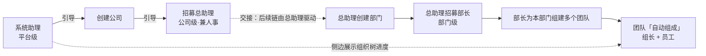

# 系统助理（M0.1 交互载体）- 产品需求文档（PRD）

| 阅读契约 | 内容 |
|---|---|
| 身份 | `SOLO-PRD-SA-01`；系统助理 M0.1 PRD **草稿** v1.0 |
| 目的 | 把已定的产品方向（系统助理 = M0.1 交互载体，链式引导旅程，对话式优先）整理为可澄清、可验收、可分期的需求文档，并**显式暴露当前的信息缺口** |
| 范围 | 系统助理的产品需求、设计决策、验收标准、执行阶段。**不含**代码 |
| 依据 | 产品经理已定方向（2026-09-17 本会话派单）；**用户三项澄清答复（2026-09-17，经指挥传达）**；[`data-contract.md`](../design/data-contract.md) §0/§2/§3/§4/§6.1；[`web-ui-fork.md`](../decisions/web-ui-fork.md) SOLO-UI-FORK-01；[`docs/refactoring/02-company-contract.md`](../refactoring/02-company-contract.md)（招募流程权威，DEP-R01–R04 / ORG-01–04）；[`architecture-summary.md`](../architecture-summary.md) 里程碑表；[`docs/technical/acceptance.md`](../technical/acceptance.md)；[`docs/technical/failure.md`](../technical/failure.md)；`packages/core/src/contracts.ts`（命令面事实）；界面插件全景检索报告（2026-09-17）；DSH `@deepseek-ai/dsh-client-locale`（i18n 机制）；配套设计稿 [`system-assistant-ui-design-v0.1.md`](system-assistant-ui-design-v0.1.md) |
| 决策状态 | **草稿，未批准**。清晰度 **86/100 < 90**（Q1/Q2/Q6 答复后自 71 上调，评分见 §6），按 `requirements-clarity` 要求本 PRD **仍不得进入实现**，须先完成 §5 剩余澄清 |
| 反面声明 | 本文不证明：系统助理已实现、配额校验已生效、Team 能力可用、i18n 已接入、M0.1 已验收。`data-contract.md` §0 明列配额/权限/Team/执行绑定/审计**均未实现** |
| 变更权 | product-owner；澄清问题回答后由 product-owner 收敛，收敛前不得作为开发依据 |

---

## 1. Requirements Description

### 1.1 Background

**Business Problem**

M0.1 里程碑的目标是「Web 版基础：公司/部门/团队 CRUD」，验收出口是「能在 DSH Web 中创建公司」（`data-contract.md` §6.1）。

问题是：**交付 CRUD 界面 ≠ 让用户建成一家可运转的公司**。SoloIPs 的组织模型有若干对新手不直观的约束：

1. **两个助理，层级不同**：**系统助理是系统级/平台级**（面向所有用户、平台提供、不在任何公司内）；**总助理是公司级的，公司建好后像员工一样走招募流程产生**（〔需求〕用户 2026-09-17 Q1 答复）。用户容易混淆二者。
2. 公司分四类，但**用户只能创建其中两类**（`enterprise` / `subsidiary`），另两类（`platform` / `operation`）属 SoloIPS 官方（`data-contract.md` §2）。
3. 有**配额**（Free = 1 公司 + 0 子公司），但配额实现属 M0.2，M0.1 阶段界面与实现状态**不同步**。
4. 员工与任职**是两个对象**：「员工身份独立于任职，任职才是权限来源」（`data-contract.md` §2）。建了员工不等于员工可工作。
5. **招募是一条四阶段流程**（〔需求〕用户 Q2 答复 + `02-company-contract.md`）：**先定义职业（岗位）→ 招募 → 员工（AI）自主生成资料 → 用户在员工配置页修改**；且**招募操作员是总助理（公司级，兼人事）或部门管理员（部门级，限本部门）**（ORG-02）。
6. **入职是准入门槛**：`checkOnboarding` 要求四类文档（`profile`/`avatar`/`soul`/`operating`）+ 记忆初始化 + 能力验证 + 装配证据齐备才算就绪（`contracts.ts:197-244`）。
7. 组织结构不是扁平列表，而是**公司与子公司构成的树**（`parentCompanyId`，有 `MAX_TREE_DEPTH` 限制）。
8. **三项能力无数据承载**：「组队/指定组长」（无 `team.create`、`Team` 实体未实现）、「独立岗位实体」（`appointment` 只有 `requiredCapabilities`，无岗位名）、「两层招募权限」（`role`/`scope` 待实现）。

一个裸 CRUD 界面会把这些约束甩给用户。**系统助理的价值主张是：把「理解 SoloIPs 组织模型」的成本从用户转移到对话**——用对话解释每一步为什么、用结构化卡片收口必填字段、用失败边界守住数据契约。

**Target Users**

| 用户 | 描述 | 证据状态 |
|---|---|---|
| **主用户：SoloIPs 部署账户持有者** | 通过 DSH Web 进入 SoloIPs profile 的人；M0.1 阶段既是运营者也是公司所有者 | 〔建议〕 |
| S0 阶段的特殊性 | 〔约束〕无认证（`data-contract.md` §3.1）：`accountId` 由部署层注入，「一个业务存储根只绑定一个账户」。**S0 不存在多用户**，因此「目标用户」在 M0.1 实际是**单账户单操作者** | 〔约束〕有来源 |
| 招募流程中的角色 | 〔需求〕**总助理（公司级，兼人事角色）**与**部门管理员（部门级，限本部门）**都是招募操作员（ORG-02）。M0.1 界面**无法以数据区分**这两层（`role`/`scope` 待实现） | 〔需求〕+〔源码事实〕 |
| 界面语言用户 | 〔需求〕文案随 DSH locale 切换（en/zh），面向中英双语用户 | 〔需求〕Q6 |
| 未来用户 | 拥有多个公司的 Pro/Enterprise 用户；子公司管理者 | 〔待决〕P1 Auth 之后 |

〔待决〕「目标用户是谁」在 M0.1 阶段是否需要在 PRD 中区分「平台运营者」与「终端用户」？见 Q10。

**Value Proposition**

- 对用户：**不用读文档就能建成第一家公司并招到第一批人**。流程内联解释约束，避免「填了表单但被拒绝」的挫败。
- 对项目：**在 M0.1 验收出口上直接交付**（「能在 DSH Web 中创建公司」），同时为 M2 总助理预置对话式交互骨架与组织状态视图。
- 对工程：引导流程天然是**数据契约的守门人**——它把 `data-contract.md` §0 的「未实现」边界**显式化给用户**（如组队不可用、无独立岗位实体），而不是靠文档纪律。

### 1.2 Feature Overview

**Core Features**（对应设计稿 [`system-assistant-ui-design-v0.1.md`](system-assistant-ui-design-v0.1.md) §4）

| # | 功能 | 命令落点 | 代码可用性（〔源码事实〕） | 界面落点（〔源码事实〕，见 §2.1.1） |
|---|---|---|---|---|
| F1 | 创建公司（公司名 + 类型 + 父公司） | `company.create` | ✅ 命令存在 | `settings.section` 整页 / `main` 新键 / `toolview` 卡片 |
| F2 | 创建部门（部门名 + 所属公司） | `department.create` | ✅ 命令存在 | 同上 |
| F3 | **定义岗位**（岗位能力项 `requiredCapabilities`） | —（随 `appointment.create` 写入） | ⚠️ **无独立岗位实体**（B-2） | 同 F1 |
| F4 | 招募员工（显示名 + 目标部门） | `employee.create` + `appointment.create` | ✅ 命令存在 | 同上 |
| F5 | **员工配置页**（四类文档读改、记忆/能力状态、入职进度） | `document.save` / `initializeEmployeeMemory` / `verifyEmployeeCapability` | ✅ 命令存在 | `settings.section` / `main` 新键详情视图 |
| F6 | 组织结构概览（公司/部门/员工/任职） | 只读查询（`getCompanyTree` / `listDepartments` 等） | ✅ 读方法存在 | `main` 新键「公司工作台」/ `settings.section` |
| F7 | 入职就绪状态展示 | `checkOnboarding` | ✅ 只读判定存在 | 同 F6 |
| F8 | **国际化**（中英随 DSH 切换） | DSH `@deepseek-ai/dsh-client-locale`：`ctx.locale.register('soloips', {zh, en})` | ✅ 机制存在（未接入） | 全部界面文案 |
| F9 | 失败与边界呈现（配额/重名/半成功/跨账户） | — | ⚠️ 见设计稿 §7；配额未实现、重名无约束 | `shell.overlay` / 卡片内错误态 |
| X1 | **组队 / 指定组长** | — | ❌ **无命令、无实体**（B-1） | — |
| X2 | **独立岗位实体** | — | ❌ **无实体、无字段**（B-2） | — |
| X3 | **两层招募权限的数据表达** | — | ❌ **`role`/`scope` 待实现**（B-3） | 仅文案表达 |
| X4 | 撤职 | `appointment.revoke` | ⚠️ 命令存在，**验收未覆盖（Q5d）** | — |

**Feature Boundaries**

| 包含 | 不包含 |
|---|---|
| **系统助理**（系统级/平台级）的引导旅程：建公司 → 建部门 → **定义岗位 → 招募 → 员工配置** | **总助理**（公司级）的日常运营职责（目标分解、跨部门协调、进度汇总、待决事项提交，见 `architecture-complete.md` §3.3）；总助理本身**由招募流程产生**（本 PRD 只管「引导用户去招募」，不管总助理的工作） |
| 对话式引导 + 结构化卡片收口 | 自由形式的 AI 任务派发 |
| **员工配置页**（四类文档读改、记忆/能力状态、入职进度） | 员工资料的**自主生成过程**（属员工侧/core 能力，界面只显示进行态与结果） |
| 组织结构的只读概览 | 3D 可视化（M0.3，随自研路线推迟） |
| **继承 DSH 国际化**（中英随 DSH 切换，不新造 i18n） | 独立语言切换器、第三方 i18n 库、新增语言包（除非走 `addLanguage` 通道） |
| 与上游 DSH Web 视觉语言一致的界面 | 品牌化视觉改造（品牌层归 fork） |
| 失败与边界的显式呈现 | 配额**实现**（M0.2）、审计落库（M3） |
| **三项能力边界的诚实降级**（组队 / 独立岗位实体 / 两层权限数据表达） | 为三项边界新建实体或契约扩展（属 M0.1 范围外，见 Q5） |

**User Scenarios**

| 场景 | 起点 | 期望结果 |
|---|---|---|
| S-1 首次进入 | 全新账户，无任何公司 | 被引导完成系统助理引导段（建公司 → 招募总助理），结束时看到组织结构与交接说明 |
| S-2 已有公司再来 | 已有 1 家 `enterprise` | 直接进入概览，可继续建部门/招人 |
| S-3 用户中途离开 | 建完公司后关闭页面 | 重新进入能读到已建公司，从第②步（招募总助理）继续（不重头开始） |
| S-4 配额拦住 | Free 账户已有 1 家公司，要求再建 | 明确拒绝并解释，不静默失败 |
| S-5 用户要求组队 | 招募完成后要求「组个团队」 | 诚实说明能力未开放，不伪造成功 |
| S-5b 用户要求「定义岗位」 | 用户在招募前想先立岗位 | 引导填**岗位能力项**（`requiredCapabilities`）；**不出现「岗位名称」字段**（无实体承载） |
| S-5c 用户问「谁来招人」 | 用户询问招募权限 | 以文案说明总助理（公司级、兼人事）与部门管理员（部门级、限本部门）；**不出现「权限不足」提示**（无权限数据） |
| S-6 员工任职绑定失败 | `employee.create` 成功、`appointment.create` 失败 | 显式呈现「已建档、待任职」半成功态并支持补建 |
| S-7 员工入职进行中 | 招募成功，员工正在自主生成资料 | 界面显示入职进行态与 `gaps` 逐项消解；用户可在**员工配置页**查看/修改；**不谎称员工已可工作** |
| S-8 员工就绪 | 四类文档 + 记忆 + 能力 + 装配证据齐备 | `checkOnboarding` 返回 `ready: true`，界面转为已就绪 |
| S-9 双语用户 | 用户在 DSH 设置切到英文 | 全部系统助理文案（含引导话术、卡片、错误）随 DSH 即时切换，无硬编码中文残留 |
| S-10 引导终点 | 招募总助理完成 | 进入**交接态**，明确告知后续由总助理驱动；系统助理转只读展示 |
| S-11 三级链推进 | 总助理在公司内创建部门、招募部长 | 系统助理工作台**只读**同步组织树进度（不逐步引导） |
| S-12 用户问「怎么组团队」 | 用户要求创建团队 / 指定组长 | 诚实说明能力未开放，不伪造（B-1）；团队节点显示未就绪占位 |
| S-13 用户看层级差异 | 用户切换「公司总览」与「本部门工作台」 | 两个视图**构成与命名不同**（静态差异），但**不出现**任何权限判定提示（§3.5） |

### 1.3 Detailed Requirements

**Input/Output**

*(命令入参字段逐项引自 `packages/core/src/contracts.ts`，〔源码事实〕2026-09-17)*

| 步骤 | 命令 | 入参 | 输出/落库 |
|---|---|---|---|
| ① | `createCompany` | `operationId`、`name`（非空）、`type?`（默认 `enterprise`）、`parentCompanyId?` | `companyId`；落库 `SoloipsCompanyRecord`：`id`/`accountId`/`parentCompanyId?`/`type`/`name`/`status='active'`/`createdAt` |
| ② | `createEmployee` | `operationId`、`displayName` | `employeeId`；落库 `SoloipsEmployeeRecord`：`id`/`displayName`/`currentDocuments`(空)/`assemblyEvidence`(空)/`memoryInitialized=false`/`verifiedCapabilities`(空) |
| ② | `createAppointment` | `operationId`、`employeeId`、`departmentId`、`requiredCapabilities?` | `appointmentId`；落库 `SoloipsAppointmentRecord`：`id`/`employeeId`/`departmentId`/`requiredCapabilities`/`generation`/`status='active'`<br>〔约束〕**总助理的「公司级」角色无字段承载**——`appointment.create` 无 `role`/`scope`（B-3）。且 ② 阶段**尚无部门**，`departmentId` 从何而来是**未解问题**（见 Q5g(c)） |
| ④ | 同上（招募部长） | 同上 | 同上；`departmentId` = 目标部门。**角色同样无承载** |
| ③ | `createDepartment` | `operationId`、`companyId`、`name`（非空） | `departmentId`；落库 `SoloipsDepartmentRecord`（**实际仅 3 字段**：`id`/`companyId`/`name`） |
| ⑤⑥ | — | — | ❌ **无落点**：Team 实体与 `team.create` 不存在（B-1） |
| 配置（员工/总助理） | `saveEmployeeDocument`（`kind: "document.save"`） | `operationId`、`ownerId`(员工)、`documentType`(∈ `profile`/`avatar`/`soul`/`operating`/`work`)、`content`、`appointmentId?` | 落库 `SoloipsDocumentVersionRecord`：`versionId`/`ownerId`/`documentType`/`content`/`digest`/`previousVersionId?`/`appointmentId?`<br>〔约束〕**不可变版本链**：修改 = 存新版本，不覆盖 |
| 配置 | `initializeEmployeeMemory` | `operationId`、`employeeId` | 置 `memoryInitialized` |
| 配置 | `verifyEmployeeCapability` | `operationId`、`employeeId`、`capability` | 追加 `verifiedCapabilities` |

〔需求〕**员工（含总助理）的自主资料生成阶段不占用用户操作**，界面只显示进行态（用户 Q2 答复）。**用户可介入的界面是员工配置页**。

〔**重要未解**〕**② 阶段招募总助理时，`appointment.create` 需要一个 `departmentId`，但此时按权威顺序（DEP-R01「先成立部门，再任命管理员」）部门尚未创建**。这是链式旅程带来的**新矛盾**：用户表述的顺序是「公司 → 招募总助理 → 总助理创建部门」，而 `createAppointment` 强制要求部门。→ **PRD Q5g(c)**，必须在开发前解决。

**User Interaction**

*(详图见设计稿 §4 链式旅程与 §5 状态机)*

**引导全程（链式）**

| 段 | 步骤 | 驱动者 | 系统助理角色 |
|---|---|---|---|
| **系统助理引导段** | ① 创建公司 | 系统助理 | 逐步引导 |
| | ② **招募总助理** | 系统助理 | **逐步引导（终点）** |
| **总助理驱动段** | ③ 创建部门 | 总助理 | 只读展示 |
| | ④ 招募部长 | 总助理 | 只读展示 |
| | ⑤ 部长为本部门组建多个团队 | 部长 | 只读展示 |
| | ⑥ 团队「自动组成」（组长 + 员工） | 部长 / 系统（**Q13 待澄清**） | 只读展示 |

每步形态：助理话术（消息流）→ 结构化卡片（落点见 §2.1.1：`toolview` / `settings.section` / `main` 新键）→ 提交 → **读回确认** → 推进或失败。

〔建议〕**推进条件必须是「读回确认存在」，而非「命令返回成功」**——与 `docs/technical/acceptance.md`「验收分层：安装 → 装配 → 调用 → 验收，层层验证」一致。

〔约束〕**引导边界**：系统助理逐步引导**止于 ②**；③–⑥ 由总助理在公司内驱动，系统助理只**只读**展示（prd AC-41）。

**Data Requirements**

*(权威来源：`data-contract.md` §2；与本 PRD 的字段级对齐已逐条核对)*

| 校验 | 规则 | 代码现状〔源码事实〕 |
|---|---|---|
| 公司名非空 | `requireNonEmpty(input.name, "公司名")` | ✅ 已实现（`store.ts:333`） |
| 部门名非空 | `requireNonEmpty(input.name, "部门名")` | ✅ 已实现（`store.ts:393`） |
| 员工显示名非空 | `SoloipsCreateEmployeeInput.displayName` | ✅ 必填字段 |
| 文档类型合法 | ∈ `profile`/`avatar`/`soul`/`operating`（必需）+ `work` | ✅ 枚举已定义（`contracts.ts:60-63`） |
| 文档 digest 一致 | 重载须读回同一版本/摘要 | ✅ 由 `SoloipsDocumentVersionRecord.digest` 承载 |
| **岗位名** | 〔需求〕用户要求「先定义职业（岗位）」 | ❌ **无字段**——`appointment` 只有 `requiredCapabilities`（B-2） |
| **角色/权限范围** | 〔需求〕总助理（公司级）vs 部门管理员（部门级） | ❌ **`role`/`scope` 待实现**（B-3） |
| 公司类型合法 | ∈ `platform`/`operation`/`enterprise`/`subsidiary` | ⚠️ 类型已定义（`contracts.ts:66-70`），**默认 `enterprise`**；`platform`/`operation` 用户不可创建 |
| 子公司必须有父公司 | `subsidiary_requires_parent` / `parent_not_found` / `parent_account_mismatch` | ⚠️ 属 `data-contract.md` §4.2 目标设计；`store.ts` 已有「父公司存在 + 类型 + 深度」校验，**未见同账户校验** |
| `operation` 不能有子级 | 父公司选择器只列 `enterprise` | ✅ 已实现（`store.ts` 父类型校验） |
| 公司树深度 | `MAX_TREE_DEPTH`，超限拒绝 | ✅ 已实现 |
| **重名唯一性** | 〔待决〕见澄清 Q8 | ❌ **无约束、无错误码** |
| **配额** | Free = 1 公司 + 0 子公司 | ❌ **未实现**（`data-contract.md` §0 明列；§0 记「S0 不校验配额」） |
| 员工入职就绪 | 四类文档 + 记忆 + 能力 + 装配证据 | ✅ 判定已实现（`evaluateOnboarding`、`checkOnboarding`）；新员工必然 `ready: false` |

**Edge Cases**

| # | 边界 | 期望行为 | 代码支撑 |
|---|---|---|---|
| E1 | 配额超限 | 明确阻断 + 解释；不自动重试 | ❌ 需 M0.2 或 UI 侧预检 |
| E2 | 重名 | 〔待决〕 | ❌ 无约束 |
| E3 | 员工已建、任职未建 | **显式半成功态** + 支持补建 | ✅ 数据模型允许（员工独立于任职） |
| E4 | **用户要求组队 / 指定组长** | 诚实降级 + 未就绪占位；**不生成可点击的创建按钮** | ❌ 无命令、无实体（B-1） |
| E4b | **用户要求「定义岗位」** | 引导填**岗位能力项**；**不出现「岗位名称」字段** | ❌ 无独立岗位实体（B-2） |
| E4c | **用户询问招募权限** | 文案说明两层（总助理公司级 / 部门管理员部门级）；**不出现「权限不足」** | ❌ `role`/`scope` 待实现（B-3） |
| E5 | 新员工入职未就绪 | 展示 `gaps`，措辞为「已建档，入职进行中」；**不谎称可工作** | ✅ `checkOnboarding` 返回 `gaps` |
| E5b | 员工正在自主生成资料 | 显示进行态；用户可在员工配置页查看/修改 | ⚠️ `document.save` 等命令存在，**自主生成的编排属员工侧/core** |
| E5c | 用户试图编辑 `assemblyEvidence` | 该字段**只读**（Host 装配证据，非用户内容） | ✅ 字段语义（`contracts.ts:149-152`） |
| E5d | 用户修改既有文档 | **保存新版本**（不可变版本链），不覆盖原文 | ✅ `previousVersionId`/`digest` |
| E6 | 跨账户 | 界面不采集/不显示/不传输 `accountId`；存储根绑定失败时阻断启动 | 〔约束〕`data-contract.md` §3.1 |
| E7 | 写权失守 | 提交失败 + 保留输入 + 通知；不重试 | ✅ 错误码存在 |
| E8 | 模型不可用（上游 API） | 引导流整体不可用（**不降级为纯表单**） | 〔约束〕`failure.md` 红线 |
| E9 | 中途离开再进入 | 读回已建状态，续接而非重头 | ⚠️ 依赖 Host 注入 `accountId` 已接线（未见证据） |
| E10 | `subsidiary` 但账户无 `enterprise` 公司 | 父公司选择器为空 → 引导先建 `enterprise` | ✅ 逻辑可推 |
| E11 | **DSH locale 切换** | 全部系统助理文案即时切换；无硬编码中文/英文残留 | ✅ locale 机制支持热更新（无需 reload） |
| E12 | **i18n 键缺失** | 机制会显示 key 本身；**不得**以显示 key 交付 | ✅ 机制行为（查找到 `common` 后回退显示 key） |
| E13 | 错误原因串展示 | `subsidiary_requires_parent`、`SOLOIPS_CORE_*` 等**不直接展示**，须映射为本地化文案 | 〔建议〕 |
| E14 | `checkOnboarding` 的 `gaps[].message` | 〔待决〕该 `message` 是否已本地化未知；若未，界面按 `item`+`reason` 自行映射 | PRD Q12 |

---

## 2. Design Decisions

### 2.1 Technical Approach

> **证据来源**：界面插件全景检索报告（2026-09-17，已职能级核实）。为**静态检索结论**，不证明插件已创建、装配已通过、界面已验收。详细展开见设计稿 [`system-assistant-ui-design-v0.1.md`](system-assistant-ui-design-v0.1.md) §6。

**Architecture Choice**

| 决策 | 内容 | 状态 |
|---|---|---|
| D-1 两层解耦（**核心技术结论**） | **品牌层** = fork 承接 `@deepseek-ai/dsh-web-app` 代表的浏览器界面面（web patch + glue，须整体承接）；**业务层** = **soloips 自建客户端插件包走 Slots 注入，不动官方源码**。**系统助理全部属业务层** | 〔需求〕`SOLO-UI-FORK-01` + 〔源码事实〕检索报告 |
| D-2 业务层插件形态 | 包内含 Host 半边 + `src/client` 浏览器半边；Host 经 `@Remote` 暴露公司/部门/员工 CRUD；浏览器半边 `ctx.slots.inject(...)`。约束：`dsh.client.platform='web'`、`exports` 含 `"./client"`、**不能值导入其他 feature 包（只能 `import type`）** | 〔约束〕检索报告 |
| D-3 呈现形态 | **对话式优先 + 结构化卡片**。`conversation` 是 DSH 界面**第一公民**，架构天然对齐。落点：`conversation.view`（加装视图）+ `tool.call.toolview`（卡片，按工具名分派，新名 `replaceRisk: none`）+ `main` 新键 + `sidebar.panellist` + `settings.section` | 〔需求〕方向已定；**组合待决（Q3）** |
| D-4 改动做薄 | 优先 `replaceRisk: none` 的席位；业务层**零官方源码改动**；fork 改动面收敛到品牌层 | 〔约束〕`web-ui-fork.md` §2.2 |
| D-5 视觉语言 | 沿用上游灰阶 + 弱描边 + 大圆角；**不引入** `architecture-complete.md` §5.3 的「青色发光」方案（该节属已推迟的自研路线） | 〔建议〕(Q3b) |
| D-6 数据写入 | 只经 Host 半边 `@Remote` 暴露的既有命令；浏览器半边是**纯消费方**；界面不新增写入路径、不直写 storage | 〔约束〕`data-contract.md` §5.1 + 检索报告 |
| D-7 推进条件 | 每步以**读回确认**为推进条件 | 〔约束〕`acceptance.md` 验收分层 |
| D-8 未实现能力 | 显式呈现为「未就绪」，不静默缺失、不伪造 | 〔建议〕(Q5) |
| D-9 状态承载 | 消息流步骤条（`toolview` / `conversation.view`）+ 持久组织概览（`main` 新键「公司工作台」或 `settings.section` 整页） | 〔建议〕 |
| **D-10 助理层级**〔Q1 已澄清〕 | **系统助理 = 系统级/平台级**（面向所有用户、平台提供、**不产生公司任职**）；**总助理 = 公司级，由招募流程产生**、兼人事角色。两步不混同 | 〔需求〕用户 2026-09-17 Q1 |
| **D-11 招募流程**〔Q2 已澄清〕 | **沿用既有流程**（`02-company-contract.md`，core 已有 `onboarding` 实现）：**定义岗位 → 招募 → 员工自主生成资料 → 用户在员工配置页修改**；招募操作员 = **总助理（公司级、兼人事）** 或 **部门管理员（部门级、限本部门）**（ORG-02） | 〔需求〕用户 2026-09-17 Q2 |
| **D-12 国际化**〔Q6 已澄清〕 | **继承 DSH 既有 locale 机制**（`@deepseek-ai/dsh-client-locale`）：`ctx.locale.register('soloips', { zh, en })`，中英随 DSH 切换，**不单独造 i18n** | 〔需求〕用户 2026-09-17 Q6 |
| **D-13 收尾建议**〔建议〕 | 旅程完成后**建议**用户招募总助理（因总助理兼人事，是后续招募的操作者）；**不自动创建**。待指挥确认 | 〔建议〕据 Q1/Q2 推论 |
| **D-14 三级权限链**〔用户补充〕 | **总助理**（公司级，**最大权限**：创建部门、招募部长、**跨部门管理与招募**）→ **部长**（部门级，**为本部门组建多个团队**）→ **团队**（多个并存，**「自动组成」**：组长 + 员工）。系统助理引导**到「招募总助理」为止**，后续链由总助理在公司内驱动 | 〔需求〕用户 2026-09-17 补充 |

**§2.1.2 三级权限链与权威文档对照**〔需求〕

> 用户 2026-09-17 补充的三级链路，与既有权威文档的对应关系如下。**该链路回答了 DEP-O01 长期悬置的问题。**

| 用户表述 | 权威文档对应 | 实现状态 |
|---|---|---|
| **总助理**（公司级，招募产生，最大权限） | `data-contract.md` §1.1「总助理复用任职机制」= **公司级任职** `general_assistant`（M2 设计）；`architecture-complete.md` §3.3 职责 | ⚠️ `role`/`scope` **待实现** |
| **「总助理招募部长」** | **回答了 `02-company-contract.md` DEP-O01「尚无管理员时由谁任命」**（原为〔待决〕，由产品负责人确认） | 〔需求〕本次确认 |
| **部长**（部门级，组团队） | `02-company-contract.md` DEP-R01 的**部门管理员**；招募权**仅限本部门范围**（ORG-02） | ⚠️ 角色无数据承载 |
| **团队**（多个并存，组长 + 员工） | `data-contract.md` §2 的独立 **`SoloipsTeamRecord`** + **`SoloipsTeamBindingRecord`**；「组长 + 员工」对应 Team 成员角色 | ❌ **两个实体均未实现**；`SoloipsOperationKind` 无 `team.create` |

**链路时序（〔需求〕）**



〔约束〕**系统助理的引导边界**：覆盖到 **C（招募总助理）**；D–G **不再由系统助理逐步引导**，而是由总助理在公司内驱动。系统助理在**侧边/工作台保留组织树进度展示**（只读）。

〔待决〕**链路在 M0.1 的可达终点**：总助理（C）以「员工 + 任职」形式**可写入**；但**部长（E）与团队（F/G）无角色数据、无 Team 实体**。M0.1 是否只到 C，还是把 E 也做成「员工 + 任职」（无角色区分）？→ Q5g。

〔约束〕**「自动组成」不改变 M0.1**：无论 Q13 答案，`Team` 实体与 `team.create` 在 M0.1 均不存在，故该问题只决定 M0.2+ 方向。

**§2.1.1 Slot 席位映射**（替换原 R1–R8〔待检索〕清单）

〔源码事实〕slot 目录共 **63 个 key**，可**运行时查询**（`cordis_inspect`）。与本 PRD 相关的席位：

| 需求 | Slot 席位 | 类型 | 替换风险 | 用途 |
|---|---|---|---|---|
| 组织管理整页 | `settings.section` | list / root | **none** | 「公司管理」新 tab 页——**零替换风险的整页席位** |
| 公司工作台主面板 | `main` | keyed / root | 官方占 `conversation` 键 | 注册**新键**加装自研面板，**不动官方聊天** |
| 侧栏入口 | `sidebar.panellist` | list | — | 侧栏图标 + 与 `main` 新键配套 |
| 会话内视图 | `conversation.view` | list / session | — | 在 `chat`/`trajectory` 之外加装「引导/组织」视图 |
| 会话头部动作 | `conversation.session.header.actions` | — | — | 顶栏按钮 |
| 全局浮层 | `shell.overlay` | — | — | 配额/阻断错误条 |
| 结构化卡片 | `tool.call.toolview` | 按**名称分派** | 新名 **none** | 卡片渲染；或自研组件 |
| 空态/欢迎页 | **未见席位** | — | — | ⚠️ **唯一未获落点的需求**，见 §2.3 R-8 |

**Key Components**

| 组件 | 职责 | 落点 |
|---|---|---|
| soloips 客户端插件包（Host 半边） | 经 `@Remote` 暴露公司/部门/员工/任职 CRUD 与只读查询 | 新建包 |
| 浏览器半边 | `ctx.slots.inject(...)` 注册各席位组件 | 新建包 `src/client` |
| 引导状态机 | 状态与跳转（设计稿 §5） | 浏览器半边 |
| 结构化卡片 | 字段 + 校验 + 提交 + 结果摘要态 | `tool.call.toolview` 或自研组件 |
| 公司工作台 | 组织结构树 + 入职进行中清单 | `main` 新键 / `settings.section` |
| **员工配置页**〔F5〕 | 四类文档读改、记忆/能力状态、入职进度；`assemblyEvidence` 只读 | `settings.section` / `main` 新键详情视图 |
| **i18n 字典**〔F8〕 | `soloips` 命名空间的 zh/en 双字典 | `ctx.locale.register('soloips', { zh, en })` |

**Data Storage**

不新增存储。全部写入走既有 6 张领域表（`company`/`department`/`employee`/`appointment`/`document_version`/`operation`，`domain.ts:221-238`）。引导进度**不落库**——由只读查询实时推导（避免第二份状态源）。

〔约束〕浏览器半边**不能值导入** feature 包，故界面**不得**直接依赖 `soloips-core` 运行时值；数据一律经 Host 半边 `@Remote` 契约。

〔约束〕**i18n 字典是新增的代码资产，但不是新增存储**：字典随插件包发布，不落业务库。

### 2.2 Constraints

| 约束 | 内容 | 来源 |
|---|---|---|
| C-1 上游 API 失败停线 | 鉴权/额度/QPS/连接/流中断首次出现 → 立即停线 + 通知用户；**不自动重试、不换路由** | `failure.md` 红线 |
| C-2 S0 无认证 | `accountId` 由部署层注入；一个存储根只绑定一个账户；UI 不得逐次传入或覆盖 | `data-contract.md` §3.1 |
| C-3 不得声称多租户隔离 | S0 验收中且界面设计均不得暗示存在账户隔离 | `data-contract.md` §3.1 |
| C-4 业务层走 Slots、零官方源码改动 | 业务界面经 soloips 自建客户端插件包注入；品牌层归 fork。改动需登记 | `web-ui-fork.md` §2.2 + 检索报告 |
| C-5 不虚构未实现能力 | 配额/Team/审计/执行绑定在 §0 明标未实现；UI 不得承诺 | `data-contract.md` §0 |
| C-6 证据分层 | 安装 ≠ 调用、构建 ≠ 验收、源码 ≠ 运行版本 | `acceptance.md` |
| C-7 代码规范 | TypeScript + ESM、`strict`、禁 `any`/`@ts-ignore`、两空格缩进 | `AGENTS.md` |
| C-8 插件包形态 | 双半边（Host + `src/client`）；`dsh.client.platform='web'`；`exports` 含 `"./client"` | 〔约束〕检索报告 |
| C-9 **禁 feature 包值导入** | 浏览器半边**不能值导入**其他 feature 包，只能 `import type`；故界面不得直接依赖 `soloips-core` 运行时值，数据一律经 Host 半边 `@Remote` | 〔约束〕检索报告；与 `AGENTS.md`「禁止跨包直接导入」同向且更强 |
| C-10 优先 `replaceRisk: none` 席位 | `settings.section`（整页）、`main` 新键、`toolview` 新名 | 〔约束〕`web-ui-fork.md` §2.2 的落实方式 |
| **C-11 不新造 i18n** | 文案走 DSH locale 机制；不引入第三方 i18n 库、不自建语言切换器、不写第二份字典格式。双语齐备为编译期强制 | 〔需求〕Q6 + 〔源码事实〕locale 包 |
| **C-12 助理层级不得混同** | 系统助理（系统级）**不产生公司任职**，不得表述为公司内岗位；总助理（公司级）由招募产生。界面文案不得混淆二者 | 〔需求〕Q1 |
| **C-13 招募流程对齐权威** | 招募界面须对齐 `02-company-contract.md` 的 DEP-R01/D04 与 ORG-02；**不得**自创招募顺序（如先招人后建部门） | 〔需求〕Q2 + 权威文档 |
| **C-14 三项能力边界诚实降级** | 组队（B-1）、独立岗位实体（B-2）、两层权限数据表达（B-3）在 M0.1 均无数据承载；界面**只能文案表达**，不得伪造、不得出现无法判定的提示（如「权限不足」） | 〔源码事实〕`contracts.ts` + 〔建议〕 |

### 2.3 Risk Assessment

| 风险 | 影响 | 缓解 |
|---|---|---|
| R-1 **创建团队在 M0.1 无落点** | 三级链第 5/6 步（部长组队、「团队自动组成」）整步不可达 → 用户预期落差 | 显式未就绪态（B-1）+ 澄清 Q5(a)/Q5g 定交付口径 |
| R-2 **配额 UI 与实现错位** | M0.1 做配额 UI 但无实现 → 界面承诺落空；不做 → M0.2 要返工 | 澄清 Q7 三选一 |
| R-3 **重名无约束** | 组织树无法区分同名实体 | 澄清 Q8；最低做软提示 |
| R-4 ~~前端调 core 服务通路未验证~~ | **已由检索报告关闭**：Host 半边经 `@Remote` 暴露 CRUD，浏览器半边为纯消费方 | 剩余风险转为 C-9 的**值导入限制**：契约设计须避免除 `import type` 外的耦合 |
| R-5 **fork diff 面积失控** | 上游同步成本上升，违背 SOLO-UI-FORK-01 | **风险显著下降**：业务层零官方源码改动；品牌层 fork 面固定（492+301+88 行）。每项改动仍须登记 |
| R-6 **M0.1 验收出口过窄** | 「能创建公司」**不覆盖**部门/招募/员工配置；本 PRD 的验收面比里程碑出口宽 | 澄清 Q11：系统助理的验收是否独立于 M0.1 出口 |
| R-7 上游 API 失败即整体不可用 | 系统助理对话依赖模型；模型不可用则引导流全停 | 与 C-1 一致；**不设计降级为纯表单**（会绕过停线红线） |
| R-8 **空态/欢迎页无 slot 席位** | 若首次进入引导依赖空态嵌入，该路径**未被证实**；影响 Q2(b)/Q3 的答案空间 | Phase 1 Task 1.5 核实：`main` 新键是否可在无会话时作为默认视图（**此为推断，不得当结论**）。若不成立，首次进入改由侧栏入口承担 |
| R-9 **Slot 席位语义假设未运行时验证** | `replaceRisk: none` 与「按名称分派」为**静态检索结论**，未经运行实例验证 | Phase 1 Task 1.2 用 `cordis_inspect` 在真实运行实例中核对，再开发 |
| R-10 **新增插件包的装配登记位置未定** | 新包如何进 profile bundles 未裁定，影响「能跑起来」 | Phase 1 Task 1.6 与 architecture-owner 确认；本文不裁定 |
| **R-11 独立岗位实体缺失** | 〔需求〕用户要求「先定义职业（岗位）」，但 `appointment` 无岗位名字段 → 需求无法完整满足 | 澄清 Q5(e) 定交付口径；M0.1 降级为「岗位能力项」（B-2，C-14） |
| **R-12 两层招募权限无法数据表达** | 〔需求〕ORG-02 的两层权限已定，但 `role`/`scope` 待实现 → 界面无法校验、无法显示差异 | 澄清 Q5(e)；M0.1 仅文案表达（B-3，C-14） |
| **R-13 员工自主生成的编排归属不明** | 〔需求〕「员工（AI）自主生成资料」是 Q2 流程的核心一环，但**无对应命令**；`document.save` 存在但谁触发未明 | 澄清 Q5(f)：生成由 core/员工侧编排，还是需界面触发？影响 F5 员工配置页是「修改」还是「也负责生成」 |
| **R-14 i18n 字典维护成本** | 双语齐备是**编译期强制**，漏键即编译错误；文案量大时维护成本高 | 建议早期定键名规范（设计稿 §3.4.2）并集中管理 |
| **R-15 服务端文案未本地化** | `checkOnboarding` 的 `gaps[].message` 是服务端生成的字符串，是否走 locale 未知 | 澄清 Q12；若未本地化，界面按 `item`+`reason` 自行映射（E14） |
| **R-16 招募总助理缺 `departmentId`**（**阻塞级**） | `createAppointment` 强制要求 `departmentId` 且校验部门存在（`contracts.ts:270-275`、`store.ts`）；但链式旅程中招募总助理时**尚无部门** → 设计稿 §4.2 无法落地 | **Q5g(c)** 四候选须裁定；**不解决则链式旅程第一步断裂** |
| **R-17 总助理任命不在 DEP-R01 框架内** | DEP-R01 是「先部门后管理员」；总助理是**公司级**、不属任何部门，其任命**落在该框架之外** | Q5g(b)(c)；可能需 architecture-owner 扩展 DEP-R01 适用范围说明（**本文不改既有文档**） |
| **R-18 权限差异展示与 S0 红线存在张力** | 用户要求权限差异呈现，但 S0 无权限体系；处理不当会触碰 C-3（不得声称隔离） | 设计稿 §3.5.3 调和：静态视图差异 + 文案禁令；**Q10(b)** 待裁 |

---

## 3. Acceptance Criteria

> ⚠️ **本 PRD 清晰度 86/100 < 90，下列验收项均为草稿**，须澄清后重写并经 product-owner 确认。标注 ⌛ 的项**当前不可验收**（依赖未实现能力或未决问题）。

### 3.1 Functional Acceptance

- [ ] AC-1 首次进入（账户下 0 家公司）时，系统助理呈现引导开场，用户可用自由文本或卡片进入创建公司流程
- [ ] AC-2 创建公司卡片的字段集合 = 公司名 + 类型（+ 类型为 `subsidiary` 时的父公司）；**不呈现** `platform`/`operation` 为可选类型
- [ ] AC-3 提交后经**读回**（`getCompany`）确认公司存在，才推进到第②步（招募总助理）
- [ ] AC-4 创建部门卡片的字段集合 = 部门名 + 所属公司；**不呈现** `description`/`leaderAppointmentId`/`parentDepartmentId`/`status`（`data-contract.md` §0 标为待实现）
- [ ] AC-5 招募流程产生**两个**对象：员工记录与任职记录；界面明确表达二者区别
- [ ] AC-6 `employee.create` 成功而 `appointment.create` 失败时，界面呈现「已建档、待任职」半成功态，并提供补建入口
- [ ] AC-7 新建员工的入职状态显示为**未就绪**并列出 `checkOnboarding` 的 `gaps`
- [ ] AC-8 用户要求「组队」「指定组长」时，助理说明能力未开放；界面**不出现**可点击的团队创建按钮 ⌛
- [ ] AC-9 组织结构概览展示公司→部门→员工/任职层级，且每项可由只读命令复核
- [ ] AC-10 中途关闭页面后重新进入，能读到已建组织并从正确步骤续接
- [ ] AC-11 界面不采集、不显示、不传输 `accountId`
- [ ] AC-12 配额超限时给出明确阻断与解释，不自动重试 ⌛（依赖 Q7 决策与 M0.2）
- [ ] AC-13 重名行为符合 Q8 决策（允许 / 软提示 / 硬约束） ⌛（依赖 Q8）
- [ ] **AC-27** 招募前的「定义岗位」**只呈现岗位能力项**（`requiredCapabilities`），**不出现**「岗位名称」等无处存储的字段 ⌛（依赖 Q5(e)）
- [ ] **AC-28** 招募卡片遵循权威顺序：**先有部门与管理员，再有招募**（DEP-R01）；界面不提供逆序路径
- [ ] **AC-29** 界面**不出现**「权限不足」「你无权执行」等提示——因 `role`/`scope` 未实现，此类判定无从作出（C-14）
- [ ] **AC-30** 招募权限的两层差异**仅以文案表达**（总助理公司级 / 部门管理员部门级）；不伪装为数据校验
- [ ] **AC-31** 员工配置页可查看并修改四类文档（`profile`/`avatar`/`soul`/`operating`）；修改后为**新版本**（旧版本不被覆盖）
- [ ] **AC-32** 员工配置页中 `assemblyEvidence` 为**只读**，不提供编辑入口
- [ ] **AC-33** 员工配置页展示 `checkOnboarding` 的 `gaps`，并随资料补齐实时消解
- [ ] **AC-34** 系统助理引导**覆盖到「招募总助理」**，完成后进入**交接态**并明确告知后续由总助理驱动 ⌛（依赖 Q5g(a)）
- [ ] **AC-41** 系统助理**不对 ③–⑥（部门/部长/团队）逐步引导**；只在工作台**只读**展示组织树进度
- [ ] **AC-42** 界面**不显示**「已任命为公司总助理」「已任命部长」这类**暗示角色已落库**的表述（`role`/`scope` 未实现，B-3）
- [ ] **AC-43** 「公司总览」与「本部门工作台」两视图的差异为**静态构成/命名差异**；**不出现**「仅显示你有权…」「无权…」等权限判定文案（§3.5，C-3/C-14） ⌛（依赖 Q10(b)）
- [ ] **AC-44** 团队节点显示为**未就绪占位**，不出现可点击的「创建团队」按钮（B-1）
- [ ] **AC-45** 界面**不出现**「智能编组」「一键成团」等未实现能力的操作入口（B-4）

### 3.2 Quality Standards

- [ ] AC-14 代码符合 `AGENTS.md`：TypeScript + ESM、`strict`、无 `any`、无 `@ts-ignore`、两空格缩进
- [ ] AC-15 `pnpm run format:check` / `lint` / `typecheck` / `test` / `build` 全部通过
- [ ] AC-16 fork 改动逐项登记在「soloips 改动清单」（`web-ui-fork.md` §2.2 / §5）；**业务层应有零官方源码改动**
- [ ] AC-17 无跨包相对导入；界面不直写 storage，只经 Host 半边 `@Remote` 契约
- [ ] AC-18 上游 API 失败路径符合 `failure.md` 红线（停线 + 通知 + 不重试）
- [ ] AC-23 插件包形态符合 C-8：双半边、`dsh.client.platform='web'`、`exports` 含 `"./client"`
- [ ] AC-24 符合 C-9：浏览器半边无对 feature 包的**值导入**（只 `import type`）；代码检查可验证
- [ ] AC-25 所有新增界面均落在已核实的 slot 席位上（`cordis_inspect` 运行时核对），无未登记席位
- [ ] **AC-35** i18n 符合 C-11：字典经 `ctx.locale.register('soloips', { zh, en })` 注册；**无第三方 i18n 库**；无自建语言切换器
- [ ] **AC-36** `zh` 与 `en` 键集**完全一致**（机制编译期强制）；`pnpm run typecheck` 可捕获漏键
- [ ] **AC-37** 界面**无硬编码**可见文案（全部经 i18n 键）；代码检查可验证
- [ ] **AC-38** 机器可判定原因串（`SOLOIPS_CORE_*`、`subsidiary_requires_parent`、`${type}_limit_exceeded`）**不直接展示**给用户（E13）

### 3.3 User Acceptance

- [ ] AC-19 用户不阅读任何文档即可完成引导全程（建公司→建部门→定义岗位→招募→员工配置）（可用性走查，至少 1 名未接触过项目的人）
- [ ] AC-20 每个失败态都有可理解的文案，且**保留用户已填输入**
- [ ] AC-21 视觉与上游 DSH Web 一致（灰阶 + 弱描边 + 大圆角），无突兀的第三方风格
- [ ] AC-22 由用户确认：M0.1 结束时「引导全程走完」的体验是否满足预期（含组队、独立岗位实体缺失的说明）⌛（依赖 Q5）
- [ ] AC-26 官方既有界面（聊天流、会话列表、轨迹 tab）**行为未被改变**——加装不动原键
- [ ] **AC-39** 在 DSH 设置中切换语言（zh ↔ en）后，系统助理全部文案**即时切换**，无残留、无需要重启（E11）
- [ ] **AC-40** 用户能辨认「系统助理」与「总助理」不是同一东西（Q1 澄清的落地检验）

---

## 4. Execution Phases

> 阶段划分**暂定**，依赖澄清结论与 §2.1 的 slot 席位事实。**清晰度未达 90 前不启动 Phase 2。**

### 4.0 Phase 0: 澄清与前置（**当前阶段**）

**Goal**: 消除信息缺口，把清晰度提升到 ≥ 90，并核实技术落点
- [ ] Task 0.1: 完成 §5 全部澄清问题（Q1–Q11），尤其 Q1/Q3/Q5/Q7/Q8
- [ ] Task 0.2: **已部分完成**——界面插件全景检索报告已回收，落点已写入 §2.1 / §2.1.1 与设计稿 §6；剩余缺口 = 空态席位（R-8）、装配登记位置（R-10）
- [ ] Task 0.3: 确定呈现形态组合（设计稿 §6.4 的组合方案 A+B+C 降级）与「+ 新会话」语义
- [ ] Task 0.4: 确认 `subsidiary` 选项在 Free 下的呈现策略（隐藏 vs 禁用说明）
- [ ] Task 0.5: 与 architecture-owner 对齐：①「界面不新增写入路径」边界；②**新增插件包的装配登记位置**（R-10）
- [ ] Task 0.6: **确认「团队自动组成」的含义**（Q13：A 角色框架自动就位 / B 智能编组）——产品形态差异大
- [ ] Task 0.7: 确认**三级权限链的 M0.1 交付边界**（Q5g）：总助理/部长/团队三级中，哪些在 M0.1 可达
- **Deliverables**: 澄清结论记录；更新后的本 PRD（v1.1，清晰度 ≥ 90）；设计稿 §6.5 缺口闭合
- **Time**: 取决于澄清回合数；〔待决〕

### 4.1 Phase 1: 席位核实与最小接线验证

**Goal**: 把**静态检索结论**在**真实运行实例**上证实，并打通一条端到端命令链。**先证伪再开发**（C-6 证据分层）
- [ ] Task 1.1: 起环境并核实 slot 目录（见下方命令链）
- [ ] Task 1.2: 用 `cordis_inspect` 在运行实例中核对本 PRD §2.1.1 的 7 个席位：键是否存在、`conversation` 键是否被官方占用、`replaceRisk` 是否确为 none（**关闭 R-9**）
- [ ] Task 1.3: 建 soloips 客户端插件包骨架（Host 半边 + `src/client`），满足 C-8 四项形态约束
- [ ] Task 1.4: 打通**一条**端到端命令链（`company.create`）：Host 半边 `@Remote` 暴露 → 浏览器半边注入的一个席位组件调用 → 读回确认（关闭 R-4 残余）
- [ ] Task 1.5: 核实空态/欢迎页是否有可用席位或替代路径（**关闭 R-8**，直接决定 Q2(b)/Q3 的答案空间）
- [ ] Task 1.6: 确认新包在 profile bundles 中的登记位置（关闭 R-10）
- [ ] Task 1.7: **核实 i18n 接入**：`ctx.locale.register('soloips', { zh, en })` 在插件包中可注册且被 slot 组件消费（关闭 AC-35/36 的可行性）
- [ ] Task 1.8: **核实服务端文案本地化状态**：`checkOnboarding` 的 `gaps[].message` 是否经 locale（关闭 R-15 / R-13）
- [ ] Task 1.9: 登记首批改动清单（预期业务层为零，品牌层由 fork 承接）
- **Deliverables**: 席位核实记录（`cordis_inspect` 输出）；端到端命令链证据（操作/结果/验证/适用，按 `acceptance.md` 格式）；插件包骨架；i18n 接入记录；改动清单
- **Time**: 〔待决〕
- **Gate**: Task 1.4 不通过则**回到 Phase 0** 重估形态（不得绕道自研界面，那属已推迟路线）

**§4.1.1 实证命令链**（〔约束〕据检索报告备好的 M0.1 命令链）

```bash
# 1) fork 仓依赖与构建
#    fork 仓 = D:/Source/workspace/deepseek-harness（见 web-ui-fork.md §3.2）
pnpm install
pnpm run build

# 2) 起 Web 服务（默认 127.0.0.1:3080，带 token）
pnpm dsh web
```

〔约束〕**独立 DSH_HOME 隔离**：照 `soloips/profiles/development/verify-preset.mjs` 的既有做法，用独立 `DSH_HOME` 起实例，避免污染主环境（对齐 `docs/operations/environment-handoff.md` 的运行实例归属核对规则）。

〔反面声明〕上述命令链为**检索报告给出的既定做法**，**不代表本 PRD 已执行**；「`pnpm run build` 通过」≠ 插件被加载 ≠ 界面可用（C-6 证据分层）。执行结果须按 `acceptance.md` 的「操作/结果/验证/适用」四段记录。

### 4.2 Phase 2: 核心开发（链式旅程）

**Goal**: 实现 F1–F6 与 E1–E10 的边界处理
- [ ] Task 2.1: 引导状态机（设计稿 §5，含链式旅程）
- [ ] Task 2.2: 创建公司卡片 + 读回推进（F1，落点 `toolview` 或自研组件）
- [ ] Task 2.3: **招募总助理**卡片 + 读回推进（F4 的特化；旅程向系统助理的交接点）
- [ ] Task 2.4: 创建部门卡片 + 读回推进（F2）
- [ ] Task 2.5: **招募部长**卡片（部门级；含 `role` 待实现的降级处理）（F4）
- [ ] Task 2.6: 员工配置页（四类文档读改、记忆/能力状态、入职进度）（F5）
- [ ] Task 2.7: 公司工作台 + 组织树 + 权限差异展示（F6/F7，落点 `main` 新键 或 `settings.section`）
- [ ] Task 2.8: 会话内「引导/组织」视图（`conversation.view` 加装）
- [ ] Task 2.9: i18n 字典（`soloips` 命名空间 zh/en 全量键）（F8）
- [ ] Task 2.10: 失败与边界呈现（F9：E1–E14；阻断错误条可用 `shell.overlay`）
- [ ] Task 2.11: 未就绪能力显式降级（团队自动组成 / 独立岗位实体 / 两层权限数据 / 撤职）
- **Deliverables**: 可运行的链式引导流程
- **Time**: 〔待决〕
- **依赖**: Phase 1 Gate 通过

### 4.3 Phase 3: 集成与验收

**Goal**: 按 `acceptance.md` 分层取证
- [ ] Task 3.1: 功能验收 AC-1 – AC-13、AC-27 – AC-34
- [ ] Task 3.2: 重启读回验证（保留 M0.1 验收出口「能在 DSH Web 中创建公司」）
- [ ] Task 3.3: 失败路径走查（上游 API 失败、写权失守、存储根绑定失败）
- [ ] Task 3.4: 可用性走查 AC-19（未接触过项目的人）
- [ ] Task 3.5: 质量项 AC-14 – AC-18、AC-23 – AC-26、AC-35 – AC-38（插件形态、值导入、席位、i18n、原因串）
- [ ] Task 3.6: 用户验收 AC-39/AC-40（语言切换、两助理可辨认）
- [ ] Task 3.7: fork diff 面积复核与改动清单完整性（预期业务层零源码改动）
- **Deliverables**: 验收证据包（操作/结果/验证/适用）；改动清单定稿
- **Time**: 〔待决〕
- **反面声明**: 构建成功 ≠ 验收；源码改动 ≠ 运行版本已更新（`acceptance.md`）

### 4.4 Phase 4: 交付与待命

**Goal**: 交付给用户验收，并标注未覆盖项
- [ ] Task 4.1: 用户验收（M0.1 出口 + 系统助理体验）
- [ ] Task 4.2: 显式列出未交付项（团队自动组成、独立岗位实体、两层权限数据表达、配额、撤职）及原因
- [ ] Task 4.3: 移交 M0.2 / M2 的衔接说明（含总助理接管链式引导的交接点）
- **Deliverables**: 用户验收记录；未交付项清单
- **Time**: 〔待决〕

---

## 5. 澄清问题清单

> **当前清晰度：86/100（< 90）→ 本 PRD 仍不可进入实现。**
> 评分明细见 §6。Q1/Q2/Q6 已由用户答复关闭（见下）；**剩余 8 个问题**按影响面排序。

### 已关闭的澄清（保留追溯）

### Q1〔边界〕✅ 已答复 — 系统助理与总助理的边界

**用户答复（2026-09-17）**：**平台引导是系统级的**（面向所有用户，M0.1 做）；**总助理是公司创建好后招募的**（像员工一样走招募流程），熟悉整个公司的所有章程流程（M2）。

**落地**：见 §1.1 对照表、设计稿 §1.1、D-10、C-12、AC-40。
**推论产物**：旅程收尾「建议招募总助理」〔建议〕（D-13，待指挥确认）。
**撤销的原〔待决〕**：原 Q1 的三选一（同实体两阶段 / 两实体 / 仅界面）**已不适用**——答案是「系统级 vs 公司级」的**层级差异**，不是同一实体的阶段差异。

### Q6〔文案〕✅ 已答复 — 国际化

**用户答复（2026-09-17）**：**界面继承 DSH 国际化**——文案走 DSH 既有 locale 机制（fork 仓 `packages/client/locale/`，有完整 i18n 体系），soloips 的 UI 插件文案也接入同一体系（中英双语随 DSH 切换），**不单独造 i18n**。

**落地**：见 F8、D-12、C-11、E11–E14、AC-35 – AC-39、设计稿 §3.4 与 §7.5。
**已核实机制事实**：`@deepseek-ai/dsh-client-locale`，`ctx.locale.register(ns, { zh, en })`，双语齐备为**编译期强制**，Settings → General 可切，热更新无需 remount，偏好持久化到 `$DSH_HOME/settings.yaml`（loopback）。
**残留〔待决〕**：助理**人格语气**与是否有名字/头像（Q6(b) 未答）→ 见 Q14。

---

### 以下为**未决**问题

### Q2〔首次进入〕首次进入是否有引导流？如何触发？

**背景**：设计稿候选 C 提出空态嵌入引导卡。`development-plan.md` T1.7 有「Host onboarding 流程」，`packages/core/src/onboarding.ts` 有**员工**入职判定——两者与「用户级首次引导」不是同一概念。

**问题**：
- (a) 首次进入是否**自动**进入引导（如空态自动展开卡片），还是需要用户**主动点击**「创建公司」？
- (b) 「+ 新会话」按钮的语义：是「新建普通会话」还是「开始一次系统助理引导」？两者是否分开？
- (c) 引导流是否可**跳过**？跳过后再进入如何恢复？
- (d) 「首次」的判定依据：账户下 0 家公司？还是另有标记（需要新状态字段）？

**影响**：决定是否需要新增状态标记（影响是否「不新增存储」的设计决策 D-5）；决定左栏入口设计。

**术语冲突提醒**：本 PRD 的「onboarding」专指用户级引导。若最终也用这个词指员工入职判定，须在文档中显式区分，避免与 `SoloipsOnboardingStatus` 混淆。

---

### Q3〔呈现形态〕系统助理最终以什么形态出现在界面上？

**背景**：设计稿 §6.4 已按 slot 席位事实重估三个候选的代价结构（**取代**原 §3.1 的初评）：
- A 专用会话类型（**推荐**；`conversation.view` 可加装视图，`tool.call.toolview` 承载卡片，新名 `replaceRisk: none`）
- B 左栏入口 + 专用主面板（**原「fork diff 大」的代价基本消失**：`main` 新键 + `sidebar.panellist` + `settings.section` 整页，全部走 Slots，零官方源码改动）
- C 欢迎页/空态向导（首进入体验好，但**新增不确定性**：检索报告的 63 个 slot key 中未见空态席位）

**问题**：
- (a) 是否采纳设计稿 §6.4 的组合方案（A 为核心 + B 承载持久视图 + C 降级待确认）？
- (b) 视觉是**沿用上游灰阶语言**（推荐，符合改动做薄），还是引入品牌化（如设计稿提到的青色发光方案，属已推迟自研路线）？
- (c) 卡片落在 `tool.call.toolview`（按工具名分派）还是自研组件？
- (d) 持久组织概览放在 `settings.section` 整页（`replaceRisk: none`，但需用户主动进设置）还是 `main` 新键「公司工作台」（更显眼，但占据一个主面板键位）？

**影响**：决定改动登记清单的条目与 AC-21/AC-26 的判定基准。

**依赖**：R-8（空态席位）与 R-9（席位语义未运行时验证）。**R-8 未闭合前，(a) 中候选 C 的取舍无法定论。**

---

### Q4〔信息架构〕左栏「工作区」是否等同「我的公司」？

**背景**：〔读图确认〕截图左栏有「工作区」分区，其下是 `soloips` 条目，再下是会话列表。

**问题**：在 SoloIPs profile 下：
- (a) 这个「工作区」是否应显示**公司列表**（多公司时每家公司一个条目）？
- (b) 还是保持「代码工作区」语义、公司结构只放右面板/助理会话内？
- (c) 多公司时如何在界面上**切换当前公司上下文**（关系到「部门/招募写错公司」的风险，见 E10/设计稿 §4.2）？

**影响**：决定信息架构与左栏改动量；决定「当前公司上下文」是否需要显式状态。

---

### Q5〔范围 - 最关键〕系统助理引导段的交付到什么程度？

**背景**：〔源码事实〕
- `SoloipsTeamRecord` / `SoloipsTeamBindingRecord` **不存在**；`SoloipsOperationKind` **无** `team.create`；adapter `team` 端口为 fail-closed 占位（`data-contract.md` §0）。
- `appointment.create` **无** `role` / `scope` 入参；`data-contract.md` §2 的 `role`（`department_lead`/`team_lead`/`member`）与 `scope` 均标「待实现」。
- 因此「组队」「选组长」「任命部门负责人」在 M0.1 **均不可写入**。
- 另：`revokeAppointment` 命令**存在**，但「撤职使执行失效」的验收未覆盖（`SoloipsExecutionBindingRecord` 未实现）。

**问题**：
- (a) M0.1 交付口径是「招募达成（员工 + 任职）」，「组队」顺延？还是要在 M0.1 就引入 Team 实体（属契约扩展）？
- (b) **员工资料采集**：〔**已由 Q2 答复关闭**〕招募后由**员工（AI）自主生成资料**，用户在员工配置页修改（见设计稿 §3.2.2）。原「建空档案 vs 一次采集」的二选一**不再适用**——既非空档案，也非用户在招募卡内采集，而是**员工自主生成**。
- (c) 部门是否需要**层级**（`parentDepartmentId` 待实现）？M0.1 是否扁平单层？
- (d) 是否在 M0.1 暴露**撤职** UI（命令存在但验收未覆盖）？
- **(e)**〔新〕**「定义职业（岗位）」在无独立岗位实体下如何交付**？`appointment` 只有 `requiredCapabilities`，**无岗位名字段**（B-2）。是接受降级（只填能力项），还是需在 M0.1 新增岗位实体（属契约扩展）？同理，**三层权限链的 `role`/`scope` 也待实现**（B-3）——M0.1 是否只做文案表达？
- **(f)**〔新〕**「员工自主生成资料」由谁编排**？Q2 明确了流程（员工自主生成），但**无对应命令**；`document.save` 存在但触发方未明。是 core/员工侧自动编排（界面只显示进行态），还是需界面触发？这决定**员工配置页是「修改」还是「也负责生成」**（R-13）。
- **(g)**〔新〕**三级权限链（总助理 → 部长 → 团队）在 M0.1 交付到哪一级**？用户 2026-09-17 补充的链路是：总助理创建部门并招募**部长** → 部长**为本部门组建多个团队** → 团队由**组长和员工**构成。其中「部长」= DEP-R01 的部门管理员、「团队」= `data-contract.md` 的独立 Team + TeamBinding（**均未实现**）。M0.1 可达的只有「公司 + 部门 + 员工 + 任职」——**总助理/部长/团队三级中的哪几级在 M0.1 真正可写入**？

**影响**：这是**范围决策**，直接决定 Phase 2 的任务量与「引导旅程」是否名副其实。**(g) 影响最大**——它决定整条权限链在 M0.1 的可达终点。

---

### Q5g〔权限链〕三级权限链的 M0.1 交付边界

> 与 Q5(g) 同源，因影响面独立成题。

**用户补充的组织结构（2026-09-17）**：

| 级 | 角色 | 由谁产生 | 权限 |
|---|---|---|---|
| 1 | **总助理** | 公司创建后**招募产生** | **最大权限**：创建部门、招募**部长**；**跨部门管理与招募权** |
| 2 | **部长** | **总助理招募** | **为本部门组建多个团队** |
| 3 | **团队** | **多个并存，「自动组成」** | 由**组长和员工**构成（结构自动就位） |

**与权威文档的对照（已写入 §2.1 D-14）**：
- 总助理 = `data-contract.md` §1.1 的公司级任职 `general_assistant`（M2 设计；用户确认其为**招募产生**）
- 「总助理招募部长」**回答了 `02-company-contract.md` DEP-O01 的「尚无管理员时由谁任命」**
- 部长 = DEP-R01 的**部门管理员**（招募权仅限本部门，ORG-02）
- 团队 = `data-contract.md` 的独立 `Team` + `TeamBinding`；「组长 + 员工」对应 Team 成员角色

**问题**：
- (a) M0.1 可达终点是**「公司 + 部门 + 员工 + 任职」**（即：总助理、部长都以「员工 + 任职」形式存在，但**无角色区分**），还是要把 `role`/`scope` 纳入 M0.1？
- (b) 「跨部门管理与招募权」（总助理）vs「仅本部门」（部长）在 M0.1 是否只做**文案/视图差异**，不做数据校验？
- (c) **〔阻塞级〕招募总助理时的 `departmentId` 从哪来？** 这是一个**结构矛盾**，必须在开发前解决：
  - `createAppointment` 的入参**强制要求** `departmentId`（`SoloipsCreateAppointmentInput`，`contracts.ts:270-275`），且 `store.ts` 会校验该部门**必须存在**（`this.#readDepartment(input.departmentId)`）。
  - 但用户表述的链式顺序是「公司 → **招募总助理** → 总助理创建部门」——**招募总助理时公司里还没有任何部门**。
  - 且权威文档 DEP-R01 是「**先成立部门，再任命管理员**」，同样不支持「无部门先任命」。
  - 四个候选出路：(i) 先建一个**默认部门**（如「管理部」）再招总助理；(ii) 总助理的任职**挂到某个先建的部门**上；(iii) 调整用户表述的顺序为「公司 → 部门 → 招募总助理」；(iv) 契约扩展（允许公司级任职无 `departmentId`，属 `scope` 判别联合的目标设计，**M0.1 范围外**）。
  - **本 PRD 不自行选择**——须用户/architecture-owner 裁定。
- (d) **总助理是否必须在系统助理引导中招募**（阻断式），还是**可跳过**（后续由用户或总助理自行操作）？
- (e) `data-contract.md` §4.2 的目标设计含「**创建公司时自动创建默认总助理任职**」（`createDefaultGeneralAssistant`），与用户「总助理由招募产生」的表述**不一致**。是否**放弃该自动创建设计**？（该设计本就未实现，故不涉及迁移，只需确认方向）

**影响**：**(c) 是阻塞级**——它决定链式旅程的第一步能否落地。**(a)(e)** 决定范围与契约方向。

---

### Q13〔团队「自动组成」〕确切含义是 A 还是 B？

**背景**：用户 2026-09-17 补充「团队**自动组成**——由组长和员工构成（团队结构自动就位，组长+成员）」。此描述有两种可能含义，**产品形态差异大**。

**问题**：二选一：
- **A（默认假设）**：部长创建团队后，**角色框架自动生成**（组长/成员的结构自动就位），人由部长指定或后续加入。
- **B**：系统**按任务或能力自动把员工编入团队**（智能编组），人是被系统自动分配的。

**影响**：
- 选 A：团队是**部长创建的空壳 + 自动就位的角色位**，界面只需团队创建卡 + 成员槽。
- 选 B：需要**编组算法**（读员工能力 `requiredCapabilities`/`verifiedCapabilities`、任务分配），界面上是「一键成团」的智能操作，且涉及公平性/可解释性——**复杂度高一个量级**。

〔建议〕**默认按 A 设计，B 留接口**（不实现编组算法，但团队实体结构预留成员槽的可编程性）。
**〔约束〕无论 A/B，Team 实体与 `team.create` 命令在 M0.1 均不存在**（`data-contract.md` §0），故本问题**不改变 M0.1 交付**，只决定 M0.2+ 的设计方向。

---

### Q14〔文案残留〕助理的人格与语气？

**背景**：Q6 已答复**语言机制**（继承 DSH locale，中英双语），但**未答复语气与人格**。

**问题**：
- (a) 助理的**人格与语气**：正式 / 中性 / 亲和？
- (b) 是否有**名字与头像**？（影响左栏入口与会话头部的呈现）
- (c) 术语中文化：`enterprise`/`subsidiary` 在界面上是否中文化（「企业公司」/「子公司」）？〔建议〕是——i18n 字典承担对照，不在代码写死。
- (d) 沿用上游文案风格（〔读图确认〕截图为简体中文、简洁陈述、无 emoji）？

**影响**：影响文案工作量与左栏/会话头部设计；不阻塞架构。

**注**：原 Q6(d)「术语对照表由谁维护」在 i18n 机制确定后已变为**字典维护职责**问题，归入本问题。

---

### Q7〔配额〕M0.1 是否做配额 UI？

**背景**：〔源码事实〕`SoloipsEntitlement*` 与三层配额在 `data-contract.md` §0 标「**未实现**」，且 §0 记「S0 不校验配额」；`store.ts` 的 `createCompany` **不做任何配额检查**。M0.2 才是「配额生效」。

**问题**：三选一（或给出其他方案）：
- (a) **纯服务端**：M0.1 界面不预检，靠写入失败返回（但当前**写入不会失败**，等于无保护）
- (b) **UI 侧预检提示**：只读统计公司数并显示「当前 1/1」；超限时展示阻断态（**前端提示，不阻断写入**，因为后端无校验）
- (c) **延后到 M0.2 一并做**：M0.1 完全不出现配额相关 UI

**补充问题**：Free 用户界面上的 `subsidiary` 选项是**隐藏**还是**禁用并说明原因**？

**影响**：决定 AC-12 是否可验收；决定 M0.2 是否需要返工界面。

---

### Q8〔数据规则〕重名如何处理？

**背景**：〔源码事实〕`contracts.ts` 的错误码中**无** `DUPLICATE` 类；`store.ts` 的三个 create 命令**只做非空校验**；领域表以 id 为键，**未声明 name 唯一索引**。→ 重名目前会被接受。

**问题**：
- (a) 策略：允许重名 / UI 软提示（不阻断）/ 硬约束（需 core 新增约束，**超出 M0.1**）？
- (b) 判定**范围**：同账户内？同父公司内（部门）？全局？
- (c) 员工呢？`displayName` 重名是否允许（现实中可能有两个同名员工）？

**影响**：决定 AC-13；决定组织树可辨识性。至少建议做软提示。

---

### Q9〔失败处置〕存储根绑定失败时界面如何表现？

**背景**：〔约束〕`data-contract.md` §3.1：一个业务存储根只绑定一个账户；数据根内出现其他账户的公司记录即**拒绝打开**（`SOLOIPS_CORE_ACCOUNT_MISMATCH`）。

**问题**：
- (a) 此时界面应显示**启动阻断错误**（而非空组织树）？设计稿建议阻断，因为空树会被误读为「还没建公司」。
- (b) 用户能否**自助修复**（换绑 / 清理数据）？还是必须由部署者介入？
- (c) 文案由谁定？

**影响**：决定 AC-11 的失败侧实现与文案；涉及权限边界（用户可不可自助换绑属业务决策）。

---

### Q10〔用户与权限〕目标用户与权限差异展示？

**背景**：〔约束〕S0 无认证（`data-contract.md` §3.1），实际是**单账户单操作者**；`owner` / `department_lead` / `general_assistant` 等角色属目标设计（`role` 待实现）。

**〔需求〕用户 2026-09-17 补充（部分回答了本题）**：三级权限链**总助理 → 部长 → 团队**（详见 Q5g），且明确要求：**总助理的管理面（跨部门）与部长面板（本部门）在 UI 上要有权限差异呈现**。

**问题**：
- (a) M0.1 的「用户」是否需要区分角色（如所有者 vs 管理者）？还是**单一操作者**？
- **(b)**〔**核心**〕**权限差异展示的依据从何而来**？用户要求「总助理的管理面（跨部门）与部长面板（本部门）在 UI 上有权限差异呈现」，但 `role`/`scope` **待实现**、`appointment.create` **无 role 入参** → **界面无从判定谁是哪一级**。是：
  - (i) 只做**静态视图差异**（如两个面板标题/文案不同，不做数据判定）？
  - (ii) 把 `role`/`scope` 纳入 M0.1（属契约扩展）？
  - (iii) M0.1 不做权限差异展示，留到 M0.2+？
- (c) S0 阶段是否明确**不出现任何权限相关 UI**（避免暗示存在权限体系）？——此问与用户新要求 (b) **存在张力**：用户要权限差异展示，但 C-3 要求不得暗示存在隔离能力。
- (d) `data-contract.md` §3.1 要求「不得声称多租户隔离」——界面文案是否有对应约束清单（如禁止出现「切换账户」「当前账户」等措辞）？

**影响**：决定界面文案红线与 AC 清单；影响设计稿 §7.4 与新增的权限差异展示节。
**〔约束〕张力提示**：用户要求的「权限差异呈现」与 C-14（不得出现无法判定的提示）需调和——**建议 (i) 静态视图差异**，即差异体现在**面板的构成与文案**上（如「公司总览（跨部门）」vs「本部门工作台」），**不体现在可执行性判定**上（不做「你无权」）。

---

### Q11〔验收〕系统助理的验收是否独立于 M0.1 出口？

**背景**：M0.1 验收出口是「能在 DSH Web 中创建公司」（`data-contract.md` §6.1），而本 PRD 的验收面更宽（含部门、招募、员工配置、i18n、失败边界）。

**问题**：
- (a) 系统助理是否需要**独立验收出口**（独立于 M0.1）？
- (b) 若 M0.1 出口不变，本 PRD 的 AC 中哪些属**M0.1 必须**、哪些可**顺延**？
- (c) 是否需要在 `data-contract.md` §6.1 或 `development-plan.md` 中**登记**「系统助理」为一个独立切片？（本文档**不改既有文档**，故此项须由 product-owner 决定后另行登记）
- **(d)**〔新〕**总助理的招募是否纳入 M0.1 验收**？用户明确「系统助理引导覆盖到招募总助理」；但总助理的**运营职责**属 M2。M0.1 验收是「能招募到总助理（员工+任职）」就够，还是要看到总助理实际工作？

**影响**：决定 Phase 3 的取证范围与验收口径。

---

### Q12〔i18n 边界〕服务端生成的文案是否已本地化？

**背景**：`checkOnboarding` 返回的 `gaps[].message` 是**服务端生成的字符串**（`contracts.ts:225-232`）。i18n 机制已定（Q6），但**服务端文案是否走同一套 locale** 未知。

**问题**：
- (a) `gaps[].message` 是否已本地化？
- (b) 若**未**本地化：界面是否**不直接显示**该 `message`，改为按机器可判定的 `item`（`employee`/`appointment`/`profile`/`avatar`/`soul`/`operating`/`memory`/`capability`/`assembly`）+ `reason`（`document-missing`/`memory-not-initialized`/…）**自行映射**到 `soloips.*` i18n 键？
- (c) 谁负责维护 `item`+`reason` 枚举与 i18n 键的映射表？若 core 后续新增枚举值，界面如何发现（漏映射会导致显示 key）？

**影响**：决定 E14 的实现方式与 AC-38 的判定；影响错误文案的完整度。

---

## 6. 清晰度评分（自评，按 `requirements-clarity` 评分表）

### 总分：**86 / 100**（< 90，仍不可进入实现）

> **变化说明**：初评 71 → 现 86。**+15** 来自：slots 技术落点回收（Technical +9）、用户答复 Q1/Q2/Q6（Functional +3 / Business +2）、范围与边界细化（Completeness +1）。

| 维度 | 满分 | 得分 | 明细 |
|---|---|---|---|
| **Functional Clarity** | 30 | **24** | |
| — Clear inputs/outputs | 10 | 9 | 全部命令入参/落库字段按 `contracts.ts` 逐项对齐，含岗位/文档/记忆/能力；扣分：团队输出仍无法定义（无命令、无实体） |
| — User interaction defined | 10 | 8 | **链式旅程已定**（公司→总助理→部门→部长→团队），四阶段招募流程对齐权威文档，员工配置页已定义；扣分：**呈现形态 A/B/C 未决**（Q3），候选 C 受 R-8 阻塞 |
| — Success criteria stated | 10 | 7 | M0.1 出口明确 + AC-27–AC-40 补齐（岗位降级、权限链、i18n、员工配置）；扣分：系统助理自身验收口径未定（Q11） |
| **Technical Specificity** | 25 | **22** | |
| — Technology stack mentioned | 8 | 8 | 两层解耦已定（品牌层 fork / 业务层 Slots）；插件包形态、platform、exports 均明确 |
| — Integration points identified | 8 | 7 | 7 个 slot 席位已映射到具体需求，含 `replaceRisk`；扣分：**席位语义未经运行实例验证**（R-9），空态席位缺失（R-8） |
| — Constraints specified | 9 | 7 | fork 薄改动、失败红线、S0 账户边界、代码规范、值导入禁令、i18n 禁令、助理层级、招募顺序、能力降级——共 14 条 C |
| **Implementation Completeness** | 25 | **22** | |
| — Edge cases considered | 8 | 8 | E1–E14 十四条边界，含半成功态、三项能力降级、版本链、只读装配证据、i18n 缺键 |
| — Error handling mentioned | 9 | 7 | 失败呈现四原则 + `failure.md` 红线对齐；扣分：Q7（配额）/Q9（存储根）/Q12（服务端文案）未定 |
| — Data validation specified | 8 | 7 | 字段级校验逐条对齐 `contracts.ts`；扣分：重名（Q8）、配额（Q7）、岗位名无字段（Q5e） |
| **Business Context** | 20 | **18** | |
| — Problem statement clear | 7 | 7 | 已说明「CRUD 界面 ≠ 建成公司」与**八条**不直观约束，含两个助理的层级差异与三级权限链 |
| — Target users identified | 7 | 6 | 已识别部署账户持有者 + 招募角色（总助理/部长）；扣分：S0 无认证导致「用户」定义稀薄（Q10） |
| — Success metrics defined | 6 | 5 | M0.1 出口 + 用户对「引导覆盖到招募总助理」的边界确认；扣分：无量化指标（Q11(d)） |

### 未达 90 的原因（三点）

1. **〔阻塞级〕Q5g(c)：招募总助理缺 `departmentId`**（R-16）。`createAppointment` 强制要求 `departmentId` 且校验部门存在，但链式旅程中招募总助理时**尚无部门** → **设计稿 §4.2 无法落地**。这是新发现的结构矛盾，**不解决则链式旅程第一步断裂**，且四候选出路涉及范围/契约决策。**本项单独就足以阻止进入实现。**
2. **呈现形态未决 + 一个席位缺口**（Q3 / R-8）。`main` 新键与 `settings.section` 已可用，但**首次进入路径未证实**，且 (a)(c)(d) 三个子问未答。
3. **范围决策未定**：三级权限链的 M0.1 终点（Q5g）、配额 UI（Q7）、`role`/`scope` 是否纳入（Q10b）。**Q5g(a) 影响最大**——它决定整条链的可达终点与 Phase 2 任务量。

### 达到 ≥ 90 的条件

| 条件 | 预计增益 |
|---|---|
| **Q5g(c) 招募总助理的 `departmentId` 出路裁定**（阻塞级） | **+3（Completeness +2 / Functional +1）** |
| Q5g(a) 可达终点 + Q3 呈现形态组合确定 | +5（Functional +3 / Business +2） |
| Q7 配额策略、Q10(b) 权限差异依据、Q8 重名策略三项答复 | +4（Completeness +3 / Functional +1） |
| R-8 空态席位与 R-9 席位语义在真实实例核实（Phase 1 Task 1.2/1.5） | +2（Technical +2） |
| Q5(e)(f) 岗位实体与自主生成编排归属确认 | +2（Completeness +2） |
| Q11 验收口径、Q12 服务端文案、Q13 团队自动组成、Q14 语气 | +2（Functional +1 / Business +1） |
| **合计** | **→ 104（封顶 100）→ 达成 ≥ 90** |

**结论**：**Q5g（尤其 (c) 阻塞项）+ Q3 是当前三把钥匙**；这三项一落，即可越过 90。

---

## 7. 决策追溯

| 本 PRD 陈述 | 标签 | 来源 |
|---|---|---|
| 系统助理 = M0.1 交互载体；引导旅程；对话式优先 + 卡片收口 | 〔需求〕 | 产品经理 2026-09-17 本会话派单 |
| **系统助理 = 系统级/平台级；总助理 = 公司级、由招募产生** | 〔需求〕 | **用户 2026-09-17 Q1 答复**（经指挥传达） |
| **招募流程 = 沿用旧插件流程**（定义岗位 → 招募 → 员工自主生成 → 用户配置）；招募操作员 = 总助理（兼人事）/ 部门管理员 | 〔需求〕 | **用户 2026-09-17 Q2 答复**；权威定义 `02-company-contract.md` DEP-R01/R03/R04、DEP-D04、ORG-02 |
| **界面继承 DSH 国际化**（中英随 DSH 切换，不单独造 i18n） | 〔需求〕 | **用户 2026-09-17 Q6 答复**；机制事实 `@deepseek-ai/dsh-client-locale` |
| **三级权限链：总助理（公司级，跨部门管理+招募）→ 部长（部门级，组团队）→ 团队（组长+员工，「自动组成」）** | 〔需求〕 | **用户 2026-09-17 补充**（经指挥传达） |
| **系统助理引导覆盖到「招募总助理」；后续链由总助理在公司内驱动** | 〔需求〕 | **用户 2026-09-17 补充** |
| **「团队自动组成」的确切含义（角色框架自动就位 vs 智能编组）** | 〔待决〕 | 本文 Q13；**默认按 A**，B 留接口 |
| V1 界面 = fork 官方 Web 为 `soloips-web`；官方源码不动 | 〔需求〕 | `web-ui-fork.md` SOLO-UI-FORK-01，用户 2026-09-17 两轮确认 |
| **品牌层 = fork / 业务层 = Slots 注入（两层解耦）** | 〔源码事实〕 | 界面插件全景检索报告 2026-09-17 |
| M0.1 验收 = 「能在 DSH Web 中创建公司」 | 〔需求〕 | `data-contract.md` §6.1 + `web-ui-fork.md` §4 |
| 三层配额 Free = 1 公司 + 0 子公司 | 〔约束〕 | `data-contract.md` §2 配额表 |
| 公司与部门数据模型字段集 | 〔约束〕 | `data-contract.md` §2 + `contracts.ts` §3 |
| 员工身份独立于任职；文档为不可变版本链 | 〔约束〕 | `data-contract.md` §2 + `contracts.ts` §3 |
| S0 无认证；不得声称多租户隔离 | 〔约束〕 | `data-contract.md` §3.1 |
| 上游 API 失败停线红线 | 〔约束〕 | `failure.md`；`AGENTS.md` 项目红线 |
| fork 改动做薄、优先扩展点 | 〔约束〕 | `web-ui-fork.md` §2 |
| 配额/Team/执行绑定/审计/`role`/`scope`/独立岗位实体未实现 | 〔源码事实〕 | `data-contract.md` §0；`contracts.ts` §3/§5 |
| 消息流已有 Markdown 渲染、面板已有卡片形态、会话已有 tab | 〔读图确认〕 | 用户提供两张 DSH Web 截图，2026-09-17 |
| locale 机制（`register(ns, {zh,en})`、双语编译期强制、热更新、`$DSH_HOME/settings.yaml`） | 〔源码事实〕 | `deepseek-harness/packages/client/locale/` README，2026-09-17 |
| slot 席位映射（63 key、7 席位、`replaceRisk`） | 〔源码事实〕 | 界面插件全景检索报告 |
| 呈现形态候选 A/B/C、卡片设计、状态机、失败呈现四原则、三项能力降级 | 〔建议〕 | 本 PRD 与设计稿作者 |
| Q2–Q5、Q5g、Q7–Q14 未决事项 | 〔待决〕 | 见 §5 |

---

**Document Version**: 1.0（草稿）
**Created**: 2026-09-17
**Clarification Rounds**: 3（第 1 轮：Q1/Q2/Q6 已答复；第 2 轮：三级权限链补充，派生 Q13；第 3 轮：本 PRD 自查发现 Q5g(c) 阻塞项）
**Quality Score**: 86/100 — **未达 90，不得进入实现**（阻塞项 Q5g(c)）
**配套设计稿**: [`system-assistant-ui-design-v0.1.md`](system-assistant-ui-design-v0.1.md)

---

## 变更历史

| 日期 | 变更 | 变更者 |
|---|---|---|
| 2026-09-17 | 创建 v1.0 草稿：需求/设计决策/验收/执行阶段 + 11 项澄清问题 + 清晰度自评 71/100 | 常驻 UI/UX 智能体 |
| 2026-09-17 | 折入 slots 技术落点：§2.1 两层解耦 + §2.1.1 席位映射（替换 R1–R8）+ R-8/R-9/R-10 + AC-23–26 + Phase 1 实证命令链 | 常驻 UI/UX 智能体（据指挥补给检索报告） |
| 2026-09-17 | 折入用户三答复（Q1 层级 / Q2 招募流程 / Q6 i18n）：F1–F9 重构、D-10–D-13、C-11–C-14、E11–E14、AC-27–AC-40、R-11–R-15、新增 Q12/Q14；清晰度 71→86 | 常驻 UI/UX 智能体（据指挥传达） |
| 2026-09-17 | 折入三级权限链（总助理→部长→团队）与「团队自动组成」：D-14 权威对照（含解决 DEP-O01）、§2.1.2 链路图、Q5(g)、新增 Q5g/Q13、Phase 2 任务链重排、AC-41–AC-45、**新发现 Q5g(c) 阻塞项（招募总助理缺 `departmentId`）**与 R-16–R-18 | 常驻 UI/UX 智能体（据指挥传达 + 本 PRD 自查） |
