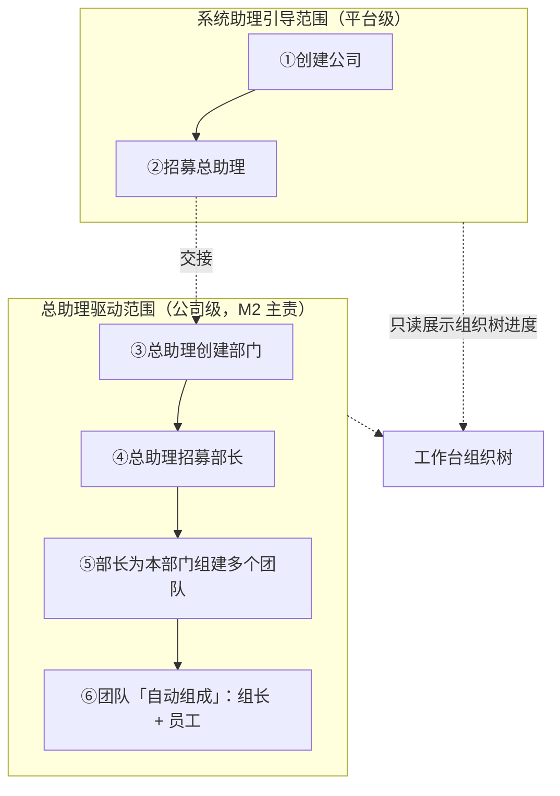
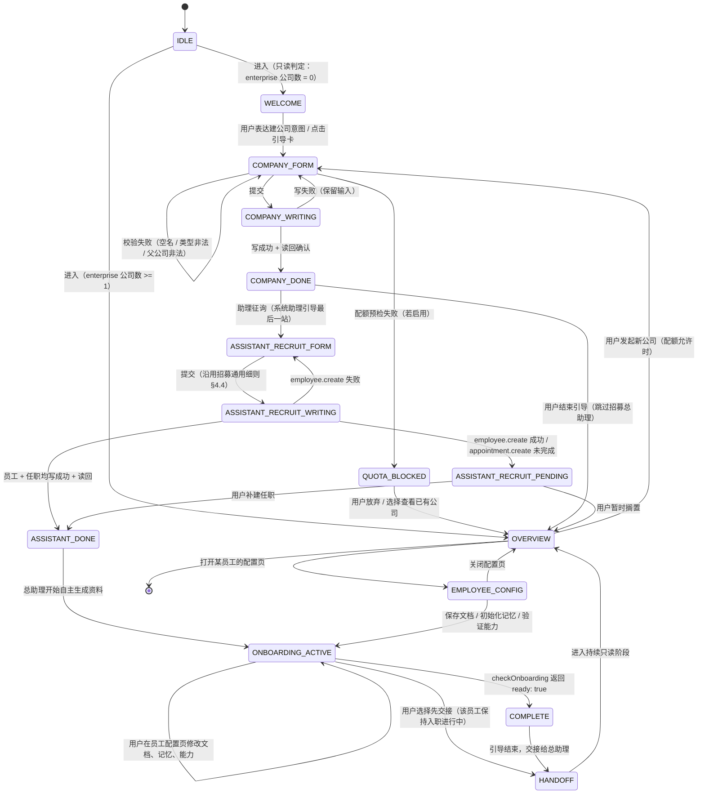

# 系统助理 UI 设计方案 v0.1

| 阅读契约 | 内容 |
|---|---|
| 身份 | `SOLO-UI-SA-01`（系统助理交互载体）设计方案 v0.1；草稿，未经用户验收 |
| 目的 | 定义「系统助理」在 DSH Web 原生界面上引导用户完成**链式旅程**（系统助理引导段：创建公司 → 招募总助理；后续由总助理驱动：部门 → 部长 → 团队）的产品设计：旅程、界面落点、结构化卡片、状态机、失败边界 |
| 范围 | 产品设计层。界面视觉与交互方案、数据写入映射、失败与边界语义、技术落点（Slots vs fork 分工）。**不含**代码 |
| 依据 | [`data-contract.md`](../design/data-contract.md) §0/§2/§3/§4（权威数据模型与配额）；[`dsh-design-language-v0.1.md`](dsh-design-language-v0.1.md)（**主题一致性权威** `SOLO-UI-DL-01`，见 §2.3b）；[`web-ui-fork.md`](../decisions/web-ui-fork.md) SOLO-UI-FORK-01（fork 改造路线）；[`architecture-summary.md`](../architecture-summary.md) 里程碑表；`packages/core/src/contracts.ts`（命令面字段事实）；DSH fork 席位源码与 locale 包 README（机制事实）；用户 2026-09-17 提供的两张 DSH Web 界面截图 |
| 决策状态 | 全线〔建议〕/〔待决〕。本设计**不是**已批准需求；〔需求〕级陈述及其来源见 §1（含用户 2026-09-17 的 Q1/Q2/Q6 答复与三级权限链补充） |
| 证据分层 | 界面盘点为〔读图确认〕（两张截图，单机单次观察，不等于完整功能面）；数据字段为〔源码事实〕（`packages/core/src/contracts.ts`，2026-09-17）；技术落点为〔源码事实〕（界面插件全景检索报告 + 本次对 DSH fork 的席位源码重核，2026-09-17，见 §6；欢迎态席位已按 B6 更正，见 §6.5） |
| 反面声明 | 本文不证明：系统助理已实现、DSH 原生界面已支持文中所述扩展点、配额校验已生效（`data-contract.md` §0 明列配额「未实现」）、M0.1 已验收 |
| 变更权 | product-owner / UI 负责人；改变旅程范围或交互形态须用户决定 |

---

## 1. 产品定义（已定方向）

〔需求〕**「系统助理」= M0.1 里程碑的交互载体**，托管在 DSH Web 原生界面（fork 改造为 `soloips-web`）的对话流里的**引导式助理**。**对话式优先，关键输入用结构化卡片/表单收口。** 来源：指挥（产品经理）2026-09-17 本会话派单。

**旅程形态（已由用户补充修订）**

〔需求〕原派单表述为「三步旅程：①创建公司 → ②创建部门 → ③招募组团队」。**用户 2026-09-17 补充三级权限链后，旅程改为链式六步，系统助理的引导范围收窄**：

| 段 | 步骤 | 驱动者 | 系统助理角色 |
|---|---|---|---|
| **系统助理引导段** | ① 创建公司 | 系统助理 | **逐步引导** |
| | ② **招募总助理** | 系统助理 | **逐步引导（引导终点）** |
| **总助理驱动段** | ③ 创建部门 | 总助理 | 只读展示 |
| | ④ 招募部长 | 总助理 | 只读展示 |
| | ⑤ 部长为本部门组建多个团队 | 部长 | 只读展示 |
| | ⑥ 团队「自动组成」（组长 + 员工） | 部长 / 系统（待澄清） | 只读展示 |

〔需求〕**引导边界**：系统助理逐步引导仅到 **②**；③–⑥ **由总助理在公司内驱动**，系统助理在工作台**只读**展示组织树进度。详见 §4。

〔需求〕**系统助理是「系统级」的**（面向所有用户、平台提供、M0.1 交付）；**总助理是公司创建后招募出来的**（像员工一样走招募流程）。来源：用户 2026-09-17 经指挥传达的澄清答复 Q1。

### 1.1 与既有概念的关系（重要边界）

> **〔需求〕Q1 已澄清（用户 2026-09-17）**：两者**不是同一实体的两个阶段**，而是**平台级 vs 公司级**的两个不同对象。本表已按此更新。

| 概念 | 层级 | 归属里程碑 | 产生方式 | 本设计的立场 |
|---|---|---|---|---|
| **系统助理**（本文对象） | **系统级 / 平台级**：面向所有用户 | M0.1 | **平台提供**，随 `soloips-web` 交付 | 引导式流程助手：把「建公司/建部门/招人」的组织操作以对话 + 卡片形式收口，**不负责日常业务运营** |
| **总助理** `general_assistant` | **公司级**：属于某一家公司 | M2 | **公司创建后像员工一样走招募流程**产生 | AI 驱动的公司运营：接收与分解用户目标、协调部门工作、汇总进度报告、向用户提交待决事项（`architecture-complete.md` §3.3）；**兼人事角色**，是三级权限链第 1 级（见 §1.1、§3.2.3） |
| 公司所有者 | 账户级 | — | 部署账户绑定 | `SoloipsAppointmentRole` 的 `owner`；S0 由部署账户绑定替代，`data-contract.md` §3.1 |

**关键推论（对本设计的三个直接后果）**

1. **系统助理不产生任职记录**。它是平台能力，不是某公司的岗位；`data-contract.md` §2 的 `general_assistant` 任职是**总助理**的，与系统助理无关。
2. **系统助理的职责边界到「把公司建起来、把人招进来」为止**。公司运营（目标分解、跨部门协调）属总助理与 M2。
3. **〔建议〕引导终点即「招募总助理」**：招募总助理完成后进入**交接态**（`HANDOFF`），明确告知用户后续由总助理驱动。此条为〔建议〕级，待指挥确认（PRD Q5g(a)）。

〔已澄清，原〔待决〕撤销〕~~系统助理与 M2 总助理的边界~~ → 见上表。

〔需求〕**三级权限链**（用户 2026-09-17 补充）：

| 级 | 角色 | 由谁产生 | 权限 | 与权威文档对应 |
|---|---|---|---|---|
| 1 | **总助理** | 公司创建后**招募产生** | **最大权限**：创建部门、招募**部长**；**跨部门管理与招募权** | `data-contract.md` §1.1 公司级任职 `general_assistant`；`architecture-complete.md` §3.3 职责 |
| 2 | **部长** | **总助理招募** | **为本部门组建多个团队** | `02-company-contract.md` DEP-R01 的**部门管理员**；招募权限本部门（ORG-02） |
| 3 | **团队** | 部长组建，**多个并存，「自动组成」** | 由**组长和员工**构成（结构自动就位） | `data-contract.md` §2 独立 `Team` + `TeamBinding`；「组长 + 员工」对应成员角色 |

〔需求〕**「总助理招募部长」回答了 `02-company-contract.md` DEP-O01「尚无管理员时由谁任命」**——该条原为 DEP-O01 待决项，由用户本次确认。

〔需求〕**系统助理的引导边界**：覆盖到「**招募总助理**」；后续链（部门 → 部长 → 团队）**由总助理在公司内驱动**，系统助理只在侧边/工作台**只读展示组织树进度**。

〔待决〕DSH 自身的 onboarding 概念：`development-plan.md` T1.7「Host onboarding 流程」、`packages/core/src/onboarding.ts` 的**员工入职/准入判定**（`SoloipsOnboardingStatus`）。本文的「onboarding」专指**用户级首次进入引导**，与员工入职判定**不是同一件事**——此词汇冲突仍未澄清（PRD Q2）。

---

## 2. 界面盘点：DSH Web 原生界面事实底册

> 证据等级：〔读图确认〕——两张用户提供的 DSH Web 截图（2026-09-17 本会话）。性质为**单机、单次、静态截图观察**；截图不含 hover/键盘/移动端/权限差异态，因此「界面上没有」不等于「功能不存在」。凡未在图中出现的元素，一律不列。

### 2.1 布局结构（栏/区/面板）

| 区域 | 截图 1（空闲/欢迎态） | 截图 2（会话进行态） | 证据 |
|---|---|---|---|
| 左侧边栏 | 宽度约占视口 23%（约 440/1918 px）；顶栏固定，底部固定工具组 | 同左，**且随会话态出现会话条目** | 〔读图确认〕 |
| 主区（中） | 「探索未至之境 预览版」大标题 + 上下文胶囊行 + 大输入框 | 消息流（含 Markdown 渲染的编号列表）+ 底部输入框 + 消息级工具条 | 〔读图确认〕 |
| 右侧面板 | **不存在**（主区横向占满） | 存在「**开始**」面板：右上三个图标按钮，中部罗盘图形占位，下方两张卡片（工作区文件 / 新建终端） | 〔读图确认〕 |
| 会话头部 | 无（未进入会话） | 「问候…」标题 + `SoloIPs 研发团队` + `Agent Team` + 彩色方块徽标 + `…` 更多菜单 | 〔读图确认〕 |
| 会话内标签页 | — | 「对话 / 轨迹」两个 tab | 〔读图确认〕 |

**结论**：DSH 原生界面是**三栏形态**（左栏 / 中主区 / 右面板），且**右面板按需出现**（欢迎态无、会话态有）。这是一条对系统助理很有价值的事实：**无需新造栏位即可承载「助理输出区 / 组件面板」**。

### 2.2 已有交互元素

**左栏（导航与会话管理）**

| 元素 | 位置 | 证据 |
|---|---|---|
| 品牌头 `deepseek HARNESS` + 折叠侧栏按钮 | 左上 | 〔读图确认〕 |
| 主行动按钮「**+ 新会话**」（全宽、高亮描边） | 顶部 | 〔读图确认〕 |
| 导航项「**SSH**」「**技能中心**」（带图标） | 主行动按钮下方 | 〔读图确认〕 |
| 分区标题「**工作区**」+ 右侧三个图标按钮（搜索 / 筛选或排序 / 新建） | 中部 | 〔读图确认〕 |
| 工作区条目「**soloips**」（文件夹图标，当前选中态） | 工作区下 | 〔读图确认〕 |
| 会话列表项：截图 1 = 「新会话」（选中态）；截图 2 = 「问候对话」+ 右侧「**刚刚**」时间戳 | 工作区条目下 | 〔读图确认〕 |
| 底部工具组：下载图标 / 对话图标 / 账单或列表图标 | 左下 | 〔读图确认〕 |
| 「**设置**」入口（齿轮图标） | 左下最底 | 〔读图确认〕 |

〔读图确认〕**左栏已具备会话管理原语**：会话列表（含相对时间）、选中态、新会话入口。系统助理若以「一个特殊会话」承载，**可直接复用这套列表与选中态，无需新造容器**。

**中栏（消息流与输入）**

| 元素 | 证据 |
|---|---|
| 空态欢迎：大标题「探索未至之境」+「**预览版**」徽标 | 〔读图确认〕 |
| 上下文胶囊行：「`soloips` ▾ / `SoloIPs 研发团队` ▾ / `main` ▾」三枚可下拉胶囊 | 〔读图确认〕 |
| 大输入框：placeholder 文案「**描述你想要构建的内容，/ 调用指令，@ 文件或对话**」 | 〔读图确认〕 |
| 输入框工具行：`+` 按钮 / 「工作区内修改 ▾」策略下拉 / 模型选择器「`DeepSeek V4.1 Flash - Global Free High` ▾」/ 圆形上箭头发送按钮 | 〔读图确认〕 |
| 会话态输入框 placeholder：「**发消息或创建任务，/ 调用指令，@ 文件或对话**」 | 〔读图确认〕 |
| 消息流：Markdown 渲染（标题、编号列表、行内代码块 `D:` 路径、超长文本自动换行） | 〔读图确认〕 |
| 消息级工具条（助手消息下方）：复制 / 点赞 / 点踩 / 重试 / 「用量 12.5K…」/「用时…」/ 时间戳 `23:30` | 〔读图确认〕 |
| 会话态底部状态行：「Ⓐ 1 轮 1 步 · 189 to…」「12.5K tok · 缓存命中…」 | 〔读图确认〕 |

**右面板**

| 元素 | 证据 |
|---|---|
| 标题「**开始**」（圆形图标前缀） | 〔读图确认〕 |
| 右上三枚图标按钮（面板开关 / 全屏类 / 关闭类） | 〔读图确认〕 |
| 空态图形（罗盘/指针图形，灰色） | 〔读图确认〕 |
| 卡片「**工作区文件**」— 副标题「浏览会话工作区的文件」，黄色文件夹图标 | 〔读图确认〕 |
| 卡片「**新建终端**」— 副标题「在会话工作区运行命令」，折叠箭头，>` 图标 | 〔读图确认〕 |

〔读图确认〕**右面板的「卡片列表」形态与系统助理的结构化卡片高度同构**：图标 + 主标题 + 副标题 + 整块可点击。这是本设计最重要的复用发现——**卡片视觉语言已存在**，系统助理需要新增的是卡片的「表单输入态」而非「列表项态」。

**会话头部**

| 元素 | 证据 |
|---|---|
| 会话标题（截断显示「问候…」） | 〔读图确认〕 |
| 团队/代理标识「`SoloIPs 研发团队`」（图标 + 文本 + 下拉） | 〔读图确认〕 |
| 代理标识「`Agent Team`」（人形图标 + 文本） | 〔读图确认〕 |
| 彩色方块徽标（多色矩形，疑似状态/身份指示） | 〔读图确认，含义未知〕 |
| `…` 更多操作菜单 | 〔读图确认〕 |
| tab「**对话**」（选中）/「**轨迹**」 | 〔读图确认〕 |

〔读图确认〕**「团队/代理」标识已在会话头部**，且带下拉。系统助理若需要一个「当前助理身份」入口，这里有现成位置。**「轨迹」tab 的存在说明界面已支持「同一会话的第二种视图」**——对系统助理的状态可视化（见 §5.4）是现成模式。

### 2.3 视觉风格要点

| 维度 | 观察 | 证据 |
|---|---|---|
| 主题 | 深色（近黑）；主区背景比左栏略深，形成**层次而非分割线** | 〔读图确认〕 |
| 圆角 | 大圆角普遍：主行动按钮、输入框、右面板卡片均为明显圆角矩形 | 〔读图确认〕 |
| 描边 | 弱描边/极细边框区分区块；主行动按钮靠**描边高亮**而非实色填充突出 | 〔读图确认〕 |
| 密度 | 中低密度：字号偏大、行距宽松、区块间留白充足 | 〔读图确认〕 |
| 强调色 | 极克制。仅发送按钮（圆形，高亮填充）、卡片图标（黄色）、会话头部彩色方块使用彩色；其余为灰阶 | 〔读图确认〕 |
| 图标风格 | 线性图标，统一线宽，圆角端头 | 〔读图确认〕 |
| 字体 | 无衬线；中文为主，等宽用于路径/代码块 | 〔读图确认〕 |
| 状态点 | 发送按钮在会话态呈**禁用灰**（截图 2），说明有明确的禁用态视觉 | 〔读图确认〕 |
| 语义色 | 截图中未见红/绿错误或成功色。**失败态视觉需新增**（见 §7） | 〔读图确认 + 推断〕 |

**与 `architecture-complete.md` §5.3 的冲突提示**：该节设计的「科幻深色 + 青色发光」视觉方案属**已推迟的自研路线**。当前 V1 是 fork 官方 Web，**视觉应沿用上游风格**（`web-ui-fork.md` §2.2「改动做薄」）。系统助理的卡片应**复用上游既有的灰阶 + 弱描边语言**，而非引入青色发光。此点标〔建议〕，须与 UI 负责人对齐。

### 2.3b 视觉规格的权威来源（**改为引用底册**）

> **〔约束〕本节（以及与视觉有关的一切规格）不再自造，一律引用 [`dsh-design-language-v0.1.md`](dsh-design-language-v0.1.md)（`SOLO-UI-DL-01`）。**
> 上方 §2.3 是〔读图确认〕的**现象观察**（截图看到什么），**不是可用规格**——可用规格见底册。

| 项 | 权威来源 | 要点 |
|---|---|---|
| 颜色 token | 底册 §1.3 / §6.1 A1–A2 | **只用 `--dsw-alias-*`**；不消费 `--dsw-static-*`；**零字面色值** |
| 卡片配方 | 底册 §2.2 | 圆角 **14/16/18/20**；gap **10–12**；padding **14×16**；标题 **14–15px / w500–600**；副标题 12–13px |
| 间距/圆角刻度 | 底册 §3.2 / §3.3 | 间距 **2/4/6/8/10/12/14/16**；圆角阶梯 4–32 + `999px`+`50%`；**无 token 家族，用字面量** |
| 强调色纪律 | 底册 §4 | 实测**强调色占比 6.05%**；**禁止大面积填充**；强调**必伴随 w500 或描边** |
| 品牌定制 | 底册 §6.2 | 仅 **BR1–BR7** 七个官方预留位；**无品牌主题色配置项** |

**三个致命坑（= 本设计的禁止项，底册三大发现）**

| # | 禁止项 | 后果 |
|---|---|---|
| **P1** | 把品牌蓝绑 `--dsw-alias-brand-primary` | ⚠️ 它是**中性色**：浅色近黑、深色近白 → 品牌蓝会**反色**（底册 §4.3 C5 N2） |
| **P2** | 用背景色差表达层级 | ⚠️ **浅色主题下 `bg-base`/`layer-1/2/3` 全是同一个白** → 层级失效，须靠 **0.5px 发丝线 + elevation**（底册 §3.4 C10 N3） |
| **P3** | 复制 14 个未定义 token 名单里的名字 | ⚠️ 声明**整条被丢弃**（不是回退）——`label-error`/`bg-l1`/`bg-l2`/`bg-layer-4`/`fill-l2`/`fill-tertiary`/`fill-tsp-secondary`/`label-quaternary`/`separator-primary`/`font-mono`/`font-sm-13` 等（底册 §1.7 A6 N7） |

〔约束〕**系统助理的品牌色**（若需品牌化）：**唯一合法挂钩**是底册 **BR4**——`ctx.theme.register` / `overrideTokens`，覆写 **`button-info-fill` / `state-business-primary` / `brand-primary-new-colorprimary-new-color`** 一族，**且必须提供 `{ light, dark }` 双值**。**不得**绑 `brand-primary`（P1）。

〔约束〕**卡片图标着色**：底册实测「四张卡片先例中**只有交付卡**把图标着 `--dsw-alias-link`」。系统助理的「卡片图标（黄色）」观察属〔读图确认〕，**不是可照搬的约定**；**建议不着色**（用 `label-tertiary`），若着色须在改动清单登记（底册 §4.4 规则 4、Q5）。

〔约束〕**浮层**：设 `border: 0` + `box-shadow: var(--dsw-elevation-panel|prominent|soft)`；**禁止**「`--dsw-alias-border-*` 边框 + elevation 阴影」配对（官方有自动化测试 `neutralBordersBesideElevation()` 会失败，底册 A7）。中性实线边框一律 **0.5px**（A8）。全圆形状同规则内配 `corner-shape: round`（A9）。

**强调色纪律的逐条对照**（底册 A3 要求）

| 底册禁止项 | 本设计的要求 | 依据 |
|---|---|---|
| **C5**（把 `brand-primary` 当品牌蓝） | 见 P1：**禁止**。品牌蓝走 BR4 覆写 `button-info-fill` 一族 | §4.3 |
| **C6**（强调色大面积填充） | **禁止** >34px 级强调色实心块/卡片整底/头部色块。**系统助理的卡片一律不用强调色填充**（用 `bg-layer-3` 或 `transparent`）；仅 `Tag`/`StateDot`/发送钮/spinner 弧例外 | §4.4 规则 1 |
| **C10**（依赖浅色表面色差表达层级） | 见 P2：**禁止**。系统助理的**步骤条、卡片层级、组织树**一律靠 **0.5px 发丝线 + elevation + 缩进**，**不靠底色深浅** | §3.4 |

〔约束〕**量化基线**：底册实测官方 `--dsw-alias-*` 引用 **1505 处**，其中强调色 **91 处 = 6.05%**。**系统助理的强调色占比照此克制**；底册验收建议新界面 **≤10%**（V15）；**强调色不得用于大面积填充**（V16）。

〔约束〕**强调必伴随字重或描边**：底册 §4.4 规则 3——不靠色相单独承担层级（如强调文字配 `font-weight: 500`，强调块配描边）。

### 2.4 可复用 vs 需新增

| 界面能力 | 判定 | 说明 | 证据 |
|---|---|---|---|
| 会话列表 / 选中态 / 相对时间 | **可复用** | 系统助理会话作为其中一条 | 〔读图确认〕 |
| 「+ 新会话」入口 | **可复用（需判断）** | 是「新会话」还是「新建系统助理引导」语义待定，见 PRD Q3 | 〔读图确认〕 |
| 对话流 + Markdown 渲染 | **可复用** | 助理话术直接走消息流 | 〔读图确认〕 |
| 输入框 + `/` 指令 + `@` 引用 | **可复用** | 自由文本回退路径 | 〔读图确认〕 |
| 输入框工具行（模型选择等） | **可复用** | 系统助理是否需要暴露模型选择器待定 | 〔读图确认〕 |
| 消息级工具条（复制/重试/用时/用量） | **可复用** | 对助理消息同样适用 | 〔读图确认〕 |
| 右面板 + 卡片列表 | **可复用（形态）** | 卡片视觉语言已在，需扩展为表单态 | 〔读图确认〕 |
| 会话内 tab（对话/轨迹） | **可复用** | 可作「引导步骤 ↔ 组织概览」双视图 | 〔读图确认〕 |
| 会话头部「团队/代理」标识 | **可复用** | 助理身份指示位 | 〔读图确认〕 |
| 左栏「工作区」分区 | **需判断** | 当前是代码工作区；是否等同「我的公司」见 PRD Q4 | 〔读图确认〕 |
| **结构化输入卡片**（字段 + 校验 + 提交） | **需新增** | 截图中只有展示型卡片，无输入型卡片 | 〔读图确认〕 |
| **选择型胶囊**（公司类型 `platform/operation/enterprise/subsidiary`） | **需新增（或复用胶囊样式）** | 顶栏胶囊是切换器样式，可借用视觉 | 〔读图确认 + 推断〕 |
| **配额提示/阻挡态** | **需新增** | 截图中无任何配额或限制提示 | 〔读图确认〕 |
| **失败 / 重名 / 拒绝态** | **需新增** | 截图中无错误视觉 | 〔读图确认〕 |
| **组织树 / 公司-部门-员工结构视图** | **需新增** | 截图中无组织结构视图 | 〔读图确认〕 |
| **引导进度指示**（①②③ 步骤条） | **需新增** | 截图中无步骤条 | 〔读图确认〕 |
| **系统助理专有入口** | **需新增** | 截图中无任何 SoloIPs 业务入口 | 〔读图确认〕 |

> **「需新增」的含义澄清**〔§6.3 更新〕：表中「需新增」指的是**新增 SoloIPs 自研组件**，**不等于需要 fork 官方源码**。经 §6 技术落点核实，这些新增项均有 Slot 席位可挂（`settings.section` 整页 / `main` 新键 / `sidebar.panellist` / `conversation.view` / `tool.call.toolview` / `shell.overlay`），业务层**零官方源码改动**。**欢迎页/空态席位确实存在**（B6 更正），但为 `single` 接管语义——见 §6.5。

---

## 3. 界面方案：系统助理在 DSH 原生界面上怎么呈现

### 3.1 呈现形态的三个候选

> 三者不是互斥的，最终可能是组合。标注为〔建议〕，需用户选择（PRD Q3）。
> **⚠️ 已按技术落点更新**：§6.4 依据 slot 席位事实重新评估了三个候选的代价结构（候选 B 的 fork 代价基本消失、候选 C 新增不确定性），**§6.4 的结论优先于本节**。

**候选 A：专用会话类型（推荐）**

- 系统助理是一条**特殊会话**：会话头部显示助理身份，进入后首条消息即为引导开场。
- 引导步骤与候选卡片**直接渲染在消息流里**，右面板承载「当前步骤的表单卡片 / 已建组织结构概览」。
- 优点：复用度最高（会话列表、消息流、输入框、右面板全部现成）；符合「对话式优先」；用户可随时用自由文本打断。**且 `conversation` 是 DSH 界面第一公民**（§6.3），架构天然对齐。
- 代价：需为「卡片消息」定义一种新的**消息类型**。〔已更新 §6.4〕该代价可走 `tool.call.toolview`（**按工具名分派**，新名 **`replaceRisk: none`**）替代，**无需 fork 消息流**；`conversation.view`（list/session）可在官方 `chat`/`trajectory` 之外**加装**自研视图。
- 复用映射：左栏会话列表（可复用）+ 中栏消息流（可复用，卡片经 `toolview` 注入）+ 面板承载概览（席位见 §6.3）

**候选 B：左栏入口 + 专用主面板**

- 左栏「技能中心 / SSH」同级新增「**我的公司**」入口，点击进入系统助理专属视图。
- 优点：入口明确、不受会话列表滚动影响；适合承载组织树这类**持久结构视图**。
- 代价：~~偏离「对话式优先」，等于新建一个页面；fork diff 面积更大~~。〔已更新 §6.4〕**该代价基本消失**——`main`（keyed/root）注册**新键** = 加装自研主面板，**不动官方 `conversation` 键**；`sidebar.panellist`（list）配套侧栏图标；`settings.section`（list/root，`replaceRisk: none`）还提供一个**零替换风险的整页席位**。**全部走 Slots，零官方源码改动。**
- 残留代价：仍与「对话式优先」存在取向差异（但可与 A 组合，不冲突）
- 复用映射：左栏导航（可复用）+ `main` 新键 + `settings.section` 新 tab

**候选 C：欢迎页 / 空态向导**

- 在**空态的欢迎页**（截图 1 的「探索未至之境」位置）嵌入 SoloIPs 引导，首屏即**引导旅程起点**。
- 优点：首进入体验最直接；复用现有大标题+输入框空态结构。
- 代价：空态只在无会话时出现，**不具备持续性**；用户建完公司后回到哪里不清楚。
- **新增语义限制**〔B6 更正〕：`conversation.hero.*` **三个席位确实存在**（`ui-conversation/.../slots.ts:159-163`），但均为 **`kind: 'single'`** → **注入即接管（替换官方默认渲染），不是追加**。且 hero 仅无会话时存在 → **无持久性**；其中 `.brand.mark` 是 `ui-brand-official` 的官方占用点。**三方向重估见 §6.5**（C3 会话内首条消息引导为推荐默认）。
- 复用映射：中栏空态（**落点未确认**）。

**〔建议〕组合方案（已按 §6.4 更新）**：**A 为主 + B 的能力 + C 降级为待确认**。
- **A 为核心**：引导对话走 conversation；卡片经 `tool.call.toolview`；`conversation.view` 加装「引导进度/组织概览」视图。
- **B 承载持久视图**：`main` 新键「公司工作台」（组织结构树 + 未就绪清单）+ `sidebar.panellist` 侧栏图标；`settings.section` 承载「公司管理」整页。
- **C 按 §6.5 三方向处理**：**默认 C3**（会话内首条消息引导，零席位风险）；**C2**（`conversation.input.dock` 加装入口条）待冷启动验证；**C1**（接管 hero）仅在用户明确要求且接受接管官方品牌位时采用。
- 配额/阻断错误条可用 `shell.overlay`；会话头部动作可用 `conversation.session.header.actions`。

### 3.2 结构化卡片设计

**通用卡片规格**（〔建议〕，视觉沿用上游右面板卡片语言）

| 属性 | 规格 |
|---|---|
| 容器 | 圆角矩形 + 弱描边，与既有右面板卡片一致；中栏内嵌时宽度不超消息流内容宽 |
| 结构 | 图标 + 标题 + 副标题（可选）/ 字段区 / 动作区（主行动 + 次行动） |
| 字段控件 | 单行文本框、下拉选择、多行文本域、标签输入（能力项） |
| 校验时机 | 失焦即时校验 + 提交前整体校验；错误文案紧贴字段下方 |
| 提交 | 主行动按钮（沿用描边高亮样式）；提交中禁用并显示进行态 |
| 结果 | **写成功后卡片转为「已创建」摘要态**（不消失），保持对话可回溯 |
| 失败 | 卡片保持输入态，顶部错误条 + 字段级定位；不自动重试 |

**卡片 1：创建公司卡**

| 字段 | 控件 | 必填 | 说明 | 约束来源 |
|---|---|---|---|---|
| 公司名 | 单行文本 | 是 | 非空（`requireNonEmpty`） | 〔源码事实〕`store.ts:333` `requireNonEmpty(input.name, "公司名")` |
| 公司类型 | 选择器 | 是（默认 `enterprise`） | 选项**仅 `enterprise` / `subsidiary`**；`platform`/`operation` 为 SoloIPS 官方持有，用户不可选、不计入用户配额 | 〔源码事实〕`contracts.ts:66-70`；`data-contract.md` §2 三层配额表 |
| 父公司 | 选择器 | 当类型 = `subsidiary` 时必填 | 只能选**本账户**的 `enterprise` 公司；`operation` 类型不能有子级 | 〔源码事实〕`store.ts` 父子校验；`data-contract.md` §4.2 `subsidiary_requires_parent` / `parent_account_mismatch` |
| 确认 | 按钮 | — | 提交后写 `company.create` | 〔源码事实〕`SoloipsOperationKind` 含 `"company.create"` |

〔建议〕卡片的型号说明文案：类型选择器旁给一行帮助文本解释「企业公司 vs 子公司」的差异与配额影响（Free 计划下不显示 `subsidiary` 选项或显示为禁用并说明原因）。

**卡片 2：创建部门卡**

| 字段 | 控件 | 必填 | 说明 | 约束来源 |
|---|---|---|---|---|
| 部门名 | 单行文本 | 是 | 非空 | 〔源码事实〕`store.ts:393` `requireNonEmpty(input.name, "部门名")` |
| 所属公司 | 选择器 | 是 | 若上下文已确定则**预填并锁定** | 〔源码事实〕`SoloipsCreateDepartmentInput.companyId` |
| 确认 | 按钮 | — | 写 `department.create` | 〔源码事实〕 |

〔约束〕**当前代码只支持这两个字段**。`data-contract.md` §2 的 `description` / `leaderAppointmentId` / `parentDepartmentId` / `status` / `createdAt` 在 `SoloipsDepartmentRecord` 中标注为「待实现」（`contracts.ts:136-140` 实际只有 `id`/`companyId`/`name`）。**卡片不得设计这些字段**，否则 UI 会承诺数据契约 §0 明列的未实现能力。

〔已取代〕`data-contract.md` §1.1 决定部门负责人用 `leaderAppointmentId`（通过任职表达），而非 `leaderEmployeeId`。因此「任命部门负责人」**不是**部门卡片的字段，而是**招募阶段的任职/角色动作**。

**卡片 3：招募卡（职业/岗位定义 + 招募 + 任职绑定）**

> **〔需求〕Q2 已澄清（用户 2026-09-17）：招募流程沿用旧插件的既有流程**，权威定义在 [`docs/refactoring/02-company-contract.md`](../refactoring/02-company-contract.md)（core 已有 `onboarding` 实现）。因此卡片设计**对齐该流程**，而非自由发挥。

**§3.2.1 权威流程（原文要点，〔需求〕）**

| ID | 内容 | 来源 |
|---|---|---|
| DEP-R01 | **先成立部门 → 再任命管理员 → 管理员招募员工**；员工只有一个当前直接汇报对象 | `02-company-contract.md` §10.2 |
| DEP-D04 | 管理员招募的员工**先进入入职阶段**，完成 DEP-R03 所列内容（个人资料、头像、灵魂/性格、个人操作文档、记忆初始化）后才激活 | `02-company-contract.md` §10.5 |
| ORG-02 | **管理员只在获准本部门范围招募、分配岗位和办理人事**，不能自我升权或撤换其他管理员；用户创建部门并授权首任任命 | `02-company-contract.md` §11.2 |
| DEP-R03 | 正式接任务或自动领取前，须完成个人资料、头像、灵魂/性格文档、个人操作文档及记忆初始化；**资料必须实际保存并可用于工作** | `02-company-contract.md` §10.2 |

**用户给出的流程口径（〔需求〕，Q2 答复原文）**：
> 「先定义好职业（岗位），招募后**员工（AI）自主生成资料**，用户在**员工配置页面**修改」。

**§3.2.2 招募的四阶段（对齐权威流程）**

| 阶段 | 谁操作 | 界面呈现 | 命令 / 落库 |
|---|---|---|---|
| **① 定义职业（岗位）** | 用户（经系统助理引导）或部门管理员 | **职业/岗位定义卡**：岗位名 + 所需能力 | 岗位能力落 `appointment.create` 的 `requiredCapabilities`；〔待决〕独立「岗位」实体是否存在，见下 |
| **② 招募** | **总助理（公司级，兼人事）** 或 **部门管理员（部门级）** | **招募卡**：员工显示名 + 目标部门 | `employee.create` → `SoloipsEmployeeRecord`（`displayName` 有值，四类文档为空，`memoryInitialized: false`） `appointment.create` → `SoloipsAppointmentRecord`（`status: 'active'`） |
| **③ 员工自主生成资料** | **员工（AI）自己** | **不占用用户操作**；界面显示入职进行态（`checkOnboarding` 的 `gaps` 逐项消解） | 〔待决〕生成走哪些命令；`document.save` 存在，但「AI 自主生成」的编排属 core/员工侧能力 |
| **④ 用户在员工配置页面修改** | 用户 / 管理员 | **员工配置页**：四类文档（`profile`/`avatar`/`soul`/`operating`）的读改、记忆初始化状态、能力验证状态、入职就绪状态 | `document.save`（`SoloipsSaveDocumentInput`：`ownerId`/`documentType`/`content`）；`initializeEmployeeMemory`；`verifyEmployeeCapability` |

**§3.2.3 两层招募权限（ORG-02）**

〔需求〕**招募操作员分两层**，界面必须体现授权范围差异：

| 层级 | 角色 | 授权范围 | 证据 |
|---|---|---|---|
| **公司级** | **总助理**（`general_assistant`，**兼人事角色**） | 公司范围招募 | 用户 Q2 答复；`data-contract.md` §1.1「总助理复用任职机制」= 公司级任职 |
| **部门级** | **部门管理员**（`department_lead`） | **仅限获准的本部门范围**；不能自我升权或撤换其他管理员 | 〔需求〕`02-company-contract.md` §11.2 ORG-02 |

〔约束〕**但 `role` 与 `scope` 在代码中「待实现」**（`contracts.ts:159-168`；`data-contract.md` §2 标待实现）。因此 M0.1 的招募卡**无法在数据上区分这两层**——见 §7.3 与 PRD Q5(e)。界面在 M0.1 只能**以文案表达角色意图**，不能以数据表达权限。

**§3.2.4 招募卡的字段（M0.1 可达集）**

| 阶段 | 字段 | 控件 | 必填 | 命令 | 约束来源 |
|---|---|---|---|---|---|
| ① 定义岗位 | 岗位名 | 单行文本 | 〔待决〕 | 〔待决〕无独立岗位实体 | 见下 |
| ① 定义岗位 | 岗位必需能力 `requiredCapabilities` | 标签输入 | 否 | `appointment.create` | 〔源码事实〕`requiredCapabilities?: readonly string[]` |
| ② 招募 | 员工显示名 `displayName` | 单行文本 | 是 | `employee.create` | 〔源码事实〕`SoloipsCreateEmployeeInput.displayName` |
| ② 招募 | 目标部门 `departmentId` | 选择器（预填当前部门） | 是 | `appointment.create` | 〔源码事实〕`contracts.ts:270-275`（**必填**） |

〔**阻塞级**〕**招募总助理时 `departmentId` 无来源**：该字段**必填**且 `store.ts` 校验部门必须存在（`#readDepartment`），但链式旅程中招募总助理时**公司里还没有部门**。四候选出路见 PRD **Q5g(c)**——本设计**不自行选择**。招募**部长**时该字段自然有值（目标部门），故本矛盾**只影响第②步**。
| ④ 配置 | 四类文档内容 | 多行文本/资源选择 | 是（就绪要求） | `document.save` | 〔源码事实〕`SoloipsRequiredDocumentType = profile\|avatar\|soul\|operating` |

〔待决〕**「职业（岗位）」是否有独立实体**：`data-contract.md` §2 的 `SoloipsAppointmentRecord` 只有 `requiredCapabilities`（能力清单），**没有** `position`/`title`/岗位名。`02-company-contract.md` §10.1 术语表把「岗位」定义为「一组职责、所需能力及评价条件」，且**明确「不等于某个固定模型或员工」**——即岗位是概念，但**当前无实体承载**。因此「先定义好职业」在 M0.1 的现实落法是**在任职记录里填 `requiredCapabilities`**，岗位名无处存。见 PRD Q5(e)。

**§3.2.5 员工配置页（新增界面需求）**

〔需求〕Q2 明确了**员工配置页面**的存在（用户在此修改员工自主生成的资料）。这是一个**未被原设计覆盖的新界面需求**，补充如下：

| 项 | 内容 |
|---|---|
| 目的 | 让用户/管理员查看并修改员工的四类文档、记忆与能力状态，并看到入职就绪进度 |
| 展示 | 员工显示名、任职部门、四类文档（`profile`/`avatar`/`soul`/`operating`）当前版本、`memoryInitialized`、`verifiedCapabilities`、`checkOnboarding` 的 `gaps` |
| 操作 | 编辑并保存文档（`document.save`）；触发记忆初始化（`initializeEmployeeMemory`）；验证能力（`verifyEmployeeCapability`） |
| 只读事实 | `assemblyEvidence`（Host 实际装配证据）——属「Host 装入内容」的事实，用户不可编辑 |
| 落点〔§6.3〕 | `settings.section`（新 tab 页）或 `main` 新键下的详情视图 |
| 〔约束〕文档版本 | `SoloipsDocumentVersionRecord` 是**不可变版本链**（`versionId`/`previousVersionId`/`digest`）。修改 = **保存新版本**，不是覆盖旧内容 |
| 〔约束〕所有权 | `document.save` 的 `ownerId` 是 `SoloipsEmployeeId`；`digest` 须读回校验（`contracts.ts:170-180`） |

**卡片 4：组队卡（M0.1 不可用）**

〔待决〕**`SoloipsTeamRecord` 与 `SoloipsTeamBindingRecord` 在代码中不存在**（`data-contract.md` §0：「`SoloipsTeamBindingRecord`（及独立 `Team` 实体）——**未实现**；adapter 的 `team` 端口是 fail-closed 占位」）。而 `SoloipsOperationKind` 中**没有** `team.create`（`contracts.ts:81-91`）。因此：

- 「创建团队」**在当前代码面上不可写入**（Team 实体与 `team.create` 均不存在，§4.6、§7.3 B-1）。
- 三级链的第⑤⑥步（部长组队、团队自动组成）在 M0.1 **整体不可达**；第④步（招募部长）可写为「员工 + 任职」但**无角色区分**。
- 可达终点须由 PRD **Q5g** 澄清；这一条是本设计方案**未消除的不确定性**。

### 3.3 引导进度指示

〔建议〕双轨表达，**两轨均有 Slot 落点**（§6.3）：

- **消息流步骤条**（轻量、不新增顶层组件）：`① 公司 ✓ → ② 部门 ● → ③ 招募 ○`，随读回确认推进。落点：`tool.call.toolview`（按工具名分派）或 `conversation.view` 加装视图。
- **组织概览（持久视图）**：公司 → 部门 → 员工/任职树，实时读 `listDepartments` / `getCompanyTree` 等只读命令（〔源码事实〕`SoloipsCoreService` 已有这些读方法，`contracts.ts:466-477`）。落点：`main` 注册新键「公司工作台」（keyed，不动官方 `conversation` 键）或 `settings.section` 新 tab 页（`replaceRisk: none`）。

〔读数〕进度**必须由真实读回驱动**（读 `getCompany` / `listDepartments` 确认存在），不能仅凭「命令返回成功」点亮——`docs/technical/acceptance.md`「验收分层」原则要求可读回。

〔约束〕概览视图只读：它经 Host 半边 `@Remote` 暴露的读命令取数（§6.2），不经浏览器半边直连 `soloips-core`。

### 3.4 国际化（i18n）

> **〔需求〕Q6 已澄清（用户 2026-09-17）：界面继承 DSH 既有国际化机制**，soloips 的 UI 插件文案接入同一体系（中英双语随 DSH 切换），**不单独造 i18n**。

**§3.4.1 事实基础**〔源码事实〕（DSH fork 2026-09-17 静态核对）

| 事实 | 内容 |
|---|---|
| 机制所在 | `deepseek-harness/packages/client/locale/`（`@deepseek-ai/dsh-client-locale`），随 client tree 自动激活，**无需配置即可挂载** |
| 已有语言 | 内置 **en / zh** 两套；用户可在 Settings → General 切换，**立即生效**（`<html lang>` 同步更新） |
| 偏好持久化 | loopback 页面写入 `$DSH_HOME/settings.yaml`；非 loopback 页面仅当前进程有效 |
| 新浏览器 | 按 `navigator` 全标签匹配 → 主语言子标签匹配 → 回退英文 |
| 插件注册方式 | `ctx.locale.register(ns, { zh, en })`；命名空间合并进 `LocaleNamespaceMap`，**编译器按键联合类型校验**，且**要求两种内置语言齐备**（缺一即编译错误） |
| 消费方式 | `ctx.locale.bind(ns)` 或框架注入的 `t` seat |
| 热更新 | 字典在 UI 已挂载后注册，**无需 remount 即被拾取** |
| slot 文案 | 经 slot 渲染的文案**无需重新加载**即更新 |
| 查找顺序 | 请求的命名空间 → `common` 命名空间 → 显示 key 本身 |
| 外部语言包 | 外部插件可 `ctx.locale.addLanguage({...})`；fallback 链必须终止于 `en`；未知目标/重复 id/环在注册时失败 |

**§3.4.2 设计侧规范**

| 项 | 规范 |
|---|---|
| **默认行为** | 系统助理文案**跟随 DSH locale**，不自设语言开关、不读自定义配置 |
| **命名空间** | 建议 `soloips`。→ 注册形如 `ctx.locale.register('soloips', { zh, en })` |
| **键名格式** | 建议点分层级、以 `soloips.` 为前缀，例： `soloips.company.create.title` `soloips.company.create.field.name` `soloips.company.create.error.nameEmpty` `soloips.department.create.title` `soloips.recruit.stage.position` `soloips.recruit.stage.hire` `soloips.recruit.stage.selfGenerate` `soloips.recruit.stage.configure` `soloips.employee.config.title` `soloips.onboarding.gap.documentMissing` `soloips.quota.companyLimitExceeded` `soloips.unsupported.teamNotAvailable` `soloips.role.chiefAssistant`（总助理） `soloips.role.departmentLead`（部长） `soloips.role.teamLead`（组长） `soloips.panel.companyWide`（公司总览·跨部门） `soloips.panel.departmentScope`（本部门工作台） |
| **双语齐备** | `zh` 与 `en` **都必须提供**（机制强制）。中文为键集真源（沿用 DSH 仓库「Chinese-first, en checked complete」惯例） |
| **占位符** | 沿用机制语法，如 `{count}` / `{value}`（见 locale 包既有条目 `'number.thousand': '{value}K'`） |
| **错误文案** | 失败/边界文案同样是 i18n 键，**不硬编码**。`data-contract.md` 的机器可判定原因串（如 `subsidiary_requires_parent`、`${type}_limit_exceeded: current=N, limit=M`）**不直接展示给用户**，须映射为本地化文案 |
| **动态 key** | `checkOnboarding` 的 `gaps[].message` 是**服务端生成的字符串**（`contracts.ts:225-232`）。〔待决〕它是否已本地化？若未，界面需按 `item` + `reason`（机器可判定枚举）**自行映射**到 i18n 键，而非直接显示 `message`。见 PRD Q12 |
| **key 缺失回退** | 机制会显示 key 本身。开发期可用此特性发现漏键；**不得**以「显示 key」作为交付状态 |

〔约束〕**不新造 i18n 体系**：不引入第三方 i18n 库、不自建语言切换器、不写第二份字典格式。若需新增语言，走机制的 `addLanguage` 通道（fallback 须终止于 `en`）。

〔建议〕**术语中文化**：`enterprise`/`subsidiary` 等内部类型名在界面上应中文化（「企业公司」/「子公司」），中英对照由 i18n 字典承担，**不在代码里写死中文**。这与 PRD Q6(d) 相关联——现在有了明确机制，中文化不再需要额外基建。

---

### 3.5 权限差异展示

> 〔需求〕用户 2026-09-17 要求：**总助理的管理面（跨部门）与部长面板（本部门）在 UI 上要有权限差异呈现**。

**§3.5.1 根本约束：差异不能靠数据判定**

〔源码事实〕`SoloipsAppointmentRecord` 实际字段为 `id`/`employeeId`/`departmentId`/`requiredCapabilities`/`generation`/`status`（`contracts.ts:159-168`）；`data-contract.md` §2 的 `role`（含 `general_assistant`/`department_lead`/`team_lead`/`member`）与 `scope`（判别联合）**均标「待实现」**，且 `appointment.create` **无 role 入参**。

**推论**：界面**无从知道**当前操作者是总助理还是部长。因此：

| 做法 | 判定 |
|---|---|
| 按角色**禁用**某些操作、显示「你无权」 | ❌ **禁止**（C-14 / §5.3 排除 `PERMISSION_DENIED`）——无法判定则不得宣称 |
| 按角色**过滤**可见数据（如部长只看本部门） | ❌ **M0.1 禁止**——无角色数据，过滤无依据 |
| 用**静态视图差异**表达层级（面板构成/标题/文案不同） | ✅ **建议**——不依赖角色数据 |
| M0.1 不做差异，留到 M0.2+（`role`/`scope` 落地后） | ✅ 备选（PRD Q10(b)(iii)） |

**§3.5.2 建议方案：静态视图差异**

〔建议〕差异体现在**面板的构成与命名**上，而非可执行性判定：

| 视图 | 定位 | 内容构成 | i18n 键 |
|---|---|---|---|
| **公司总览**（跨部门视角） | 对应总助理的**最大权限**视野 | 全部部门列表 + 全部员工/任职 + 组织树全量 + 「创建部门」「招募」入口 | `soloips.panel.companyWide` |
| **本部门工作台**（部门视角） | 对应部长的**本部门范围** | 单部门详情 + 本部门员工/任职 + （M0.2+）本部门团队 + 本部门内招募入口 | `soloips.panel.departmentScope` |

〔建议〕差异呈现的三个具体落点：

1. **面板标题与副标题**用不同 i18n 键，措辞体现层级（「公司总览 · 全部部门」vs「本部门工作台 · {部门名}」）。
2. **入口可见性**：公司总览有「创建部门」；本部门工作台**没有**该入口（因为建部门是总助理的权，部长不具备）。这是**静态的视图构成差异**，不是「点了被拒」。
3. **组织树的范围**：公司总览显示全树；本部门工作台只显示本部门子树。**〔约束〕这是视图筛选，不是权限过滤**——必须在文案上避免「仅显示你有权查看的」这类暗示（那会暗示存在权限体系，触碰 C-3）。

**§3.5.3 与 S0 红线的张力（必须显式记录）**

〔约束〕`data-contract.md` §3.1 要求 **S0 验收中不得声称已满足多租户隔离**；`docs/technical/failure.md` 与项目红线也要求不虚构能力。

**张力**：用户要求**权限差异呈现**，但 S0 **没有权限体系**（无 `role`/`scope`、无认证）。

**〔建议〕调和方式**：
- 呈现的是**视图的层级组织**（组织架构视角），**不是权限的强制**。
- 文案**不得**出现：「仅显示你有权…」「你无权…」「权限不足」「无权访问」。
- 内部实现上，两个视图是**同一份只读数据的两种组织方式**，不是两份不同权限的数据。
- 在 M0.2+ `role`/`scope` 落地后，可把这两个视图**升级**为真正的权限视图（届时差异才有数据依据）。**本次不做该升级的预留代码**，避免为未实现能力预留抽象。

**§3.5.4 待澄清**

→ PRD **Q10(b)**：三选一（静态视图差异 / `role`+`scope` 纳入 M0.1 / M0.1 不做）。
〔建议〕选**静态视图差异**——它满足用户的层级表达需求，且不触碰红线。

---

## 4. 用户旅程地图（链式）

> 原「三步旅程」已按用户 2026-09-17 补充的**三级权限链**扩展为**链式旅程**：系统助理引导覆盖到「**招募总助理**」，后续链由**总助理在公司内驱动**。
>
> 每步四段：用户意图 / 助理行为 / 界面呈现 / 数据写入。失败与边界统一在 §7，此处只标注该步特有的风险点。
> 命令名与字段均引自 `packages/core/src/contracts.ts`（〔源码事实〕，2026-09-17）。

**旅程全景（链式）**

〔约束〕**引导边界**：系统助理逐步引导 **①→②**；**③–⑥ 不由系统助理引导**（由总助理在公司内驱动），系统助理只**只读**展示进度。

〔源码事实〕**可达性**：①✅ ②✅（以「员工 + 任职」形式）③✅ ④⚠️（可写为「员工 + 任职」，但**无角色区分**）⑤❌ ⑥❌（`Team` 实体与 `team.create` 不存在）。可达终点见 PRD **Q5g**。

### 4.0 旅程前置：进入判定

| 项 | 内容 |
|---|---|
| 触发 | 用户打开 DSH Web，进入 SoloIPs profile |
| 判定 | 只读查询当前账户下 `type='enterprise'` 且 `status='active'` 的公司数量 |
| 分支 | 0 家 → **首次引导流**（§5 状态机 `IDLE → WELCOME`）；≥1 家 → 直接进入助理会话并展示组织概览 |
| 数据写入 | **无**（纯读） |
| 〔待决〕 | S0 阶段无认证，`accountId` 由部署层注入且「一个业务存储根只绑定一个账户」（`data-contract.md` §3.1）。因此**「跨账户」在 S0 不表现为多用户，而表现为「存储根已绑定其他账户即拒绝打开」**（`SOLOIPS_CORE_ACCOUNT_MISMATCH`）。旅程设计不假设登录流程 |
| 风险 | 〔未验证〕当前 `createCompany` 写入的 `accountId` 是硬编码 `"seed"` 占位（`store.ts:361` 注释与代码），Host 层注入是否已接线未见证据。「新建后重新进入能否读到」是 M0.1 验收关键（`acceptance.md`「重启后可继续」） |

### 4.1 第①步：创建公司

| 段 | 内容 |
|---|---|
| **用户意图** | 「我要开一家公司」/「帮我建个公司」/ 首次进入时点击引导卡 |
| **助理行为** | 1) 说明公司将作为组织根与配额计量单位；2) 若已是第 2 家，先做**配额预检**；3) 抛出创建公司卡片；4) 收集公司名 + 类型（+ 父公司，若选 `subsidiary`）；5) 提交后**读回确认**并宣读结果；6) 推进至第②步（招募总助理——**系统助理引导的终点**，§4.2） |
| **界面呈现** | 消息流：助理开场文案 + 内嵌创建公司卡片；右面板：切换为「公司概览」空态 |
| **数据写入** | 命令 `createCompany`（`kind: "company.create"`） 入参：`operationId`、`name`、`type?`（默认 `enterprise`）、`parentCompanyId?` 落库字段（`SoloipsCompanyRecord`）：`id`、`accountId`、`parentCompanyId?`、`type`、`name`、`status: 'active'`、`createdAt` ~~其余副作用：创建默认总助理任职~~ → **〔已删除，2026-09-18 裁定〕`createCompany` 不再创建任何总助理任职**；公司创建后处于**「待招募」合法状态**，首任总助理由用户经可信入口招募（`data-contract.md` §2.4.1/§2.4.2）。`createCompany` 仍写审计 `company_created` |
| **该步特有风险** | **配额**：Free 计划 `companyLimit=1`，第 2 家必须被挡（`data-contract.md` §2 三层配额表）。 **类型可见性**：`platform`/`operation` 是官方类型，用户界面**不得**作为可选项呈现（选了也会污染配额语义）。 **父子校验**：`operation` 类型不能有子级；公司树有 `MAX_TREE_DEPTH` 深度限制（`store.ts` 校验） |
| **〔待决〕** | 「创建公司」的配额校验在 M0.1 是否启用？`data-contract.md` §0 明确 `SoloipsEntitlement*` 与三层配额「**未实现**」，且 §0 记「S0 不校验配额」；而 M0.2 才是「配额生效」。界面是否**预置**配额提示（前端提示但不阻断）须澄清 → PRD Q7 |

### 4.2 第②步：招募总助理（**系统助理引导的终点**）

> 〔需求〕用户 2026-09-17 补充：**总助理是公司创建好后招募出来的**（像员工一样走招募流程）。本步是**系统助理引导的最后一站**——招募到总助理后，后续链（部门 → 部长 → 团队）**由总助理在公司内驱动**（§1.1 三级权限链）。

| 段 | 内容 |
|---|---|
| **用户意图** | 公司建好了，接下来做什么 / 助理主动提示 |
| **助理行为** | 1) 说明总助理是**公司级**角色，**兼人事角色**，是后续部门与招募的驱动者（三级权限链第 1 级）；2) 说明这是**系统助理引导的最后一站**，之后由总助理接管；3) 抛出招募总助理卡片（沿用 §3.2.2 四阶段流程）；4) 读回确认；5) 交接说明（后续由总助理驱动） |
| **界面呈现** | 消息流：招募总助理卡 + 交接说明卡；工作台：公司节点下出现总助理，组织树开始生长 |
| **数据写入** | 同 §3.2.4 的招募命令：`createEmployee`（`kind: "employee.create"`）→ `SoloipsEmployeeRecord`；`createAppointment`（`kind: "appointment.create"`）→ `SoloipsAppointmentRecord` 〔约束〕**总助理的「公司级」身份在 M0.1 无法写入**：`appointment.create` 无 `role`/`scope` 入参（`data-contract.md` §2 标「待实现」）。数据上是「员工 + 任职」；「总助理」只是界面叙事与文案 |
| **该步特有风险** | **角色不可写入**：总助理的「公司级」不落库（B-3）。界面**不得**显示「已任命为公司总助理」这类**暗示已落库**的表述；宜表述为「已招募总助理（角色能力将在后续版本生效）」或类似诚实措辞。 **⚠️ 阻塞级结构矛盾**：`createAppointment` **强制要求 `departmentId`**（`contracts.ts:270-275`），`store.ts` 还校验该部门必须存在；**但招募总助理时公司里还没有任何部门**（用户表述的顺序是「公司 → 招募总助理 → 总助理创建部门」）。**本设计不自行选择出路**，四候选（先建默认部门 / 挂到先建部门 / 调整顺序 / 契约扩展）见 PRD Q5g(c)。**此矛盾不解决，本步无法落地。** **半成功态**：见 §4.4 通用细则。 **入职未就绪**：总助理同样要过 `checkOnboarding`（四类文档 + 记忆 + 能力 + 装配）。 |
| **〔待决〕** | 总助理是否**必须**招募才能继续（阻断式），还是**可跳过**（后续由用户自己操作）？M0.1 可达终点见 PRD Q5g。 ~~〔源码事实〕`data-contract.md` §4.2 的目标设计里有「创建公司时自动创建默认总助理任职」（`createDefaultGeneralAssistant`），但**未实现**，且与用户「招募产生」的描述**不一致**——须澄清是否放弃该自动创建设计。见 PRD Q5g(b)。~~ **〔2026-09-18 部分关闭〕自动创建设计已放弃**（`data-contract.md` 已删除该示例，§2.4.1 明确「创建后待招募合法」）。**「阻断式 vs 可跳过」仍〔待决〕**——契约层已允许「无总助理」状态存在，但**是否阻断后续引导**属界面/产品决定，见 PRD Q5g。 |

### 4.3 第③步：总助理创建部门（**总助理驱动范围起点**）

> 〔需求〕此步起**不由系统助理逐步引导**，而由总助理在公司内驱动；系统助理在工作台**只读**展示进度。

| 段 | 内容 |
|---|---|
| **用户意图** | 「给公司建个部门」/「我要一个创作部」（此时由总助理应答，非系统助理） |
| **助理行为（总助理）** | 1) 说明部门围绕长期职责成立（`01-departments.md` DEPT-01）；2) 确认目标公司；3) 抛出创建部门卡片；4) 提交后读回 |
| **界面呈现** | 总助理的管理面（**跨部门视角**，§3.5 `soloips.panel.companyWide`）；系统助理工作台只读同步组织树 |
| **数据写入** | 命令 `createDepartment`（`kind: "department.create"`） 入参：`operationId`、`companyId`、`name` 落库字段（`SoloipsDepartmentRecord`，实际仅 3 字段）：`id`、`companyId`、`name` 〔待实现〕`description`、`leaderAppointmentId`、`parentDepartmentId`、`status`、`createdAt` |
| **该步特有风险** | **目标公司歧义**：账户下多公司时，必须由用户明确选择，助理不得默认。 **重名**：见 §7.2。 **部门暂停/撤销语义**（`DEPT-01`：暂停阻止新增工作，撤销需人员去向安排）在 M0.1 **无字段承载**（`status` 待实现），不得暴露这些动作 |
| **〔待决〕** | 部门是否需要层级（`parentDepartmentId` 待实现）？M0.1 是否做扁平单层？→ PRD Q5(c) **到达本步的前置**：是否必须先有总助理（DEP-R01「先成立部门，再任命管理员」）？注意 **DEP-R01 的顺序是「先部门后管理员」，而用户本次表述是「总助理创建部门」**——两处顺序需对齐，见 PRD Q5g(b)。 |

### 4.4 招募通用细则（第②步与第④步共用）

> **〔需求〕Q2 已澄清**：招募**沿用旧插件既有流程**（权威定义 [`02-company-contract.md`](../refactoring/02-company-contract.md)），不是自由设计。四阶段流程见 §3.2.2，字段集见 §3.2.4。本节列出**两次招募（总助理、部长）共用的风险与边界**。

| 项 | 内容 |
|---|---|
| **招募流程四阶段** | 定义岗位 → 招募 → **员工（AI）自主生成资料** → 用户在**员工配置页**修改（§3.2.2） |
| **招募操作员** | **总助理**（公司级、兼人事）或**部长/部门管理员**（部门级、**限本部门**）（ORG-02，§3.2.3） |
| **信息提示** | 助理应说明权威顺序：**先有部门 → 有管理员 → 管理员招募**（DEP-R01）；招募操作员的层级差异（§3.2.3） |
| **该步特有风险** | **半成功状态**：`employee.create` 成功、`appointment.create` 失败 → 存在**未任职员工**。界面必须显式呈现此中间态并支持补建任职，不得静默。 **入职未就绪**：新建员工 `memoryInitialized: false` 且四类文档为空 → `checkOnboarding` 必然 `ready: false` + 多条 `gaps`。表述必须诚实（「已建档，入职进行中」），不得让用户以为员工已可工作。 |
| **两层权限无法用数据表达** | 〔需求〕总助理（公司级）vs 部长（部门级、**限本部门**、不能自我升权或撤换其他管理员）。 〔源码事实〕**`role` / `scope` 待实现**（`contracts.ts:159-168`；`data-contract.md` §2），`appointment.create` 无 role 入参。 〔建议〕M0.1 界面**只能以文案表达角色意图**；不得出现「权限不足」这类**无法判定**的提示（B-3，§5.3 已排除 `PERMISSION_DENIED` 态）。 〔待决〕→ PRD Q5(e)、Q5g |
| **岗位实体缺失** | 〔需求〕用户要求「先定义好职业（岗位）」。〔源码事实〕`SoloipsAppointmentRecord` **无岗位名/职位字段**，只有 `requiredCapabilities`；`02-company-contract.md` §10.1 定义「岗位」为概念（「一组职责、所需能力及评价条件」），但**当前无实体承载**。 〔建议〕M0.1 的「定义岗位」= 填 `requiredCapabilities`；界面**不应显示可保存的「岗位名」字段**。 〔待决〕→ PRD Q5(e) |
| **数据写入（两次招募相同）** | 命令 A `createEmployee`（`kind: "employee.create"`）→ `SoloipsEmployeeRecord`：`id`、`displayName`、`currentDocuments`（初始空）、`assemblyEvidence`（初始空）、`memoryInitialized: false`、`verifiedCapabilities`（初始空） 命令 B `createAppointment`（`kind: "appointment.create"`）→ `SoloipsAppointmentRecord`：`id`、`employeeId`、`departmentId`、`requiredCapabilities`、`generation`、`status: 'active'` **顺序不可颠倒**：`appointment` 引用 `employeeId` 与 `departmentId`，两者都必须先存在 **阶段③④在员工配置页**：`document.save`（四类文档）、`initializeEmployeeMemory`、`verifyEmployeeCapability` |

### 4.5 第④步：总助理招募部长（部门级）

> 〔需求〕三级权限链第 2 级。**部长 = `02-company-contract.md` DEP-R01 的「部门管理员」**；招募权**仅限本部门范围**（ORG-02）。本步解决了 DEP-O01 的「尚无管理员时由谁任命」——**由总助理任命**。

| 段 | 内容 |
|---|---|
| **操作者** | **总助理**（公司级、兼人事） |
| **用户意图** | 「这个部门给他管」/ 总助理提议 |
| **界面呈现** | 总助理管理面（跨部门视角）；工作台：部门节点下出现部长，组织树加深一层 |
| **数据写入** | `createEmployee` → `SoloipsEmployeeRecord`；`createAppointment`（`departmentId` = 目标部门）→ `SoloipsAppointmentRecord` 〔约束〕**「部长」身份无法写入**：无 `role`，只能表达为「员工 + 某部门任职」 |
| **该步特有风险** | **角色不可写**（同 §4.2）。 **顺序核查**：DEP-R01 原文是「**先成立部门，再任命管理员**」；本步（部门 → 部长）与之**一致**，与用户表述（总助理建部门在前、招募部长在后）也**一致**。**无冲突**，但须注意 §4.3 的部门创建**不需要**先有部长。 **权限范围不可校验**：ORG-02 要求「部长只在获准本部门范围招募」，但无权限数据 → 不可校验（B-3） |
| **〔待决〕** | 部长是否必须由**总助理**招募（而非用户直接操作）？M0.1 无角色数据，界面只能以**文案**表达「由总助理招募」。→ PRD Q5g |

### 4.6 第⑤步：部长为本部门组建多个团队（**M0.1 不可达**）

| 段 | 内容 |
|---|---|
| **操作者** | **部长**（部门级） |
| **用户意图** | 「给这个部门配几个小组」 |
| **界面呈现** | 部长面板（**本部门视角**，§3.5 `soloips.panel.departmentScope`）；工作台：部门节点下出现多个团队节点 |
| **数据写入** | ❌ **无落点**：`SoloipsTeamRecord` / `SoloipsTeamBindingRecord` **未实现**；`SoloipsOperationKind` **无** `team.create`；adapter `team` 端口为 fail-closed 占位（`data-contract.md` §0） |
| **该步特有风险** | **整步不可写入**。界面必须呈现为**显式的未就绪状态**，不得出现可点击的「创建团队」按钮（B-1）。 |
| **〔待决〕** | 是否在 M0.1 引入 Team 实体（属契约扩展）→ PRD Q5(a)；「多个团队并存」的 UI 承载方式（列表/树/看板）→ 待 Team 实体确定后设计 |

### 4.7 第⑥步：团队「自动组成」（组长 + 员工）（**含义待澄清**）

| 段 | 内容 |
|---|---|
| **操作者** | 系统（若为含义 B）或部长（若为含义 A，指定人） |
| **用户表述** | 「**自动组成**——由**组长和员工**构成（团队结构自动就位，组长+成员）」（用户 2026-09-17） |
| **两种可能含义** | **A（默认假设）**：部长创建团队后，**角色框架自动生成**（组长/成员位自动就位），人由部长指定或后续加入。 **B**：系统**按任务/能力自动把员工编入团队**（智能编组）。 |
| **界面差异** | A：团队创建卡 + **空的成员槽**（组长槽 + 成员槽），部长填人。 B：**「一键成团」**智能操作，界面需展示编组依据与可调整性（可解释性、公平性要求高）。 |
| **数据写入** | **〔QA 裁定 2 修正〕Team 数据层在 M0.1 建立**（首任后端 BE-3：`team` 表 + team 命令 kind；BE-2 的 `scope.kind='team'` 承载 `team_lead`/`member`）。团队**可创建与读回**。**但任务/attempt/审核仍归 DSH Team**（CUR-03，adapter `team` 端口 fail-closed），故团队**不能凭此接活**。 |
| **〔待决〕** | → PRD **Q13**。〔建议〕**默认按 A 设计，B 留接口**。本问题**不改变 M0.1 交付**，只决定 M0.2+ 方向。 |

### 4.8 旅程完成态与系统助理的持续角色

| 项 | 内容 |
|---|---|
| **系统助理的边界** | 〔需求〕引导覆盖 **①创建公司 → ②招募总助理**；此后**不由系统助理引导**（由总助理驱动）。系统助理在**工作台/侧边只读展示组织树进度**（§3.5）。 |
| **完成态呈现** | 工作台显示完整组织树：公司 → 总助理 / 部门 → 部长 → 员工/任职（团队节点显示为未就绪占位）。 |
| **未就绪清单** | 入职进行中的员工、未就绪的团队层级、未配置的能力——**显式列出**而非隐藏。 |
| **数据写入** | **无**（纯读汇总）。 |
| **反面声明** | 汇总**只读**，不写状态；汇总里每一项都必须能从读回命令复核，不得凭历史命令成功记录宣称。**系统助理不代替总助理执行公司内操作**。 |

---

## 5. 状态机草图

> 状态机覆盖**系统助理引导范围**（①创建公司 → ②招募总助理）。③–⑥（总助理驱动范围）不在本状态机内——它们由总助理在公司内驱动，系统助理只**只读**展示（§4.8）。

### 5.1 主状态机（引导流程）

**关键新增状态**

| 状态 | 含义 | 说明 |
|---|---|---|
| `ASSISTANT_RECRUIT_FORM` | 招募**总助理**卡 | 复用 §3.2.4 字段集；总助理是公司级、兼人事（§3.2.3） |
| `ASSISTANT_DONE` | 总助理已招募 | **系统助理引导的终点** |
| `HANDOFF` | **交接态** | 引导结束，明确告知用户「后续由总助理驱动」；系统助理转为只读展示 |

**已从状态机移除**（**非删除，是移出系统助理引导范围**）

原状态机中的 `DEPARTMENT_FORM` / `DEPARTMENT_WRITING` / `DEPARTMENT_DONE` / `POSITION_FORM` / `RECRUIT_*`（作为**系统助理引导步骤**）——这些步骤**改由总助理在公司内驱动**（§4.3–§4.7）。招募的**通用细则**（字段、命令、半成功态）仍适用，见 §4.4，但**发起者变为总助理**。

〔约束〕**`TEAM_*` 仍不存在**（Team 实体未实现，§4.6、§5.3）。

### 5.2 状态与可执行动作对照

| 状态 | 界面主呈现 | 允许的写命令 | 关键守卫 |
|---|---|---|---|
| `IDLE` | 空态欢迎页 | 无 | 无 |
| `WELCOME` | 引导开场 + 创建公司卡 | `company.create` | 配额预检（若启用） |
| `COMPANY_FORM` | 公司卡片（输入态） | `company.create` | 名称非空；类型 ∈ 用户可选集；`subsidiary` 必须有合法父公司 |
| `QUOTA_BLOCKED` | 配额说明卡（不可提交） | 无 | `companyLimit` / `subsidiaryLimit` |
| `COMPANY_WRITING` | 卡片提交中（禁用） | —（进行中） | 幂等：同 `operationId` 不重复建 |
| `COMPANY_DONE` | 已建公司摘要卡 | `employee.create`（招募总助理） | 读回确认成功 |
| `ASSISTANT_RECRUIT_FORM` | **招募总助理卡** | `employee.create` | 显示名非空；〔约束〕角色无法落库（B-3） |
| `ASSISTANT_RECRUIT_WRITING` | 卡片提交中（禁用） | —（进行中） | 幂等：同 `operationId` 不重复建 |
| `ASSISTANT_RECRUIT_PENDING` | **「已建档，待任职」警示卡** | `appointment.create` | 必须显式展示半成功态 |
| `ASSISTANT_DONE` | 总助理已招募摘要卡（**引导终点**） | `document.save`（经员工配置页） | 读回确认；≯ 不宣称「已任命」 |
| `ONBOARDING_ACTIVE` | **入职进行中卡**（员工自主生成资料）；展示 `gaps` 逐项消解进度 | `document.save`、`initializeEmployeeMemory`、`verifyEmployeeCapability` | 就绪由 `checkOnboarding` 判定，不由界面自报 |
| `EMPLOYEE_CONFIG` | **员工配置页**：四类文档读改、记忆/能力状态、入职进度 | 同上 | 〔约束〕文档为**不可变版本链**，修改 = 存新版本；`assemblyEvidence` 只读 |
| `COMPLETE` | 引导完成摘要卡 | 无（只读汇总） | 只读汇总驱动 |
| `HANDOFF` | **交接态**：明确告知「后续由总助理驱动」 | 无 | 系统助理转只读 |
| `OVERVIEW` | 组织结构树（含未就绪占位）+ 入职进行中清单 | 无（只读） | 只读驱动；**③–⑥ 由总助理驱动**（§4.3–§4.7） |

**已移出系统助理引导范围的状态**（**仍存在于产品，但发起者变为总助理**）

`DEPARTMENT_FORM` / `DEPARTMENT_WRITING` / `DEPARTMENT_DONE` / `POSITION_FORM` / `RECRUIT_EMPLOYEE` / `APPOINT_WRITING` / `RECRUIT_DONE` —— 见 §4.3–§4.6。其**字段集、命令、半成功态与入职判定规则不变**（§4.4 通用细则）。

### 5.3 不可达状态（显式排除）

〔约束〕以下状态**在本设计中不存在**，防止实现时被"补全"：

- **`TEAM_FORM` / `TEAM_WRITING` / `TEAM_DONE`**：因 `team.create` 命令不存在（`contracts.ts:81-91`）。§4.6 第⑤步与 §4.7 第⑥步均落入此排除。
- **`SESSION_ASSIGN`（给员工分配会话）**：`SoloipsExecutionBindingRecord` 未实现（`data-contract.md` §0），无创建命令。
- **`ROLE_ASSIGN`（任命总助理/部长/组长）**：`appointment.role` 与 `scope` 待实现；`appointment.create` 无 role 入参。**〔需求〕三级权限链（总助理/部长/组长）在 M0.1 无法以数据表达**，只能以文案表达（§1.1、§3.2.3、§3.5、§4.2、§4.5）。
- **`POSITION_CREATE`（独立岗位实体创建）**：无岗位实体、无命令（见 §3.2.4）。
- **`PERMISSION_DENIED`（权限不足态）**：无 `role`/`scope` 数据 → **无法判定**，故界面不得出现此类提示。**此条与用户的「权限差异展示」要求（§3.5）直接相关**——差异只能走静态视图，不能走判定。
- **`REVOKE`（撤职 UI）**：`revokeAppointment` 命令**存在**（`contracts.ts:439-441`），但「撤职使执行失效」的验收尚未覆盖（`data-contract.md` §0：`SoloipsExecutionBindingRecord` 未实现）。M0.1 是否暴露撤职须澄清 → PRD Q5(d)。
- **`AUTO_TEAM_FORM`（智能编组操作）**：**〔Q13 已裁定为 B 方案〕**系统按职能与组员职业自动匹配编入。**但 M0.1 仍排除**：Team 数据层虽在 M0.1 建立（BE-3），**编组算法与自动入职三步**依赖后端 §1.2/§2.4 的成果（含装配取证粒度案 B）。→ 本状态移入 **M0.2+**，界面设计见 `organization-full-ui-design-v0.1.md` §3。

### 5.4 「轨迹」视图复用（可选）

〔建议〕**加装自研视图**：`conversation.view`（list / session，§6.3）允许在官方 `chat` / `trajectory` **之外新增视图**，因此不必"复用"轨迹 tab——可直接新增一个「**引导 / 组织**」视图承载引导状态与操作历史（每一步的 operationId、命令种类、结果、时间），`chat` 承载引导对话。这给系统助理一个**可审计的操作回放视图**，且走 Slots、零官方源码改动。

---

## 6. 技术落点：Slots vs fork 的分工

> **本节证据来源**：界面插件全景检索报告（2026-09-17，已职能级核实）。性质为**静态检索结论**；不证明插件已创建、装配已通过、界面已验收。凡本报告未覆盖的点，一律保留〔待检索〕标记、不自行推断。

### 6.1 两层解耦（本设计的核心技术结论）

〔源码事实〕界面交付分为**两层**，职责与改动面完全分离：

| 层 | 承载内容 | 实现方式 | 上游同步影响 |
|---|---|---|---|
| **品牌层** | `@deepseek-ai/dsh-web-app` 代表的浏览器界面面（web patch + runtime glue） | **fork 承接**，必须**整体**承接（检索报告给出的规模：patch 层 492 行 + 301 行 + 88 行） | 受上游变更影响；改动须登记「soloips 改动清单」 |
| **业务层** | 公司/部门/员工/任职的业务界面（**系统助理全部属于此层**） | **soloips 自建客户端插件包走 Slots 注入**，**不动官方源码** | **不受上游同步影响** |

**对本设计的直接含义**：系统助理的界面**不需要** fork 前端源码。原设计稿 §6 提出的「若扩展点不可用则需 fork 改动」的 R1–R8 清单中，**业务侧全部落在 Slots 上**。这显著降低了 `web-ui-fork.md` §2.2「改动做薄」的压力，也解除了 §3.1 候选 B 此前的主要代价（见 §6.4）。

### 6.2 业务层插件的形态约束（〔约束〕）

〔源码事实〕自建客户端插件包须满足（**BE-6 补齐版**；漏项会导致**建包必然构建失败**）：

| 约束 | 内容 |
|---|---|
| 双半边 | 包内含 **Host 半边** + `src/client` **浏览器半边** |
| 能力暴露 | Host 半边经 `@Remote` 暴露公司/部门/员工/团队 CRUD 与只读投影；浏览器半边调 `ctx.slots.inject(...)` |
| platform 声明 | `dsh.client.platform = 'web'` |
| **exports 三项**〔**B1 补齐**〕 | 必须含 **`"./client"`**（浏览器半边）+ **`"./typert"`**（Host 生成物）+ **`"./remote"`**（有 `@Remote` 方法时）；且 `files` 须含对应产物 |
| **Typert 生成管线**〔**B1 补齐**〕 | 由 `@deepseek-ai/dsh-typert-generator` 在 **tsdown** 中执行（`tsdown-plugin.ts`）。**soloips 仓库当前 `build` 只有 `tsc -b`，无 tsdown、无 React/Vite 客户端工具链** → 引入客户端构建工具链是 BE-6 的**隐式子片**，与 UI 工作**共用**，须在合并前与后端对齐 |
| **api-remotes 挂载登记**〔**B1 补齐**〕 | Client 侧只装配 `@deepseek-ai/dsh-api-remotes`，它以**运行时值**导入被选业务包的 `/remote` 子路径并 `ctx.remote.$mount()`。**增加一个 Host Remote 包是 Client 组合所有者的显式选择** → 须在 profile bundle / `dsh.client` 声明中登记 |
| 导入限制 | **不能值导入其他 feature 包**，只能 `import type` |

〔约束〕**`@Remote` 方法签名形态**（BE-6 §3.2 推导）：因「严格分析要求参数是具名必填的简单标识符，不得解构/默认值/rest/可选」，每个命令是**单一必填对象参数**：
`@Remote('createCompany') createCompany(input: CreateCompanyPayload): Promise<CreateCompanyResult>`。
**不要**把 `SoloipsCoreService` 直接暴露为 Remote 服务（含 `close()`，且会把 domain 生命周期交给浏览器）。

〔约束〕**失败语义**：业务错误抛 `RemoteError`（如 `RemoteError('company/not-found', ...)`），使码原样上 wire；只有未归类 throw 才折成 `gateway/internal`。

〔约束〕前两条与 `AGENTS.md`「禁止跨包相对导入（用 `exports` 和服务契约）」同向，且**更强**：不仅禁相对导入，还禁 feature 包间的值导入。设计侧含义：**界面不得直接依赖 `soloips-core` 的运行时值**，只能通过 Host 半边经 `@Remote` 暴露的契约调用。

〔约束〕这也验证了设计稿 D-5（界面不新增写入路径、只经既有命令）：命令面由 Host 半边经 `@Remote` 暴露，浏览器半边是纯消费方。

〔**阻塞提示**〕**oxlint 导入禁令**（BE-6 §3.2 实测）：`@deepseek-ai/*` 与 `soloips-core*` 的导入禁令覆盖 `packages/*/src/**`，**唯一豁免是 `packages/adapter-dsh`**。Host 半边既要 import cordis/decorator 又要 import core 契约 → 必须在同一切片内**新增窄口径 oxlint override**，或经 adapter re-export（后者风险更高）。这是**工程配置改动**，须登记在改动清单（`web-ui-fork.md` §2 第 2 条）。

### 6.3 可用 slot 席位与设计需求的对应（替换原 R1–R8）

〔源码事实〕slot 目录的**口径化规模**（**不写「63 个」这类无口径数字**）：

| 口径 | 数字 | 方法 |
|---|---|---|
| **严格口径**（推荐引用） | **60 个 key** | `grep -rhoE "^\s*'[a-z][a-zA-Z0-9._]*':\s*\{" --include=*.ts ui-*/src \| grep -oE "'[a-z][a-zA-Z0-9._]*'" \| sort -u`（在 `deepseek-harness/packages/client/` 执行，三次重跑均得 60） |
| 上限口径 | ~65 | 放宽到全部 `ui-*/src`，含动态注册点（`ctx.slots.inject` 等）与多行声明 |
| 官方 63 之说 | **不可复现** | 首任引用「检索报告 63 key」，本次重核**未能复现该精确值**；按 `doc-format.md` 「源码事实必须写来源+边界」，**改用上表口径** |

〔约束〕**上表口径以「slot 键声明 + `: {`」为判据**；`kind`/`scope` 语义另见下表。声明 SlotMap 的文件共 **15 个**（`grep -rlE "interface (SlotMap\|SlotContracts)" --include=*.ts ui-*/src`）。

〔约束〕**key 数量不是设计依据**，**席位语义**才是。下表的 `kind`/`scope` 列才是决策依据——**尤其是 `single` 的接管语义**（见 R-8）。

与本设计最相关的席位：

| 需求 | Slot 席位 | kind / scope | 语义与风险 |
|---|---|---|---|
| 组织管理整页 | `settings.section` | `list` / `root` | **可追加**（list 基数）→ 新 tab 页，**零替换风险** |
| 员工配置页 | `settings.section` | `list` / `root` | 同上的详情视图 |
| 权限差异视图 | `main` 或 `settings.section` | `keyed` / `root` | **`main` 是 `keyed`** → 注册**新键**，不动官方 `conversation` 键 |
| 公司工作台主面板 | `main` 新键 | `keyed` / `root` | 同上 |
| 侧栏入口 | `sidebar.panellist` | `list` / — | 可追加 |
| 会话内视图 | `conversation.view` | `list` / `session` | 在官方 `chat`/`trajectory` 之外**加装** |
| 会话头部动作 | `conversation.session.header.actions` | `list` / `session` | 可追加 |
| 全局浮层 | `shell.overlay` | — | — |
| 结构化卡片 | `tool.call.toolview` | **`keyed`** / `session` | **按 key 分派**；新键 = 新工具名 → 无替换风险 |
| **欢迎态**〔**B6 更正**〕 | **`conversation.hero.workspace` / `conversation.hero.brand.mark` / `conversation.hero.agentPreset`** | **`single`** / `root` | ⚠️ **席位存在**（正是截图「探索未至之境」区），**但 `single` = 同一时刻只能有一个占用者 → 属"接管"语义**，不是"追加"。见 R-8 与 §6.5 |

〔重要〕**`conversation` 是 DSH 界面的第一公民**（检索结论）。这与本设计「对话式优先」的方向**天然对齐**，无需为「对话承载引导」做架构性辩解。

### 6.4 对 §3.1 三个候选的重新评估

Slots 事实改变了候选 A/B/C 的代价结构：

| 候选 | 原评估 | Slots 事实下的更新 |
|---|---|---|
| **A 专用会话类型** | 推荐；复用度最高，但需新消息类型 | **仍成立且更强**：`conversation.view`（list/session）可在官方两 tab 之外**加装**自研视图；卡片可走 `tool.call.toolview`（`keyed`，新键 = 新工具名 → 无替换风险）。「新消息类型需 fork」的担忧被 `toolview` 按 key 分派替代 |
| **B 左栏入口 + 专用路由页** | 代价：fork diff 大，违背薄改动 | **代价基本消失**：`main` 是 **`keyed`**，注册**新键**即可（不动官方 `conversation` 键）；`sidebar.panellist`（list）配套。且 `settings.section`（list）还提供一个**零替换风险的整页席位** |
| **C 欢迎页/空态向导** | 代价：无持续性 | **〔B6 更正〕席位存在但语义受限**：`conversation.hero.workspace` / `.brand.mark` / `.agentPreset` **三个席位确实存在**（正是截图「探索未至之境」区），但**均为 `kind: 'single'`** → **同一时刻只能有一个占用者 = "接管"语义，不是"追加"**。见 §6.5 的三方向重估 |

### 6.5 欢迎态三方向重估（**替换**原「席位缺失」结论）

> **〔B6 更正〕原结论作废**：首任 §6.5 称「检索报告未见欢迎页/空态席位」→ **该结论不成立**。实际存在 `conversation.hero.*` 三个席位。**R-8 由「席位缺失无解」降级为「席位存在但语义待验」。**

**事实**（`ui-conversation/src/client/contract/slots.ts:159-163`）

| 席位 | kind | scope | 语义 |
|---|---|---|---|
| `conversation.hero.workspace` | **`single`** | `root` | 工作区选择器（截图「soloips ▾」处） |
| `conversation.hero.brand.mark` | **`single`** | `root` | 品牌标记（截图 whale 图标处） |
| `conversation.hero.agentPreset` | **`single`** | `root` | Agent 预设控件（截图「SoloIPs 研发团队 ▾」处） |

〔约束〕**`single` 的关键含义**：`single` 席位**只能有一个占用者**——注入即**接管**（替换官方默认渲染），而非在旁边**追加**。这与 `list`（可追加）本质不同。因此候选 C 不是「把引导卡插进空态」，而是**「整个接管空态 hero 区」**——这会把「探索未至之境」标题区换成 SoloIPs 引导，**失去引导结束后的回落目标**（hero 只在无会话时出现）。

**三个方向重估**

| 方向 | 做法 | 优点 | 代价与风险 | 判定 |
|---|---|---|---|---|
| **C1 接管 hero** | 占用 `conversation.hero.*`（一个或多个），把空态换成 SoloIPs 引导 | 首进入体验最直接；席位确认存在 | **接管官方品牌与预设控件**（BR2/BR3 的品牌层归属冲突——`ui-brand-official` 已占 `sidebar.brand.mark`/`conversation.hero.brand.mark`）；hero 仅无会话时存在 → **无持久性**；与官方默认体验互斥 | ⚠️ **不推荐作首选**（接管成本与品牌层冲突） |
| **C2 `conversation.input.dock` 加装** | 用 `list` 席位在 composer 上方**加装**引导入口条 | **`list` = 可追加**，不与官方争位；不碰 hero | 〔**未验证**〕该席位 `scope: 'session'` ——**冷启动（无会话）时是否渲染未知**；需运行时验证 | ✅ **有条件推荐**（依赖冷启动验证） |
| **C3 会话内首条消息引导** | 不碰 hero/dock；引导作为**新会话的第一条消息 + 卡片**（即候选 A） | **零席位风险**（纯消息层，走 `toolview`）；与 `conversation` 第一公民定位一致；有持久性（会话可回溯） | 用户需先进入会话才看到引导；首屏无「一眼可见」的钩子 | ✅ **推荐为默认**（风险最低） |

〔建议〕**默认取 C3**（会话内首条消息引导 = 候选 A 的形态），**C2 作为增强**（待冷启动验证通过后加装入口条），**C1 仅在用户明确要求"空态即引导"且接受接管官方品牌位时采用**。

〔约束〕**C1 的额外约束**：`conversation.hero.brand.mark` 与 `sidebar.brand.mark` **是 `ui-brand-official` 的官方占用点**（底册 BR2/BR3）。soloips 若要接管，应**替换 `ui-brand-official` 为 soloips 品牌包**（底册 §6.2 BR2/BR3 路线），而**不是**在业务层插件里抢注——否则两个插件争同一 `single` 席位，加载顺序决定胜负，属**不确定行为**。

### 6.6 仍未闭合的席位问题

| 需求 | 状态 | 影响 |
|---|---|---|
| **C2 的冷启动渲染** | 〔**未验证**〕`conversation.input.dock` 为 `scope: 'session'`；无会话时是否渲染未验证 | 直接决定 C2 可用性；须运行时验证（Phase 1） |
| 「+ 新会话」语义可否改写 | 〔待检索〕 | 影响 PRD Q2(b) |
| 会话列表项可否标记「系统助理会话」 | 〔待检索〕 | 影响 R1 |
| 主题/品牌扩展点的具体形态 | 〔待检索〕品牌层归 fork，细节未列 | 影响 Q3(b) 视觉决策 |
| `single` 席位的接管冲突裁决规则 | 〔待检索〕两插件争同一 `single` 席位时的加载顺序与胜负规则未读源确认 | 影响 C1 与品牌层归属 |

**反面声明**：§6.6 的缺口**不得**用推断填补。**R-9（席位语义未运行时验证）仍然有效**——上表全部条目都需运行实例核实。

### 6.7 与 SOLO-UI-FORK-01 的约束对齐（更新）

〔约束〕按 [`web-ui-fork.md`](../decisions/web-ui-fork.md) §2：

1. **以 git fork / 分支形态维护，不散装复制**。更新含义：**品牌层**由 fork 整体承接（492+301+88 行属必须承接的面）；**业务层**走 soloips 自建客户端插件包，**不进入 fork**。两层解耦即是对「改动做薄」的最优落实。
2. **改动做薄**。更新含义：业务层**零**官方源码改动；fork 的改动面收敛到品牌层。设计侧应优先用 §6.3 中 `replaceRisk: none` 的席位（`settings.section`、`main` 新键、`toolview` 新名）。
3. **装配替换走既有 `cordis.patch.yml`**。更新含义：`soloips-web` 行替换属品牌层；**新增的 soloips 客户端插件包需在装配中登记**（此点须与 architecture-owner 确认装配位置，本文不裁定）。
4. 〔约束〕**不能值导入其他 feature 包**（§6.2）：设计侧的界面组件不得直接 import `soloips-core` 的值，只能经 Host 半边的 `@Remote` 契约。

### 6.8 对 N 个设计决策的确认/修正

| 设计决策 | 检索结论下的状态 |
|---|---|
| D-1 界面来源 = fork 的 `soloips-web` | **需修正**：品牌层是 fork；**系统助理业务界面是新插件包走 Slots**，不是 fork 内容 |
| D-2 呈现形态 = 对话式优先 + 卡片 | **获支撑**：conversation 是第一公民；`conversation.view` 可加装视图 |
| D-3 改动做薄、优先扩展点 | **获强支撑**：业务层零源码改动；`replaceRisk: none` 席位可用 |
| D-5 界面不新增写入路径，只经既有命令 | **获强支撑**：Host 半边 `@Remote` 暴露 CRUD；浏览器半边是纯消费方 |
| D-8 状态承载（步骤条 + 右面板） | **需修正**：右面板的具体席位未在本报告列出（`main` 新键 / `settings.section` 是候选）；「轨迹」复用改为「直接加装 `conversation.view` 新视图」 |
| D-4/D-14 视觉沿用上游灰阶 | **不变**（品牌层细节未列，仍按〔建议〕处理） |
| **D-10 文案与 i18n**〔新〕 | **新增**：Q6 澄清后确定——文案走 DSH `@deepseek-ai/dsh-client-locale`（§3.4），`ctx.locale.register('soloips', { zh, en })`，不新造 i18n |
| **D-11 系统助理层级**〔新〕 | **新增**：Q1 澄清后确定——系统助理是**系统级/平台级**，不产生公司任职；总助理是**公司级、招募产生**（§1.1） |
| **D-12 招募流程**〔新〕 | **新增**：Q2 澄清后确定——沿用 `02-company-contract.md` 既有流程，四阶段（岗位定义→招募→自主生成→用户配置），含**员工配置页**与**两层招募权限**（§3.2） |

---

## 7. 失败与边界

> 标注原则：有代码依据的写〔源码事实〕；DSH 契约声明的写〔约束〕；设计选择的写〔建议〕；无证据的写〔待决〕。

### 7.1 配额超限

| 项 | 内容 |
|---|---|
| 触发 | 账户已有一家 `enterprise` 公司（Free）时请求再建；或 Free 用户请求建 `subsidiary` |
| 权威规则 | `data-contract.md` §2 三层配额表：Free = `companyLimit: 1` / `subsidiaryLimit: 0`；§4.2 拒绝原因格式 `${resourceType}_limit_exceeded: current=N, limit=M` |
| **实现状态** | 〔源码事实〕`SoloipsEntitlement*` 与三层配额在 `data-contract.md` §0 标「**未实现**」，并记「**S0 不校验配额**」。`SoloipsOperationKind` 中无配额相关命令；`store.ts` 的 `createCompany` **不做任何配额检查** |
| 界面设计（〔建议〕） | 三种候选，须用户选定（PRD Q7）： (a) **纯服务端**：界面不预检，靠写入失败返回； (b) **预检提示**：进入 `COMPANY_FORM` 前只读统计公司数并显示「当前 1/1」；超限时展示 `QUOTA_BLOCKED` 不可提交； (c) **M0.2 一并做**：M0.1 完全不做配额 UI |
| 界面文案 | 「当前计划最多可创建 N 个公司/子公司。如需更多，请升级计划。」（不承诺升级路径，因 P1 Sub 未实现） |
| **红线对齐** | 〔约束〕`docs/technical/failure.md`：额度/配额错误「首次出现 → 立即停线 → 通知用户，**不自动重试、不换路由**」。界面须表现为**明确阻断 + 通知**，不得静默重试 |
| 〔待决〕 | Free 用户界面上 `subsidiary` 选项是「隐藏」还是「禁用并说明原因」？ |

### 7.2 重名

| 项 | 内容 |
|---|---|
| 触发 | 同名公司 / 同名部门 / 同名员工 |
| **代码现状** | 〔源码事实〕`packages/core/src/contracts.ts` 的 `SOLOIPS_CORE_*` 错误码中**没有** `DUPLICATE` 类错误码（`contracts.ts:487-505`）；`store.ts` 的 `createCompany` / `createDepartment` / `createEmployee` **只做非空校验**（`requireNonEmpty`），**不做唯一性校验**。领域表（`domain.ts:221-238`）以 id 为键，**未声明 name 唯一索引** |
| **结论** | 〔推断〕重复名称**目前会被接受**。这是**事实底册的关键一条**：系统助理不能声称「名称已存在」——除非查询确认（读回 `getCompany` / `listDepartments` 后按名比对） |
| 界面设计（〔建议〕） | **若需重名拦截，必须由 UI/服务层显式实现**（读回比对 + 拒绝）。三选一（PRD Q8）： (a) 允许重名（保持代码现状），卡片不加唯一性提示； (b) UI 侧只读预检 + 提示「已存在同名」，但允许用户确认后继续； (c) 要求 core 新增唯一性约束（**超出 M0.1 范围**，属契约变更） |
| 风险 | 若选 (a)，用户可能建出多个同名公司，在组织树里无法区分。建议至少做**软提示**（次数提示而非阻断） |
| 〔待决〕 | 重名判定的**范围**：同账户内？同父公司内（部门）？全库？ |

### 7.3 四项能力边界（团队 / 岗位实体 / 角色权限 / 智能编组）

〔需求〕用户 Q2 与三级权限链澄清了流程与结构，但也暴露了**四项无数据承载的能力**。界面必须对四者一致地**诚实降级**。

| # | 边界 | 用户期望 | 〔源码事实〕缺口 | 界面处置（〔建议〕） |
|---|---|---|---|---|
| **B-1** | **创建团队 / 指定组长** | 三级链第 3 级：部长为本部门组建**多个团队**；团队由**组长和员工**构成 | `SoloipsTeamRecord`/`SoloipsTeamBindingRecord` 不存在；无 `team.create`；adapter `team` 端口 fail-closed 占位 | 助理回答「团队协作能力尚未开放，当前已为你建立岗位、员工与部门任职」；「团队」节点显示为**未就绪占位**（灰显 + 说明），**不显示可点击的创建按钮** |
| **B-2** | **独立岗位/职业实体** | 用户要求「先定义好职业（岗位）」 | `SoloipsAppointmentRecord` 无岗位名字段，只有 `requiredCapabilities`；`02-company-contract.md` §10.1 定义「岗位」为概念但无实体 | M0.1 的「定义岗位」= **填 `requiredCapabilities`**；界面**不显示可保存的「岗位名」字段**（无处存）。文案表述为「岗位要求（能力项）」而非「岗位名称」 |
| **B-3** | **三级角色（总助理/部长/组长）** | 三级权限链的角色区分与「总助理跨部门管理 vs 部长限本部门」的权限差异 | `appointment.role` / `scope` 待实现；`appointment.create` 无 role 入参 | 角色**只能以文案与视图组织表达**（§3.5 静态视图差异）；**不得出现「权限不足」提示**——无权限数据则无法判定（§5.3 已排除 `PERMISSION_DENIED` 态）；**不得**显示「已任命为公司总助理」这类暗示已落库的表述 |
| **B-4** | **团队「智能编组」** | **〔Q13 已裁定为 B 方案〕**：部长定义团队职能 → 系统按**职能与组员职业自动匹配**编入（**不是** A 方案的角色框架自动就位） | M0.1：Team **数据层**建立（BE-3），但**编组算法与自动入职三步**未在 M0.1 范围（依赖后端 §1.2/§2.4） | 界面设计见 `organization-full-ui-design-v0.1.md` §3（编组建议 + 理由 + 自动入职三步进度）；M0.1 不可达 |
| **反面声明** | — | — | — | **不伪造**：不用「已创建团队（占位）」「岗位已建立」「你无权执行此操作」「已任命为总助理」等措辞掩盖缺口；不静默缺失 |
| **反面声明（反面）** | — | — | — | 四者**都不是**"以后再说"——它们是 Q5/Q5g/Q13 的待决范围决策，须用户定交付口径 |

### 7.4 跨账户 / 隔离边界

| 项 | 内容 |
|---|---|
| 触发（目标设计） | 访问他人账户的公司 |
| S0 实际形态 | 〔约束〕`data-contract.md` §3.1：S0 无认证，`accountId` 由部署层经插件 config 注入，「一个业务存储根**只绑定一个账户**；数据根内出现其他账户的公司记录即拒绝打开」（`SOLOIPS_CORE_ACCOUNT_MISMATCH`）。业务命令、UI、模型**不得**逐次传入或覆盖 `accountId` |
| 界面设计（〔建议〕） | **系统助理绝不采集、不显示、不传输 `accountId`**。不存在「切换账户」入口。若存储根打开失败，界面显示明确的启动阻断错误（而非空组织树）——因为「空树」会被误读为「还没建公司」 |
| **红线** | 〔约束〕§3.1 明确：S0 验收中**不得**声称已满足多租户隔离。本文的界面设计同样**不得**暗示存在账户隔离能力 |
| 〔待决〕 | 存储根绑定失败时的界面文案与处置权限（用户能否自助修复）→ PRD Q9 |

### 7.5 国际化边界（i18n）

| 边界 | 设计处置 | 依据 |
|---|---|---|
| 机制 | 走 DSH `@deepseek-ai/dsh-client-locale`；`ctx.locale.register('soloips', { zh, en })`；**不新造 i18n** | 〔需求〕Q6；〔源码事实〕locale 包 |
| 语言集 | 内置 **en / zh** 两套；用户设置即时生效、无需 reload | 〔源码事实〕locale 包 |
| 语言偏好 | loopback 页面持久化到 `$DSH_HOME/settings.yaml`；非 loopback 仅当前进程 | 〔源码事实〕 |
| 新浏览器 | 按 `navigator` 全标签 → 主语言子标签 → 回退英文 | 〔源码事实〕 |
| 双语强制 | `register(ns, { zh, en })` **要求两套齐备**，缺一即**编译错误**（键联合类型校验） | 〔源码事实〕 |
| 键名缺失 | 查找顺序 = 请求 ns → `common` → **显示 key 本身**。开发期借此外露漏键；**不得**以显示 key 作为交付状态 | 〔源码事实〕 |
| 机器原因串 | `data-contract.md` 的原因串（`subsidiary_requires_parent`、`${type}_limit_exceeded: ...`）与 `SOLOIPS_CORE_*` 错误码**不直接展示**，须映射为本地化文案 | 〔建议〕 |
| `checkOnboarding` 的 `gaps[].message` | 〔待决〕该 `message` 由服务端生成（`contracts.ts:225-232`），是否已本地化未知。若未，界面须按 `item` + `reason`（机器可判定枚举）**自行映射**到 i18n 键，不直接显示 `message` | PRD Q12 |
| 新增语言 | 走 `ctx.locale.addLanguage`；fallback 链须终止于 `en`；未知目标/重复 id/环在注册时失败 | 〔源码事实〕 |
| 热更新 | 字典在 UI 已挂载后注册**无需 remount** 即被拾取；slot 文案无需 reload 即更新 | 〔源码事实〕 |

### 7.6 其他边界（简述）

| 边界 | 设计处置 | 依据 |
|---|---|---|
| 公司树深度超限 | 卡片在构造 `parentCompanyId` 时校验深度，超限不给选项 | 〔源码事实〕`store.ts` `MAX_TREE_DEPTH` 校验 |
| `operation` 类型不能有子级 | 父公司选择器只列 `enterprise` 类型的本账户公司 | 〔源码事实〕`store.ts` 父类型校验 |
| 写权失守（lease 丢失） | 提交失败 → 卡片保留输入 + 通知；不重试 | 〔源码事实〕`SOLOIPS_CORE_LEASE_NOT_HELD`、`SOLOIPS_CORE_LEASE_CHECK_FAILED` |
| store 已关闭 | 全部写命令拒绝；界面转为只读 + 提示 | 〔源码事实〕`SOLOIPS_CORE_STORE_CLOSED` |
| `operationId` 复用冲突 | 属内部实现，界面不暴露；但**重放语义**影响「重复点击提交」的行为 | 〔源码事实〕`SOLOIPS_CORE_CONFLICT` |
| 上游 API 失败（模型调用） | 〔约束〕`failure.md` 红线：鉴权/额度/QPS/连接/流中断 → 首次即停线 + 通知，不重试不换路由。**系统助理对话本身依赖模型**，故模型不可用时引导流**整体不可用**（非降级为纯表单） | `failure.md` §上游 API 失败 |
| 空名 / 纯空白 | 客户端与服务端双重校验 | 〔源码事实〕`requireNonEmpty` |
| 文档版本被覆盖 | 〔约束〕文档是**不可变版本链**（`previousVersionId`/`digest`）；「修改」= 保存新版本。界面不得暗示"覆盖原文" | 〔源码事实〕`SoloipsDocumentVersionRecord` |
| 用户编辑 `assemblyEvidence` | 该字段是**Host 实际装配证据**，属系统事实；界面**只读**呈现，不提供编辑 | 〔源码事实〕`contracts.ts:149-152` |

### 7.7 失败呈现的通用原则

〔建议〕四条：

1. **失败不销毁用户输入**。卡片保留已填内容，用户修正后可重提交。
2. **失败必须定位到字段**（能定位时）。整体失败（如 lease）则给顶层错误条。
3. **不自动重试**。与 `failure.md` 红线一致；重试须用户明确动作。
4. **半成功态必须显式**。`RECRUIT_EMPLOYEE_PENDING`（员工已建、任职未成）是**最危险**的静默失败点，必须在消息流与工作台**双处**呈现。

---

## 8. 待决事项汇总

> **[已澄清]** 标记表示已由用户 2026-09-17 答复关闭；保留行以便追溯。

| # | 事项 | 状态 | 决策人 | 关联澄清问题 |
|---|---|---|---|---|
| D1 | 系统助理与 M2 总助理的边界 | **[已澄清]**：系统级 vs 公司级（§1.1） | 用户 | Q1 |
| D2 | 三级权限链（总助理→部长→团队）与权威文档的对应 | **[已澄清需求]**：链路与对应关系已定（§1.1、§2.1.2）；**M0.1 可达终点待决** | 用户 | Q5g |
| D3 | 「团队自动组成」的含义（A 角色框架 / B 智能编组） | **〔待决〕**（§4.7）；默认按 A | 用户 | Q13 |
| D4 | 「onboarding」词汇冲突（用户级引导 vs 员工入职判定） | 〔待决〕 | product-owner | Q2 |
| D5 | 呈现形态最终组合（候选 A/B/C） | 〔待决〕（§6.4 组合方案；候选 C 按 §6.5 三方向处理，C3 为默认） | 用户 | Q3 |
| D6 | 首次进入是否有引导流；「+ 新会话」语义 | 〔待决〕（欢迎态席位已确认存在但为 `single` 接管语义，§6.5；C2 冷启动渲染未验证） | 用户 | Q2/Q3 |
| D7 | 左栏「工作区」是否等同「我的公司」 | 〔待决〕 | 用户 | Q4 |
| D8 | 创建团队在 M0.1 的交付口径 | 〔待决〕（B-1） | 用户 | Q5(a) |
| D9 | 「定义职业/岗位」在无岗位实体下的落法 | **[需求已定 / 落法待决]**：需求「先定义好职业」；无实体承载 → 落为 `requiredCapabilities`（§3.2.4） | 用户 | Q5(e) |
| D10 | **「员工自主生成资料」由谁编排** | 〔待决〕：Q2 定了流程，但**无对应命令**；决定员工配置页是「修改」还是「也负责生成」 | product-owner | Q5(f)、Q12 |
| D11 | 三级角色（总助理/部长/组长）在 M0.1 如何表达 | **[需求已定 / 落法待决]**：`role`/`scope` 待实现 → 只能文案 + 静态视图表达（B-3） | 用户 / product-owner | Q5g、Q10(b) |
| D12 | **权限差异展示的依据**（静态视图 vs 纳入 `role` vs 不做） | **〔待决〕**（§3.5.4）；建议静态视图差异 | 用户 | Q10(b) |
| D13 | 语言机制 | **[已澄清]**：继承 DSH locale，中英随 DSH 切换（§3.4） | 用户 | Q6 |
| D14 | 助理人格语气、名字/头像、术语中文化 | 〔待决〕（语言机制已定，人格未定） | 用户 | Q14 |
| D15 | M0.1 是否做配额 UI（纯服务端 vs 预检 vs 延后到 M0.2） | 〔待决〕 | 用户 | Q7 |
| D16 | 重名策略（允许 / 软提示 / 硬约束）；判定范围 | 〔待决〕 | 用户 | Q8 |
| D17 | 存储根绑定失败时的界面处置与文案 | 〔待决〕 | architecture-owner | Q9 |
| D18 | 视觉方案：沿用上游灰阶 vs 引入品牌化 | 〔待决〕；建议沿用上游 | UI 负责人 / 用户 | Q3(b) |
| D19 | 技术落点（slot 席位映射） | **已重核**（§6.3）：严格口径 **60 key**；剩余 = 欢迎态 `single` 接管语义（R-8，§6.5）、席位语义未运行时验证（R-9）、装配登记位置（R-10） | architecture-owner | §6.5/§6.6 |
| D20 | 总助理是否必须在系统助理引导中招募（阻断式 vs 可跳过） | 〔待决〕（§4.2） | 用户 | Q5g(a) |

---

## 变更历史

| 日期 | 变更 | 变更者 |
|---|---|---|
| 2026-09-17 | 创建 v0.1：界面盘点（两张截图）、三步旅程、卡片设计、状态机、失败边界 | 常驻 UI/UX 智能体 |
| 2026-09-17 | §6 回填技术落点：Slots vs fork 两层解耦、slot 席位映射（替换 R1–R8 待检索）、三候选代价重估、§6.5 显式缺口 | 常驻 UI/UX 智能体（据指挥补给的界面插件全景检索报告） |
| 2026-09-17 | 折入用户三项澄清：①§1.1 系统助理=系统级 vs 总助理=公司级（含收尾「建议招募总助理」）；②§3.2 招募卡重写为四阶段权威流程（岗位定义→招募→自主生成→员工配置）+ 新增员工配置页 + 两层招募权限；③§3.4 新增 i18n 节（DSH locale 机制）+ §7.5 国际化边界 | 常驻 UI/UX 智能体（据指挥传达的用户答复 Q1/Q2/Q6） |
| 2026-09-17 | 折入三级权限链（总助理→部长→团队）：①§1.1 补三级链与 DEP-O01 对应；②§3.5 **新增权限差异展示**（静态视图差异 + 与 S0 红线的张力调和）；③§4 旅程**由三步改为链式六步**（系统助理引导止于招募总助理，③–⑥ 由总助理驱动）；④§5 状态机重排（新增 `ASSISTANT_RECRUIT_*`/`HANDOFF`，移除已移交总助理的状态）；⑤§7.3 能力边界由三项扩为**四项**（新增 B-4 智能编组）；⑥§8 待决表重编号 | 常驻 UI/UX 智能体（据指挥传达的用户补充） |
| 2026-09-18 | **第三任 QA 统审修正**：①**§2.3b 新增主题一致性**（全部视觉规格改为引用底册 `SOLO-UI-DL-01`；三禁止项 P1 品牌蓝绑 `brand-primary`/P2 背景色差表达层级/P3 未定义 token；强调色 6.05% 纪律；品牌位 BR1–BR7）；②§6.2 **B1 补插件包形态**（`./typert`+`./remote`+tsdown+api-remotes+oxlint override）；③§6.3 **B2 更正 slot 事实**（严格口径 60 key、复现命令、`kind`/`scope` 语义）；④§6.5 **B6 重写**（欢迎态三个 `single` 席位确实存在 → 三方向重估 C1/C2/C3）；⑤R-8 降级为「席位存在但语义待验」；⑥§1.3/§7.3/§5.3 **B3 Team 数据层修正**；⑦§4.5 B-4 改为 Q13 已裁定 B 方案 | 常驻 UI/UX 智能体（第三任） |

---

> **本文档状态**：草稿 v0.1，〔建议〕/〔待决〕为主，未经用户验收。§6 技术落点已按界面插件全景检索报告回填（含 §6.5 显式缺口）。Q1/Q2/Q6 与三级权限链已澄清并折入。配套 PRD 见 [`system-assistant-m01-prd-v1.0.md`](system-assistant-m01-prd-v1.0.md)。
